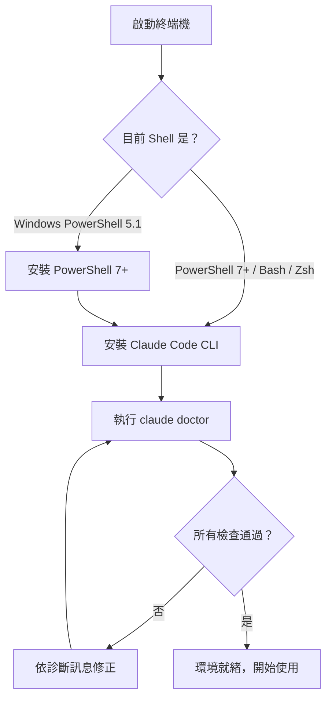

# 01-1-1 Windows PowerShell 7+ 安裝與 claude doctor 健檢

## 1. 本章學習目標

- 理解為何 Claude Code 在 Windows 環境下建議使用 PowerShell 7+ 而非 Windows PowerShell 5.1
- 完成 PowerShell 7+ 的安裝與環境驗證
- 完成 Claude Code CLI 的安裝與登入
- 學會使用 `claude doctor` 進行環境健檢，診斷常見設定問題
- 建立正確的終端機工作習慣，為後續所有 CLI 操作打好基礎

## 2. 適用對象與前置知識

- **適用對象**：初次在 Windows 環境設定 Claude Code 的開發者、正在建立 AI 開發環境的工程師
- **前置知識**：基本 Windows 操作、能夠開啟終端機並執行簡單指令
- **關聯章節**：本章是整個課程的起點，完成後請接續 [01-1-2 基本指令操作](./01-1-2-basic-commands-login-reference-help-init.md)

## 3. 核心概念

### 3.1 為什麼需要 PowerShell 7+？

Windows 內建的 Windows PowerShell 5.1 雖然穩定，但存在以下限制：

1. **跨平台相容性不足**：Windows PowerShell 5.1 是 Windows-only 的解決方案。Claude Code 的某些底層工具與 Script 預設在跨平台環境運作，PowerShell 7+（即 PowerShell Core）基於 .NET（Core），與 macOS/Linux 的 PowerShell 行為更一致
2. **執行效能與功能**：PowerShell 7+ 在啟動速度、管線處理、錯誤處理等方面有顯著改善
3. **預設執行原則差異**：Windows PowerShell 5.1 的執行原則（ExecutionPolicy）在某些企業環境中被嚴格限制，可能導致 Claude Code 的安裝 Script 遭到封鎖
4. **npm/Node.js 相容性**：PowerShell 7+ 對於 npm 全域安裝的工具路徑解析更可靠，減少 `command not found` 類型的問題

### 3.2 claude doctor 的作用

`claude doctor` 是 Claude Code CLI 內建的診斷工具，它會檢查：

- Node.js 版本是否符合要求
- Claude Code CLI 是否正確安裝
- 網路連線是否可達 Anthropic API
- 認證 Token 是否有效
- 常見的環境衝突（如多個 Node.js 版本共存）
- Git 是否可用



## 4. 實務情境

**情境**：阿傑是一名 Windows 後端工程師，公司剛導入 Claude Code 作為 AI 輔助開發工具。他打開 Windows Terminal，執行了安裝指令，卻遇到 `npm.ps1 cannot be loaded` 的錯誤。經過排查，發現他的終端機使用的是 Windows PowerShell 5.1，而且 ExecutionPolicy 設為 Restricted。

**解決路徑**：安裝 PowerShell 7+ → 調整執行原則 → 重新安裝 Claude Code → 執行 `claude doctor` 確認環境就緒。

## 5. 操作步驟

### 5.1 安裝 PowerShell 7+

#### 方法一：透過 Winget（建議）

```powershell
winget install --id Microsoft.PowerShell --source winget
```

安裝完成後，重新開啟終端機，選擇「PowerShell 7」而非「Windows PowerShell」。

#### 方法二：手動安裝

1. 前往 [PowerShell GitHub Releases](https://github.com/PowerShell/PowerShell/releases)
2. 下載最新的 `.msi` 安裝檔（例如 `PowerShell-7.4.x-win-x64.msi`）
3. 執行安裝程式，依照精靈完成安裝

#### 方法三：透過 Chocolatey（若已安裝）

```powershell
choco install powershell-core
```

### 5.2 驗證 PowerShell 版本

```powershell
# 確認目前 Shell 版本（應顯示 7.0 以上）
$PSVersionTable.PSVersion
```

輸出範例：
```
Major  Minor  Patch  PreReleaseLabel BuildLabel
-----  -----  -----  --------------- ----------
7      4      0
```

### 5.3 設定執行原則

```powershell
# 查看目前執行原則
Get-ExecutionPolicy

# 若顯示 Restricted，請調整為 RemoteSigned
Set-ExecutionPolicy RemoteSigned -Scope CurrentUser
```

> **安全提醒**：`RemoteSigned` 允許執行本機 Script，但從網路下載的 Script 需經數位簽署。這是 Windows 環境下的建議設定，勿使用 `Unrestricted`。

### 5.4 安裝 Claude Code CLI

```powershell
# 全域安裝 Claude Code CLI
npm install -g @anthropic-ai/claude-code
```

> **注意**：若遇到 `npm.ps1 cannot be loaded`，請確認您是在 PowerShell 7+ 環境中執行，且已設定執行原則。若問題持續，可改用 `npm.cmd` 替代 `npm`。

### 5.5 登入 Claude Code

```powershell
claude login
```

依照終端機提示完成瀏覽器驗證。若在無 GUI 的伺服器環境，請依照提示使用裝置碼驗證流程。

### 5.6 執行環境健檢

```powershell
claude doctor
```

成功的輸出範例：
```
✓ Node.js v20.11.0
✓ Claude Code CLI v1.0.0
✓ Authentication valid
✓ Network connectivity OK
✓ Git v2.43.0
```

## 6. 指令與範例

### 常用診斷指令

```powershell
# 完整健檢
claude doctor

# 僅檢查特定項目（依 Claude Code 版本而定，以下為範例）
claude doctor --check node
claude doctor --check auth
claude doctor --check network

# 查看 Claude Code 版本
claude --version

# 查看安裝路徑
where.exe claude
```

### 環境變數檢查

```powershell
# 確認 Node.js 可用
node --version
npm --version

# 確認 Git 可用
git --version

# 查看 PATH 中是否有 Claude Code
$env:PATH -split ';' | Select-String claude
```

### macOS / Linux 對應指令

```bash
# 安裝 Claude Code CLI
npm install -g @anthropic-ai/claude-code

# 執行健檢
claude doctor

# 查看版本
claude --version
which claude
```

## 7. 常見錯誤與排查方式

### 錯誤 1：`npm.ps1 cannot be loaded because running scripts is disabled`

**原因**：Windows 執行原則不允許執行 PowerShell Script。

**症狀**：執行任何 `npm` 指令時出現此錯誤。

**排查**：
```powershell
Get-ExecutionPolicy
```

**修正**：
```powershell
Set-ExecutionPolicy RemoteSigned -Scope CurrentUser
```

### 錯誤 2：`claude: command not found`

**原因**：Claude Code CLI 未正確安裝，或 npm 全域安裝路徑不在 PATH 中。

**症狀**：終端機中輸入 `claude` 卻顯示找不到指令。

**排查**：
```powershell
# 檢查 npm 全域安裝路徑
npm config get prefix

# 確認該路徑是否在 PATH 中
$env:PATH -split ';'
```

**修正**：
```powershell
# 將 npm 全域路徑加入 PATH（PowerShell Profile）
$npmPrefix = npm config get prefix
[Environment]::SetEnvironmentVariable("Path", "$env:PATH;$npmPrefix", [EnvironmentVariableTarget]::User)

# 或直接使用完整路徑
& "$(npm config get prefix)\claude.cmd"
```

### 錯誤 3：`claude doctor` 回報 Node.js 版本不符

**原因**：系統中有多個 Node.js 版本，或版本過舊。

**症狀**：`claude doctor` 顯示 Node.js 版本警告或錯誤。

**排查**：
```powershell
node --version
where.exe node
```

**修正**：使用 nvm-windows 管理 Node.js 版本：
```powershell
# 安裝 nvm-windows 後
nvm install 20
nvm use 20
```

### 錯誤 4：認證失敗（Authentication Failed）

**原因**：Token 過期、網路問題、或使用非企業允許的帳號。

**症狀**：`claude doctor` 在 Authentication 項目顯示紅叉。

**修正**：
```powershell
# 重新登入
claude logout
claude login

# 若在企業防火牆後，可能需要設定 Proxy
$env:HTTPS_PROXY = "http://proxy.company.com:8080"
```

## 8. 最佳實務

1. **使用 Windows Terminal**：而非傳統 `cmd.exe` 或 PowerShell ISE。Windows Terminal 支援多分頁、GPU 加速文字渲染、更好的 Unicode 支援，對 Claude Code 的輸出示支援較佳
2. **將 PowerShell 7+ 設為預設 Shell**：在 Windows Terminal 設定中，將 PowerShell 7 設為預設設定檔，避免誤開舊版 PowerShell
3. **建立開發用的 PowerShell Profile**：在 `$PROFILE` 中預先設定常用別名與環境變數，例如 `Set-Alias -Name cc -Value claude`
4. **定期執行 `claude doctor`**：尤其在系統更新、Node.js 升級或網路環境變更後，快速確認環境狀態
5. **保留終端機記錄**：當遇到問題時，`claude doctor` 的輸出是排查的第一手資料。截圖或複製完整輸出，方便尋求協助
6. **避免以系統管理員身分執行**：除非必要（如安裝系統級工具），否則以一般使用者身分執行 Claude Code，降低誤操作風險
7. **PowerShell 與 Bash 的選擇**：若您的專案主要部署在 Linux 環境，亦可考慮在 Windows 上使用 Git Bash 或 WSL2。Claude Code 支援多種 Shell 環境，選擇與團隊一致的即可

## 9. 安全性、權限與成本注意事項

### 安全性
- **執行原則**：永遠不要使用 `Unrestricted`，`RemoteSigned` 是 Windows 環境下的最低安全底線
- **Claude Code 的檔案存取權限**：Claude Code CLI 會讀寫工作目錄中的檔案，確保只在受信任的專案目錄中執行
- **`.claude` 目錄**：Claude Code 在工作目錄下建立的 `.claude` 目錄包含對話記錄與設定，不應提交至版本控制（應加入 `.gitignore`）
- **認證 Token**：Claude Code 的認證 Token 存放於使用者目錄中，勿與他人共用電腦帳號

### 權限
- Claude Code CLI 需要網路連線權限以存取 Anthropic API
- 若在企業 VPN 或防火牆後，可能需要額外開通 `*.anthropic.com` 的連線
- 部分企業端點防護軟體可能誤判 Claude Code 的行為，需加入白名單

### 成本
- `claude doctor` 不會消耗 API 額度，可放心執行
- 環境健檢屬於一次性成本，但建議每次重大環境變更後重新執行

## 10. 小結

1. PowerShell 7+ 是 Windows 上使用 Claude Code 的建議環境，它提供更好的跨平台相容性與效能
2. `claude doctor` 是一站式環境診斷工具，應在初次安裝與環境變更後執行
3. 環境設定看似基礎，卻是所有後續 AI 輔助開發的根基——環境不穩，一切免談
4. 常見的安裝問題多與執行原則、PATH 設定、Node.js 版本有關，本章已涵蓋排查方式
5. 建立良好的終端機使用習慣（Windows Terminal + PowerShell 7+），將提升整體開發體驗

## 11. 延伸練習

### 練習一：環境建置與驗證（操作型）
1. 在您的 Windows 機器上安裝 PowerShell 7+（若已有，請確認版本）
2. 安裝 Claude Code CLI 並完成登入
3. 執行 `claude doctor`，確認所有檢查項目通過
4. 若有任一項目未通過，請依照本章的排查指引修正
5. 將 `claude doctor` 的輸出截圖或複製，作為環境就緒的證明

### 練習二：設計團隊環境標準（思考型）
假設您是一個 10 人開發團隊的 Tech Lead，需要制定團隊的 Claude Code 環境標準。請思考：
1. Windows、macOS、Linux 三平台各自需要哪些前置軟體？
2. 如何確保團隊成員的 Node.js 版本一致（建議使用何種版本管理工具）？
3. 企業防火牆環境下，需要開通哪些網域與連接埠？
4. 如何將環境設定自動化（如撰寫 Setup Script 或使用 Dev Container）？
5. 請寫出一份簡短的「團隊 Claude Code 環境設定 SOP」

## 12. 查核來源與版本備註

本章內容尚未完成即時官方文件查核，正式發布前應重新比對官方最新文件。

- 本章內容依據以下資料核實：
  - 來源 1：Microsoft PowerShell 官方文件（https://learn.microsoft.com/powershell/）
  - 來源 2：Anthropic Claude Code 官方文件
  - 來源 3：npm 官方文件（https://docs.npmjs.com/）
- 查核日期：2026-06-05（教材撰寫日期，尚未完成最終官方查核）
- 版本備註：本章以 PowerShell 7.4、Node.js 20 LTS、Claude Code CLI 最新穩定版為基準撰寫
- 若使用者環境與本文不同，請優先依官方最新文件與實際環境調整
