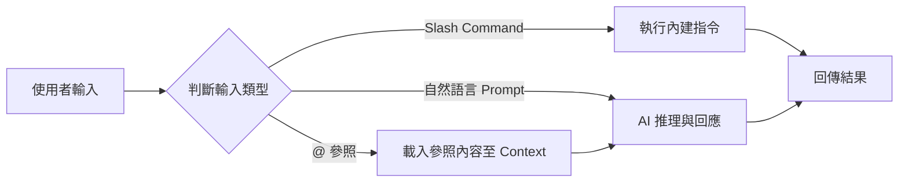

# 01-1-2 基本指令操作：/login、@ 參照、/help、/init

## 1. 本章學習目標

- 熟悉 Claude Code 的六個核心基本指令：`/login`、`@` 參照、`/help`、`/init`、`/clear`、`/doctor`
- 理解 `@` 參照的精準用意：如何引用檔案、目錄、符號與 Git 歷史
- 學會使用 `/init` 初始化專案，建立 CLAUDE.md 專案設定檔
- 能在不同場景下選擇合適的指令，提升與 Claude Code 的互動效率

## 2. 適用對象與前置知識

- **適用對象**：已完成環境安裝（01-1-1）、準備開始使用 Claude Code 的開發者
- **前置知識**：Claude Code CLI 已安裝且可成功登入、基本命令列操作
- **關聯章節**：前接 [01-1-1 PowerShell 與 claude doctor](./01-1-1-windows-powershell-claude-doctor.md)，後接 [01-1-3 訂閱方案與成本精算](./01-1-3-subscription-plans-api-cost-estimation.md)

## 3. 核心概念

### 3.1 Claude Code 的互動模型

Claude Code 的 CLI 介面採用「交談式 REPL」模型（Read-Eval-Print Loop），您輸入自然語言或 Slash Command，Claude 回應程式碼、建議或直接執行操作。理解基本指令是高效互動的關鍵：



### 3.2 基本指令的定位

| 指令 | 定位 | 使用時機 |
|------|------|---------|
| `/login` | 認證管理 | 初次使用、Token 過期、切換帳號 |
| `/help` | 指令參考 | 忘記指令用法、探索新功能 |
| `/init` | 專案初始化 | 新專案開始、建立 CLAUDE.md |
| `/clear` | 上下文清理 | 對話過長、主題切換 |
| `@` 參照 | 精準引用 | 指定特定檔案、目錄或 Git 歷史 |
| `/doctor` | 環境診斷 | 環境異常排查（詳見 01-1-1） |

## 4. 實務情境

**情境**：小美剛完成 Claude Code 安裝，她想為一個既有的 Java 專案初始化 Claude Code 設定。她需要在 `CLAUDE.md` 中描述專案結構、常用指令與慣例，但她不清楚 `/init` 會產生什麼，也不知道如何用 `@` 參照讓 Claude 讀取現有的 `pom.xml` 來理解專案依賴。

**解決路徑**：執行 `/init` → 用 `@pom.xml` 讓 Claude 讀取依賴 → 補充專案慣例 → 完成 CLAUDE.md。

## 5. 操作步驟

### 5.1 `/login`：登入與認證管理

```powershell
# 初次登入
claude login

# 登出（切換帳號前）
claude logout

# 查看目前登入狀態
claude whoami
```

> **注意**：`claude login` 會開啟瀏覽器進行 OAuth 驗證。若在無 GUI 環境（如 SSH 遠端伺服器），請使用裝置碼流程；終端機會顯示對應的驗證 URL 與一次性代碼。

### 5.2 `/help`：內建說明系統

在 Claude Code 互動模式中：

```
/help
```

這會列出所有可用的 Slash Commands 及其簡短說明。若需要特定指令的詳細說明：

```
/help init
```

### 5.3 `/init`：專案初始化

`/init` 是 Claude Code 最重要的指令之一。它會在專案根目錄產生 `CLAUDE.md`，這個檔案是 Claude Code 的「專案記憶」，每次對話都會自動載入。

```powershell
# 在專案根目錄執行
cd E:\Projects\my-app

# 啟動 Claude Code 並初始化
claude
```

在互動模式中：
```
/init
```

Claude Code 會：
1. 掃描專案結構與檔案
2. 讀取 `package.json`、`pom.xml`、`build.gradle` 等設定檔
3. 產生 `CLAUDE.md`，包含專案描述、技術棧、目錄結構、常用指令
4. 您可以直接補充或修改產生的內容

**CLAUDE.md 範例**：
```markdown
# My App Project

## Tech Stack
- Backend: Spring Boot 3.2, Java 17, Maven
- Frontend: React 18, Vite, TypeScript
- Database: PostgreSQL 15

## Commands
- Build: `mvn clean package -DskipTests`
- Test: `mvn test`
- Frontend dev: `cd frontend && npm run dev`

## Conventions
- Follow Google Java Style Guide
- Use conventional commits
- All PRs require review
```

### 5.4 `@` 參照：精準引用

`@` 是 Claude Code 最強大的機制之一，它讓您可以精準指定 Claude 需要關注的內容：

#### 引用檔案
```
請分析 @src/main/java/com/example/TicketController.java 的 API 設計
```

#### 引用目錄
```
請依照 @src/main/java/com/example/dto/ 中的 DTO 模式，為 User 建立新的 DTO
```

#### 引用多個檔案
```
請比較 @TicketService.java 與 @UserService.java 的實作模式差異
```

#### 引用 Git 歷史
```
請分析 @git:main 分支上最近 3 個 commit 的變更摘要
```

#### 引用特定符號（Symbol）
```
請說明 @TicketService#createTicket 方法的邏輯
```

### 5.5 `/clear`：清理上下文

```
/clear
```

當對話過長、主題已切換、或 Claude 的回應開始出現「上下文汙染」（參考舊對話的無關內容）時，使用 `/clear` 重置對話上下文。

> **成本提醒**：`/clear` 後，Claude 會失去對先前對話的記憶。若有重要結論，請在 `/clear` 前先記錄下來。

## 6. 指令與範例

### 完整操作示範

```
# 步驟 1：進入專案目錄，啟動 Claude Code
PS> cd E:\Projects\my-app
PS> claude

# 步驟 2：初始化專案
> /init

# 步驟 3：讓 Claude 讀取現有設定檔來豐富 CLAUDE.md
> 請讀取 @pom.xml 了解專案依賴，並更新 CLAUDE.md 中的 Tech Stack 段落

# 步驟 4：用 @ 參照讓 Claude 分析特定程式碼
> 請分析 @src/main/java/com/example/controller/TicketController.java 的所有端點，幫我補上缺失的 API 文件註解

# 步驟 5：完成後清理上下文
> /clear
```

### 在 VS Code 插件中使用

若使用 VS Code 插件而非 CLI：
- `@` 參照可直接從檔案瀏覽器拖曳檔案到對話框
- `/init` 可從 Command Palette（`Ctrl+Shift+P`）搜尋 "Claude Code: Initialize"
- VS Code 插件會自動將當前開啟的檔案加入 Context

## 7. 常見錯誤與排查方式

### 錯誤 1：執行 `/init` 後 CLAUDE.md 內容空洞

**原因**：Claude Code 無法充分理解專案結構，可能因為專案目錄過於龐雜或缺乏標準設定檔。

**症狀**：`CLAUDE.md` 只包含泛泛的 template 內容，沒有具體的專案資訊。

**修正**：手動補充 CLAUDE.md，或使用 `@` 參照引導 Claude 讀取關鍵檔案：
```
請讀取 @pom.xml @package.json @README.md，然後更新 CLAUDE.md
```

### 錯誤 2：`@` 參照指向的檔案不存在

**原因**：路徑拼寫錯誤、檔案已被移動、或使用了相對路徑但當前工作目錄不同。

**症狀**：Claude 回覆「無法找到該檔案」。

**修正**：
- 使用 Tab 自動補全（CLI 模式）來確保路徑正確
- 在 VS Code 插件中直接拖曳檔案
- 先用 `ls` 或 `dir` 確認檔案存在

### 錯誤 3：`/clear` 後遺失重要上下文

**原因**：在清理前未備份重要結論或產生的程式碼。

**症狀**：需要重複之前的工作。

**修正**：
- 養成習慣：`/clear` 前先將重要產出存檔
- 使用 Git commit 保存程式碼變更
- 或使用 `/compact`（參見 02-3-3）替代 `/clear`，前者會壓縮而非丟棄上下文

### 錯誤 4：忘記登入狀態已過期

**原因**：Token 有有效期限，長時間未使用後可能過期。

**症狀**：Claude 回應認證錯誤。

**修正**：
```powershell
claude login
```

## 8. 最佳實務

1. **進入新專案先 `/init`**：這是建立 Claude Code 對專案理解的基礎。即使專案已有 CLAUDE.md，也建議用 `/init` 檢查是否需要更新
2. **善用 `@` 參照而非貼上大段程式碼**：`@` 參照讓 Claude 直接讀取檔案，比貼上程式碼更精準，也節省 Token 成本。Claude 可以看到完整的檔案內容與行號
3. **`@` 參照優先指定最小範圍**：`@TicketService.java` 比 `@src/` 更有效率。引用整個目錄會消耗大量 Context，可能稀釋 Claude 對關鍵內容的注意力
4. **CLAUDE.md 應保持更新**：當專案技術棧、慣例或結構變更時，應更新 CLAUDE.md。可在 PR Review 清單中加入「檢查 CLAUDE.md 是否需要更新」
5. **適時使用 `/clear`**：當對話超過 50 輪或主題已切換時，清理上下文可以提升 Claude 的回應品質。但請先確認重要內容已保存
6. **將 CLAUDE.md 納入版本控制**：CLAUDE.md 是專案設定檔，應與程式碼一起進版控。團隊成員共用同一份 CLAUDE.md 確保 Claude Code 的行為一致
7. **學習 `/help` 的輸出**：不定期查看 `/help`，Claude Code 可能會新增指令或功能

## 9. 安全性、權限與成本注意事項

### 安全性
- **CLAUDE.md 不要包含敏感資訊**：API Key、資料庫密碼、內部伺服器位址等不應寫入 CLAUDE.md，因該檔案通常會提交至版本控制
- **`@` 參照注意**：引用檔案時，Claude 會讀取完整內容並傳送至 Anthropic API。請確保引用的檔案不包含金鑰、Token 或客戶資料
- **`.env` 檔案**：不要用 `@.env` 參照環境變數檔案，這會將敏感資訊傳送至雲端

### 權限
- `/init` 會掃描專案結構，確保您有權讓 AI 讀取專案中的所有檔案
- 若專案包含第三方授權程式碼，請確認授權條款允許用於 AI 訓練或分析

### 成本
- 每次 `@` 參照都會將對應檔案內容載入 Context，檔案越大，Token 消耗越多
- `@` 參照整個目錄（如 `@src/`）成本極高，應避免
- `/init` 在掃描專案時會消耗一定的 Token，但屬於一次性成本
- CLAUDE.md 的內容會在每次對話中自動載入，請保持其精簡（建議不超過 500 行）

## 10. 小結

1. `/login`、`/help`、`/init`、`/clear` 與 `@` 參照是 Claude Code 日常操作的五大基礎指令
2. `/init` 產生的 CLAUDE.md 是 Claude Code 理解專案的入口，應保持更新並納入版控
3. `@` 參照是精準餵給 Claude 上下文的核心機制，優先引用最小範圍的檔案
4. 適時 `/clear` 可維持對話品質，但清除前應確認重要內容已保存
5. 所有指令的使用都應考慮安全性（不洩漏敏感資訊）與成本（控制 Context 大小）

## 11. 延伸練習

### 練習一：專案初始化實作（操作型）
1. 選擇一個您現有的專案（或建立一個新的空專案）
2. 執行 `/init` 初始化 Claude Code
3. 檢查產生的 CLAUDE.md 是否充分反映專案結構與技術棧
4. 使用 `@` 參照引用至少 3 個不同類型的檔案（如設定檔、Controller、Service）
5. 根據 Claude 的回應，手動補充 CLAUDE.md 中的不足之處
6. 將 CLAUDE.md 提交至 Git

### 練習二：指令使用策略設計（思考型）
在一個大型的微服務專案中（50+ 服務、500+ 開發者），您需要設計 Claude Code 的使用指引。請思考：
1. 每個微服務應該有自己的 CLAUDE.md 嗎？還是共用一份？各自的優缺點是什麼？
2. `@` 參照在跨服務的場景中如何使用（例如 A 服務要呼叫 B 服務的 API）？
3. 如何用 `.gitignore` 管理 Claude Code 產生的暫存檔（`.claude/` 目錄）？
4. 在 Code Review 流程中，如何利用 CLAUDE.md 確保 AI 輔助的程式碼符合團隊規範？

## 12. 查核來源與版本備註

本章內容尚未完成即時官方文件查核，正式發布前應重新比對官方最新文件。

- 本章內容依據以下資料核實：
  - 來源 1：Anthropic Claude Code 官方文件（Slash Commands、CLAUDE.md 規格）
  - 來源 2：Git 官方文件
- 查核日期：2026-06-05（教材撰寫日期，尚未完成最終官方查核）
- 版本備註：本章以 Claude Code CLI 最新穩定版為基準撰寫。Slash Command 的名稱與行為可能隨版本變動
- 若使用者環境與本文不同，請優先依官方最新文件與實際環境調整
