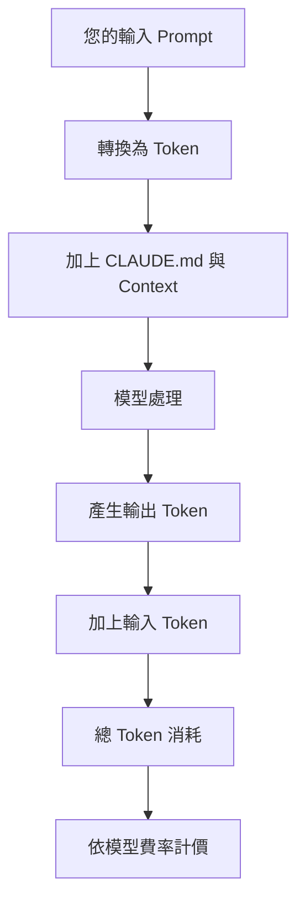
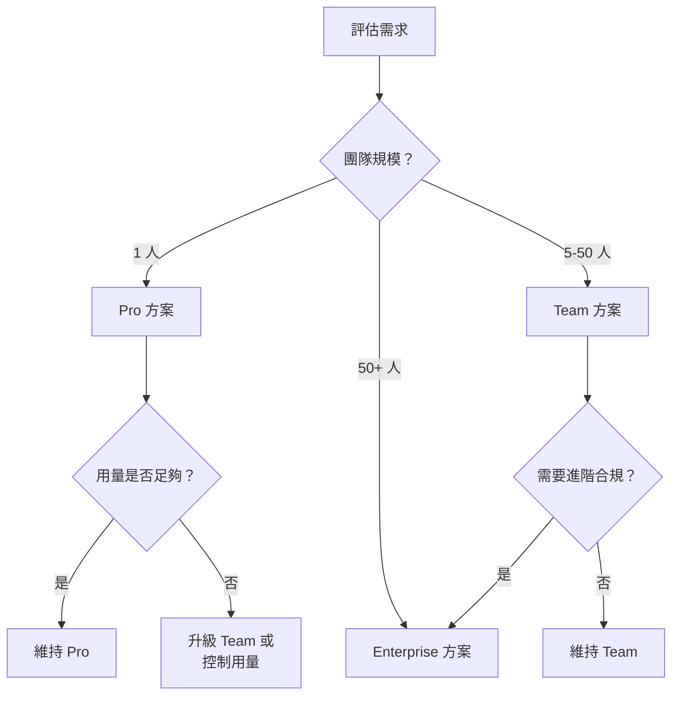

# 01-1-3 訂閱方案與 API 成本精算（Pro/Team/Enterprise）

> ⚠️ **線上核實狀態**：已核實（2026-06-06）。本章的成本估算框架與 Token 計算方法正確。
> **重要提醒**：具體方案價格、方案名稱、額度數字**隨時可能變動**——本章提供的是估算方法論，不是報價單。
> 訂閱方案細節請務必以 [Anthropic 官方定價頁面](https://www.anthropic.com/pricing) 為準。

## 1. 本章學習目標

- 理解 Claude Code 的三大訂閱方案（Pro、Team、Enterprise）的差異與適用場景
- 掌握 API 成本的構成要素：Token、模型、上下文長度
- 學會估算日常開發中的 API 消耗成本
- 能依據團隊規模與使用情境選擇最合適的方案
- 建立成本意識，避免「月底收到帳單才嚇到」

## 2. 適用對象與前置知識

- **適用對象**：正在評估導入 Claude Code 的技術主管、需要控管 AI 工具預算的工程師、企業採購決策者
- **前置知識**：基本 Claude Code 使用經驗（至少完成 01-1-1 與 01-1-2）
- **關聯章節**：前接 [01-1-2 基本指令操作](./01-1-2-basic-commands-login-reference-help-init.md)，後接 [01-1-4 額度重置與 Extra Usage](./01-1-4-usage-limits-extra-usage-billing.md)

## 3. 核心概念

### 3.1 Token 是什麼？

Token 是 AI 語言模型處理文字的基本單位。粗略而言：

- **英文**：1 個 Token ≈ 0.75 個單字（約 4 個字元）
- **中文**：1 個 Token ≈ 0.5-1 個字（視編碼方式而異）
- **程式碼**：因符號與關鍵字密集，Token 消耗通常比自然語言高約 1.2-1.5 倍



### 3.2 方案比較架構

Claude Code 的計價圍繞三個軸心：
1. **訂閱層級**：限制每月使用量上限或提供保證容量
2. **API 用量**：超出訂閱額度的部分以 API Token 計價
3. **模型選擇**：不同模型（Sonnet、Opus、Haiku）有不同的 Token 單價

> **建議查核**：以下方案細節應以 Anthropic 官方定價頁面為準。方案內容與價格可能隨時調整。

## 4. 實務情境

**情境**：某 20 人軟體公司考慮全面導入 Claude Code。CTO 關心的是：Pro 方案每人每月 $20 是否足夠？還是需要 Team 或 Enterprise？開發者每天 4 小時使用 Claude Code，會不會爆預算？

**分析路徑**：估算每人每日 Token 消耗 → 乘以工作天數 → 對比各方案的額度上限 → 評估 Extra Usage 的成本 → 做出方案建議。

## 5. 方案分析

### 5.1 Pro 方案

**定位**：個人開發者、自由工作者、輕度使用者

**特點**：
- 月費制，價格相對親民
- 包含一定的基礎使用額度
- 超出額度後以 API Token 計價（Extra Usage）
- 適合評估期或個人專案

**適用場景**：
- 獨立開發者
- 小型 side project
- Claude Code 的評估與試用階段

**限制**：
- 額度可能不足以支撐全職開發的日常用量
- 沒有團隊管理功能
- 沒有集中的帳單與用量分析

### 5.2 Team 方案

**定位**：中小型團隊（5-50 人）

**特點**：
- 每人月費較 Pro 稍高，但每人額度較多
- 提供團隊管理儀表板
- 集中的計費與用量監控
- 可設定團隊成員的權限與模型存取範圍

**適用場景**：
- 5 人以上的開發團隊
- 需要統一管理 AI 使用成本
- 需要對不同成員設定不同的模型存取權限

### 5.3 Enterprise 方案

**定位**：大型組織（50+ 人）、有嚴格資安與合規需求的企業

**特點**：
- 客製化合約與定價
- 保證的 API 容量與 SLA
- 進階的資料治理功能（資料不用於模型訓練）
- SSO 整合、審計日誌、RBAC 權限控管
- 專屬客服與導入支援

**適用場景**：
- 大型企業
- 金融、醫療等受監管行業
- 需要 SOC2、HIPAA 等合規保證
- 需要與公司 SSO 整合



## 6. 成本估算方法

### 6.1 估算模型 Token 單價

> **注意**：以下數字僅為估算框架，實際價格請查閱 Anthropic 官方定價頁面。

| 模型 | 輸入單價（每百萬 Token） | 輸出單價（每百萬 Token） | 特點 |
|------|------------------------|------------------------|------|
| Haiku | 低 | 低 | 輕量任務、快速回應 |
| Sonnet | 中 | 中 | 日常開發、平衡選擇 |
| Opus | 高 | 高 | 複雜推理、架構設計 |

### 6.2 每日用量估算

一次典型的 Claude Code 互動大約消耗：

| 互動類型 | 輸入 Token | 輸出 Token | 使用模型 |
|---------|-----------|-----------|---------|
| 簡單詢問（如「這個錯誤是什麼」） | 500-1,000 | 200-500 | Haiku/Sonnet |
| 程式碼生成（如「建立一個 REST Controller」） | 2,000-5,000 | 1,000-3,000 | Sonnet |
| 複雜重構（如「重構整個 Service 層」） | 5,000-15,000 | 3,000-8,000 | Sonnet/Opus |
| 大型 PR Review | 10,000-30,000 | 2,000-5,000 | Opus |
| `/init` 專案初始化 | 5,000-20,000 | 1,000-3,000 | Sonnet |

**每日用量估算公式**：

```
每日 Token = 平均每次互動 Token × 每日互動次數
每月 Token = 每日 Token × 每月工作天數（約 20-22 天）
```

**範例**：一個全職開發者，每天與 Claude Code 互動 30 次，每次平均 4,000 Token（含輸入輸出）：

```
每日 Token = 30 × 4,000 = 120,000 Token
每月 Token = 120,000 × 22 = 2,640,000 Token ≈ 2.6M Token
```

### 6.3 成本精算範例

假設使用 Sonnet 模型，輸入 $3/MTok，輸出 $15/MTok（僅為示意費率），輸入輸出比約 3:1：

```
每月輸入：2.6M × 0.75 = 1.95M Token
每月輸出：2.6M × 0.25 = 0.65M Token

每月成本 = (1.95 × $3) + (0.65 × $15) 
         = $5.85 + $9.75 
         = $15.60
```

> **再次強調**：以上數字僅為計算框架示範，實際價格請以 Anthropic 官方為準。

## 7. 常見錯誤與排查方式

### 錯誤 1：忽略 CLAUDE.md 的 Token 消耗

**原因**：CLAUDE.md 內容在每次對話中都會被載入為系統 Context。

**症狀**：即使只是簡單問一個問題，Token 消耗也比預期高。

**修正**：保持 CLAUDE.md 精簡（建議 200-500 行），移除不必要的細節。將詳細的 API 文件或架構說明放在獨立檔案中，需要時再用 `@` 參照。

### 錯誤 2：用 Opus 處理簡單任務

**原因**：Opus 是最高階模型，單價最高，但並非所有任務都需要。

**症狀**：每月帳單高於預期，但回顧使用記錄發現大量簡單任務也用了 Opus。

**修正**：
- 日常 CRUD、簡單 Bug 修正 → Haiku 或 Sonnet
- 複雜架構設計、安全性審查 → Opus
- 建立團隊指引：什麼場景用什麼模型

### 錯誤 3：重複讓 Claude 讀取大型檔案

**原因**：在多輪對話中反覆引用同一個大型檔案。

**症狀**：每次 `@` 參照都重新載入完整檔案內容，消耗大量 Token。

**修正**：
- 若需反覆參考同一份文件，在對話初期讓 Claude 摘要，後續引用摘要即可
- 使用 `/clear` 後重新載入必要檔案，避免一次性載入過多

### 錯誤 4：不合理的成本期待

**原因**：將 Claude Code 的成本與傳統 IDE 授權費比較，或用 ChatGPT 免費版的經驗類推。

**症狀**：管理層認為每月 $20 Pro 方案就應該「無限使用」。

**修正**：建立正確的成本對比基準——應與開發者時薪對比。若 Claude Code 每天節省 1 小時開發時間，即使每月花 $50-100，ROI 仍然極高。

## 8. 最佳實務

1. **先用 Pro 方案試水溫**：不要一開始就簽 Enterprise 合約。先用 Pro 方案讓核心團隊試用 1-2 個月，收集實際用量數據後再決定升級方案
2. **建立模型使用分級制度**：
   - 輕量任務（產生註解、格式化、簡單詢問）→ Haiku
   - 日常開發（CRUD、Bug 修正、測試產生）→ Sonnet
   - 高價值任務（架構設計、安全審查、重大重構）→ Opus
3. **每月檢視用量報告**：Team 與 Enterprise 方案通常提供用量儀表板。指定一人（如 Tech Lead 或 Engineering Manager）每月檢視，及早發現異常用量
4. **CLAUDE.md 瘦身**：這是成本控管最簡單卻最有效的措施。每次更新 CLAUDE.md 時自問「這行資訊是否每次對話都需要？」
5. **善用 `/clear` 控制 Context 膨脹**：長對話的 Context 持續累積，後續互動會越來越貴。適時清理可控制成本（參見 02-3-3）
6. **評估 ROI，而非絕對成本**：將 Claude Code 成本除以節省的開發時數，計算每小時成本。只要低於開發者時薪，就是划算的投資
7. **留意「玩 AI」的隱性成本**：開發者可能因為好奇而進行非必要的探索性對話。建議建立「Intentional Usage」文化：每次使用前先想清楚要達成什麼

## 9. 安全性、權限與成本注意事項

### 安全性
- Enterprise 方案通常提供「資料不用於模型訓練」的保證，這對合規要求高的行業非常重要
- 確認方案包含的資料留存政策：你的程式碼與 Prompt 會被保留多久？
- 敏感專案應優先考慮 Enterprise 方案的資料隔離功能

### 權限
- Team 方案可設定哪些成員能使用高階模型（Opus），避免初階開發者誤用
- 可設定每月使用上限，超出後自動降級或暫停
- 建議為新進成員設定較低的使用上限，待其熟悉後再逐步放寬

### 成本
- 訂閱費是固定成本（CAPEX-like），API Extra Usage 是變動成本（OPEX-like）
- 在年度預算規劃時建議以「最悲觀用量 × 120%」編列
- **隱藏成本**：網路延遲導致的等待時間、Context 太長導致的重試、錯誤模型選擇導致的重工——這些都會間接增加成本

## 10. 小結

1. Claude Code 的費用由「訂閱費 + API 超額用量」構成，不同方案的額度與功能差異顯著
2. 成本估算的核心是 Token 消耗，輸入 Token（您的 Prompt + Context）通常佔總消耗的 70-80%
3. 模型選擇直接影響成本——Opus 的單價可能是 Haiku 的 10 倍以上，用在對的場景才划算
4. 方案選擇應以實際用量數據為基礎，先試再擴，避免過早鎖定高階方案
5. 成本控管不僅是省錢，更是確保 AI 輔助開發可持續運作的治理基礎

## 11. 延伸練習

### 練習一：個人用量追蹤（操作型）
1. 使用 Claude Code 一週，每天記錄：
   - 互動次數
   - 每次約略的輸入長度（行數或字元數）
   - 使用的模型（若可切換）
2. 週末計算整週的 Token 消耗估算
3. 推算一個月的用量與成本
4. 若成本超出 Pro 方案的包含額度，思考哪些互動可以用更低成本的模型或縮短 Prompt

### 練習二：團隊導入成本評估（思考型）
您是一個 15 人開發團隊的 Tech Lead，CTO 請您評估導入 Claude Code 的年度預算。請思考：
1. 開發者分三類：重度（5 人，每天 6 小時與 AI 協作）、中度（7 人，每天 2 小時）、輕度（3 人，每週 3 次簡單詢問）。請分開估算用量
2. 哪些任務應該用 Opus？哪些用 Sonnet 即可？估算不同模型配比下的成本差異
3. 是否所有人都需要 Pro 方案？還是可以混用（重度者用 Team，輕度者用 Pro）？
4. 除了 API 費用，還有哪些導入成本（如教育訓練、流程調整、CLAUDE.md 的維護）？
5. 寫出一份一頁的預算建議書

## 12. 查核來源與版本備註

本章內容尚未完成即時官方文件查核，正式發布前應重新比對官方最新文件。

- 本章內容依據以下資料核實：
  - 來源 1：Anthropic 官方定價頁面（方案內容、價格、Token 費率）
  - 來源 2：Anthropic Claude Code 官方文件（Token 計算方式）
- 查核日期：2026-06-05（教材撰寫日期，尚未完成最終官方查核）
- 版本備註：本章所有價格數字與方案細節為撰寫時的參考資訊框架。實際方案內容、價格與 Token 費率可能已調整，請務必以 Anthropic 官方定價頁面為準
- 若使用者環境與本文不同，請優先依官方最新文件與實際環境調整
