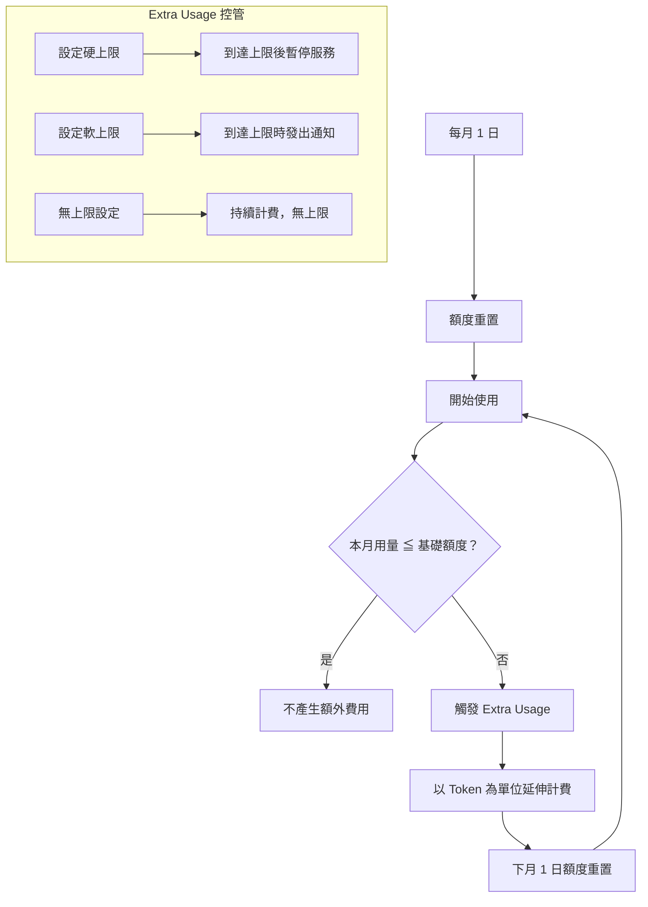

# 01-1-4 額度重置規則與 Extra Usage 延伸計費說明

## 1. 本章學習目標

- 理解 Claude Code 訂閱方案的額度重置週期與規則
- 掌握 Extra Usage（超額使用）的觸發條件、計費方式與控管機制
- 學會設定使用上限以避免意外帳單
- 能在預算與開發效率之間取得合理平衡
- 建立團隊的用量監控流程

## 2. 適用對象與前置知識

- **適用對象**：所有 Claude Code 付費使用者、負責成本控管的技術主管
- **前置知識**：已了解 Claude Code 的訂閱方案結構（01-1-3），已有基本使用經驗
- **關聯章節**：前接 [01-1-3 訂閱方案與成本精算](./01-1-3-subscription-plans-api-cost-estimation.md)，本章是 01-1 小節的最後一章

## 3. 核心概念

### 3.1 什麼是「額度」（Usage Limit / Quota）？

Claude Code 每個訂閱方案包含每月的基礎使用額度，通常以 API 呼叫次數、Token 總量或互動次數來定義。額度內的使用不額外收費（已含在月費中）。

### 3.2 什麼是 Extra Usage？

當月使用量超過基礎額度後，Claude Code 不會直接停止服務，而是進入「Extra Usage」模式——以 API Token 為單位進行延伸計費。



### 3.3 額度重置週期

| 項目 | 規則 |
|------|------|
| 週期 | 日曆月（Calendar Month），以 UTC 時間為基準 |
| 重置時間 | 每月 1 日 00:00 UTC |
| 未用完額度 | 不會累積至下月（Use it or lose it） |
| 帳單結算 | 月費在月初收取，Extra Usage 在次月結算 |

> **注意**：確切的重置時間點可能因方案而異，請查閱方案的 Terms of Service。

## 4. 實務情境

**情境**：大仁是團隊中的重度 Claude Code 使用者，這個月遇到一個大型重構任務，連續兩週每天與 Claude 密集協作。到了月中，他突然收到 Email 通知已用掉 85% 的基礎額度。他擔心接下來兩週無法使用，也擔心 Extra Usage 會讓團隊下個月收到天價帳單。

**解決路徑**：檢查方案的上限設定 → 與主管討論是否調高本月上限 → 改用更節省 Token 的互動方式 → 規劃剩餘額度分配。

## 5. 額度監控與上限設定

### 5.1 查看目前用量

在 Claude Code CLI 中：

```
/usage
```

（此指令可用性需依實際版本確認，部分方案可能不支援 CLI 查詢用量）

替代方式：登入 Anthropic Console 網頁介面，在 Billing / Usage 頁面查看即時用量。

### 5.2 設定使用上限

Team 與 Enterprise 方案的管理者可在管理後台設定：

- **硬上限（Hard Limit）**：到達上限後，Claude Code 停止回應，直到下月重置或管理者手動調高
- **軟上限（Soft Limit）**：到達上限時發送通知，但不停止服務，允許繼續產生 Extra Usage
- **通知閾值**：例如在用量達 50%、80%、90%、100% 時分別通知

**建議設定**：
```
50%：通知使用者（提醒用量已過半）
80%：通知使用者 + 團隊主管
95%：通知使用者 + 團隊主管 + 管理者
100%：依團隊政策決定是否暫停或繼續
```

## 6. 指令與範例

### 用量查詢（依方案可用性而定）

```powershell
# 在 Claude Code 互動模式中查詢
/usage

# 或透過 API 查詢（需 API Key）
curl -H "x-api-key: $ANTHROPIC_API_KEY" \
     https://api.anthropic.com/v1/usage
```

### 成本追蹤 Script 範例

以下為一個 PowerShell 範例，用於記錄每日的 Claude Code 使用情況：

```powershell
# 建立每日使用記錄
$logFile = "claude-usage-log.csv"
if (-not (Test-Path $logFile)) {
    "Date,EstimatedTokens,Model,Task" | Out-File $logFile
}

$date = Get-Date -Format "yyyy-MM-dd"
$tokens = 5000  # 自行估算
$model = "sonnet"
$task = "Refactor TicketService"

"$date,$tokens,$model,$task" | Add-Content $logFile
```

## 7. 常見錯誤與排查方式

### 錯誤 1：月中突然無法使用

**原因**：團隊設定了硬上限，且本月用量已達標。

**症狀**：Claude Code 回應「Usage limit reached」或類似訊息。

**修正**：
- 聯繫團隊管理者調高上限
- 若為 Pro 方案，確認是否已觸發方案內的上限
- 檢查是否有其他團隊成員共用同一個帳號（不建議的做法）

### 錯誤 2：未預期的 Extra Usage 帳單

**原因**：未設定上限或上限設得過高，且對自己的用量沒有概念。

**症狀**：收到比月費高出數倍的帳單。

**修正**：
- 立即設定合理的使用上限
- 檢查過去一個月的使用記錄，找出用量異常高的日期
- 與團隊討論是否需要升級方案（若常態性超額，升級方案可能比持續付 Extra Usage 划算）

### 錯誤 3：把所有用量歸咎於自己

**原因**：在共用開發環境中，Claude Code 可能被多個 Process 或 Cron Job 呼叫。

**症狀**：個人用量記錄與帳單顯示的用量差距很大。

**修正**：
- 檢查是否有 CI/CD Pipeline 或自動化 Script 在呼叫 Claude Code
- 檢查是否在背景執行了 `/agent` 任務而忘記（參見 03-3）
- 使用 API Key 層級的用量追蹤來區分不同來源

### 錯誤 4：以為 Extra Usage 能無限使用

**原因**：未閱讀方案的 Fair Use Policy。

**症狀**：極端超量使用後收到警告或帳號暫停。

**修正**：
- 了解方案的 Fair Use Policy 或 Acceptable Use Policy
- 若確實需要極高用量，聯繫 Anthropic 銷售團隊討論 Enterprise 客製化方案

## 8. 最佳實務

1. **設定用量通知，不要設定「無上限」**：即使預算充裕，「無上限」意味著沒有任何警示機制，容易在不知不覺中產生高額帳單
2. **月初規劃，月中檢視**：每月初根據當月排程（有幾個大型功能、重構任務）估算所需用量；月中檢查實際用量是否符合預期，必要時調整
3. **區分「必要用量」與「探索用量」**：必要用量（完成工作任務）不應受限；探索用量（測試 AI 能力、玩不同 Prompt）應有所節制
4. **建立團隊用量透明化機制**：讓每個人可以看到自己的用量（而非只能看到總量），促進自我管理意識
5. **Extra Usage 不是壞事**：如果 Extra Usage 是因為 AI 幫你解決了高價值的問題（例如節省了 20 小時的 Debug 時間），$20 的 Extra Usage 是非常划算的投資
6. **定期評估方案適配度**：如果連續三個月都有顯著的 Extra Usage，表示目前的方案已經不夠用，應考慮升級
7. **留意「沉默的 Context 消耗」**：CLAUDE.md、長對話歷史、大型 `@` 參照都會默默消耗 Token——這些是 Extra Usage 的常見元兇

## 9. 安全性、權限與成本注意事項

### 安全性
- 用量暴增可能是異常行為的指標——例如 API Key 外洩或被惡意使用。設定用量異常警報可及早發現
- Team/Enterprise 方案的管理者應定期檢查用量報表，排除未授權的使用

### 權限
- 僅管理者應有權限修改使用上限
- 建議為不同成員設定不同的用量上限，反映其角色與需求
- 新進成員的初始上限應較低，使用一段時間後根據實際需求調整

### 成本
- **Extra Usage 的單位成本高於方案內的單位成本**。換句話說，如果常態性超額，升級方案通常比持續支付 Extra Usage 更划算
- 計算 Extra Usage 時，別忘了「輸出 Token」的費率通常高於「輸入 Token」——讓 Claude 產生過長的輸出（如整份文件的完整重寫）會顯著增加成本
- **退款政策**：多數方案的月費不可退款，Extra Usage 亦然。請在設定上限時保守一點

## 10. 小結

1. Claude Code 的額度以日曆月為週期重置，未用完不累積，超額以 Extra Usage 延伸計費
2. Extra Usage 是彈性機制而非無限使用——需設定上限與通知來避免意外帳單
3. 用量控管需要團隊協作：管理者設定上限，個人追蹤自身用量，定期檢視整體趨勢
4. 若常態性超額，升級方案比持續支付 Extra Usage 更具成本效益
5. 成本意識是 AI 輔助開發可持續運作的基礎——不是要你省到極致，而是要你知道錢花在哪、值不值得

## 11. 延伸練習

### 練習一：建立個人用量日誌（操作型）
1. 接下來一週，每次使用 Claude Code 後記錄：
   - 大約的 Prompt 長度（行數）
   - Claude 的回應長度（行數）
   - 使用的模型
   - 任務類型（Bug 修復 / 功能開發 / 詢問 / 重構）
2. 週末根據本章的 Token 估算方法，計算整週用量
3. 若用量趨勢持續一個月，預估是否會超出 Pro 方案的基礎額度

### 練習二：團隊用量治理方案設計（思考型）
您負責一個 30 人開發團隊的 Claude Code 成本治理。請設計一份方案：
1. 如何分級設定不同角色的用量上限？（初階工程師 vs. 資深工程師 vs. 架構師）
2. 如何處理「某個成員因特殊任務需要短期高用量」的例外情況？
3. 如何讓用量數據驅動方案升級決策？（例如連續幾個月超額多少 % 就該升級）
4. 如何在不打擊開發者使用意願的前提下，建立成本意識？
5. 寫出一份團隊用量治理 SOP（不超過一頁 A4）

## 12. 查核來源與版本備註

本章內容尚未完成即時官方文件查核，正式發布前應重新比對官方最新文件。

- 本章內容依據以下資料核實：
  - 來源 1：Anthropic 官方定價頁面與 Terms of Service
  - 來源 2：Anthropic Claude Code 官方文件（用量限制與計費說明）
- 查核日期：2026-06-05（教材撰寫日期，尚未完成最終官方查核）
- 版本備註：本章的額度重置規則、Extra Usage 計費方式與上限設定機制為撰寫時的框架說明。實際規則可能因方案類型與 Anthropic 政策變更而不同，請務必以官方最新文件為準
- 若使用者環境與本文不同，請優先依官方最新文件與實際環境調整
