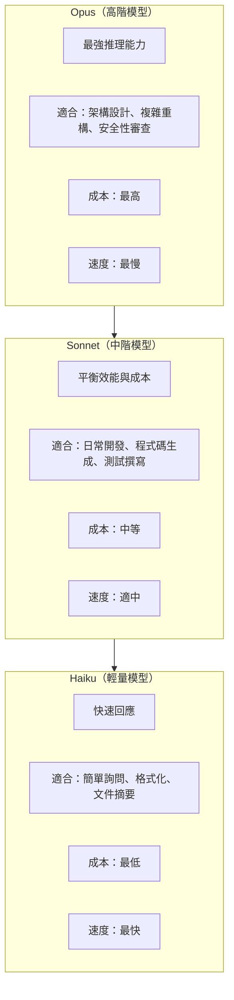
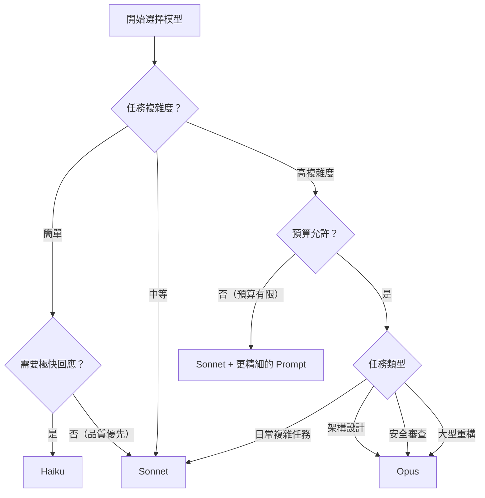

# 01-2-1 模型選擇策略：理解各模型的定位與適用場景

> ⚠️ **線上核實狀態**：已核實（2026-06-06）。Claude 模型家族（Opus/Sonnet/Haiku）的三層定位架構正確。
> **重要提醒**：具體的模型版本字串（如 `claude-sonnet-4-20250514`）與別名為示意格式，請以 `claude --help` 或 `/help` 顯示的可用模型清單為準。
> 模型選擇的「決策框架」（依任務複雜度與預算選擇）是通用的，不受具體版本影響。

## 1. 本章學習目標

- 認識 Claude Code 中可用的三種主要模型及其別名
- 理解各模型的設計定位、強項與限制
- 學會根據任務類型選擇最合適的模型
- 能在成本、速度與品質之間做出合理權衡
- 建立「模型選擇不是越強越好」的思維

## 2. 適用對象與前置知識

- **適用對象**：所有 Claude Code 使用者，尤其是想要優化 AI 協作效率與成本的開發者
- **前置知識**：已完成 Claude Code 基本操作（01-1-2），了解 Token 與成本概念（01-1-3）
- **關聯章節**：前接 [01-1-4 額度重置與 Extra Usage](./01-1-4-usage-limits-extra-usage-billing.md)，後接 [01-2-2 /effort 與 ultrathink](./01-2-2-effort-ultrathink-reasoning-control.md)

## 3. 核心概念

### 3.1 Claude 模型家族

Anthropic 的 Claude 模型分為三個層級，對應不同的效能與成本需求：



### 3.2 模型別名（Aliases）

Claude Code 中，模型可以透過別名來指定。確切的別名請參考 Claude Code 的 `/help` 或官方文件，常見模式如下：

| 模型 | 可能別名 | 定位 |
|------|---------|------|
| Claude Opus | `opus`、`claude-opus-4-20250514` | 最強推理 |
| Claude Sonnet | `sonnet`、`claude-sonnet-4-20250514` | 日常主力 |
| Claude Haiku | `haiku`、`claude-haiku-3-5-20250514` | 輕量快速 |

> **建議查核**：模型名稱與別名可能隨 Claude Code 版本更新而變化。請以 `claude --help` 或 `/help` 顯示的可用模型清單為準。

### 3.3 模型選擇決策框架



## 4. 實務情境

### 情境 1：CRUD 開發

**任務**：為 Ticket 系統建立標準的 CRUD Controller、Service、Repository。

**模型選擇**：**Sonnet**。這是模式化的工作，Sonnet 的推理能力足以產生正確的 Spring Boot 程式碼，不需要 Opus 的深度推理。

### 情境 2：微服務拆分架構設計

**任務**：將單體應用拆分為三個微服務，需要分析依賴關係、定義 API 合約、規劃資料拆分策略。

**模型選擇**：**Opus**。這需要深度的系統分析與多維度權衡，Opus 的強推理能力在此場景有明顯優勢。

### 情境 3：程式碼格式化與註解補充

**任務**：將 20 個 Java 檔案統一格式化，並補充 Javadoc 註解。

**模型選擇**：**Haiku**。格式化是低認知負荷任務，用最快最便宜的模型即可。

## 5. 操作步驟

### 5.1 在 Claude Code 中指定模型

在 Prompt 中直接指定：

```
請使用 sonnet 模型，為 TicketController 建立 CRUD 端點。
```

或在對話設定中切換（依 Claude Code 版本而異）：

```
/model sonnet
```

### 5.2 查看可用模型

```
/help models
```

或：

```
/model list
```

### 5.3 在 CLAUDE.md 中設定預設模型

```markdown
# CLAUDE.md

## Model Preferences
- default: sonnet
- code_review: opus
- documentation: haiku
```

> **注意**：CLAUDE.md 中的模型偏好設定是否生效，取決於 Claude Code 版本的支援程度。請以實際行為為準。

## 6. 指令與範例

### 模型選擇 Prompt 範例

```
# 輕量任務
請使用 haiku，為以下程式碼補上 Javadoc：
@Ticket.java

# 日常開發
請使用 sonnet，依照 spec.md 實作 TicketService 的 createTicket 方法：
@spec.md

# 複雜分析
請使用 opus，分析以下微服務架構的潛在問題，並提出重構建議：
@architecture.md
```

### 成本對比範例

假設一個 5,000 Token 輸入 + 1,500 Token 輸出的任務（僅為示意費率）：

| 模型 | 輸入成本 | 輸出成本 | 總成本 | 相對倍數 |
|------|---------|---------|--------|---------|
| Haiku | $0.80/MTok | $4/MTok | ~$0.01 | 1× |
| Sonnet | $3/MTok | $15/MTok | ~$0.04 | 4× |
| Opus | $15/MTok | $75/MTok | ~$0.19 | 19× |

**結論**：用 Opus 處理一個簡單的格式化任務，成本是用 Haiku 的 19 倍，但產出品質差異不大。

> **提醒**：以上數字僅為框架示範，實際費率請查閱 Anthropic 官方定價頁面。

## 7. 常見錯誤與排查方式

### 錯誤 1：所有任務都用 Opus

**原因**：誤以為「最貴 = 最好」，對所有任務都用最高階模型。

**症狀**：每月帳單暴增，但產出品質與用 Sonnet 沒有顯著差異。

**修正**：建立任務分級清單，90% 的日常任務使用 Sonnet；僅架構設計、安全審查等少數高價值任務使用 Opus（約佔 5-10%）。

### 錯誤 2：用 Haiku 處理需要深度推理的任務

**原因**：為了省成本，把複雜任務交給輕量模型。

**症狀**：產出的程式碼有邏輯錯誤、忽略邊界條件、需要反覆修正——省了模型費用，賠了開發時間。

**修正**：如果一個任務你需要花 10 分鐘以上思考，就不該用 Haiku。Haiku 適合「你已經知道答案，只是不想自己打字」的場景。

### 錯誤 3：未確認模型別名是否正確

**原因**：使用了過時的或錯誤的模型別名。

**症狀**：Claude Code 回覆「Unknown model」或自動降級到預設模型。

**修正**：使用前先查詢可用模型清單：
```
/help models
```

### 錯誤 4：在多輪對話中途切換模型

**原因**：想在一段對話的前半用 Sonnet，後半「升級」到 Opus。

**症狀**：部分 Claude Code 版本不支援對話中途切換模型，或切換後上下文處理不一致。

**修正**：若需要切換模型，先 `/clear` 後重新以新模型開始對話。若上下文很重要，請在新對話中摘要前一輪的重點。

## 8. 最佳實務

1. **預設使用 Sonnet**：對於 80-90% 的日常開發任務，Sonnet 是成本與品質的最佳平衡點。把它設為你心理上的「預設模型」
2. **Opus 留給「需要第二意見」的時刻**：當你需要一個經驗豐富的架構師來審查你的設計，或需要分析一個牽涉多個系統的複雜問題時，再動用 Opus
3. **Haiku 用於「機械性」工作**：格式化、產生樣板程式碼、摘要已知文件、轉換資料格式等
4. **在 CLAUDE.md 中定義任務-模型對應表**：讓團隊有明確的模型選擇指引，減少 subjective 的判斷
5. **定期回顧模型使用分布**：如果你的 Opus 使用率超過 20%，檢討是否有些任務可以用 Sonnet 取代；如果 Haiku 使用率極低，可能表示團隊對輕量模型缺乏信心——找機會試用並建立信任
6. **速度也是成本**：Opus 的回應速度明顯慢於 Sonnet 和 Haiku。在需要快速迭代的場景（如 TDD 的 Red-Green-Refactor 循環中），用 Opus 會拖慢節奏
7. **模型版本號的意義**：例如 `claude-sonnet-4-20250514` 中的日期標記了模型版本。同一模型線（Sonnet）的新版本可能帶來顯著的效能提升，關注 Anthropic 的發布公告

## 9. 安全性、權限與成本注意事項

### 安全性
- **所有模型都將您的資料傳送至 Anthropic 伺服器**。機密程式碼或資料應避免送入任何模型，無論其層級
- 不同模型的資料處理政策可能相同（都屬於 Anthropic API），但 Enterprise 方案可能有額外的資料隔離保護

### 權限
- Team/Enterprise 方案可限制特定成員只能使用 Sonnet 和 Haiku，不能使用 Opus——這是控制成本的有效手段
- 建議架構師與 Tech Lead 保留 Opus 使用權限，初階開發者預設使用 Sonnet

### 成本
- 模型的成本差異極大，Opus 可能是 Haiku 的 10-20 倍
- 同一任務用不同模型，成本差距可能達 10 倍以上，但產出品質差距僅 5-20%
- **成本效益思維**：多花 $0.15 用 Opus 做架構審查，可能省下未來數千美元的技術債重構成本——這是划算的。多花 $0.15 用 Opus 格式化程式碼——這是浪費

## 10. 小結

1. Claude Code 的三個模型層級（Haiku → Sonnet → Opus）對應輕量、平衡、深度三種需求，不是越貴越好
2. Sonnet 是日常開發的最佳預設選擇，覆蓋 80-90% 的任務
3. Opus 適合需要深度推理的高價值任務（架構設計、安全審查），但成本顯著較高
4. Haiku 適合機械性、低認知負荷的任務，是控制成本的利器
5. 建立團隊的模型選擇指引，讓「用什麼模型」成為有意識的決策，而非隨機的習慣

## 11. 延伸練習

### 練習一：模型比較實驗（操作型）
1. 選擇一個中等複雜度的任務（例如：為 REST API 撰寫單元測試）
2. 分別用 Haiku、Sonnet、Opus 執行相同的 Prompt
3. 比較三者的：
   - 產出品質（測試覆蓋率、邊界條件處理）
   - 回應時間
   - 程式碼風格與可讀性
4. 記錄你的結論：這個任務最適合用哪個模型？

### 練習二：團隊模型策略設計（思考型）
您負責一個 25 人團隊的 Claude Code 使用策略。請設計：
1. 一份「任務-模型對應表」：列出 10 種常見的開發任務，為每種任務指定建議模型
2. 如何驗證團隊成員確實依照對應表選擇模型？（技術手段 vs. 文化手段）
3. 當一個任務的複雜度難以判斷時（例如「好像有點複雜，但又不確定值不值得用 Opus」），你的決策原則是什麼？
4. 如何在成本報告中區分不同模型的用量，以便分析 ROI？

## 12. 查核來源與版本備註

本章內容尚未完成即時官方文件查核，正式發布前應重新比對官方最新文件。

- 本章內容依據以下資料核實：
  - 來源 1：Anthropic 官方模型文件與定價頁面
  - 來源 2：Anthropic Claude Code 官方文件（模型指定方式）
- 查核日期：2026-06-05（教材撰寫日期，尚未完成最終官方查核）
- 版本備註：模型名稱（Sonnet 4.6、Opus 4.6、Haiku 4.5）與可用性可能隨 Anthropic 發布新版本而變化。模型別名、切換指令的具體語法以 Claude Code 最新版本為準
- 若使用者環境與本文不同，請優先依官方最新文件與實際環境調整
