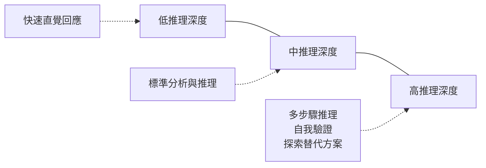
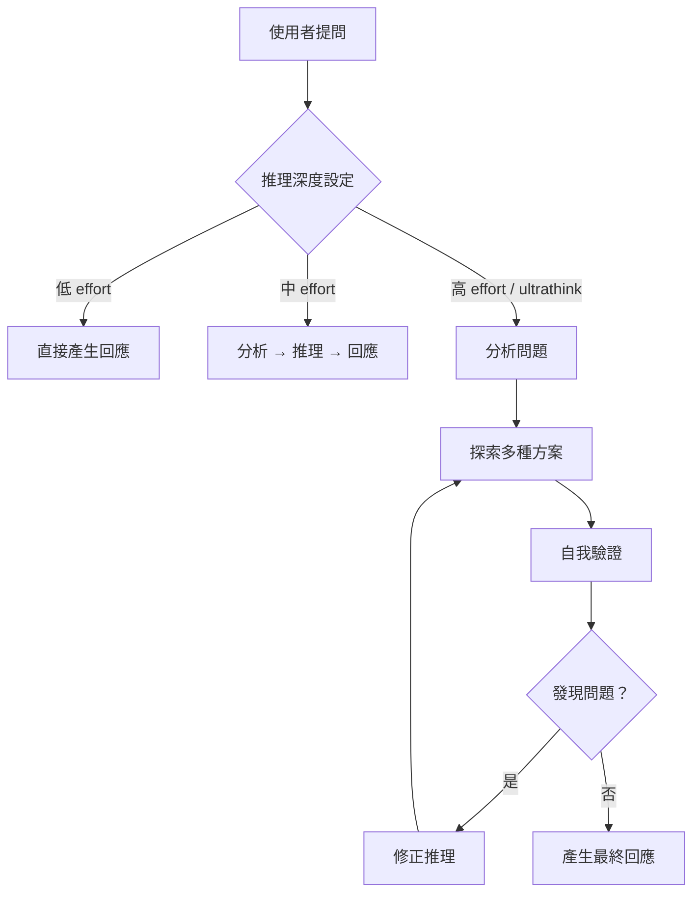

# 01-2-2 推理深度控制：/effort 指令與 ultrathink 觸發

## 1. 本章學習目標

- 理解 Claude Code 中推理深度控制的概念與必要性
- 學會使用 `/effort` 指令調整 Claude 的思考投入程度
- 理解 ultrathink（深度思考）模式何時該觸發、何時該避免
- 能在任務需求與資源消耗之間動態調整推理深度
- 避免「一律用最深思維」或「一律用最淺思維」的極端做法

## 2. 適用對象與前置知識

- **適用對象**：希望精細控制 Claude Code 輸出品質與成本的進階使用者
- **前置知識**：已了解 Claude Code 的模型選擇（01-2-1）與 Token 成本概念（01-1-3）
- **關聯章節**：前接 [01-2-1 模型別名與場景](./01-2-1-model-aliases-and-use-cases.md)，後接 [01-2-3 五種操作模式](./01-2-3-permission-and-operation-modes.md)

## 3. 核心概念

### 3.1 什麼是推理深度？

推理深度（Reasoning Effort）指的是 Claude 在產生回應之前，投入多少「思考時間」進行分析、推理、權衡與驗證。這不是一個二元開關（深/淺），而是一個連續的光譜：



### 3.2 /effort 指令

`/effort` 是 Claude Code 中用來設定推理深度的指令。它影響 Claude 在回答前的「思考量」：

- **低 effort**：快速回應，適合簡單、明確的問題
- **中 effort**（預設）：平衡思考與速度，適合大多數開發場景
- **高 effort**：深度推理，適合複雜的架構問題、多維度權衡、安全性分析

> **建議查核**：`/effort` 指令的具體層級名稱與效果，應以 Claude Code 最新版本的 `/help effort` 輸出為準。

### 3.3 ultrathink 模式

Ultrathink 是 Claude Code 中最深度的推理模式，類似於「讓 Claude 在回答前進行擴展思考」。觸發 ultrathink 時，Claude 會：

1. 進行多步驟分析
2. 自我質疑與驗證
3. 探索多個替代方案
4. 考慮邊界條件與例外情況
5. 產生更全面、更可靠的結論



## 4. 實務情境

### 情境 1：簡單的語法查詢

**任務**：「Java 17 中 switch expression 的語法是什麼？」

**推理深度**：**低 effort**。這是有明確答案的事實性問題，不需要深度推理。

### 情境 2：API 設計權衡

**任務**：「Ticket 系統應該用 REST API 還是 GraphQL？考慮到我們有行動端和 Web 端兩種客戶端，且未來可能擴展到第三方整合。」

**推理深度**：**高 effort / ultrathink**。這需要多維度分析（效能、開發成本、維護性、擴展性、團隊技能），且答案沒有絕對的對錯。

### 情境 3：Bug 修復

**任務**：「TicketController.createTicket() 在某些情況下會回傳 500，請找出原因並修正。」

**推理深度**：**中 effort**。需要閱讀程式碼、追蹤邏輯、找出問題，但範圍明確，不需要大規模的架構思考。

## 5. 操作步驟

### 5.1 使用 /effort 指令

在 Claude Code 互動模式中：

```
/effort low
/effort medium
/effort high
```

### 5.2 在 Prompt 中觸發 ultrathink

除了 `/effort` 指令，也可以在 Prompt 中明確要求深度思考：

```
請對以下問題進行深度思考（ultrathink），分析所有可能的方案及其 trade-off：
我們應該如何設計 Ticket 系統的權限模型？
```

### 5.3 查看目前 effort 設定

```
/effort
```

（不帶參數時顯示目前設定）

## 6. 指令與範例

### 不同 effort 等級的 Prompt 範例

#### 低 effort
```
/effort low
請說明 @Transactional 註解的基本用法。
```

#### 中 effort（預設）
```
/effort medium
請分析 TicketService 中的交易邊界是否合理，是否存在分散式交易風險。
```

#### 高 effort / ultrathink
```
/effort high
請全面評估以下微服務架構方案：
1. 同步 REST 呼叫 vs 非同步訊息佇列
2. 資料庫 per service vs 共享資料庫
3. API Gateway 模式 vs Service Mesh
針對我們的業務場景（電商、日均 10 萬訂單、SLA 99.9%），請給出具體建議。
```

### 組合使用模型與 effort

```
請使用 opus 模型，以高 effort（ultrathink）模式，全面審查以下程式碼的安全性：
@src/main/java/com/example/security/AuthController.java
```

## 7. 常見錯誤與排查方式

### 錯誤 1：所有問題都使用高 effort

**原因**：誤以為「思考越深 = 答案越好」。

**症狀**：
- 簡單問題也要等很久才有回應
- Token 消耗暴增（深度推理會產生大量內部思考 Token）
- 回應過於冗長，重點被淹沒在過度分析中

**修正**：先判斷問題的複雜度。一個好用的經驗法則：如果你自己需要坐下來畫圖才能回答的問題，才用高 effort。

### 錯誤 2：複雜問題使用低 effort

**原因**：為了追求速度或節省成本，在需要深度分析的場景使用低 effort。

**症狀**：
- 回應過於膚淺，只觸及表面
- 忽略重要的邊界條件或例外情況
- 需要反覆追問才能得到完整答案（反而更花時間與 Token）

**修正**：如果問題涉及多個變數的交互作用、需要 trade-off 分析、或影響範圍大（如架構決策），預設使用高 effort。

### 錯誤 3：混淆模型選擇與 effort 設定

**原因**：認為「用 Opus 就等於高 effort」。

**症狀**：用 Opus 搭配低 effort，或用 Haiku 搭配高 effort——前者浪費了 Opus 的推理能力，後者讓 Haiku 做超出其設計範圍的事。

**修正**：
- 模型決定「誰來想」→ Opus 的推理引擎比 Haiku 強大
- effort 決定「想多久」→ 即使 Opus，低 effort 也不會進行深度推理
- 最佳組合：簡單任務 = Haiku + 低 effort；複雜任務 = Opus + 高 effort

### 錯誤 4：忽略 effort 對成本的影響

**原因**：未意識到高 effort 模式會產生大量的「思考 Token」。

**症狀**：使用高 effort 後，成本明顯高於預期。

**修正**：
- 高 effort 的內部推理 Token 也會計費
- 估算成本時，高 effort 的 Token 消耗可能是低 effort 的 3-5 倍
- 把高 effort 留給真正需要深度思考的場景

## 8. 最佳實務

1. **預設使用中 effort**：對於日常開發，中 effort 是成本、速度與品質的最佳平衡點。不要一打開 Claude Code 就調到高 effort
2. **ultrathink 用於「不可逆」決策**：架構決策、API 合約設計、資料模型定義——這些一旦確定就很難修改的決策，值得用 ultrathink 充分分析
3. **低 effort 用於「你已經知道答案」的場景**：當你需要 Claude 幫你寫出你已經知道怎麼寫的程式碼，或查詢你知道存在但不記得細節的 API 用法
4. **在一個對話中動態調整 effort**：一個對話的前半可能是簡單的環境確認（低 effort），中段是功能實作（中 effort），結尾是架構審查（高 effort）。不要一個 effort 用到底
5. **effort 與模型的搭配矩陣**：

| 任務類型 | 建議模型 | 建議 effort | 範例 |
|---------|---------|------------|------|
| 簡單查詢 | Haiku | 低 | API 語法查詢 |
| 日常開發 | Sonnet | 中 | CRUD 實作 |
| 複雜開發 | Sonnet/Opus | 中-高 | 複雜業務邏輯 |
| 架構設計 | Opus | 高/ultrathink | 微服務拆分 |
| 安全審查 | Opus | 高/ultrathink | 滲透測試分析 |

6. **學習辨識「假簡單」問題**：有些問題表面簡單（「這個 API 怎麼設計？」），實際上牽涉多個系統、多種約束。當你不確定複雜度時，先用中 effort，若回應不夠深入再加強
7. **effort 不是品質保證**：高 effort 提高的是「思考的廣度與深度」，不是 100% 正確率。即使 ultrathink，Claude 的結論仍需人工審查

## 9. 安全性、權限與成本注意事項

### 安全性
- 高 effort 模式會讓 Claude 更深入地分析程式碼——這意味著更多程式碼會被「仔細閱讀」並傳送至 API。確保傳送的內容不包含敏感資訊
- ultrathink 可能探索攻擊面與安全漏洞——這些分析內容本身也是敏感資訊，確認 API 的資料處理政策

### 權限
- 目前 Claude Code 的 effort 設定通常是 per-session 的，不同團隊成員可以有不同的 effort 偏好
- 若團隊需要管控 effort 使用（避免有人一律用高 effort 浪費成本），可透過 CLAUDE.md 或團隊規範來約定

### 成本
- **高 effort 的成本可能是低 effort 的 3-5 倍**，因為內部推理 Token 也被計費
- 估算成本時，將 effort 等級納入計算。一個 5,000 Token 輸入的任務，在低 effort 下可能消耗 1,500 輸出 Token，高 effort 下可能消耗 5,000-8,000 輸出 Token（含推理鏈）
- 定期回顧高 effort 的使用頻率——如果超過 30% 的互動使用高 effort，檢討是否有些場景可以降級

## 10. 小結

1. `/effort` 指令讓你能精細控制 Claude 的推理深度，從快速直覺到深度 ultrathink
2. 推理深度不是「越高越好」——它與任務複雜度、成本、回應速度之間需要動態平衡
3. ultrathink 適合不可逆的重大決策（架構、安全、API 合約），不適合日常 CRUD
4. 模型選擇（誰來想）與 effort 設定（想多久）是兩個獨立維度，需要搭配使用
5. 養成在每個任務前判斷「這個問題需要多深的思考」的習慣，這是 AI 協作的核心素養

## 11. 延伸練習

### 練習一：effort 對比實驗（操作型）
1. 選擇一個中等複雜度的問題（例如：設計一個 API 的錯誤處理策略）
2. 分別以低、中、高 effort 向 Claude 提問（使用 `/clear` 確保每次獨立）
3. 比較三種回應的：
   - 深度（是否考慮了邊界條件、例外情況）
   - 廣度（是否探索了多種方案）
   - 實用性（是否能直接應用）
   - Token 消耗（從回應長度估算）
4. 記錄你的結論：對這個任務而言，哪個 effort 等級最合適？

### 練習二：effort 使用策略設計（思考型）
1. 列出你日常工作中的 10 種常見任務類型
2. 為每種任務類型指定建議的 effort 等級（低/中/高）
3. 定義觸發 ultrathink 的明確條件（例如：影響超過 3 個微服務、涉及金融計算、需要長期維護的 API 合約）
4. 思考：如果團隊不設任何 effort 指引，開發者可能會出現哪些使用偏差？如何在不增加過多管理負擔的前提下引導正確使用？

## 12. 查核來源與版本備註

本章內容尚未完成即時官方文件查核，正式發布前應重新比對官方最新文件。

- 本章內容依據以下資料核實：
  - 來源 1：Anthropic Claude Code 官方文件（/effort 指令、推理深度控制）
  - 來源 2：Anthropic API 文件（thinking/reasoning 機制）
- 查核日期：2026-06-05（教材撰寫日期，尚未完成最終官方查核）
- 版本備註：`/effort` 指令的具體語法、effort 等級名稱與 ultrathink 的觸發機制為撰寫時的參考框架。實際行為以 Claude Code 最新版本為準
- 若使用者環境與本文不同，請優先依官方最新文件與實際環境調整
