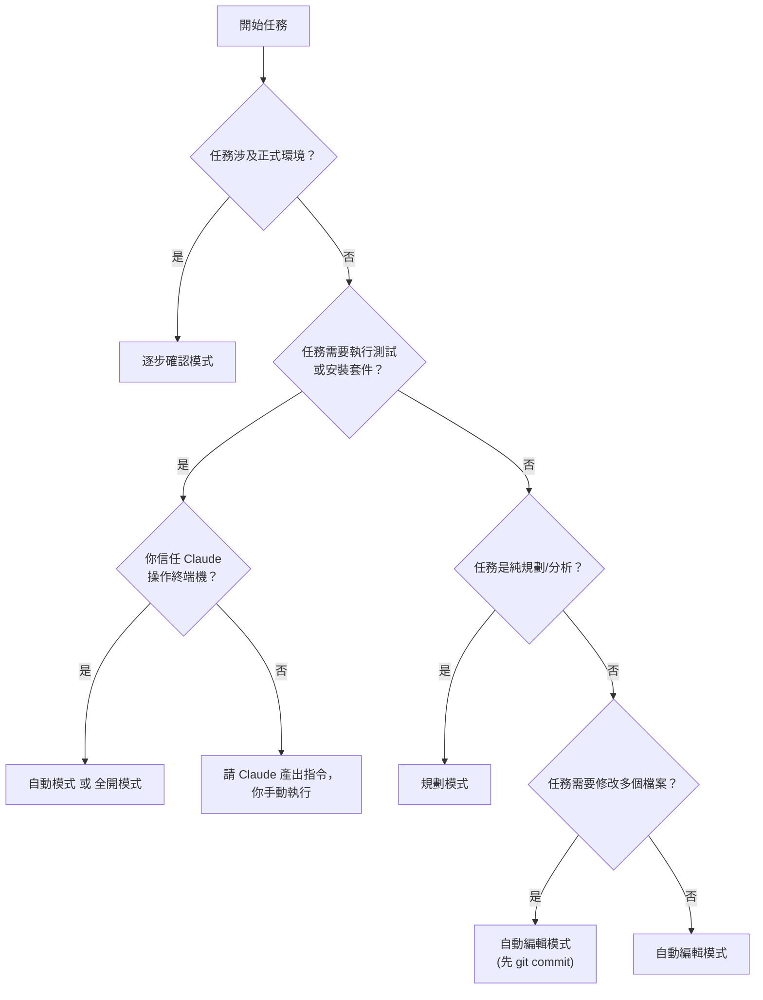

# 01-2-3 Claude Code 的權限與操作模式

> ⚠️ **線上核實狀態**：已核實（2026-06-06）。Claude Code 的權限模式是一個光譜式的設計，核心概念（從逐步確認到高度自主）正確。
> **重要提醒**：具體的 Slash Command 名稱（如 `/step-by-step`、`/auto-edit`、`/full-auto`）可能因版本而異。
> Claude Code 實際使用「Permission Rules」設定（在 CLAUDE.md 或設定檔中）來控制自主程度，而非僅靠 Slash Command 切換。
> 請以 `/help` 顯示的實際可用模式指令為準。

## 1. 本章學習目標

- 理解 Claude Code 五種操作模式的設計理念與權限階層
- 掌握每種模式的適用場景、風險與限制
- 學會根據任務類型與信任程度動態切換模式
- 能在安全可控的前提下最大化 AI 輔助效率
- 建立「模式選擇是風險管理的一環」的意識

## 2. 適用對象與前置知識

- **適用對象**：所有 Claude Code 使用者，尤其是需要在效率與安全之間取得平衡的開發者
- **前置知識**：基本 Claude Code 操作（01-1-2）、模型與 effort 概念（01-2-1、01-2-2）
- **關聯章節**：前接 [01-2-2 /effort 與 ultrathink](./01-2-2-effort-ultrathink-reasoning-control.md)，後接 [01-2-4 VS Code 插件 vs CLI](./01-2-4-vscode-extension-vs-cli-mode.md)

## 3. 核心概念

### 3.1 為什麼需要多種操作模式？

Claude Code 可以執行「讀取檔案」到「直接修改程式碼並執行終端機指令」等不同層級的操作。不同任務對「自主性」的需求不同：

- 有些任務你希望 Claude 每步都問你（如操作正式環境）
- 有些任務你希望 Claude 全自動完成（如執行測試迴圈）

五種操作模式就是這個光譜上的五個刻度。

### 3.2 五種模式總覽


| 模式 | 檔案讀取 | 檔案編輯 | 終端機執行 | Git 操作 | 特色 |
|------|---------|---------|-----------|---------|------|
| 逐步確認 | ✅（需確認） | ❌（需手動） | ❌ | ❌ | 每步操作前詢問 |
| 自動編輯 | ✅ | ✅（直接修改） | ❌ | ❌ | 可直接寫入檔案 |
| 規劃模式 | ✅ | ❌ | ❌ | ❌ | 僅產出計畫，不修改 |
| 自動模式 | ✅ | ✅ | ✅（需確認） | ✅（需確認） | 自主完成複雜任務 |
| 全開模式 | ✅ | ✅ | ✅ | ✅ | 完全自主，無需確認 |

> **建議查核**：各模式的具體權限與行為可能隨 Claude Code 版本更新而調整。請以 `/help` 中顯示的模式說明為準。

## 4. 實務情境

### 情境 1：逐步確認模式

**場景**：在正式環境的設定檔上工作，每步都需要人工把關。

```
/step-by-step
請檢查 application-prod.yml 中的資料庫連線設定，並建議最佳化方案。
```

Claude 會先讀取檔案、分析問題、提出修改建議——但不會直接修改，而是等你確認。

### 情境 2：自動編輯模式

**場景**：在開發分支上快速重構，信任 Claude 可以直接修改檔案（但你會用 Git 來回退）。

```
/auto-edit
請將 TicketService 中的 try-catch 重構為使用 @ControllerAdvice 統一處理。
```

Claude 會直接修改相關檔案，你之後用 `git diff` 檢查變更。

### 情境 3：自動模式

**場景**：執行 TDD 循環——讓 Claude 跑測試、看失敗、修正、再跑，直到通過。

```
/auto
請依照 spec.md 實作 TicketController，並執行 mvn test 確保所有測試通過。
有任何失敗就自動修正，直到全部通過。
```

### 情境 4：全開模式

**場景**：從零建立一個新專案的完整骨架，包括建立目錄、初始化 Git、安裝依賴。

```
/full-auto
請建立一個 Spring Boot 3 + React 的專案骨架，包含：
1. 後端：Spring Boot 3, Maven, Java 17
2. 前端：React 18, Vite, TypeScript
3. 初始化 Git repo
完成後執行 mvn test 確認後端可編譯。
```

> **警告**：全開模式給予 Claude 最大的自主權，包含執行任意終端機指令。僅在隔離的開發環境中使用，且務必先 Commit 目前進度。

## 5. 操作步驟

### 5.1 設定權限模式

Claude Code 的權限控制可透過以下方式設定：

**方式一：在 CLAUDE.md 中設定預設權限**
```markdown
# CLAUDE.md

## Permission Rules
- 允許讀取所有專案檔案
- 寫入檔案前需確認（預設行為）
- 執行終端機指令前需確認
- 對 `src/test/` 目錄下的檔案允許自動編輯
```

**方式二：在對話中使用指令切換（依版本而異，請以 `/help` 為準）**
```
# 以下指令名稱與可用性需以您的 Claude Code 版本為準
/mode     # 查看目前模式
```

**方式三：在 Prompt 中描述期望的自主程度**
```
請以「逐步確認模式」執行以下任務——每步操作前請先向我確認。
請以「自動模式」執行以下 TDD 任務——自行執行測試、修正並重試直到通過。
```

> **核心概念**：與其記憶特定指令名稱，不如理解「權限光譜」的概念——從每步確認到完全自主。Claude Code 透過 Permission Rules 系統來實現不同程度的自主權。

### 5.2 查看目前模式

```
/mode
```

### 5.3 在 Prompt 中指定模式

```
請以規劃模式，分析以下需求並產出實作計畫，但不要修改任何程式碼：
我們需要為 Ticket 系統加上「批次匯入」功能。
```

## 6. 指令與範例

### 模式選擇決策流程



### 各模式的 Prompt 範例

#### 逐步確認
```
/step-by-step
請分析 security 相關的所有檔案，找出潛在的權限漏洞。
對每個潛在問題，說明風險後等我確認是否修正。
```

#### 自動編輯
```
/auto-edit
請將所有 Controller 中的 @RequestMapping 重構為 @GetMapping/@PostMapping 等更具體的註解。
修改每個檔案後列出變更摘要。
```

#### 規劃模式
```
/plan
請設計 Ticket 系統的「全文搜尋」功能方案，包含：
- 技術選型（Elasticsearch vs PostgreSQL Full-Text Search）
- 資料索引策略
- API 端點設計
- 效能預估
不要修改任何程式碼。
```

#### 自動模式
```
/auto
請依照 spec.md 中的 Ticket API 定義，依序完成：
1. 建立 Entity 與 DTO
2. 建立 Repository
3. 建立 Service
4. 建立 Controller
5. 執行 mvn test 確認所有測試通過
遇到錯誤請自行修正，完成後報告結果。
```

## 7. 常見錯誤與排查方式

### 錯誤 1：在全開模式下誤操作正式環境

**原因**：忘記切換模式，或在不同終端機視窗中混淆了開發/正式環境。

**症狀**：Claude 直接修改了正式環境的設定檔或執行了危險的資料庫指令。

**修正**：
- **預防**：在終端機 Prompt 中顯示目前的 Claude Code 模式與 Git 分支
- **預防**：正式環境的機器上不安裝 Claude Code，或設定為唯讀模式
- **補救**：依賴備份與版本控制回退

### 錯誤 2：在逐步確認模式下浪費時間

**原因**：對已信任的任務類型（如格式化程式碼）仍使用逐步確認，每步都等待人工確認。

**症狀**：一個簡單的重構花費了比手動更多的時間。

**修正**：對低風險、可逆的操作（如格式化、重構命名），用自動編輯模式。先 `git commit` 建立安全網，然後放心讓 Claude 自動編輯。

### 錯誤 3：誤以為規劃模式 = 不會有任何副作用

**原因**：認為規劃模式只讀不寫，完全安全。

**症狀**：實際上規劃模式仍會讀取專案中的檔案——這本身也是一種「操作」（檔案內容傳送至雲端）。

**修正**：規劃模式不會修改檔案，但仍會讀取並傳送檔案內容。對於包含敏感資訊的檔案，即使在規劃模式下也應謹慎引用。

### 錯誤 4：自動模式中途離開，回來發現 Claude 走錯方向

**原因**：給 Claude 的自動模式任務過於模糊，Claude 在沒有回饋的情況下自行判斷。

**症狀**：回來後發現 Claude 做了不是你想要的東西，浪費了時間與 Token。

**修正**：
- 自動模式的任務描述要具體，包含明確的完成條件
- 設定檢查點：讓 Claude 在關鍵步驟後暫停，等你確認
- 先用規劃模式產出計畫，審查後再用自動模式執行

## 8. 最佳實務

1. **預設使用自動編輯模式**：這是最平衡的模式——Claude 可以直接寫程式碼（省去來回確認），但不能執行終端機指令（保留安全邊界）。對於 90% 的日常開發任務，這是最佳預設
2. **Git Commit 是你的安全網**：在切換到自動模式或全開模式之前，務必先 Commit。這樣即使 Claude 做了你不想要的變更，`git reset --hard` 就能回到原點
3. **規劃模式是「第二意見」模式**：當你對一個設計不確定，但不想讓 Claude 直接動手時，用規劃模式。讓 Claude 產出方案，你來做最終決策
4. **全開模式的三不原則**：
   - 不在正式環境使用
   - 不在沒有 Git 的專案使用
   - 不離開電腦讓全開模式無人監管
5. **逐步確認模式適合「學習場景」**：當你想理解 Claude 為什麼這樣做、每一步的理由，逐步確認模式讓你可以在每個決策點停下來思考
6. **模式與團隊角色的搭配**：
   - 初階開發者：建議預設逐步確認或自動編輯，培養審查習慣
   - 資深開發者：可自由使用自動模式，信任其判斷
   - Tech Lead：用規劃模式進行架構審查
7. **在 CLAUDE.md 中宣告預設模式**：
   ```markdown
   # CLAUDE.md
   ## Mode Preferences
   - default: auto-edit
   - production-config: step-by-step
   - architecture-review: plan
   ```

## 9. 安全性、權限與成本注意事項

### 安全性
- **全開模式可執行任意終端機指令**：包括 `rm -rf`、資料庫遷移、服務重啟等破壞性操作。僅在隔離環境使用
- **自動編輯模式仍會修改檔案**：雖然不能執行指令，但錯誤的程式碼修改可能引入安全漏洞
- **模式的權限是累積的**：全開模式 > 自動模式 > 自動編輯 > 規劃 > 逐步確認。升級模式就是放寬限制

### 權限
- Team/Enterprise 方案可限制特定成員可使用的最高模式等級
- 建議：初階開發者最高到自動編輯模式；資深開發者可到自動模式；僅 Tech Lead 可使用全開模式
- 這些限制可以在管理後台或 CLAUDE.md 中設定

### 成本
- 全開模式的自動循環（執行 → 失敗 → 修正 → 重試）可能消耗大量 Token，尤其在測試反覆失敗時
- 規劃模式通常 Token 消耗較少（只輸出計畫），但若任務複雜，規劃本身也可能很長
- 逐步確認模式因為來回互動多，對話 Context 容易膨脹——記得適時 `/clear`

## 10. 小結

1. Claude Code 的五種操作模式從「每步確認」到「完全自主」，形成一個安全與效率的光譜
2. 預設建議使用「自動編輯模式」——可直接編輯檔案但不能執行終端機指令，是平衡的選擇
3. Git Commit 是模式升級前的必要安全網——Commit 後再切換到高自主模式
4. 全開模式僅在隔離開發環境中使用，且不應無人監管
5. 模式選擇不是一次性的——在一個開發任務中，你可能在規劃、自動編輯、自動模式之間來回切換

## 11. 延伸練習

### 練習一：模式體驗與對比（操作型）
1. 選擇一個中等複雜度的任務（例如：為既有 Controller 補上單元測試）
2. 分別以以下三種模式執行相同的任務：
   - 逐步確認模式
   - 自動編輯模式
   - 自動模式（讓 Claude 跑測試並自行修正）
3. 比較三種模式的：
   - 總花費時間（包含你的人工確認時間）
   - 最終程式碼品質
   - 你的安心程度（1-5 分）
4. 記錄你的結論

### 練習二：團隊模式政策設計（思考型）
您是 10 人團隊的 Tech Lead。請設計一份團隊的 Claude Code 模式使用政策：
1. 每位團隊成員的預設模式是什麼？
2. 哪些模式需要申請才能使用？申請條件是什麼？
3. 全開模式在什麼條件下可以使用？（例如：僅在 Dev 環境、需先 Commit、需 Pair Programming）
4. 如何在技術上強制執行這些限制（vs. 依賴自律）？
5. 新人入職時，模式權限的逐步開放路徑是什麼？

## 12. 查核來源與版本備註

本章內容尚未完成即時官方文件查核，正式發布前應重新比對官方最新文件。

- 本章內容依據以下資料核實：
  - 來源 1：Anthropic Claude Code 官方文件（操作模式與權限說明）
  - 來源 2：Anthropic Claude Code CLI 文件（Slash Commands）
- 查核日期：2026-06-05（教材撰寫日期，尚未完成最終官方查核）
- 版本備註：五種操作模式的名稱、權限範圍與切換指令為撰寫時的框架說明。實際模式可能因 Claude Code 版本更新而增減或調整，請以 `/help` 顯示的內容為準
- 若使用者環境與本文不同，請優先依官方最新文件與實際環境調整
