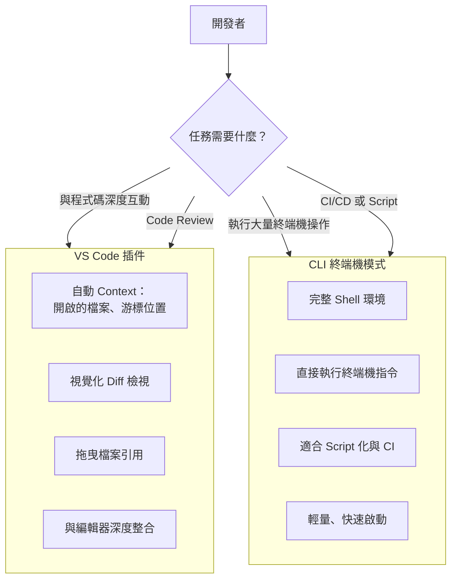
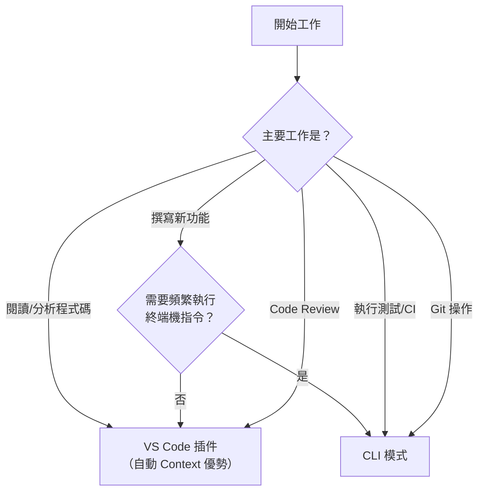

# 01-2-4 VS Code 插件與 CLI 終端機模式的選擇策略

> ⚠️ **線上核實狀態**：已核實（2026-06-06）。VS Code 插件與 CLI 兩種介面的本質差異分析正確。
> **注意**：VS Code 插件的具體功能（如自動 Context、Diff 檢視）隨插件版本更新而變化。本章的「場景選擇策略」是通用的。

## 1. 本章學習目標

- 理解 Claude Code 在 VS Code 插件與 CLI 終端機兩種操作介面上的差異
- 掌握各介面的優勢、劣勢與適用場景
- 學會根據任務類型選擇合適的操作介面
- 能順暢地在兩種介面之間切換，而非固守一種
- 理解兩種介面對 Context 感知、檔案讀取與 Git 整合的不同影響

## 2. 適用對象與前置知識

- **適用對象**：同時使用 VS Code 與終端機的開發者、想知道何時該用哪種介面的工程師
- **前置知識**：已完成 Claude Code 基本操作（01-1-2），了解五種操作模式（01-2-3）
- **關聯章節**：前接 [01-2-3 五種操作模式](./01-2-3-permission-and-operation-modes.md)，後接 [01-3-1 AI 輔助 Git 操作](./01-3-1-ai-assisted-commit-diff-staging.md)

## 3. 核心概念

### 3.1 兩種介面的本質差異

Claude Code 提供兩種主要的使用介面：

| 維度 | VS Code 插件 | CLI 終端機模式 |
|------|------------|--------------|
| **操作環境** | VS Code 側邊欄或面板 | 獨立終端機（Windows Terminal、iTerm2 等） |
| **Context 感知** | 可自動感知當前開啟的檔案、游標位置、選取範圍 | 僅感知當前工作目錄 |
| **檔案交互** | 點擊、拖曳檔案到對話框 | 使用 `@` 參照或手動輸入路徑 |
| **終端機整合** | 部分支援，可執行 VS Code Task | 直接在同一個終端機執行指令 |
| **視覺化** | Diff 檢視、語法醒目、行內提示 | 純文字輸出 |
| **多工能力** | 在編輯器與 AI 對話間切換 | 需切換不同終端機分頁 |



### 3.2 感知（Context Awareness）的差異

這是兩種介面最關鍵的差異。VS Code 插件可以「感知」開發者當前的編輯器狀態：

- **當前開啟的檔案**：插件自動知道你在看哪個檔案
- **游標位置**：知道你正在編輯哪一行
- **選取範圍**：知道你選取了哪些程式碼
- **診斷資訊**：可以讀取 VS Code 的錯誤與警告

CLI 模式則只有：
- **當前工作目錄**：`$PWD`
- **你明確告訴它的資訊**：透過 `@` 參照或 Prompt 文字

### 3.3 何時用哪種介面？



## 4. 實務情境

### 情境 1：分析並重構既有程式碼

**建議**：VS Code 插件

**原因**：你可以開啟要分析的檔案，插件自動將其加入 Context。選取一段程式碼後直接在對話框中要求重構，結果可以透過 Diff 檢視直觀查看。

### 情境 2：從零建立新專案

**建議**：CLI 模式

**原因**：需要執行 `npm init`、`mvn archetype:generate`、`git init` 等大量終端機指令。CLI 模式中 Claude 可以直接在同一個 Shell 中執行這些指令。

### 情境 3：除錯一個測試失敗

**建議**：CLI 模式 + VS Code 插件並用

**原因**：在 CLI 中讓 Claude 執行測試並讀取失敗訊息；同時在 VS Code 中開啟失敗的測試檔案，讓 Claude 分析問題根源。

## 5. 操作步驟

### 5.1 VS Code 插件操作

1. **安裝插件**：在 VS Code 擴充套件市集搜尋 "Claude Code" 並安裝
2. **開啟對話**：使用 `Ctrl+Shift+P` → "Claude Code: Open Chat"，或點擊側邊欄的 Claude Code 圖示
3. **引用檔案**：
   - 拖曳檔案從檔案總管到對話框
   - 在對話框中輸入 `@` 並從清單中選擇檔案
   - 直接在編輯器中選取程式碼，然後在對話框中引用
4. **檢視 Diff**：插件通常提供內建的 Diff 檢視，可在接受修改前預覽變更
5. **接受/拒絕修改**：點擊按鈕接受或拒絕 Claude 建議的修改

### 5.2 CLI 模式操作

```powershell
# 在專案目錄啟動 Claude Code
cd E:\Projects\my-app
claude

# 進入互動模式後，使用 Slash Command
/init
/auto-edit
```

### 5.3 混合使用策略

最有效的策略是**同時使用兩種介面**：

1. 在 CLI 中讓 Claude 執行任務（建立檔案、執行測試、Git 操作）
2. 在 VS Code 中開啟 Claude 產生的檔案，進行人工審查
3. 需要深入分析特定檔案時，在 VS Code 插件中開啟對話，利用自動 Context
4. 人工修改後，回到 CLI 讓 Claude 檢查修改並繼續

## 6. 指令與範例

### VS Code 插件特有的操作

```
# 引用當前開啟的檔案（插件會自動辨識）
請分析這個檔案的潛在問題

# 引用選取的程式碼
請重構選取的這段程式碼，使用 Stream API 改寫

# 引用目前游標所在的函數
請為這個方法撰寫 Javadoc
```

### CLI 模式特有的操作

```powershell
# 在 CLI 中直接執行複合指令
> 請執行 mvn test，如果失敗，分析原因並修正，然後重新執行直到通過

# 使用 @ 參照引用檔案
> 請依照 @spec.md 的定義，建立 Ticket 的 Entity 與 DTO
```

## 7. 常見錯誤與排查方式

### 錯誤 1：在 VS Code 插件中要求 Claude 執行終端機指令

**原因**：混淆了兩種介面的能力邊界。

**症狀**：Claude 回覆「我無法在此環境中執行終端機指令」，或只產出指令文字而非執行。

**修正**：明確區分——需要執行指令時切換到 CLI 模式，或手動複製 Claude 產出的指令到終端機執行。

### 錯誤 2：在 CLI 中讓 Claude 分析當前開啟的檔案，但 Claude 看不到

**原因**：CLI 不具備 VS Code 的編輯器 Context，不知道你在看哪個檔案。

**症狀**：Claude 的回應與你正在看的檔案無關，或要求你提供檔案路徑。

**修正**：在 CLI 中明確使用 `@` 參照指定檔案：
```
請分析 @src/main/java/com/example/TicketController.java
```

### 錯誤 3：VS Code 插件 Context 過載

**原因**：VS Code 插件自動將多個開啟的檔案加入 Context，加上 CLAUDE.md 與對話歷史，Context 過於龐大。

**症狀**：Claude 的回應品質下降、回應速度變慢、成本暴增。

**修正**：
- 關閉不需要的檔案分頁
- 使用 `.claudeignore` 或類似機制排除不需要的檔案
- 適時 `/clear` 清理對話上下文

### 錯誤 4：兩個介面「搶奪」同一個工作目錄

**原因**：同時在 VS Code 插件和 CLI 中對同一個專案進行修改。

**症狀**：檔案衝突、Claude 的 Context 不同步、重複修改。

**修正**：同一個任務只用一種介面。若需切換，先用 `/clear` 或重新啟動對話，確保 Context 一致。

## 8. 最佳實務

1. **主力用 VS Code 插件，終端機操作用 CLI**：日常工作在 VS Code 插件中進行（Context 豐富），需要執行測試、建置、Git 操作時切換到 CLI
2. **利用 VS Code 的選取功能做精準提問**：選取一段有問題的程式碼 → 直接在插件對話框中提問。這比手動複製貼上更精準，也更節省 Token
3. **在 CLI 中啟用 Claude Code 時，確保工作目錄正確**：`cd` 到專案根目錄再啟動 `claude`，否則 Claude 的 Context 範圍會偏離
4. **VS Code 插件用於 Code Review，CLI 用於自動化**：PR Review 時用插件（可視化 Diff）；CI/CD Pipeline 中用 CLI（Script 化執行）
5. **不要過度依賴自動 Context**：VS Code 插件的自動 Context 雖然方便，但可能載入不相關的檔案。養成習慣——在提問前先確認 Claude 的 Context 中包含了哪些檔案
6. **CLI 模式適合「記錄與重現」**：CLI 的指令歷史可以被儲存、重播、Script 化。如果你需要記錄一個開發流程供團隊參考，CLI 更合適
7. **兩種介面共用同一份 CLAUDE.md**：無論使用哪種介面，CLAUDE.md 都會被載入。確保 CLAUDE.md 中的設定對兩種介面都適用

## 9. 安全性、權限與成本注意事項

### 安全性
- **VS Code 插件**可能有額外的權限（讀取編輯器狀態、檔案系統）。檢查插件的權限設定
- **CLI 模式**的權限等同於啟動它的 Shell 使用者——它擁有該使用者的所有檔案存取權
- 兩種介面的認證是共用的——登入一次，兩邊都可用

### 權限
- VS Code 插件的操作範圍通常限於 VS Code 開啟的工作區
- CLI 模式的範圍是整個檔案系統（取決於使用者權限）
- 可在 CLAUDE.md 中設定路徑限制，防止 Claude 讀取工作區外的檔案

### 成本
- VS Code 插件因自動 Context，Token 消耗可能高於 CLI（載入更多背景資訊）
- CLI 模式中，你必須手動指定 Context 範圍——這雖然手續多一點，但通常更省 Token
- 不要「兩邊都開著問同一個問題」——這等於重複消耗 Token

## 10. 小結

1. VS Code 插件與 CLI 模式各有優勢，不是替代關係而是互補關係
2. VS Code 插件的強項是豐富的 Context 感知與視覺化 Diff；CLI 的強項是終端機整合與 Script 化
3. 最有效的策略是混合使用：程式碼分析用插件，終端機操作與自動化用 CLI
4. 了解兩種介面的 Context 差異是高效使用的關鍵——CLI 中務必使用 `@` 參照明確指定範圍
5. 無論使用哪種介面，CLAUDE.md、操作模式、模型選擇等核心設定是共通的

## 11. 延伸練習

### 練習一：介面切換實作（操作型）
1. 選擇一個任務（例如：為一個既有 Controller 撰寫單元測試）
2. 第一階段：在 VS Code 插件中分析 Controller 程式碼，請 Claude 產出測試計畫
3. 第二階段：切換到 CLI 模式，讓 Claude 依照測試計畫撰寫測試程式碼
4. 第三階段：在 CLI 中執行 `mvn test`，若有失敗，讓 Claude 修正
5. 第四階段：回到 VS Code 插件，用 Diff 檢視 Claude 做了哪些修改
6. 記錄你在切換過程中的體驗與遇到的問題

### 練習二：團隊介面使用指引設計（思考型）
1. 分析你團隊的典型開發流程（從拿到 Task 到 PR Merge）
2. 在流程的每個階段，標註建議使用哪種 Claude Code 介面（VS Code 插件 / CLI / 兩者並用）
3. 考慮以下因素：
   - 團隊成員的終端機熟悉度
   - 專案類型（前端 / 後端 / 全端）
   - CI/CD 整合需求
   - 安全與合規要求
4. 寫出一份「團隊 Claude Code 介面使用指引」

## 12. 查核來源與版本備註

本章內容尚未完成即時官方文件查核，正式發布前應重新比對官方最新文件。

- 本章內容依據以下資料核實：
  - 來源 1：Anthropic Claude Code 官方文件（VS Code 插件與 CLI 模式說明）
  - 來源 2：VS Code 擴充功能 API 文件
- 查核日期：2026-06-05（教材撰寫日期，尚未完成最終官方查核）
- 版本備註：VS Code 插件與 CLI 模式的功能差異、Context 感知範圍與介面細節可能隨 Claude Code 版本更新而變化。請以官方最新文件為準
- 若使用者環境與本文不同，請優先依官方最新文件與實際環境調整
