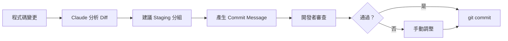

# 01-3-1 讓 AI 協助撰寫 Commit Message、整理 Diff 與決定 Staging 範圍

## 1. 本章學習目標

- 學會讓 Claude Code 協助分析變更內容，產出高品質的 Commit Message
- 掌握讓 AI 整理 Git Diff 的技巧，快速理解變更範圍
- 學會讓 Claude 輔助決定哪些檔案該納入同一個 Commit（Staging 策略）
- 建立「AI 輔助但不取代 Git 紀律」的正確心態
- 理解 Conventional Commits 規範與 AI 協作的整合方式

## 2. 適用對象與前置知識

- **適用對象**：所有使用 Git 的開發者，尤其是希望提升 Commit 品質與一致性的工程師
- **前置知識**：基本 Git 操作（`add`、`commit`、`diff`、`log`）、了解 Claude Code 的 `@` 參照機制（01-1-2）
- **關聯章節**：後接 [01-3-2 gh CLI 工作流](./01-3-2-github-cli-repo-issue-pr-workflow.md) 與 [01-3-3 自動生成 PR](./01-3-3-auto-generate-pr-title-and-body.md)

## 3. 核心概念

### 3.1 為什麼 AI 適合輔助 Git 操作？

Git 操作中的幾個環節非常適合 AI 介入：

1. **Diff 分析**：大量變更中，AI 可以快速摘要「改了什麼、為什麼改」
2. **Commit Message 撰寫**：AI 可以根據 Diff 內容，依照規範自動產出結構化的 Commit Message
3. **Staging 決策**：在多個檔案的變更中，AI 可以建議哪些檔案應該一起 Commit（邏輯相關）

### 3.2 Commit Message 的重要性

一個好的 Commit Message 不只是「記錄做了什麼」，它是：

- **半年後你自己回來看的文件**
- **同事 Code Review 時的上下文**
- **`git bisect` 除錯時的線索**
- **Release Note 自動產生的原料**

### 3.3 Conventional Commits 規範

本課程建議採用 [Conventional Commits](https://www.conventionalcommits.org/) 規範：

```
<type>[optional scope]: <description>

[optional body]

[optional footer(s)]
```

常用 type：
| Type | 說明 |
|------|------|
| `feat` | 新功能 |
| `fix` | Bug 修正 |
| `refactor` | 重構（不改變外部行為） |
| `test` | 新增或修改測試 |
| `docs` | 文件更新 |
| `chore` | 建置、CI、依賴更新 |
| `style` | 格式化、缺少分號等 |



## 4. 實務情境

**情境**：大仁完成了一個 Ticket 功能的開發，修改了 15 個檔案。他需要把這些變更拆分為 3 個邏輯獨立的 Commit：
1. 資料層（Entity + Repository + Migration）
2. 業務邏輯層（Service + DTO）
3. API 層（Controller + 測試）

他使用 Claude Code 來分析 Diff、建議分組，並為每個 Commit 產出符合 Conventional Commits 的訊息。

## 5. 操作步驟

### 5.1 讓 Claude 分析目前變更

在 Claude Code 中（CLI 模式建議，因為可直接讀取 Git 狀態）：

```
請分析目前的 git diff --staged，告訴我：
1. 總結所有變更的內容
2. 這些變更可以拆分成幾個邏輯獨立的 Commit？
3. 每個 Commit 建議包含哪些檔案？
```

### 5.2 讓 Claude 產生 Commit Message

```
請根據 @git:staged 的變更內容，依照 Conventional Commits 規範，
為以下 3 個 Commit 分別產出對應的 Commit Message：
1. 資料層變更
2. 業務邏輯層變更
3. API 層變更
```

### 5.3 審查並執行 Commit

```
# 檢視 Claude 建議的 Staging 分組
git status

# 依照分組逐步 add
git add src/main/java/com/example/entity/Ticket.java
git add src/main/java/com/example/repository/TicketRepository.java
git add src/main/resources/db/migration/V2__create_ticket.sql

# 使用 Claude 產生的 Commit Message
git commit -m "feat(db): add Ticket entity, repository and migration

- Create Ticket JPA entity with fields: id, title, description, status, assignee
- Add TicketRepository with custom query findByStatus
- Add Flyway migration V2 for ticket table"
```

## 6. 指令與範例

### Claude Code Prompt 範例

#### 分析所有變更（含 unstaged）
```
請分析 git diff 的所有變更內容，用繁體中文簡述每個檔案的變更目的與影響範圍。
```

#### 只分析已 staged 的變更
```
請分析 git diff --staged，為這些變更產出一個 Conventional Commit Message。
type 請自行判斷（feat/fix/refactor/test/docs/chore）。
```

#### 分析特定範圍
```
請分析 @git:HEAD~3..HEAD 這 3 個 Commit 的變更，幫我寫一段 Release Note 摘要。
```

#### 檢查 Commit Message 品質
```
請檢查以下 Commit Message 是否符合 Conventional Commits 規範，並提出修改建議：
"fixed bug"
"update code"
"added feature for ticket"
```

### Git 別名設定

為了方便在 Claude Code 中引用，可以設定 Git 別名：

```bash
# 顯示 staged diff
git config --global alias.sdiff "diff --staged"

# 顯示最近 N 個 commit 的摘要
git config --global alias.recent "log --oneline -10"
```

## 7. 常見錯誤與排查方式

### 錯誤 1：直接使用 Claude 產生的 Commit Message 而不審查

**原因**：過度信任 AI，未檢查訊息是否準確反映變更內容。

**症狀**：Commit Message 描述與實際程式碼變更不符，誤導後續的 Code Review 或 `git log` 查閱。

**修正**：養成習慣——在 `git commit` 前，先在編輯器中檢視 Claude 產生的訊息，對照 `git diff --staged` 確認準確性。

### 錯誤 2：Staging 分組過於零碎或過於龐大

**原因**：Claude 根據 Diff 的文字相似度分組，但不了解業務邏輯的內在關聯。

**症狀**：邏輯相關的變更被拆到不同 Commit，或不相關的變更被合在一起。

**修正**：Staging 分組的最終決策者是你，不是 Claude。Claude 提供建議，你根據對程式碼的理解做最終判斷。

### 錯誤 3：遺漏關聯檔案

**原因**：只 staged 了 Java 檔案，遺漏了對應的測試檔案或 Migration 檔案。

**症狀**：Commit 不完整，`git bisect` 時該 Commit 可能無法通過測試。

**修正**：讓 Claude 幫你檢查：
```
請檢查目前的 staged 變更是否完整——例如，如果修改了 Entity，對應的 Migration 和測試是否也應該包含在同一 Commit？
```

### 錯誤 4：Commit Message 語言混雜

**原因**：Claude 可能因 Prompt 或 Context 影響，產出中英混雜的 Commit Message。

**症狀**：`feat: 新增 Ticket API endpoint for creating tickets`——type 是英文但 description 混用中英文。

**修正**：在 Prompt 中明確指定語言：
```
請用繁體中文產生 Conventional Commit Message，但 type 和 scope 保留英文。
```

## 8. 最佳實務

1. **Commit 前先讓 Claude 分析，但 Commit 決定權在你**：Claude 是顧問，不是代理人。永遠手動執行 `git commit`，永遠審查 AI 產生的內容
2. **遵循 Conventional Commits**：這是業界主流規範，與語意化版本（SemVer）和自動化 Release Note 工具（如 semantic-release）相容
3. **一個 Commit 做一件事**：如果 Claude 建議把 10 個檔案包成一個 Commit，但你覺得其中有些變更不相關——相信你的判斷，拆開它們
4. **Commit Message 的 Body 要回答「為什麼」**：Header（type + description）說明「做了什麼」，Body 說明「為什麼這樣做」。讓 Claude 幫你產生 Body：
   ```
   請在 Commit Message Body 中說明為什麼要用這個方案，而非其他替代方案。
   ```
5. **利用 Claude 檢查 Staging 遺漏**：`git add` 後，讓 Claude 用 `git diff --staged` 檢查是否有遺漏的關聯檔案
6. **建立團隊的 Commit Message 範本**：在 CLAUDE.md 中定義團隊的 Commit Message 格式要求——Claude 產生的訊息就會自動符合團隊規範
7. **定期讓 Claude 分析 Commit 歷史品質**：每週或每次 Sprint 結束時，讓 Claude 回顧本週的 Commit Message，指出可改進之處

## 9. 安全性、權限與成本注意事項

### 安全性
- **不要將敏感資訊寫入 Commit Message**：AI 可能從程式碼中提取資訊並寫入 Commit Message。審查時確認 Commit Message 不含密碼、API Key、內部伺服器位址
- **Commit Message 是永久記錄**：一旦 Push 到 Remote，Commit Message 很難修改（需要 force push）。確保在 Push 前審查完成
- **`git diff` 會暴露所有變更細節**：讓 Claude 分析 Diff 意味著所有變更內容都會傳送至 API。確認變更中不含敏感資訊

### 權限
- Claude Code 讀取 Git 資訊的權限與你的 Shell 使用者相同
- 若使用 `/auto` 模式讓 Claude 直接執行 `git commit`，請確保你信任該操作（本課程建議手動執行 Commit）

### 成本
- 分析大型 Diff（如整個 Sprint 的變更）可能消耗大量 Token。建議將大 Diff 拆分成多個小批次分析
- 每次 `@git:diff` 或類似參照都會將完整 Diff 內容載入 Context

## 10. 小結

1. Claude Code 可以在 Git Diff 分析、Commit Message 撰寫、Staging 分組三個環節有效輔助開發者
2. 建議採用 Conventional Commits 規範，讓 Commit Message 結構化、可機器讀取
3. AI 的建議需要人工審查——Staging 的最終決策、Commit Message 的準確性都應由開發者把關
4. 好的 Commit Message 是給未來的自己和同事看的，AI 可以幫你寫，但你要確認它能被理解
5. Commit Message 中不得包含敏感資訊，審查時要特別留意

## 11. 延伸練習

### 練習一：Commit Message 實作（操作型）
1. 在一個測試專案中，進行以下變更：
   - 新增一個 Entity 類別
   - 修改一個 Service 方法
   - 修正一個 Bug
   - 重構一段重複程式碼
2. **不要手動寫 Commit Message**——讓 Claude Code 分析你的變更
3. 依照 Claude 的建議將變更拆分為多個 Commit
4. 每個 Commit 使用 Claude 產生的 Conventional Commit Message
5. 執行 `git log --oneline` 檢視結果，反思：
   - 哪些 Commit Message 可以直接使用？
   - 哪些需要手動調整？為什麼？

### 練習二：團隊 Commit 規範設計（思考型）
1. 設計一份團隊的 Commit Message 規範，包含：
   - 採用的規範（Conventional Commits 或自訂變體）
   - 允許的 type 列表
   - scope 的命名規則（例如以模組名稱）
   - Body 的必要性規則（哪些情況必須寫 Body）
   - 語言政策（全英文？全中文？混合？）
2. 將此規範寫入 CLAUDE.md
3. 測試：給 Claude 一段 Diff，確認它產生的 Commit Message 是否符合你的規範
4. 若不符合，調整 CLAUDE.md 中的描述直到 Claude 能穩定產出合格訊息

## 12. 查核來源與版本備註

本章內容尚未完成即時官方文件查核，正式發布前應重新比對官方最新文件。

- 本章內容依據以下資料核實：
  - 來源 1：Git 官方文件（https://git-scm.com/doc）
  - 來源 2：Conventional Commits 規範（https://www.conventionalcommits.org/）
  - 來源 3：Anthropic Claude Code 官方文件（Git 整合功能）
- 查核日期：2026-06-05（教材撰寫日期，尚未完成最終官方查核）
- 版本備註：Conventional Commits 為社群規範，非 Git 官方的一部分。Claude Code 的 Git 整合功能（如 @git: 參照）的行為以實際版本為準
- 若使用者環境與本文不同，請優先依官方最新文件與實際環境調整
