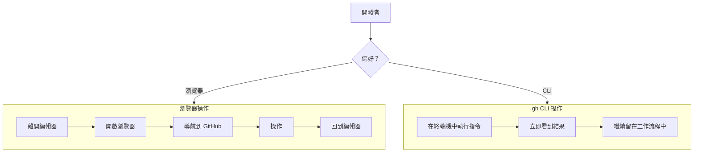

# 01-3-2 gh CLI 工作流：一鍵建立 Repo、查看 Issue 與發出 PR

## 1. 本章學習目標

- 學會使用 GitHub CLI (`gh`) 在終端機中完成常見的 GitHub 操作
- 掌握 `gh` 的基本指令：建立 Repo、查看與管理 Issue、建立與管理 PR
- 理解如何在 Claude Code 中整合 `gh` 指令，讓 AI 輔助 GitHub 操作
- 建立「終端機即 GitHub 控制中心」的工作習慣
- 了解 `gh` 與 Git 原生指令的分工邊界

## 2. 適用對象與前置知識

- **適用對象**：使用 GitHub 做版本控制的開發者、希望減少瀏覽器操作提升效率的工程師
- **前置知識**：Git 基本操作、GitHub 帳號、已完成 GitHub CLI 安裝與認證（`gh auth login`）
- **關聯章節**：前接 [01-3-1 AI 輔助 Commit](./01-3-1-ai-assisted-commit-diff-staging.md)，後接 [01-3-3 自動生成 PR](./01-3-3-auto-generate-pr-title-and-body.md)

## 3. 核心概念

### 3.1 什麼是 GitHub CLI？

GitHub CLI（`gh`）是 GitHub 官方提供的命令列工具，讓開發者可以直接在終端機中操作 GitHub 平台，包括：

- **Repository 管理**：建立、Clone、Fork
- **Issue 管理**：建立、查看、篩選、關閉
- **Pull Request 管理**：建立、查看、Review、Merge
- **Actions 管理**：查看 CI/CD 狀態、重新執行 Workflow
- **Release 管理**：建立 Release、上傳 Artifact

### 3.2 為什麼要用 gh 而非瀏覽器？



**gh CLI 的優勢**：
- 不離開終端機，減少 Context 切換
- 可以 Script 化、自動化
- 可以與 Claude Code 整合——Claude 可以讀取 `gh` 的輸出並提供建議
- 更適合 CI/CD Pipeline

### 3.3 gh 與 Git 的分工

| 操作 | 使用工具 | 指令範例 |
|------|---------|---------|
| 建立 Commit | `git` | `git commit -m "..."` |
| Push 到 Remote | `git` | `git push origin main` |
| 建立 Remote Repository | `gh` | `gh repo create` |
| 建立 Issue | `gh` | `gh issue create` |
| 建立 Pull Request | `gh` | `gh pr create` |
| 查看 CI 狀態 | `gh` | `gh run list` |

**簡單記法**：本地操作用 `git`，GitHub 平台操作用 `gh`。

## 4. 實務情境

**情境**：小美完成了一個功能分支的開發，她需要：
1. 建立一個 Issue 描述新發現的 Bug
2. 建立一個 PR 將功能合併到 main
3. 查看 CI 是否通過

以往她需要在瀏覽器中做這些事，現在她想全部在終端機中完成（並讓 Claude 幫她產生 Issue 和 PR 的內容）。

## 5. 操作步驟

### 5.1 安裝與認證 GitHub CLI

#### Windows (PowerShell)
```powershell
winget install --id GitHub.cli
```

#### macOS
```bash
brew install gh
```

#### Linux
```bash
# Debian/Ubuntu
sudo apt install gh

# 或使用官方 Script
type -p curl >/dev/null || sudo apt install curl -y
curl -fsSL https://cli.github.com/packages/githubcli-archive-keyring.gpg | sudo dd of=/usr/share/keyrings/githubcli-archive-keyring.gpg
sudo chmod go+r /usr/share/keyrings/githubcli-archive-keyring.gpg
echo "deb [arch=$(dpkg --print-architecture) signed-by=/usr/share/keyrings/githubcli-archive-keyring.gpg] https://cli.github.com/packages stable main" | sudo tee /etc/apt/sources.list.d/github-cli.list > /dev/null
sudo apt update
sudo apt install gh -y
```

#### 認證
```bash
gh auth login
```

依照提示選擇：
- GitHub.com（或 GitHub Enterprise Server）
- HTTPS（建議）
- 透過瀏覽器認證（或使用 Token）

### 5.2 Repository 操作

```bash
# 在目前目錄建立一個新的 GitHub Repo
gh repo create my-project --public --source=. --remote=origin --push

# 參數說明：
# --public       公開 Repo（用 --private 建立私有 Repo）
# --source=.     使用目前目錄作為來源
# --remote=origin 設定 remote 名稱為 origin
# --push         立即推送目前內容

# Clone 一個既有的 Repo
gh repo clone owner/repo

# Fork 一個 Repo
gh repo fork owner/repo --clone

# 查看 Repo 資訊
gh repo view --web    # 在瀏覽器中開啟
gh repo view          # 在終端機中顯示摘要
```

### 5.3 Issue 操作

```bash
# 建立 Issue
gh issue create --title "Bug: Ticket API 回傳 500" --body "描述..."

# 互動式建立（會開啟編輯器）
gh issue create

# 列出目前 Repo 的 Issues
gh issue list --limit 10
gh issue list --label bug
gh issue list --assignee @me
gh issue list --state closed

# 查看特定 Issue
gh issue view 42
gh issue view 42 --web    # 在瀏覽器中開啟

# 關閉 Issue
gh issue close 42
```

### 5.4 Pull Request 操作

```bash
# 建立 PR（基本）
gh pr create --title "feat: add Ticket CRUD API" --body "實作內容..."

# 建立 PR（互動式）
gh pr create

# 建立 PR 並指定為 Draft
gh pr create --draft

# 列出 PR
gh pr list
gh pr list --author @me
gh pr list --label "needs-review"

# 查看 PR
gh pr view 123
gh pr view 123 --web

# Checkout 一個 PR 到本地
gh pr checkout 123

# Review PR
gh pr review 123 --approve
gh pr review 123 --comment --body "請修改..."
gh pr review 123 --request-changes

# Merge PR
gh pr merge 123 --squash
```

## 6. 指令與範例

### 整合 Claude Code 的 gh 工作流

在 Claude Code 中，你可以這樣使用：

```
請幫我建立一個 Issue，描述我們需要為 Ticket 系統加上「批次匯入 CSV」功能。
使用 gh issue create，title 和 body 請你幫我產生。
```

Claude 會產出：
```bash
gh issue create \
  --title "feat: Ticket 批次匯入 CSV 功能" \
  --body "## 需求描述
使用者需要能透過上傳 CSV 檔案，一次匯入多筆 Ticket。

## 驗收條件
- 支援 CSV 格式（UTF-8 編碼）
- 單次最多匯入 1000 筆
- 匯入失敗時提供詳細錯誤報告
- 非同步處理，避免 Request Timeout

## 技術要點
- 後端：Spring Boot + Apache Commons CSV
- 前端：檔案上傳元件 + 進度條"
```

### 常用組合指令

```bash
# 建立 Issue 並立刻指派給自己
gh issue create --title "..." --body "..." --assignee @me

# 建立 PR 並連結 Issue
gh pr create --title "..." --body "Closes #42"

# 建立 PR 並指定 Reviewer
gh pr create --title "..." --body "..." --reviewer alice,bob

# 建立 PR 並加上 Label
gh pr create --title "..." --body "..." --label "feature,needs-review"

# 查看 CI 狀態並在失敗時重新執行
gh run list --limit 5
gh run watch $(gh run list --limit 1 --json databaseId -q '.[].databaseId')
```

### 在 CLAUDE.md 中設定 gh 慣例

```markdown
## GitHub CLI Conventions
- 所有 PR 必須連結至少一個 Issue（用 Closes #N 語法）
- PR Title 使用 Conventional Commits 格式
- 預設 Reviewer：tech-leads
- 預設 Label：needs-review
- Merge 策略：Squash and merge
```

## 7. 常見錯誤與排查方式

### 錯誤 1：`gh: command not found`

**原因**：GitHub CLI 未安裝，或安裝後未重新啟動終端機。

**症狀**：輸入 `gh` 顯示指令找不到。

**修正**：
```bash
# 確認是否已安裝
which gh

# Windows
where.exe gh

# 若已安裝但找不到，重新啟動終端機或更新 PATH
```

### 錯誤 2：`gh auth` 過期

**原因**：Token 過期或認證狀態異常。

**症狀**：`gh issue list` 等指令回覆認證錯誤。

**修正**：
```bash
# 查看認證狀態
gh auth status

# 重新認證
gh auth login

# 或重新整理 Token
gh auth refresh
```

### 錯誤 3：PR 建立後才發現忘記連結 Issue

**原因**：建立 PR 時未在 Body 中使用 `Closes #N`。

**症狀**：PR Merge 後 Issue 沒有自動關閉。

**修正**：
```bash
# 方法 1：編輯 PR Body
gh pr edit 123 --body "原本內容...\n\nCloses #42"

# 方法 2：手動關閉 Issue（在 Issue 中留言）
gh issue comment 42 --body "Fixed in #123"
gh issue close 42
```

### 錯誤 4：在錯誤的目錄執行 gh 指令

**原因**：`gh` 會根據當前目錄的 Git Remote 決定操作哪個 Repo。

**症狀**：在 `~/projects/other-app` 目錄中對 `my-app` 的 Issue 進行操作，結果失敗或操作了錯誤的 Repo。

**修正**：
```bash
# 確認目前目錄對應的 Repo
gh repo view

# 或使用 -R 參數指定 Repo
gh issue list -R owner/my-app
```

## 8. 最佳實務

1. **用 `gh` 處理 GitHub 平台操作，用 `git` 處理本地版本控制**：養成習慣——Push 前用 `git`，Push 後用 `gh`
2. **PR 與 Issue 必須連結**：在 PR Body 中使用 `Closes #N` 或 `Fixes #N`，讓 GitHub 自動關聯。Claude 可以幫你產生這段文字
3. **互動式建立 vs. 參數式建立**：
   - 簡單操作用參數式：`gh issue create --title "..." --body "..."`
   - 複雜內容用互動式：`gh issue create`（會開啟編輯器，適合長篇 Body）
4. **善用 Label、Assignee、Milestone**：這些 metadata 讓 Issue/PR 管理更有結構。讓 Claude 根據內容自動建議標籤
5. **`gh pr view --web` 用於 Code Review**：終端機中看 Diff 不如瀏覽器直觀。複雜的 Code Review 建議在瀏覽器中進行
6. **建立團隊的 gh 別名**：在 `~/.config/gh/config.yml` 中設定常用別名：
   ```yaml
   aliases:
     issues: issue list --assignee @me
     prs: pr list --author @me
     review: pr list --search "review-requested:@me"
   ```
7. **gh 的 JSON 輸出適合 Script 化**：`gh issue list --json number,title,state` 可以輸出結構化資料，適合與 Claude Code 整合分析

## 9. 安全性、權限與成本注意事項

### 安全性
- **`gh auth` Token 的權限**：Token 決定了 `gh` 能做的事。最小權限原則——只給需要的 scope（repo、read:org 等）
- **不要將 gh Token 寫入程式碼或設定檔**：Token 儲存在 `~/.config/gh/` 中，由 `gh` 自行管理
- **CI/CD 中的 gh 認證**：使用 `GH_TOKEN` 環境變數或 GitHub Actions 的自動認證（`${{ secrets.GITHUB_TOKEN }}`）

### 權限
- `gh` 的操作權限等同於你的 GitHub 帳號權限——你無法 `gh pr merge` 一個你沒有 Write 權限的 Repo
- 受保護的分支（Protected Branch）仍然需要通過 Required Review 才能 Merge，`gh` 無法繞過

### 成本
- `gh` 本身是免費的開源工具
- GitHub Actions 的使用可能產生費用（依方案而定），與 `gh` 工具本身無關
- 讓 Claude Code 產出 `gh` 指令的內容（Issue Body、PR Description）會消耗 Token——但這部分成本通常很小

## 10. 小結

1. GitHub CLI (`gh`) 讓開發者不離開終端機就能完成 Repo 建立、Issue 管理、PR 操作等 GitHub 平台任務
2. 區分 `git`（本地版本控制）與 `gh`（GitHub 平台操作）的職責邊界
3. Claude Code 可以輔助產出 `gh` 指令的內容（Issue Body、PR Description），但最終由你手動執行指令
4. `gh` 的 JSON 輸出模式讓它成為可 Script 化的工具，可與 Claude Code 的資料分析能力結合
5. Token 安全與最小權限原則是使用 `gh` 時的基本資安考量

## 11. 延伸練習

### 練習一：gh 工作流實作（操作型）
1. 使用 `gh repo create` 建立一個測試用的 Repository
2. 使用 `gh issue create` 建立 3 個 Issue（分別為 feature、bug、docs 類型）
3. 建立一個新分支，做幾次 Commit 並 Push
4. 使用 `gh pr create` 建立一個 PR，在 Body 中使用 `Closes #N` 連結對應的 Issue
5. 使用 `gh pr view` 和 `gh pr merge` 完成 PR 生命週期
6. 全程不開啟瀏覽器

### 練習二：Claude + gh 整合腳本設計（思考型）
設計一個開發工作流，讓 Claude Code 在以下時機自動輔助：
1. 當你說「開 Issue」時，Claude 根據最近的對話內容自動產出 Issue title 與 body，並建議 `gh issue create` 指令
2. 當功能開發完成時，Claude 自動分析 Commit 歷史，產出 PR title 與 body，並建議 `gh pr create` 指令
3. 當 CI 失敗時，Claude 自動執行 `gh run view` 查看失敗日誌，並建議修正方案

請設計 Claude Code 的 Prompt 範本（或在 CLAUDE.md 中的設定），讓以上流程可以穩定運作。

## 12. 查核來源與版本備註

本章內容尚未完成即時官方文件查核，正式發布前應重新比對官方最新文件。

- 本章內容依據以下資料核實：
  - 來源 1：GitHub CLI 官方文件（https://cli.github.com/manual/）
  - 來源 2：GitHub Docs（https://docs.github.com/）
- 查核日期：2026-06-05（教材撰寫日期，尚未完成最終官方查核）
- 版本備註：GitHub CLI 的指令與參數以撰寫時的最新穩定版為基準。gh 指令的行為可能隨版本更新而變化，請以 `gh help` 顯示的內容為準
- 若使用者環境與本文不同，請優先依官方最新文件與實際環境調整
