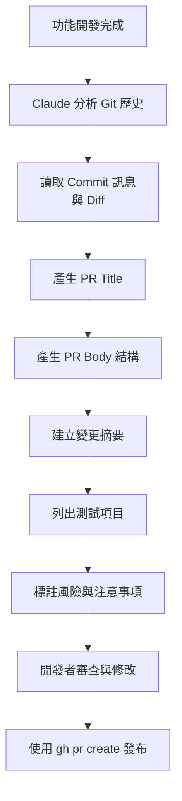

# 01-3-3 整合示範：開發完畢後自動生成 PR Title 與 Body

## 1. 本章學習目標

- 學會在功能開發完成後，讓 Claude Code 自動分析所有 Commit 並產出高品質的 PR Title 與 Body
- 掌握 PR Description 的結構化寫法，讓 Reviewer 能快速理解變更內容
- 理解 PR 與 Issue 的關聯機制（Closes #N）
- 能將此流程整合進日常開發工作流，提升 PR 建立效率與品質
- 建立「每個 PR 都是可獨立閱讀的文件」的意識

## 2. 適用對象與前置知識

- **適用對象**：所有需要在 GitHub 上建立 Pull Request 的開發者
- **前置知識**：Git 操作（01-3-1）、GitHub CLI 操作（01-3-2）、Conventional Commits 概念
- **關聯章節**：前接 [01-3-2 gh CLI 工作流](./01-3-2-github-cli-repo-issue-pr-workflow.md)，後接 [01-4-1 SDD 概念](./01-4-1-specification-driven-development.md)

## 3. 核心概念

### 3.1 為什麼 PR Title 與 Body 很重要？

一個 PR 不只是「合併程式碼的請求」，它是：

- **Reviewer 理解變更的入口**：好的 PR Description 讓 Reviewer 不需要逐行閱讀就能掌握全貌
- **半年後的考古文件**：當你需要理解「這個功能當初為什麼這樣做」時，PR 是重要的歷史記錄
- **自動化 Release Note 的原料**：許多工具（如 release-please）會從 PR Title 自動產出 Changelog
- **團隊知識傳遞的媒介**：好的 PR Description 本身就是一份微型技術文件

### 3.2 Claude Code 的角色

Claude Code 在 PR 產出流程中扮演「技術寫手」的角色：



### 3.3 PR Body 的建議結構

一個好的 PR Body 應包含以下區塊：

```markdown
## Summary（簡述）
用 2-3 句話說明這個 PR 做了什麼

## Related Issue（關聯 Issue）
Closes #42

## Changes（詳細變更）
- 新增了什麼
- 修改了什麼
- 刪除了什麼

## Testing（測試）
- 如何測試這些變更
- 測試結果

## Screenshots / Demo（畫面或示範）
如有 UI 變更，附上截圖

## Risk & Notes（風險與注意事項）
- 可能的副作用
- 部署注意事項
- 相依的 PR
```

## 4. 實務情境

**情境**：大仁完成了 Ticket CRUD 功能的開發，總共 8 個 Commit，修改了 15 個檔案。現在他要建立 PR。他讓 Claude Code 分析這 8 個 Commit 的內容，自動產出結構化的 PR Title 與 Body，然後用 `gh pr create` 發布。

## 5. 操作步驟

### 5.1 讓 Claude 分析 Commit 歷史

在 Claude Code 中（CLI 模式）：

```
請分析從 main 分支分叉以來的所有 Commit（git log main..HEAD --oneline），
並讀取對應的 git diff main..HEAD，為我產生一份 PR Description。
```

### 5.2 產生結構化 PR Body

```
請依照以下格式產生 PR Body：

## Summary
（2-3 句簡述）

## Related Issue
Closes #（相關的 Issue 編號，若無則標註 N/A）

## Changes
- （每項變更一行，用中文描述）

## Testing
- 手動測試步驟
- 自動化測試結果

## Risk & Notes
- 部署注意事項
- 資料庫 Migration 注意事項
```

### 5.3 審查並調整

Claude 產出後，你應該：
1. 檢查 Summary 是否準確反映變更意圖
2. 確認 Related Issue 是否正確連結
3. 補充 Claude 可能遺漏的 Testing 步驟
4. 標註 Claude 未提及的 Risk

### 5.4 使用 gh 建立 PR

```bash
# 使用 Claude 產生的內容
gh pr create \
  --title "feat: 實作 Ticket CRUD API 與關聯查詢" \
  --body "## Summary
實作完整的 Ticket CRUD API，包含建立、查詢、更新、刪除及依狀態/指派人的關聯查詢功能。

## Related Issue
Closes #12

## Changes
- 新增 Ticket Entity 與對應的 Flyway Migration (V2)
- 新增 TicketRepository，支援依狀態與指派人查詢
- 新增 TicketService，包含業務邏輯與驗證
- 新增 TicketController，提供 RESTful API 端點
- 新增 TicketDto 與 TicketCreateRequest 用於 API 傳輸
- 新增 TicketControllerTest 整合測試

## Testing
- 手動測試：使用 Postman 測試所有 CRUD 端點，確認回應正確
- 自動化測試：mvn test 全部通過（15/15 tests passed）
- 邊界測試：空 title 應回傳 400，不存在的 ID 應回傳 404

## Risk & Notes
- 此 PR 包含資料庫 Migration（V2），部署前請確認資料庫備份
- 與 #15（前端 Ticket UI）有相依關係，建議先合併此 PR"
```

## 6. 指令與範例

### Claude Code Prompt 範本

你可以將以下 Prompt 儲存為範本（或寫入 CLAUDE.md 的 Hooks），每次建立 PR 時使用：

```
請為我產生一份 PR Description。步驟如下：

1. 執行 git log main..HEAD --oneline 查看所有新 Commit
2. 執行 git diff main..HEAD --stat 查看變更檔案概覽
3. 根據以上資訊，產生以下結構的 PR Body（使用繁體中文）：

## Summary
## Related Issue
## Changes
## Testing
## Risk & Notes

請注意：
- PR Title 使用 Conventional Commits 格式
- 若發現敏感資訊（密碼、Token），不要寫入 PR Body
- 若 Commit 中有未完成的工作（TODO、FIXME），在 Risk 區塊標註
```

### 多樣化的 PR 生成策略

#### 輕量 PR（單一 Commit）
```
請根據 git diff HEAD~1..HEAD 產生一個簡短的 PR Title 與 Body。
```

#### 大型 PR（多個 Commit）
```
請分析 main..HEAD 的所有 Commit，先給我一個變更總覽，
等我確認後再產出正式的 PR Body。
```

#### Bug Fix PR
```
請根據修復的內容，產生 PR Body。重點描述：
1. Bug 的根因
2. 修復方案
3. 如何驗證修復有效
```

## 7. 常見錯誤與排查方式

### 錯誤 1：PR Body 過於冗長，變成「貼 Diff」

**原因**：Claude 試圖列出每一個變更的細節，而非摘要重點。

**症狀**：PR Description 長達數頁，Reviewer 無法快速掌握重點。

**修正**：在 Prompt 中加上限制：
```
變更摘要請控制在 10 行以內，重點描述「做了什麼」而非「怎麼做的」。
```

### 錯誤 2：PR Title 與 Commit History 不一致

**原因**：Claude 只分析了最後一個 Commit 的訊息來產生 PR Title，但該 PR 包含多個不同類型的 Commit。

**症狀**：PR Title 只反映部分變更，例如只有 `fix: ...` 但實際上 PR 也包含新功能。

**修正**：讓 Claude 分析所有 Commit Message，用最顯著的變更作為 PR Title 的 type：
```
請分析所有 Commit 的 type，選擇最能代表此 PR 整體性質的 type 作為 PR Title 的前綴。
```

### 錯誤 3：忘記關聯 Issue

**原因**：未在 Prompt 中要求 Claude 尋找相關 Issue。

**症狀**：PR Merge 後，對應的 Issue 仍然開著。

**修正**：讓 Claude 協助檢查：
```
請根據 PR 內容，檢查是否有應該關聯的 Issue（搜尋 Issue 標題中的關鍵字）。
在 PR Body 中加上 Closes #N。
```

### 錯誤 4：敏感資訊洩漏

**原因**：Claude 從程式碼或設定檔中提取了包含敏感資訊的內容，寫入 PR Body。

**症狀**：PR Body 中出現 API Key、資料庫密碼、內部 IP 位址等。

**修正**：
- **預防**：在 Prompt 中明確禁止：「不要將任何 API Key、密碼、Token 或內部伺服器資訊寫入 PR Body」
- **審查**：建立 PR 前，手動檢查 PR Body 中是否有不應公開的資訊
- **自動化**：使用 Git Hooks 或 CI 檢查 PR Body 是否包含敏感模式

## 8. 最佳實務

1. **PR Title 使用 Conventional Commits**：與 Commit Message 保持一致，讓自動化工具能正確分類
2. **PR Body 是給人看的，不是給機器看的**：使用清晰的段落、條列式、必要時附上截圖。不要貼整段程式碼
3. **先讓 Claude 給總覽，再產出正式內容**：對於大型 PR，先請 Claude 摘要變更，你確認方向正確後再讓它產出完整的 PR Body。這比直接產出後大幅修改更有效率
4. **Testing 區塊要具體**：不是「測試通過」，而是「mvn test 15/15 passed；手動驗證了正常路徑與 4 種異常路徑」
5. **Risk 區塊要誠實**：如果這個 PR 改了核心模組、涉及資料庫 Migration、或有已知的 Trade-off，一定要在 Risk 區塊標註。這是對 Reviewer 和未來維護者的尊重
6. **設定 CLAUDE.md 中的 PR 範本**：在 CLAUDE.md 中定義團隊的 PR Body 格式要求——這樣每次讓 Claude 產生 PR 時，格式就會自動一致
7. **PR 建立後，自己再看一遍**：用 `gh pr view` 在終端機中預覽，或用 `gh pr view --web` 在瀏覽器中確認最終效果

## 9. 安全性、權限與成本注意事項

### 安全性
- **PR Body 是公開的**（在公開 Repo 中）：確認內容不包含客戶資料、內部伺服器資訊、安全漏洞的詳細描述（在公開 Repo 中）
- **程式碼片段**：在 PR Body 中貼程式碼片段通常沒問題，但要確認該片段不包含敏感資訊
- **Commit Hash 與內部參照**：PR Body 中的技術細節可能被競爭對手或其他非授權人員看到（在公開 Repo 中）

### 權限
- `gh pr create` 的權限取決於你的 GitHub 帳號在該 Repo 中的角色
- 若 Repo 有 Protected Branch 設定，仍需通過 Required Review 才能 Merge

### 成本
- 分析 10-20 個 Commit 的 Diff 可能需要 10,000-30,000 Token，視專案規模而定
- 若每次 Push 都讓 Claude 重新分析完整的 PR 範圍，成本累積可觀。建議在準備發布 PR 時才做一次完整分析
- 可以先用 `--stat` 取得檔案變更概覽（Token 消耗較低），確認範圍後再做詳細分析

## 10. 小結

1. Claude Code 可以自動分析 Git 歷史，產出結構化的 PR Title 與 Body，大幅提升 PR 建立效率與品質
2. PR Description 應包含 Summary、Related Issue、Changes、Testing、Risk 五個核心區塊
3. Claude 的產出需要人工審查——檢查準確性、補充遺漏、移除敏感資訊
4. PR Title 建議使用 Conventional Commits 格式，與團隊的 Commit Message 規範一致
5. 好的 PR Body 是一份可獨立閱讀的微型文件，給 Reviewer 也給未來的維護者

## 11. 延伸練習

### 練習一：PR 生成實作（操作型）
1. 在一個測試專案中，建立一個新分支，進行 5-8 個不同類型的 Commit（feature、fix、refactor、test、docs）
2. 使用 Claude Code 分析整個分支的變更
3. 讓 Claude 產出 PR Title 與 Body
4. 使用 `gh pr create` 建立 PR（使用 Claude 產生的內容）
5. 請一位同事 Review 你的 PR，並蒐集回饋：
   - PR Description 是否足夠清楚？
   - 是否有遺漏的資訊？
   - 哪些部分需要改進？

### 練習二：PR Body 品質標準設計（思考型）
1. 定義一套團隊的「PR Body 品質檢查清單」，例如：
   - [ ] Summary 在 3 句以內
   - [ ] Related Issue 已連結
   - [ ] Testing 包含手動與自動化測試結果
   - [ ] Risk 區塊標註了資料庫 Migration 影響
   - [ ] 無敏感資訊
2. 將此清單轉化為 Claude Code 的 Prompt 範本
3. 思考：如何在 CI 中自動化檢查 PR Body 是否符合這些標準？（例如使用 GitHub Actions + 正則表達式檢查）

## 12. 查核來源與版本備註

本章內容尚未完成即時官方文件查核，正式發布前應重新比對官方最新文件。

- 本章內容依據以下資料核實：
  - 來源 1：GitHub Docs — Pull Request 文件（https://docs.github.com/en/pull-requests）
  - 來源 2：GitHub CLI 官方文件（https://cli.github.com/manual/）
  - 來源 3：Conventional Commits 規範（https://www.conventionalcommits.org/）
- 查核日期：2026-06-05（教材撰寫日期，尚未完成最終官方查核）
- 版本備註：PR 範本格式為建議範本，非 GitHub 強制規範。gh 指令參數以撰寫時的最新版本為準
- 若使用者環境與本文不同，請優先依官方最新文件與實際環境調整
