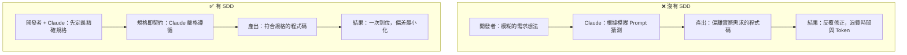
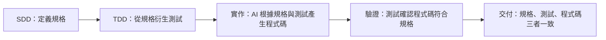

# 01-4-1 SDD（Specification-Driven Development）概念：規格即契約

## 1. 本章學習目標

- 理解 SDD（Specification-Driven Development，規格驅動開發）的核心理念與價值
- 理解「規格即契約」的含義：規格是開發者、AI 與需求方之間的共同協定
- 掌握在 AI Coding 中為何 SDD 比傳統開發方法更為關鍵
- 了解 SDD 與 TDD 的關係與整合方式
- 建立「先寫規格，再寫程式碼」的開發紀律

## 2. 適用對象與前置知識

- **適用對象**：所有使用 AI 輔助開發的工程師，尤其是對需求頻繁變動或 AI 產出偏離預期感到困擾的開發者
- **前置知識**：基本軟體開發流程概念，有與 AI Coding 工具協作的初步經驗
- **關聯章節**：後接 [01-4-2 產出 spec.md](./01-4-2-create-spec-md-data-api-ui-behavior.md)、[01-4-3 CLAUDE.md 設定](./01-4-3-claude-md-mcp-server-hooks.md)、[01-4-4 AI 問題追蹤系統](./01-4-4-ai-ticket-system-architecture.md)

## 3. 核心概念

### 3.1 什麼是 SDD？

SDD（Specification-Driven Development）是一種開發方法論，其核心理念是：

> **在撰寫任何一行程式碼之前，先完成一份精確的規格文件。這份規格是後續所有開發活動的「契約」——程式碼必須符合規格，測試必須驗證規格，AI 必須遵循規格。**

這不是新的概念——它源自於形式化方法（Formal Methods）與契約式設計（Design by Contract），但在 AI Coding 時代被賦予了新的重要性。

### 3.2 為什麼 AI Coding 時代更需要 SDD？

AI（如 Claude Code）在產生程式碼時，依賴的是 Prompt 中的描述與 Context。如果描述模糊，AI 就會「猜測」——這就是 AI 幻覺（Hallucination）與偏離需求的根源。



### 3.3 規格即契約的含義

「規格即契約」意味著：

1. **開發者與 AI 的契約**：你（開發者）給 AI 一份清晰的規格，AI 承諾（盡力）產出符合規格的程式碼
2. **開發者與需求方的契約**：規格是需求方與開發者之間的共識基礎——「這就是我們同意要做的東西」
3. **程式碼與測試的契約**：測試案例直接從規格衍生，測試驗證程式碼是否符合規格

### 3.4 SDD 與 TDD 的關係



SDD 回答「做什麼」，TDD 回答「怎麼驗證做對了」。兩者結合形成完整的品質保證鏈。

## 4. 實務情境

**情境**：公司需要開發一個「AI 問題追蹤系統」。PM 給了一句話需求：「讓使用者可以建立和追蹤 Ticket」。

如果沒有 SDD，開發者可能直接讓 Claude Code 開始寫程式碼。結果：
- Claude 做了一個簡單的 CRUD，但 PM 實際上需要的是含狀態機、權限控管、通知機制的完整系統
- 反覆修改，成本暴增，時程延誤

如果有 SDD，開發者先跟 PM（或用 Claude 協助）產出一份 spec.md，明確定義：
- 資料模型（Ticket 有哪些欄位、什麼類型）
- API 端點（路徑、方法、請求/回應格式）
- 狀態機（Ticket 狀態如何轉換）
- 權限規則（誰能做什麼）
- 驗收條件（什麼叫「完成」）

然後 Claude 嚴格依照 spec.md 產出程式碼——大幅減少偏差。

## 5. 操作步驟

### 5.1 決定規格範圍

在開始撰寫 spec.md 之前，先確認：
- 這個規格涵蓋的範圍（一個功能？一個模組？整個系統？）
- 誰是規格的主要讀者（開發者？PM？AI？）
- 規格的詳細程度（越詳細，AI 產出越精確，但維護成本也越高）

### 5.2 使用 Claude 協助撰寫規格

```
請協助我為「AI 問題追蹤系統」撰寫一份 spec.md。請先詢問我以下關鍵問題：
1. 系統的核心實體有哪些？（User、Ticket、Comment？）
2. 每個實體有哪些屬性？
3. Ticket 的狀態流轉規則是什麼？
4. 有哪些 API 端點？
5. 誰有權限做什麼操作？

在我回答後，請產出結構化的 spec.md。
```

### 5.3 審查與細化規格

規格初稿產出後：
1. 與 PM / 需求方確認規格是否符合業務需求
2. 與團隊確認技術可行性
3. 補充邊界條件（空值、大量資料、並行操作）
4. 補充錯誤處理策略

### 5.4 將規格作為開發契約

一旦規格定稿：
- **所有開發活動必須參照規格**
- **Claude Code 的 Prompt 引用規格**（`@spec.md`）
- **測試案例從規格衍生**
- **規格變更必須經過審查流程**（不是開發者自己改了算）

## 6. 指令與範例

### 規格導向的 Claude Code Prompt

```
請依照 @spec.md 中的「Ticket API」章節，實作以下內容：
1. Ticket Entity（對應 spec.md 第 3.1 節的資料模型）
2. TicketRepository（對應 spec.md 第 3.2 節的查詢需求）
3. TicketService（對應 spec.md 第 4.1 節的業務邏輯）
4. TicketController（對應 spec.md 第 5.1 節的 API 端點定義）

請嚴格遵循 spec.md 中的欄位名稱、型別與驗證規則。
若有任何 spec.md 未定義的細節，請先詢問而非自行假設。
```

### 規格偏離時的處理

```
請檢查目前的實作是否完全符合 @spec.md。
列出任何偏離 spec.md 的地方，並提供修正方案。
```

## 7. 常見錯誤與排查方式

### 錯誤 1：規格寫得太模糊

**原因**：開發者習慣快速進入實作，規格只寫了幾行就開始寫程式碼。

**症狀**：Claude 產出的程式碼與預期有顯著偏差，需要反覆修正。

**修正**：使用「規格完整性檢查清單」（見下一章 01-4-2）。如果一個欄位的型別或驗證規則你現在說不清楚，Claude 也不會知道。

### 錯誤 2：規格寫完後就「僅供參考」

**原因**：開發過程中規格沒更新，或開發者自行「優化」了設計但不回頭更新規格。

**症狀**：三個月後，spec.md 與實際程式碼完全脫節，規格形同虛設。

**修正**：規格與程式碼必須同步更新。在 PR Review 清單中加入「檢查 spec.md 是否需要更新」。
- 也可以在 CLAUDE.md 中設定 Hooks：當特定檔案變更時，提醒檢查規格

### 錯誤 3：規格過於詳細，變成「設計文件」

**原因**：把 spec.md 寫成了詳細的技術設計文件，包含實作細節（用哪個 Library、怎麼實作）。

**症狀**：規格過度指定實作方式，限制了 AI 和開發者的創造空間。而且微小的實作變更就需要修改規格。

**修正**：spec.md 應該描述「做什麼」（What）而非「怎麼做」（How）。
- 好的規格：「Ticket 建立時，title 不可為空，長度限制 1-200 字元」
- 不好的規格：「使用 Hibernate Validator 的 @NotBlank 和 @Size(max=200) 驗證 title」

### 錯誤 4：一人獨自寫規格，未與需求方確認

**原因**：開發者認為自己理解需求，直接寫規格，未與 PM 或用戶確認。

**症狀**：功能開發完成後，需求方說「這不是我想要的」。

**修正**：規格是開發者與需求方的「契約」。在開始實作前，必須讓需求方確認規格（至少確認關鍵的資料模型與行為描述）。

## 8. 最佳實務

1. **規格的詳細度原則**：「一個新加入團隊的開發者，能否只看 spec.md 就理解這個功能該怎麼做？」——如果能，規格夠詳細；如果不能，繼續補充
2. **規格的「可測試性」**：每一條規格描述都應該是可被測試驗證的。如果不能寫出對應的測試案例，表示這條規格太模糊
3. **規格與 AI Prompt 的整合**：在 CLAUDE.md 中加入規格參照規則，讓 Claude 在每次開發時自動尋找並遵循相關的 spec.md
4. **規格的版本控制**：spec.md 必須與程式碼一起進版控（Git）。規格的變更歷史與程式碼的變更歷史一樣重要
5. **規格變更流程**：當需求變更時，先更新 spec.md → 更新測試 → 再修改程式碼。不要跳過規格直接改程式碼
6. **用規格約束 AI，而非限制 AI**：規格應該提供清晰的邊界與目標，但允許 AI 在實作細節上有彈性（選擇合適的 Design Pattern、Library 用法等）
7. **規格是活的文件**：沒有人能在開發前預見所有細節。規格應該在開發過程中逐步細化——但每次修改都要經過審查

## 9. 安全性、權限與成本注意事項

### 安全性
- spec.md 中不應包含實作敏感資訊（API Key、密碼策略的具體值等）。規格可以說「需要認證」但不能寫「JWT Secret = xxx」
- 規格中描述的安全需求（如「只有管理員能刪除 Ticket」）必須在實作中嚴格執行，不能因為 AI 沒注意到而遺漏

### 權限
- spec.md 是團隊共用的文件，應開放給所有相關人員閱讀與建議
- 但 spec.md 的修改權限應有所控管（透過 PR Review），避免未經審查的變更

### 成本
- 撰寫 spec.md 需要投入前期時間，但這是一次性投資。對比沒有規格導致的反覆修正成本，SDD 通常是淨節省
- 每次讓 Claude 讀取 spec.md 會消耗 Token。保持 spec.md 精簡但完整（通常 500-2000 行），避免冗餘

## 10. 小結

1. SDD（規格驅動開發）主張在寫程式碼之前先完成精確的規格文件，該規格是後續所有開發活動的契約
2. 在 AI Coding 時代，SDD 的重要性更高——規格是防止 AI 幻覺與偏離需求的最有效手段
3. 「規格即契約」對內約束 AI 的輸出，對外與需求方建立共識，對測試提供驗證基礎
4. SDD 與 TDD 相輔相成：SDD 定義做什麼，TDD 驗證做對了
5. spec.md 必須與程式碼同步維護，否則規格將形同虛設

## 11. 延伸練習

### 練習一：規格撰寫實作（操作型）
1. 選擇一個你最近開發或將要開發的功能
2. 使用 Claude Code 協助你撰寫一份 spec.md（依照 01-4-2 的指引）
3. 確保 spec.md 包含：資料模型、API 端點（含請求/回應格式）、狀態轉換規則、權限規則、驗收條件
4. 將 spec.md 提交到 Git
5. 讓 Claude 依照 spec.md 實作該功能，觀察：
   - Claude 的產出是否與規格一致？
   - 哪些規格描述讓 Claude 產出精確？
   - 哪些規格描述仍然讓 Claude 需要猜測？

### 練習二：SDD 導入策略設計（思考型）
你是一家 50 人公司的技術主管，想導入 SDD。但團隊習慣「拿到需求就開始寫程式碼」。請設計一份導入計畫：
1. 如何說服團隊 SDD 的價值？（用數據或具體案例）
2. 導入的第一階段，哪些類型的任務必須有 spec.md？
3. 如何降低 spec.md 的撰寫門檻（讓工程師不覺得是額外負擔）？
4. 如何確保 spec.md 不會變成「寫完就沒人看」的文件？
5. 三個月後，如何衡量導入成效？

## 12. 查核來源與版本備註

本章內容尚未完成即時官方文件查核，正式發布前應重新比對官方最新文件。

- 本章內容依據以下資料核實：
  - 來源 1：Design by Contract 概念（Bertrand Meyer, Object-Oriented Software Construction）
  - 來源 2：Anthropic Claude Code 官方文件（規格引用與 Context 管理）
  - 來源 3：一般軟體工程最佳實務
- 查核日期：2026-06-05（教材撰寫日期，尚未完成最終官方查核）
- 版本備註：SDD 為通用軟體工程方法論，非 Claude Code 特有功能。本章是該方法論在 AI Coding 場景中的應用
- 若使用者環境與本文不同，請優先依官方最新文件與實際環境調整
