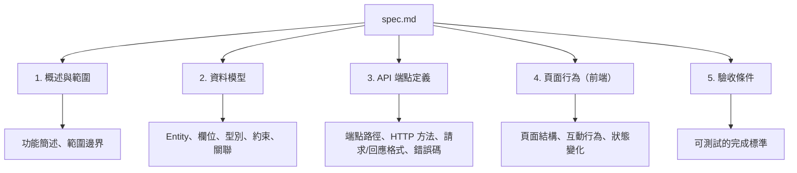

# 01-4-2 產出 spec.md：定義資料模型、API 端點與頁面行為

## 1. 本章學習目標

- 學會撰寫一份結構化、可被 AI 精準理解的 spec.md
- 掌握 spec.md 必須包含的五大核心區塊
- 理解如何用規格定義資料模型、API 端點、頁面行為、狀態轉換與驗收條件
- 學會讓 Claude Code 輔助產出 spec.md 的初稿
- 能寫出「AI 看了不會誤解」的規格描述

## 2. 適用對象與前置知識

- **適用對象**：需要為 AI 輔助開發撰寫規格的工程師、技術主管、架構師
- **前置知識**：已理解 SDD 概念（01-4-1），具備基本的 REST API 設計與資料建模知識
- **關聯章節**：前接 [01-4-1 SDD 概念](./01-4-1-specification-driven-development.md)，後接 [01-4-3 CLAUDE.md 設定](./01-4-3-claude-md-mcp-server-hooks.md)

## 3. 核心概念

### 3.1 spec.md 的定位

spec.md 是 SDD 的核心產出物。它不是：
- ❌ 技術設計文件（不指定用哪個 Library）
- ❌ 使用者手冊（不需要截圖或操作說明）
- ❌ Javadoc 替代品（不描述實作細節）

spec.md 是：
- ✅ **資料與行為的契約**：定義資料長什麼樣子、系統該有什麼行為
- ✅ **AI 的開發指引**：Claude 可以逐條對照實作
- ✅ **測試的來源**：每一條規格都可以衍生出對應的測試案例

### 3.2 spec.md 的五大區塊

一個完整的 spec.md 應包含以下五個區塊：



## 4. 實務情境

**情境**：以「AI 問題追蹤系統」的 Ticket 功能為例，撰寫一份完整的 spec.md。

## 5. 操作步驟與範本

### 5.1 spec.md 完整範本

以下是針對「Ticket CRUD 功能」的 spec.md 範本：

~~~~markdown
# Ticket 功能規格書

## 1. 概述與範圍

### 1.1 功能簡述
Ticket 是 AI 問題追蹤系統的核心實體，用於記錄與追蹤使用者的 AI 相關問題。

### 1.2 範圍
- ✅ 包含：Ticket 的建立、查詢、更新、刪除
- ✅ 包含：Ticket 狀態流轉（Open → In Progress → Resolved → Closed）
- ✅ 包含：依狀態、指派人的篩選查詢
- ❌ 不包含：批次操作、報表匯出（將於後續版本處理）
- ❌ 不包含：即時通知（將於通知系統規格中定義）

---

## 2. 資料模型

### 2.1 Ticket 實體

| 欄位 | 型別 | 必填 | 說明 | 約束 |
|------|------|------|------|------|
| id | Long | 自動 | 主鍵 | 自動產生 |
| title | String | ✅ | 標題 | 長度 1-200 字元 |
| description | String | ✅ | 詳細描述 | 長度 1-5000 字元 |
| status | Enum | ✅ | 狀態 | 見 2.2 狀態定義 |
| priority | Enum | ✅ | 優先級 | LOW / MEDIUM / HIGH / CRITICAL |
| assignee | User | ❌ | 指派人 | 外鍵關聯 User |
| reporter | User | ✅ | 回報人 | 外鍵關聯 User，建立後不可變更 |
| createdAt | DateTime | 自動 | 建立時間 | 自動設定 |
| updatedAt | DateTime | 自動 | 更新時間 | 每次更新時自動設定 |

### 2.2 狀態定義

| 狀態 | 說明 |
|------|------|
| OPEN | 新建立的 Ticket，尚未開始處理 |
| IN_PROGRESS | 有人正在處理中 |
| RESOLVED | 已解決，等待回報人確認 |
| CLOSED | 已關閉（回報人確認或逾時自動關閉） |

### 2.3 狀態轉換規則

- OPEN → IN_PROGRESS：指派人被設定時
- IN_PROGRESS → RESOLVED：處理完成時
- RESOLVED → CLOSED：回報人確認時
- RESOLVED → IN_PROGRESS：回報人不同意解決方案時（重新開啟）
- 任何狀態 → CLOSED：管理員強制關閉

### 2.4 關聯實體

- **User**：Ticket 的 reporter 與 assignee
- **Comment**：一個 Ticket 可有多筆 Comment（將於 Comment 規格定義）

---

## 3. API 端點定義

### 3.1 建立 Ticket

- **端點**：`POST /api/v1/tickets`
- **認證**：需要（任何已登入使用者）
- **請求 Body**：
  ```json
  {
    "title": "string（1-200 字元）",
    "description": "string（1-5000 字元）",
    "priority": "LOW | MEDIUM | HIGH | CRITICAL"
  }
  ```
- **成功回應**：`201 Created`
  ```json
  {
    "id": 1,
    "title": "...",
    "description": "...",
    "status": "OPEN",
    "priority": "HIGH",
    "reporter": { "id": 1, "username": "alice" },
    "assignee": null,
    "createdAt": "2026-06-05T10:00:00Z",
    "updatedAt": "2026-06-05T10:00:00Z"
  }
  ```
- **錯誤回應**：
  - `400 Bad Request`：title 為空或超過 200 字元
  - `401 Unauthorized`：未認證

### 3.2 查詢 Ticket 列表

- **端點**：`GET /api/v1/tickets`
- **認證**：需要
- **查詢參數**：
  - `status`（選填）：依狀態篩選
  - `assigneeId`（選填）：依指派人篩選
  - `page`（選填，預設 0）：分頁頁碼
  - `size`（選填，預設 20，最大 100）：每頁筆數
- **成功回應**：`200 OK`
  ```json
  {
    "content": [ { ...ticket 物件... } ],
    "page": 0,
    "size": 20,
    "totalElements": 42,
    "totalPages": 3
  }
  ```

### 3.3 查詢單一 Ticket

- **端點**：`GET /api/v1/tickets/{id}`
- **成功回應**：`200 OK`，回傳完整 Ticket 物件（含 Comment 列表）
- **錯誤回應**：`404 Not Found`（ID 不存在）

### 3.4 更新 Ticket

- **端點**：`PUT /api/v1/tickets/{id}`
- **認證**：需要（僅 reporter 或 admin）
- **請求 Body**：同建立，但所有欄位為選填（僅更新提供的欄位）
- **成功回應**：`200 OK`
- **錯誤回應**：
  - `404 Not Found`
  - `403 Forbidden`（非 reporter 或 admin）

### 3.5 刪除 Ticket

- **端點**：`DELETE /api/v1/tickets/{id}`
- **認證**：需要（僅 admin）
- **成功回應**：`204 No Content`
- **錯誤回應**：
  - `404 Not Found`
  - `403 Forbidden`（非 admin）

### 3.6 變更 Ticket 狀態

- **端點**：`PATCH /api/v1/tickets/{id}/status`
- **請求 Body**：
  ```json
  {
    "status": "IN_PROGRESS | RESOLVED | CLOSED"
  }
  ```
- **驗證**：狀態轉換必須符合 2.3 的狀態轉換規則
- **錯誤回應**：`400 Bad Request`（不合法的狀態轉換）

---

## 4. 頁面行為（前端）

### 4.1 Ticket 列表頁
- 以表格形式顯示所有 Ticket
- 支援依狀態（下拉選單）與指派人（搜尋框）篩選
- 支援分頁（每頁 20 筆）
- 點擊 Ticket 行進入詳情頁
- 右上角「建立 Ticket」按鈕

### 4.2 Ticket 詳情頁
- 顯示所有 Ticket 欄位
- 顯示關聯的 Comment 列表
- 狀態可透過下拉選單變更（依狀態轉換規則限制可選狀態）
- 「編輯」按鈕（僅 reporter 或 admin 可見）
- 「刪除」按鈕（僅 admin 可見）

### 4.3 建立/編輯 Ticket 表單
- title：單行文字輸入框
- description：多行文字輸入框（支援 Markdown 預覽）
- priority：下拉選單
- 送出前進行前端驗證（欄位不可空白）
- 送出後導向 Ticket 詳情頁

---

## 5. 驗收條件

### 5.1 功能驗收
- [ ] 使用者可建立 Ticket，必填欄位空白時顯示驗證錯誤
- [ ] 使用者可查看 Ticket 列表，支援分頁與篩選
- [ ] 使用者可查看單一 Ticket 詳情（含 Comment）
- [ ] Reporter 可編輯自己建立的 Ticket
- [ ] Admin 可編輯與刪除任何 Ticket
- [ ] 非 Reporter 或 Admin 無法編輯 Ticket（回傳 403）

### 5.2 狀態流轉驗收
- [ ] 新建立的 Ticket 狀態為 OPEN
- [ ] 設定指派人後，狀態自動變更為 IN_PROGRESS
- [ ] 狀態為 RESOLVED 時，可變更為 CLOSED 或 IN_PROGRESS
- [ ] 狀態為 CLOSED 時，不可再變更為其他狀態（除非 Admin 強制重新開啟）

### 5.3 效能驗收
- [ ] Ticket 列表查詢（含篩選）回應時間 < 500ms（1000 筆資料內）
- [ ] 單一 Ticket 查詢回應時間 < 100ms

### 5.4 錯誤處理驗收
- [ ] 不存在的 Ticket ID 回傳 404，而非 500
- [ ] 未認證的請求回傳 401
- [ ] 無權限的操作回傳 403
~~~~

## 6. 讓 Claude 輔助撰寫 spec.md

### Prompt 範本

```
請協助我撰寫一份 spec.md。功能如下：
[描述你的功能]

請依照以下結構產出：
1. 概述與範圍
2. 資料模型（表格形式，含欄位名稱、型別、必填、約束）
3. API 端點定義（每個端點含路徑、HTTP 方法、請求/回應格式、錯誤碼）
4. 頁面行為（每個頁面含元件、互動、狀態變化）
5. 驗收條件（含功能、狀態、效能、錯誤處理）

在產出前，請先詢問我以下關鍵問題（若描述中未包含）：
- 實體之間的關聯關係
- 狀態流轉規則
- 權限規則（誰能做什麼）
- 分頁與排序需求
- 特殊驗證規則
```

## 7. 常見錯誤與排查方式

### 錯誤 1：資料模型缺少約束條件

**原因**：只定義了欄位名稱和型別，未定義驗證規則。

**症狀**：Claude 產出的程式碼沒有驗證邏輯，允許空白 title 或超長 description。

**修正**：每個欄位必須定義「約束」——必填？長度限制？格式限制？唯一性？

### 錯誤 2：API 端點只定義成功回應

**原因**：規格中只寫了 200 OK 的情境，忽略錯誤處理。

**症狀**：Claude 產出的 Controller 缺少異常處理，遇到錯誤時回傳 500 或未定義的行為。

**修正**：每個端點必須定義所有可能的錯誤回應碼與對應情境。

### 錯誤 3：驗收條件不可測試

**原因**：驗收條件使用了主觀描述（「介面美觀」、「效能良好」）。

**症狀**：無法判斷功能是否真的完成。

**修正**：驗收條件必須是可客觀驗證的——「回應時間 < 500ms」而非「效能良好」；「按鈕在畫面右上角」而非「按鈕在方便的位置」。

### 錯誤 4：前端行為描述過於簡略

**原因**：只寫了「顯示 Ticket 列表」，未定義互動行為。

**症狀**：Claude 做出來的 UI 功能完整但互動體驗差（缺少載入狀態、錯誤提示、空資料狀態）。

**修正**：前端行為描述應包含：載入中狀態、空資料狀態、錯誤狀態、成功回饋、互動流程。

## 8. 最佳實務

1. **規格先定義「是什麼」，再定義「做什麼」**：先寫資料模型，再寫 API 行為。穩定的資料模型是不變的核心
2. **使用表格定義資料模型**：表格形式讓 AI 和人類都能快速理解欄位結構。避免用段落文字描述資料結構
3. **API 端點使用 OpenAPI 風格的描述**：HTTP 方法 + 路徑 + 請求/回應範例。Claude 對這種結構化描述的理解準確度最高
4. **驗收條件使用 Checkbox 格式**：`- [ ]` 格式讓驗收條件可以被逐條勾稽，也適合匯入 Issue Tracking 系統
5. **spec.md 的長度控制**：一個 spec.md 聚焦一個功能或一個模組。不要把所有功能塞進一份文件（難以維護）
6. **使用 Claude 檢查規格完整性**：規格撰寫完成後，讓 Claude 檢查是否有遺漏：
   ```
   請檢查 @spec.md，列出任何遺漏或不明確的定義
   ```
7. **規格的語言一致性**：整個 spec.md 使用一致的術語。不要前面叫「使用者」後面叫「用戶」，這會讓 AI 困惑

## 9. 安全性、權限與成本注意事項

### 安全性
- spec.md 中定義的權限規則（如「僅 admin 可刪除」）是安全需求的來源。這些規則必須在實作中被嚴格執行
- 規格中不應包含具體的認證實作方式（如 JWT Secret 的格式），只描述「需要認證」即可

### 權限
- spec.md 應納入版控，變更需要 PR Review
- 若專案為私有 Repository，spec.md 可能包含業務邏輯細節——注意存取控管

### 成本
- 一份 500-1000 行的 spec.md 在每次載入時約消耗 3,000-6,000 Token（以英文計，中文可能略高）
- 可以讓 Claude 先讀取 spec.md 並產出一份「開發摘要」，後續互動使用摘要而非完整規格，節省 Token

## 10. 小結

1. spec.md 是 SDD 的核心產出物，包含概述、資料模型、API 端點、頁面行為、驗收條件五大區塊
2. 好的 spec.md 讓 AI 能精準理解需求，不需要猜測——這是防止 AI 偏離的關鍵
3. 資料模型用表格定義、API 端點用結構化格式、驗收條件用 Checkbox——這些格式 AI 理解效果最好
4. 規格中必須定義錯誤情境與邊界條件，不能只寫「正常路徑」
5. Claude 可以輔助撰寫與檢查 spec.md 的完整性，但最終審查責任在開發者

## 11. 延伸練習

### 練習一：撰寫 spec.md（操作型）
1. 選擇一個你要開發的功能（或使用「AI 問題追蹤系統」的 Comment 功能）
2. 使用本章的範本，撰寫一份完整的 spec.md
3. 確保包含所有五大區塊
4. 讓 Claude Code 檢查你的 spec.md，請它列出遺漏或不夠明確的地方
5. 根據 Claude 的建議修改 spec.md
6. 將最終版提交至 Git

### 練習二：規格品質檢查清單（思考型）
設計一份「spec.md 品質檢查清單」，團隊在 Code Review 時可以用這份清單檢查 spec.md 的完整性。清單應包含：
- 資料模型檢查項（至少 5 項）
- API 端點檢查項（至少 5 項）
- 前端行為檢查項（至少 3 項）
- 驗收條件檢查項（至少 3 項）
- 通用檢查項（至少 3 項）

## 12. 查核來源與版本備註

本章內容尚未完成即時官方文件查核，正式發布前應重新比對官方最新文件。

- 本章內容依據以下資料核實：
  - 來源 1：一般軟體工程規格撰寫最佳實務
  - 來源 2：OpenAPI 規範（https://www.openapis.org/）
  - 來源 3：Anthropic Claude Code 官方文件（規格引用機制）
- 查核日期：2026-06-05（教材撰寫日期，尚未完成最終官方查核）
- 版本備註：spec.md 範本為建議格式，非強制標準。團隊可依需求調整結構
- 若使用者環境與本文不同，請優先依官方最新文件與實際環境調整
