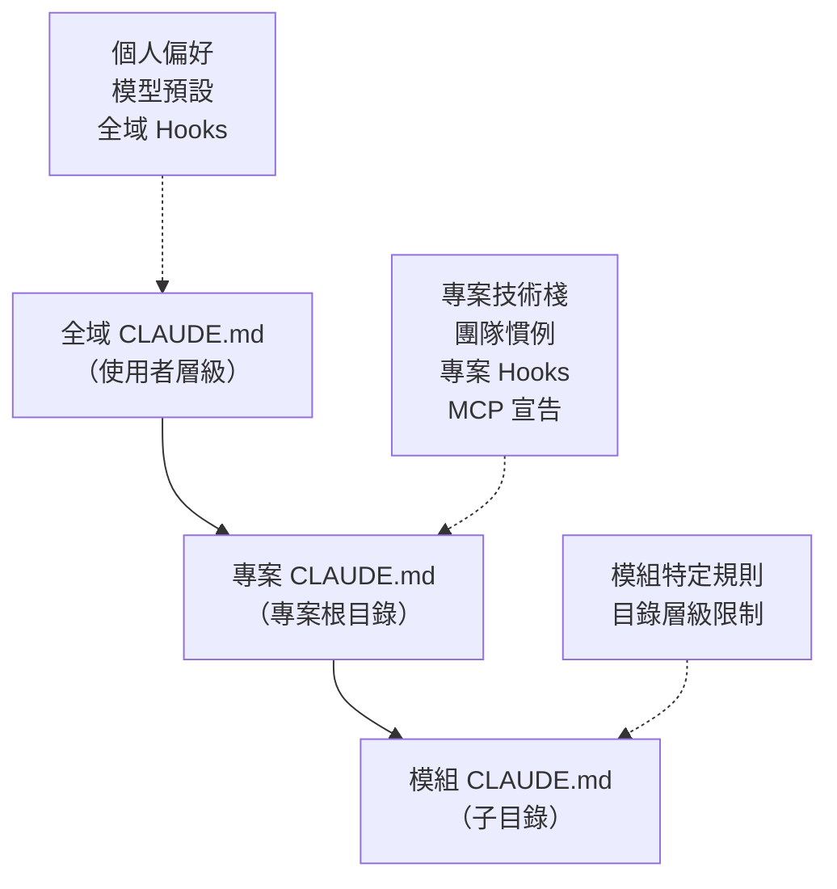

# 01-4-3 CLAUDE.md 進階設定：宣告 MCP Server 與 Hooks

## 1. 本章學習目標

- 理解 CLAUDE.md 在 Claude Code 生態系中的核心定位
- 學會在 CLAUDE.md 中宣告 MCP（Model Context Protocol）Server
- 掌握 Hooks 機制的設定與應用場景
- 能為團隊建立一套標準化的 CLAUDE.md 範本
- 理解 CLAUDE.md 對 AI 行為的影響範圍與限制

## 2. 適用對象與前置知識

- **適用對象**：需要為團隊或專案設定 Claude Code 行為的技術主管、DevOps 工程師、資深開發者
- **前置知識**：已完成基本 Claude Code 操作（01-1-2），了解 `/init` 指令（01-1-2），理解 SDD 概念（01-4-1）
- **關聯章節**：前接 [01-4-2 產出 spec.md](./01-4-2-create-spec-md-data-api-ui-behavior.md)，後接 [01-4-4 AI 問題追蹤系統](./01-4-4-ai-ticket-system-architecture.md)；MCP 深入內容見 [02-2-3 Playwright MCP](./02-2-3-playwright-mcp-browser-snapshot.md)

## 3. 核心概念

### 3.1 CLAUDE.md 的三層設定模型

CLAUDE.md 不只是一個檔案，它是一個階層式設定系統：



- **全域 CLAUDE.md**：位於使用者目錄，影響所有專案。適合放個人偏好設定
- **專案 CLAUDE.md**：位於專案根目錄，由 `/init` 產生。這是團隊共用的核心設定
- **模組 CLAUDE.md**：可放在子目錄中，為特定模組提供額外規則

### 3.2 MCP Server 在 CLAUDE.md 中的宣告

MCP（Model Context Protocol）讓 Claude Code 可以與外部工具互動。在 CLAUDE.md 中宣告 MCP Server，Claude 就能在需要時自動使用這些工具。

### 3.3 Hooks 機制

Hooks 是 CLAUDE.md 中的事件驅動規則——當特定事件發生時，自動觸發檢查或操作。最常見的 Hook 是「寫入檔案前」的檢查。

## 4. 實務情境

**情境**：企業開發團隊需要在 CLAUDE.md 中設定：
1. 宣告 Playwright MCP Server（用於自動化瀏覽器測試）
2. 設定「寫入檔案前」的資安檢查 Hook
3. 定義團隊的 Commit Message 格式要求
4. 指定不同目錄使用不同的 AI 行為規則

## 5. 操作步驟

### 5.1 CLAUDE.md 完整範本

```markdown
# AI 問題追蹤系統 — CLAUDE.md

## 專案概述
這是一個 AI 問題追蹤系統（Ticket System），用於管理使用者的 AI 相關問題回報。

## 技術棧
- **後端**：Spring Boot 3.2, Java 17, Maven, PostgreSQL 15
- **前端**：React 18, Vite, TypeScript, Tailwind CSS
- **測試**：JUnit 5, Mockito, Playwright（E2E）
- **CI/CD**：GitHub Actions

---

## 建置與測試指令

```bash
# 後端
mvn clean package -DskipTests    # 編譯
mvn test                          # 執行單元測試
mvn spring-boot:run              # 啟動後端

# 前端
cd frontend && npm install       # 安裝依賴
cd frontend && npm run dev       # 啟動開發伺服器
cd frontend && npm run build     # 生產建置
cd frontend && npm run test      # 執行前端測試
```

---

## 開發慣例

### 程式碼風格
- Java：遵循 Google Java Style Guide
- TypeScript：遵循 Airbnb Style Guide
- 使用 Lombok 簡化 Entity 與 DTO（避免手寫 getter/setter）

### Commit Message
- 遵循 Conventional Commits 規範
- 格式：`<type>(<scope>): <description>`
- 範例：`feat(ticket): add Ticket CRUD API`
- Type 列表：feat, fix, refactor, test, docs, chore, style

### 分支策略
- `main`：正式環境，僅透過 PR Merge
- `develop`：開發主線
- `feature/*`：功能分支
- `fix/*`：Bug 修正分支

---

## MCP Server 宣告

### Playwright MCP
用於自動化瀏覽器測試與畫面驗證。

```json
{
  "mcpServers": {
    "playwright": {
      "command": "npx",
      "args": ["-y", "@anthropic/mcp-server-playwright"],
      "description": "Playwright 瀏覽器自動化測試 MCP Server"
    }
  }
}
```

> **建議查核**：MCP Server 的宣告格式與可用參數以 Claude Code 最新版本文件為準。

---

## Hooks 設定

### 寫入檔案前的資安檢查
當 Claude 準備寫入 Java 檔案時，自動執行以下檢查：

- **禁止硬編碼密碼**：檢查是否包含 `password = "` 或 `secret = "` 等硬編碼模式
- **禁止將 API Key 寫入程式碼**：檢查是否包含類似 `apiKey = "sk-..."` 的模式
- **檢查 SQL Injection 風險**：檢查是否使用了字串拼接 SQL 而非 Parameterized Query

### 寫入設定檔前的檢查
當寫入 `application*.yml` 或 `application*.properties` 時：
- 檢查是否包含明文密碼
- 提醒應使用環境變數或 Secrets Manager

---

## Context 與行為設定

### 預設行為
- **模型**：預設使用 Sonnet，Code Review 使用 Opus
- **操作模式**：預設 `auto-edit`
- **語言**：繁體中文（台灣用語）

### 檔案讀取限制
- 永遠不要讀取 `.env` 檔案
- 永遠不要讀取 `application-prod.yml`（正式環境設定）
- 永遠不要讀取 `*credentials*` 或 `*secret*` 相關檔案

### 規格優先
- 在開始任何實作前，先檢查是否有對應的 `spec.md`
- 若有 spec.md，必須嚴格遵循其定義
- 若 spec.md 中未定義的細節，需先詢問後再進行
```

### 5.2 MCP Server 宣告細節

MCP Server 的宣告格式（依 Claude Code 版本而異）：

```json
{
  "mcpServers": {
    "server-name": {
      "command": "執行檔或指令",
      "args": ["參數1", "參數2"],
      "env": {
        "ENV_VAR": "value"
      },
      "description": "此 MCP Server 的用途說明"
    }
  }
}
```

### 5.3 Hooks 設定細節

Hooks 的設定通常在 CLAUDE.md 中以規則描述方式呈現：

```markdown
## Hooks

### Before File Write — Java
當將要寫入 `*.java` 檔案時：
1. 檢查程式碼中是否有硬編碼的密碼或 API Key
2. 檢查是否使用了字串拼接 SQL
3. 若有以上問題，先報告並建議修正，不要直接寫入

### Before File Write — Configuration
當將要寫入 `application*.yml` 或 `.properties` 時：
1. 檢查有無明文密碼
2. 若有，提醒使用環境變數
```

> **建議查核**：Hooks 的觸發條件與執行方式以 Claude Code 最新版本文件為準。部分 Hooks 功能可能需要特定版本或方案。

## 6. 指令與範例

### 讓 Claude 檢查 CLAUDE.md 的有效性

```
請檢查 @CLAUDE.md 的內容是否有效，包含：
1. MCP Server 宣告格式是否正確
2. Hooks 規則是否合理
3. 是否有矛盾或重複的規則
4. 是否有應該加入但遺漏的設定
```

### 讓 Claude 根據專案特性建議 CLAUDE.md 內容

```
請分析目前的專案結構（@pom.xml @package.json @src/），
並建議 CLAUDE.md 中應該包含的內容，特別是：
1. 建置與測試指令
2. 程式碼風格慣例
3. 需要注意的專案特定規則
```

## 7. 常見錯誤與排查方式

### 錯誤 1：CLAUDE.md 過於龐大，每次對話都載入大量 Token

**原因**：把所有資訊都塞進 CLAUDE.md，包含詳細的 API 文件、資料庫 Schema 等。

**症狀**：每次啟動對話或 `/clear` 後，Claude 的回應品質下降（Context 被 CLAUDE.md 佔據大半）。

**修正**：CLAUDE.md 應保持精簡（建議 200-500 行）。詳細資訊放在獨立檔案中，需要時再用 `@` 參照。

### 錯誤 2：MCP Server 宣告格式錯誤

**原因**：使用了過時或不正確的 JSON 格式。

**症狀**：Claude Code 無法啟動 MCP Server，或回覆找不到對應工具。

**修正**：使用 `claude doctor` 檢查 MCP 設定。確認 MCP Server 的執行檔在 PATH 中。

### 錯誤 3：Hooks 規則互相衝突

**原因**：多個 Hooks 對同一事件有不同（甚至矛盾）的處理方式。

**症狀**：Claude 在寫入檔案時行為不一致，有時檢查有時不檢查。

**修正**：檢視所有 Hooks 規則，確保沒有矛盾。將相關規則合併為一條清晰的規則。

### 錯誤 4：團隊成員各自修改 CLAUDE.md，導致衝突

**原因**：CLAUDE.md 沒有納入正式的變更審查流程。

**症狀**：不同成員的 Claude Code 行為不一致，PR 中常見 CLAUDE.md 的 Merge Conflict。

**修正**：將 CLAUDE.md 的變更視為程式碼變更——需要 PR Review。設立 CLAUDE.md 的 Owner（如 Tech Lead）。

## 8. 最佳實務

1. **CLAUDE.md 精簡原則**：每個段落都要通過「這行資訊是否每次對話都需要？」的測試。如果不是，移到獨立檔案
2. **MCP Server 宣告與實際安裝同步**：在 CLAUDE.md 中宣告的 MCP Server，必須確保所有團隊成員的環境中都已安裝對應的執行檔。在 README 中列出前置安裝步驟
3. **Hooks 規則要具體且可驗證**：不好的規則：「注意安全性」；好的規則：「檢查 Java 檔案中是否包含 `password = \"` 模式」
4. **使用註解說明「為什麼」**：CLAUDE.md 中的每一條規則都應該有簡短的說明（為什麼有這條規則）。這幫助團隊成員理解，也幫助 Claude 判斷何時該嚴格遵循、何時可以有彈性
5. **版本控制 CLAUDE.md**：CLAUDE.md 必須進版控（Git）。每次修改都經過 PR Review。重大變更時在 Commit Message 中標註 `docs(claude): ...`
6. **為不同環境準備不同的 CLAUDE.md**：可以在分支層級調整 CLAUDE.md。例如 `main` 分支的 CLAUDE.md 可以更嚴格（限制寫入權限），`develop` 分支可以更寬鬆
7. **定期審查 CLAUDE.md 的有效性**：每 2-4 週回顧一次 CLAUDE.md，確認規則是否仍然適用、MCP Server 是否仍在運作

## 9. 安全性、權限與成本注意事項

### 安全性
- **CLAUDE.md 本身可能包含敏感資訊**：不要在其中寫入 API Key、密碼、內部伺服器位址。CLAUDE.md 通常會進版控，所以它是「公開」的（對有權限存取 Repo 的人）
- **Hooks 可以防止安全漏洞，但無法保證**：Hook 是 AI 的「提醒」，不是編譯器級別的強制檢查。重要安全規則最終要靠 Code Review 和自動化 SAST 工具
- **MCP Server 的權限**：宣告在 CLAUDE.md 中的 MCP Server 可以存取系統資源（如瀏覽器、檔案系統）。只宣告信任的 MCP Server

### 權限
- 誰可以修改 CLAUDE.md？建議設定 Code Owner（使用 GitHub 的 CODEOWNERS 檔案），CLAUDE.md 的變更需要特定人員審查
- 全域 CLAUDE.md vs. 專案 CLAUDE.md 的優先級：專案設定通常覆蓋全域設定，但實際行為以 Claude Code 版本為準

### 成本
- CLAUDE.md 每次對話都載入，所以它的每一行都在持續消耗 Token。精簡 CLAUDE.md 是長期成本控管的重要措施
- MCP Server 的使用本身可能產生額外成本（如 Playwright 的瀏覽器啟動資源）

## 10. 小結

1. CLAUDE.md 是 Claude Code 的核心設定檔，控制 AI 的行為、可用工具與安全檢查規則
2. MCP Server 宣告讓 Claude Code 可以與外部工具（如 Playwright）整合，擴展 AI 的能力邊界
3. Hooks 機制可以在關鍵事件（如寫入檔案前）自動觸發檢查，是企業治理的重要工具
4. CLAUDE.md 應精簡、進版控、定期審查——它是團隊共用的 AI 協作契約
5. 所有安全規則在 CLAUDE.md 中都是輔助性的，最終把關仍依賴 Code Review 和自動化工具

## 11. 延伸練習

### 練習一：CLAUDE.md 設定實作（操作型）
1. 為你的專案撰寫一份完整的 CLAUDE.md
2. 包含：技術棧、建置指令、程式碼慣例、Commit Message 規範、Hooks（至少 2 條）
3. 若團隊有使用 MCP Server（如 Playwright），加入宣告
4. 使用 Claude 檢查你的 CLAUDE.md：
   ```
   請檢查 @CLAUDE.md，找出任何矛盾、遺漏或可改善之處
   ```
5. 將 CLAUDE.md 提交至 Git 並通知團隊

### 練習二：企業級 CLAUDE.md 治理設計（思考型）
你負責為一個 100 人的開發組織設計 CLAUDE.md 治理策略。請設計：
1. 全域 CLAUDE.md 應包含哪些內容（所有專案通用）？
2. 專案級 CLAUDE.md 可以覆蓋全域設定的哪些部分？哪些部分不應覆蓋？
3. CLAUDE.md 的變更審查流程是什麼？（誰可以發起？誰可以批准？）
4. 如何確保團隊成員不會繞過 CLAUDE.md 的限制（例如在自己的全域設定中覆蓋專案限制）？
5. 如何監控 CLAUDE.md 的遵循情況？

## 12. 查核來源與版本備註

本章內容尚未完成即時官方文件查核，正式發布前應重新比對官方最新文件。

- 本章內容依據以下資料核實：
  - 來源 1：Anthropic Claude Code 官方文件（CLAUDE.md 規格、MCP Server 設定、Hooks 機制）
  - 來源 2：Model Context Protocol 官方文件（https://modelcontextprotocol.io/）
- 查核日期：2026-06-05（教材撰寫日期，尚未完成最終官方查核）
- 版本備註：MCP Server 宣告格式、Hooks 的觸發條件與執行方式為撰寫時的框架說明。實際格式與功能以 Claude Code 最新版本為準
- 若使用者環境與本文不同，請優先依官方最新文件與實際環境調整
