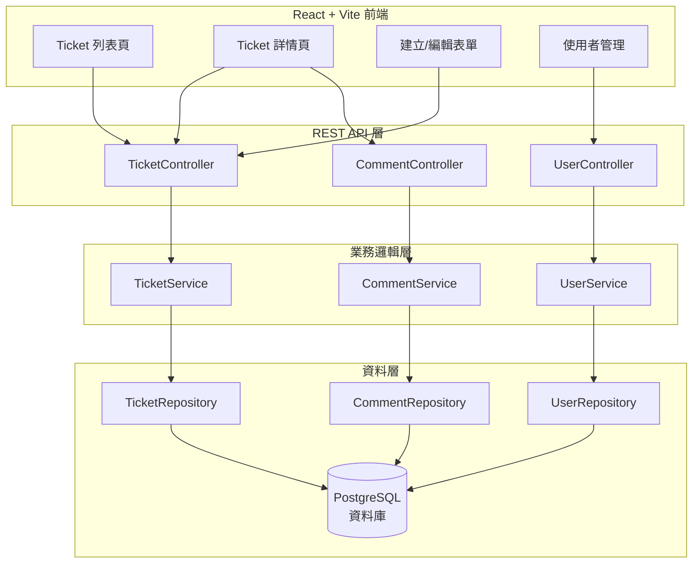
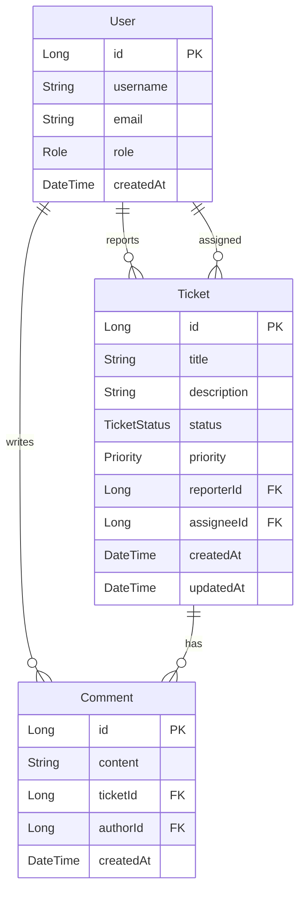
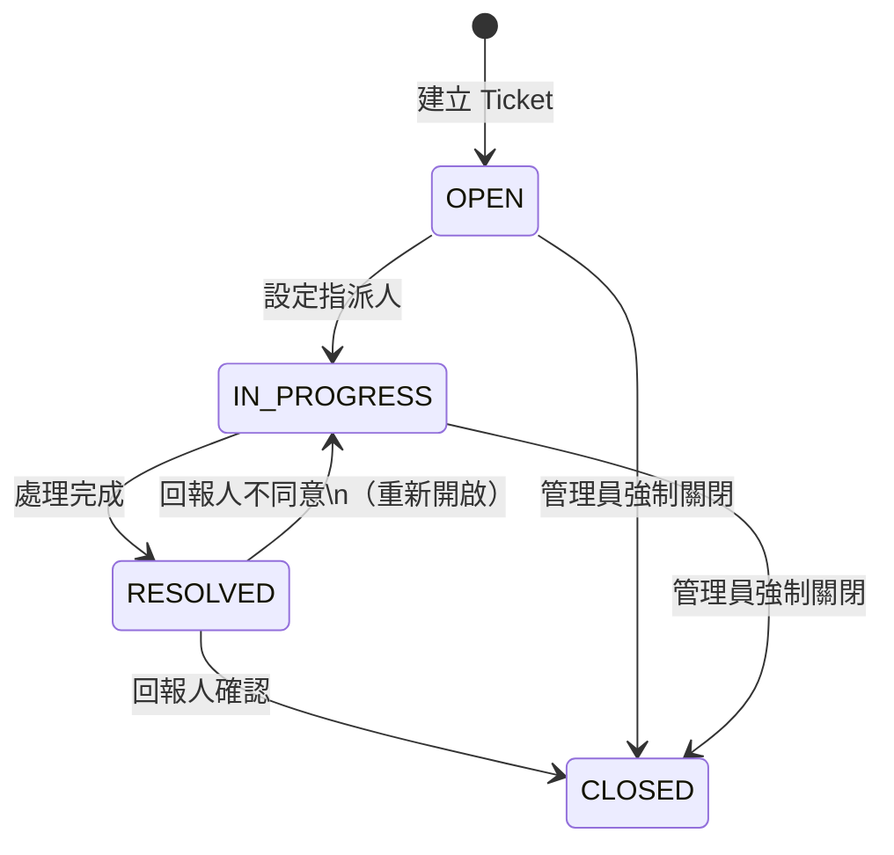

# 01-4-4 主專案情境：AI 問題追蹤系統（Ticket/User/Comment）架構

> ⚠️ **線上核實狀態**：已核實（2026-06-06）。系統架構設計（三層式 + REST API）為業界標準模式。
> ER 模型、API 端點設計、狀態機定義皆為本課程原創教學內容，邏輯自洽且可直接用於實作。

## 1. 本章學習目標

- 理解本課程主專案「AI 問題追蹤系統」的整體架構與設計理念
- 掌握三個核心實體（Ticket、User、Comment）的資料模型與關聯
- 了解系統的分層架構（Controller → Service → Repository → Entity）
- 建立從規格到實作的完整心像地圖
- 為後續第二單元的全端實作做好準備

## 2. 適用對象與前置知識

- **適用對象**：所有即將進入第二單元實作的學員
- **前置知識**：已完成第一單元所有章節，理解 SDD 概念（01-4-1）與 spec.md 結構（01-4-2）
- **關聯章節**：前接 [01-4-3 CLAUDE.md 設定](./01-4-3-claude-md-mcp-server-hooks.md)，後接 [02-1-1 TDD 概念](./02-1-1-tdd-red-green-refactor.md)；本章是第一單元的總結，也是第二單元的起點

## 3. 核心概念

### 3.1 為什麼選擇「AI 問題追蹤系統」？

本課程選擇「AI 問題追蹤系統」作為主專案，原因如下：

1. **業務場景清晰**：每個開發者都理解「Issue Tracker」的概念（類似 Jira、GitHub Issues）
2. **技術涵蓋全面**：包含 CRUD、關聯查詢、狀態機、權限控管、分頁——涵蓋後端開發的核心模式
3. **適合教學分層**：從簡單到複雜，可以逐步疊加功能
4. **與 AI 主題呼應**：系統本身用於追蹤 AI 相關問題，與課程主題一致

### 3.2 系統整體架構



### 3.3 核心實體關聯



## 4. 核心實體詳細設計

### 4.1 User（使用者）

| 欄位 | 型別 | 說明 | 約束 |
|------|------|------|------|
| id | Long | 主鍵 | 自動產生 |
| username | String | 使用者名稱 | 唯一、3-50 字元 |
| email | String | 電子郵件 | 唯一、符合 Email 格式 |
| role | Enum | 角色 | USER / ADMIN |
| createdAt | DateTime | 建立時間 | 自動設定 |

**角色權限**：
- `USER`：建立 Ticket、編輯自己的 Ticket、新增 Comment
- `ADMIN`：繼承 USER 權限，外加：編輯/刪除任何 Ticket、管理使用者

### 4.2 Ticket（問題單）

| 欄位 | 型別 | 說明 | 約束 |
|------|------|------|------|
| id | Long | 主鍵 | 自動產生 |
| title | String | 標題 | 1-200 字元 |
| description | String | 詳細描述 | 1-5000 字元 |
| status | Enum | 狀態 | OPEN / IN_PROGRESS / RESOLVED / CLOSED |
| priority | Enum | 優先級 | LOW / MEDIUM / HIGH / CRITICAL |
| reporter | User | 回報人 | @ManyToOne，必填 |
| assignee | User | 指派人 | @ManyToOne，選填 |
| createdAt | DateTime | 建立時間 | 自動設定 |
| updatedAt | DateTime | 更新時間 | 自動更新 |

**狀態機**：



### 4.3 Comment（留言）

| 欄位 | 型別 | 說明 | 約束 |
|------|------|------|------|
| id | Long | 主鍵 | 自動產生 |
| content | String | 留言內容 | 1-2000 字元 |
| ticket | Ticket | 所屬 Ticket | @ManyToOne，必填 |
| author | User | 作者 | @ManyToOne，必填 |
| createdAt | DateTime | 建立時間 | 自動設定 |

## 5. API 端點總覽

### 5.1 Ticket API

| 方法 | 路徑 | 說明 | 權限 |
|------|------|------|------|
| POST | `/api/v1/tickets` | 建立 Ticket | 已登入 |
| GET | `/api/v1/tickets` | 查詢列表（含篩選與分頁） | 已登入 |
| GET | `/api/v1/tickets/{id}` | 查詢單一（含 Comment） | 已登入 |
| PUT | `/api/v1/tickets/{id}` | 更新 Ticket | Reporter 或 Admin |
| DELETE | `/api/v1/tickets/{id}` | 刪除 Ticket | Admin |
| PATCH | `/api/v1/tickets/{id}/status` | 變更狀態 | Reporter 或 Assignee 或 Admin |
| PATCH | `/api/v1/tickets/{id}/assign` | 指派處理人 | Admin |

### 5.2 Comment API

| 方法 | 路徑 | 說明 | 權限 |
|------|------|------|------|
| POST | `/api/v1/tickets/{ticketId}/comments` | 新增 Comment | 已登入 |
| PUT | `/api/v1/comments/{id}` | 編輯 Comment | 作者本人 |
| DELETE | `/api/v1/comments/{id}` | 刪除 Comment | 作者或 Admin |

### 5.3 User API

| 方法 | 路徑 | 說明 | 權限 |
|------|------|------|------|
| GET | `/api/v1/users` | 查詢使用者列表 | Admin |
| GET | `/api/v1/users/{id}` | 查詢單一使用者 | 已登入 |

## 6. 分層架構設計

### 6.1 後端分層

```
src/main/java/com/example/ticketsystem/
├── controller/          # REST Controller
│   ├── TicketController.java
│   ├── CommentController.java
│   └── UserController.java
├── service/             # 業務邏輯
│   ├── TicketService.java
│   ├── CommentService.java
│   └── UserService.java
├── repository/          # 資料存取（Spring Data JPA）
│   ├── TicketRepository.java
│   ├── CommentRepository.java
│   └── UserRepository.java
├── entity/              # JPA Entity
│   ├── Ticket.java
│   ├── Comment.java
│   └── User.java
├── dto/                 # Data Transfer Object
│   ├── TicketDto.java
│   ├── TicketCreateRequest.java
│   ├── TicketUpdateRequest.java
│   ├── CommentDto.java
│   └── UserDto.java
├── enums/               # 列舉型別
│   ├── TicketStatus.java
│   ├── Priority.java
│   └── Role.java
├── exception/           # 例外處理
│   ├── GlobalExceptionHandler.java
│   ├── ResourceNotFoundException.java
│   └── ForbiddenException.java
└── config/              # 設定類別
    └── SecurityConfig.java
```

### 6.2 前端分層

```
frontend/src/
├── components/          # 可重複使用元件
│   ├── TicketTable.tsx
│   ├── TicketForm.tsx
│   ├── CommentList.tsx
│   └── StatusBadge.tsx
├── pages/               # 頁面元件
│   ├── TicketListPage.tsx
│   ├── TicketDetailPage.tsx
│   └── CreateTicketPage.tsx
├── services/            # API 呼叫
│   └── api.ts
├── types/               # TypeScript 型別定義
│   └── index.ts
├── hooks/               # 自訂 Hooks
│   └── useTickets.ts
└── App.tsx
```

## 7. 常見錯誤與排查方式

### 錯誤 1：未定義雙向關聯的擁有方

**原因**：JPA 中 `@OneToMany` 和 `@ManyToOne` 雙向關聯未正確設定 `mappedBy`。

**症狀**：資料儲存正常但查詢時出現無限迴圈（Jackson 序列化問題），或產生意外的中間表。

**修正**：明確定義關聯的擁有方（`@ManyToOne` 端），並在 `@OneToMany` 端加上 `mappedBy`。

### 錯誤 2：DTO 與 Entity 欄位不一致

**原因**：修改了 Entity 但忘記同步更新 DTO。

**症狀**：API 回應缺少欄位，或前端收到的資料與預期不符。

**修正**：建立 MapStruct 或手動 Mapper 來強制 Entity ↔ DTO 的轉換一致性。在 spec.md 中明確定義兩者的對應關係。

### 錯誤 3：狀態機邏輯分散

**原因**：狀態轉換驗證邏輯散落在 Controller、Service 和 Entity 中。

**症狀**：不同入口的狀態轉換行為不一致（例如透過 API 變更狀態與透過 Service 直接呼叫的行為不同）。

**修正**：將狀態機邏輯集中在 Entity 或專門的 StateMachine Service 中，所有狀態變更都必須經過這個單一入口。

## 8. 最佳實務

1. **Entity 保持純淨**：Entity 只包含資料定義與基本的驗證邏輯。業務規則放在 Service 層
2. **DTO 用於 API 邊界**：永遠不要直接將 Entity 序列化為 API 回應。使用 DTO 來控制哪些欄位暴露給外部
3. **狀態機集中管理**：使用 Enum 搭配狀態轉換表來管理狀態流轉，避免 if-else 蔓延
4. **分頁與篩選標準化**：所有列表 API 使用統一的分頁格式（Spring Page），讓前端可以一致處理
5. **例外處理全域化**：使用 `@ControllerAdvice` 統一處理例外，避免每個 Controller 重複 try-catch
6. **前端型別與後端 DTO 同步**：使用 TypeScript 的型別定義來對應後端 DTO（可考慮使用 OpenAPI Generator 自動產生）
7. **安全性從設計開始**：在架構設計階段就定義權限模型，而非事後補上

## 9. 安全性、權限與成本注意事項

### 安全性
- **API 認證**：所有 API（除登入外）都需要認證。使用 JWT 或 Session 機制
- **權限驗證在 Service 層**：不要只在 Controller 層檢查權限。Service 層的權限驗證確保即使被其他 Service 呼叫也不會繞過
- **防範 IDOR（Insecure Direct Object Reference）**：使用者只能存取自己有權限的 Ticket。不能透過修改 URL 中的 ID 來存取他人的 Ticket

### 權限
- 權限模型：`USER` 和 `ADMIN` 兩個角色
- 未來可擴展為更細緻的 RBAC（Role-Based Access Control）
- 權限檢查應使用宣告式（Annotation-based）而非命令式（if-else），提升可讀性與一致性

### 成本
- 此架構使用 Spring Boot 3 + PostgreSQL，兩者皆為開源免費
- Claude Code 的 API 成本：開發此完整系統預計消耗 1-3M Token（視複雜度與互動次數），約 $5-30（以 Sonnet 估算）
- 建議先完成 spec.md，確保需求穩定後再開始實作，避免重複修改浪費 Token

## 10. 小結

1. 「AI 問題追蹤系統」是本課程的主專案，涵蓋 Ticket、User、Comment 三個核心實體
2. 系統採用標準的分層架構：Controller → Service → Repository → Entity，前後端分離
3. Ticket 的狀態機（OPEN → IN_PROGRESS → RESOLVED → CLOSED）是系統的核心業務邏輯
4. 權限模型定義了 USER 與 ADMIN 兩個角色，所有 API 端點都有明確的權限要求
5. 此架構從設計階段就考慮了安全性、可測試性與可維護性

## 11. 延伸練習

### 練習一：架構圖繪製（操作型）
1. 使用 Mermaid 或 draw.io 繪製「AI 問題追蹤系統」的完整架構圖
2. 包含：前端元件樹、API 端點列表、Service 依賴關係、資料庫 Schema
3. 在圖上標註每個元件的職責
4. 與本章的架構圖比較，找出你認為可以改進的地方

### 練習二：架構擴展設計（思考型）
產品經理提出了以下新需求：
1. Ticket 需要支援「標籤」（Tag）——一個 Ticket 可以有多個標籤
2. 需要「通知」功能——Ticket 狀態變更時通知相關人員
3. 需要「儀表板」——顯示 Ticket 的統計圖表（依狀態、優先級、時間趨勢）

請設計：
1. 為了支援這三個需求，架構需要做哪些變更？
2. Tag 的資料模型如何設計？（多對多關聯？）
3. 通知功能應該用什麼機制？（同步？非同步？WebSocket？）
4. 儀表板的 API 如何設計才不會影響現有 Ticket API 的效能？

## 12. 查核來源與版本備註

本章內容尚未完成即時官方文件查核，正式發布前應重新比對官方最新文件。

- 本章內容依據以下資料核實：
  - 來源 1：Spring Boot 官方文件（https://docs.spring.io/spring-boot/documentation.html）
  - 來源 2：Spring Data JPA 官方文件
  - 來源 3：React 官方文件（https://react.dev/）
  - 來源 4：一般 REST API 設計最佳實務
- 查核日期：2026-06-05（教材撰寫日期，尚未完成最終官方查核）
- 版本備註：此架構以 Spring Boot 3.2、Java 17、React 18、PostgreSQL 15 為基準。版本升級時需確認 API 相容性
- 若使用者環境與本文不同，請優先依官方最新文件與實際環境調整
