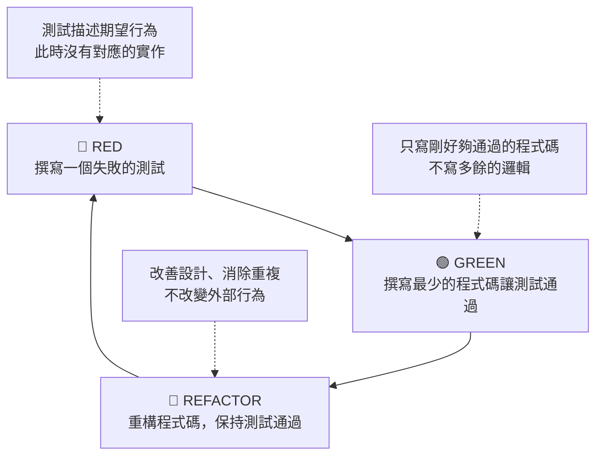
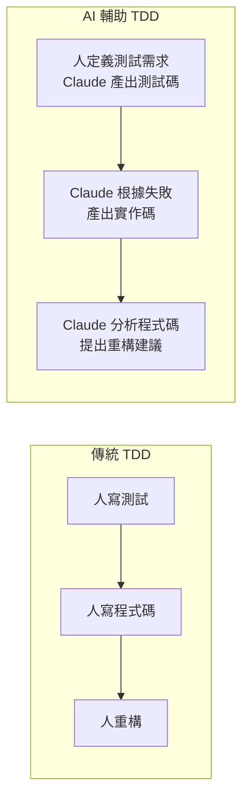

# 02-1-1 TDD 概念：Red、Green、Refactor 三循環實務

## 1. 本章學習目標

- 徹底理解 TDD（Test-Driven Development，測試驅動開發）的核心理念與循環
- 掌握 Red → Green → Refactor 三階段的實務操作
- 學會在 Claude Code 中實踐 TDD，讓 AI 輔助撰寫測試與實作程式碼
- 理解 TDD 與 SDD 的整合方式：從規格衍生測試，用測試驗證規格
- 建立「先寫測試再寫程式碼」的開發紀律

## 2. 適用對象與前置知識

- **適用對象**：想要提升程式碼品質的後端/全端開發者、對 TDD 有基本認識但想了解如何與 AI 整合的工程師
- **前置知識**：基本 Java/Spring Boot 知識、單元測試概念（JUnit）、SDD 概念（01-4-1）
- **關聯章節**：前接 [01-4-4 AI 問題追蹤系統架構](./01-4-4-ai-ticket-system-architecture.md)，後接 [02-1-2 Auto Mode 測試修正迴圈](./02-1-2-auto-mode-test-and-fix-loop.md)

## 3. 核心概念

### 3.1 TDD 的本質

TDD 不只是「先寫測試」，而是一個嚴格的開發循環：



**核心原則**：
1. **Red**：先寫一個會失敗的測試（因為還沒有對應的實作）
2. **Green**：用最少的程式碼讓測試通過（不要過度設計）
3. **Refactor**：在測試保護下，重構程式碼以改善設計

### 3.2 為什麼 TDD 與 AI Coding 是絕配？

AI（Claude Code）在 TDD 中扮演的角色：

- **Red 階段**：你可以描述測試需求，讓 Claude 產出測試程式碼
- **Green 階段**：讓 Claude 根據失敗的測試訊息，產出剛好讓測試通過的程式碼
- **Refactor 階段**：讓 Claude 分析現有程式碼，提出重構建議（在測試保護下）



### 3.3 TDD 的測試層級

| 層級 | 範圍 | 速度 | 工具 | Claude 輔助 |
|------|------|------|------|-----------|
| 單元測試 | 單一方法/類別 | 極快（ms） | JUnit + Mockito | ✅ 非常適合 |
| 整合測試 | 多個類別/資料庫 | 中等（s） | Spring Boot Test | ✅ 適合 |
| E2E 測試 | 完整系統 | 慢（min） | Playwright | ✅ 適合（見 02-2-4） |

## 4. 實務情境

**情境**：我們要實作 TicketService 的 `createTicket` 方法。依照 TDD 流程：

1. **Red**：先寫一個測試，呼叫 `createTicket`（此方法還不存在）→ 測試失敗（編譯錯誤）
2. **Green**：建立 `createTicket` 方法的最簡實作，讓測試通過
3. **Refactor**：加入驗證邏輯、狀態設定等，每次修改後都要確保測試仍通過

## 5. 操作步驟

### 5.1 Red 階段：撰寫失敗的測試

**步驟 1**：定義測試案例

在 Claude Code 中：
```
請依照 @spec.md 中 Ticket API 的定義，為 TicketService.createTicket 方法撰寫 JUnit 5 測試案例。
測試應包含：
1. 正常建立 Ticket（title 和 description 有效）
2. title 為空白時應拋出例外
3. description 超過 5000 字元時應拋出例外
4. priority 為 null 時應設為預設值 MEDIUM
```

**步驟 2**：Claude 產出測試程式碼

```java
@ExtendWith(MockitoExtension.class)
class TicketServiceTest {

    @Mock
    private TicketRepository ticketRepository;
    
    @Mock
    private UserRepository userRepository;
    
    @InjectMocks
    private TicketService ticketService;
    
    @Test
    void createTicket_WithValidData_ShouldReturnTicketDto() {
        // Arrange
        TicketCreateRequest request = new TicketCreateRequest();
        request.setTitle("測試標題");
        request.setDescription("這是一個測試描述");
        request.setPriority(Priority.HIGH);
        
        User reporter = new User();
        reporter.setId(1L);
        
        Ticket savedTicket = new Ticket();
        savedTicket.setId(1L);
        savedTicket.setTitle("測試標題");
        savedTicket.setStatus(TicketStatus.OPEN);
        
        when(userRepository.findById(1L)).thenReturn(Optional.of(reporter));
        when(ticketRepository.save(any(Ticket.class))).thenReturn(savedTicket);
        
        // Act
        TicketDto result = ticketService.createTicket(request, 1L);
        
        // Assert
        assertNotNull(result);
        assertEquals("測試標題", result.getTitle());
        assertEquals(TicketStatus.OPEN, result.getStatus());
        verify(ticketRepository).save(any(Ticket.class));
    }
    
    @Test
    void createTicket_WithEmptyTitle_ShouldThrowException() {
        TicketCreateRequest request = new TicketCreateRequest();
        request.setTitle("");
        request.setDescription("描述");
        
        assertThrows(IllegalArgumentException.class, () -> {
            ticketService.createTicket(request, 1L);
        });
    }
}
```

**步驟 3**：執行測試，確認失敗（Red）

```bash
mvn test -Dtest=TicketServiceTest
```

測試失敗——因為 `TicketService.createTicket` 方法還不存在。

### 5.2 Green 階段：撰寫最小實作

**步驟 4**：讓 Claude 根據失敗訊息產生實作

```
請根據以下測試失敗的訊息，為 TicketService.createTicket 建立最簡實作，
只寫剛好讓測試通過的程式碼，不要過度設計：

[貼上測試失敗的訊息]
```

**步驟 5**：Claude 產出實作

```java
@Service
public class TicketService {
    
    private final TicketRepository ticketRepository;
    private final UserRepository userRepository;
    
    public TicketService(TicketRepository ticketRepository, UserRepository userRepository) {
        this.ticketRepository = ticketRepository;
        this.userRepository = userRepository;
    }
    
    public TicketDto createTicket(TicketCreateRequest request, Long reporterId) {
        // 驗證
        if (request.getTitle() == null || request.getTitle().isBlank()) {
            throw new IllegalArgumentException("標題不可為空白");
        }
        
        User reporter = userRepository.findById(reporterId)
            .orElseThrow(() -> new ResourceNotFoundException("使用者不存在"));
        
        Ticket ticket = new Ticket();
        ticket.setTitle(request.getTitle());
        ticket.setDescription(request.getDescription());
        ticket.setStatus(TicketStatus.OPEN);
        ticket.setPriority(request.getPriority() != null ? request.getPriority() : Priority.MEDIUM);
        ticket.setReporter(reporter);
        ticket.setCreatedAt(LocalDateTime.now());
        ticket.setUpdatedAt(LocalDateTime.now());
        
        Ticket savedTicket = ticketRepository.save(ticket);
        return TicketDto.fromEntity(savedTicket);
    }
}
```

**步驟 6**：執行測試，確認通過（Green）

```bash
mvn test -Dtest=TicketServiceTest
```

### 5.3 Refactor 階段：重構改善

**步驟 7**：讓 Claude 提出重構建議

```
請分析 TicketService.createTicket 方法，提出重構建議。考量：
1. 可讀性
2. 單一職責原則
3. 是否有重複的程式碼模式
4. 錯誤處理的一致性
```

**步驟 8**：逐步重構，每次重構後執行測試確保仍通過

```
請重構 createTicket 方法：將驗證邏輯抽出為獨立方法。
重構後請確保所有現有測試仍通過。
```

## 6. 指令與範例

### Claude Code TDD Prompt 範本

```
# TDD Red 階段
請為 [方法名稱] 撰寫 JUnit 5 測試，涵蓋以下案例：
1. [正常路徑]
2. [邊界條件]
3. [例外情況]
使用 Mockito 隔離外部依賴。

# TDD Green 階段
以下是測試失敗的訊息：[貼上]。請撰寫最簡實作讓測試通過。
不要加入測試未涵蓋的功能。

# TDD Refactor 階段
請分析 [類別名稱] 的程式碼，從以下維度提出重構建議：
- 可讀性
- 重複程式碼
- 設計模式適用性
- 測試覆蓋缺口
```

## 7. 常見錯誤與排查方式

### 錯誤 1：Green 階段寫了過多程式碼

**原因**：開發者習慣「一次到位」，在 Green 階段就加入了測試未涵蓋的功能。

**症狀**：寫了 100 行程式碼但測試只驗證了其中 30 行的行為。剩下的 70 行沒有測試保護。

**修正**：Green 階段只寫剛好讓測試通過的程式碼。新功能必須從新的 Red（測試）開始。

### 錯誤 2：測試與實作耦合過緊

**原因**：測試過度指定實作細節（如 mock 了特定方法的呼叫次數）。

**症狀**：Refactor 階段即使外部行為不變，測試卻失敗了（因為內部實作方式改變）。

**修正**：測試應該驗證「行為」而非「實作」。避免過度使用 `verify()` 檢查內部呼叫細節。

### 錯誤 3：跳過 Refactor 階段

**原因**：測試通過後就急著進入下一個功能。

**症狀**：程式碼中累積技術債——重複程式碼、過長方法、不明確的命名。

**修正**：把 Refactor 視為 TDD 循環的必要步驟，不是可選的。在 Claude 的 Prompt 中明確要求重構建議。

### 錯誤 4：Claude 產生的測試本身就是錯的

**原因**：過度信任 AI 產生的測試程式碼，未審查就執行。

**症狀**：測試通過了，但測試本身驗證了錯誤的行為（false positive）。

**修正**：在 Red 階段，要人工確認測試的 Assert 邏輯是否正確。一個好習慣：在 Green 階段前，先故意讓實作回傳錯誤的值，確認測試確實會失敗。

## 8. 最佳實務

1. **TDD 三步驟不可跳躍**：Red → Green → Refactor，每一步都是必要的。跳過 Red 就沒有測試保護；跳過 Refactor 就累積技術債
2. **測試案例從 spec.md 衍生**：不要憑空想像測試案例。打開 spec.md，逐條檢查：這條規格有對應的測試嗎？
3. **一個測試只驗證一件事**：`createTicket_WithEmptyTitle_ShouldThrowException` 是好的測試命名。`createTicket_ShouldWork` 是不好的——太模糊
4. **善用 Claude 產出測試骨架**：手寫測試的 Arrange 部分（建立 Mock 物件）繁瑣且容易出錯。讓 Claude 產出測試骨架，你來補充關鍵的 Assert 邏輯
5. **讓 Claude 跑測試並讀取失敗訊息**：不要手動複製失敗訊息給 Claude。使用 Auto Mode（02-1-2）讓 Claude 直接執行測試並讀取結果
6. **Refactor 時讓 Claude 當「第二雙眼睛」**：Refactor 前，讓 Claude 分析程式碼並提出建議。你選擇採納哪些建議，而非全盤接受
7. **測試程式碼也是程式碼**：測試程式碼也需要維護、也需要可讀性。不要因為是「測試」就寫得隨便

## 9. 安全性、權限與成本注意事項

### 安全性
- 測試中不應使用真實的密碼或 API Key。使用測試專用的假資料
- 整合測試若使用真實資料庫，確保測試資料庫不含敏感資訊

### 權限
- 測試應驗證權限邏輯（例如非 Admin 無法刪除 Ticket）。這是 TDD 實現「Security by Design」的方式

### 成本
- TDD 的前期成本較高（寫測試需要時間），但後期除錯與回歸測試的成本大幅降低
- Claude Code 在 TDD 循環中的 Token 消耗：Red（測試碼）約 1,000-3,000 Token，Green（實作碼）約 1,000-2,000 Token，Refactor（分析+重構）約 2,000-5,000 Token

## 10. 小結

1. TDD 是 Red → Green → Refactor 的嚴格循環：先寫失敗的測試，再寫最小實作，最後重構
2. TDD 與 AI Coding 高度互補——Claude 可以輔助撰寫測試、根據失敗訊息修正、提出重構建議
3. 測試案例應從 spec.md 衍生，確保規格與實作一致
4. Green 階段只寫剛好夠的程式碼；Refactor 階段在測試保護下改善設計
5. TDD 的價值不只是「有測試」，而是「測試驅動了設計」

## 11. 延伸練習

### 練習一：完整 TDD 循環實作（操作型）
1. 選擇 TicketService 中的另一個方法（如 `updateTicket` 或 `changeStatus`）
2. 嚴格依照 Red → Green → Refactor 三步驟實作：
   - Red：撰寫 3-5 個測試案例（含正常路徑、邊界條件、例外）
   - Green：用最簡程式碼讓測試通過
   - Refactor：讓 Claude 提出重構建議，選擇性採納
3. 記錄每個步驟的時間與 Claude 的輔助程度
4. 反思：TDD 讓你的程式碼設計有什麼不同？

### 練習二：團隊 TDD 導入策略（思考型）
你希望在團隊中推廣 TDD，但團隊成員反映「寫測試很花時間」。請設計一份導入策略：
1. 哪些類型的程式碼「必須」有測試？（核心業務邏輯？Controller？Repository？）
2. 如何讓 Claude Code 分擔測試撰寫的工作量？
3. 如何衡量 TDD 的 ROI？（用什麼指標說服團隊和管理層？）
4. 初學者最常見的 TDD 錯誤是什麼？如何預防？
5. 寫一份「TDD 最小可行實踐」指引（不超過一頁）

## 12. 查核來源與版本備註

本章內容尚未完成即時官方文件查核，正式發布前應重新比對官方最新文件。

- 本章內容依據以下資料核實：
  - 來源 1：Kent Beck, "Test-Driven Development: By Example"
  - 來源 2：JUnit 5 官方文件（https://junit.org/junit5/docs/current/user-guide/）
  - 來源 3：Mockito 官方文件（https://site.mockito.org/）
- 查核日期：2026-06-05（教材撰寫日期，尚未完成最終官方查核）
- 版本備註：本章以 JUnit 5、Mockito 最新穩定版為基準
- 若使用者環境與本文不同，請優先依官方最新文件與實際環境調整
