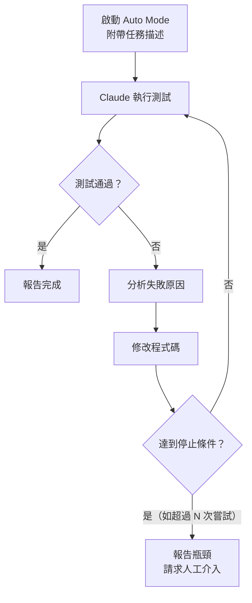

# 02-1-2 自動化開發：讓 Auto Mode 自主跑完測試與修正迴圈

## 1. 本章學習目標

- 學會使用 Claude Code 的 Auto Mode 自動執行 TDD 循環
- 掌握如何定義自動化任務的邊界與成功條件
- 理解何時該讓 AI 自主運作、何時該人工介入
- 學會設定檢查點，防止 Auto Mode 偏離方向
- 能在效率與可控性之間取得平衡

## 2. 適用對象與前置知識

- **適用對象**：已熟悉 TDD 概念（02-1-1）、希望在 Claude Code 中提升開發效率的工程師
- **前置知識**：TDD 三循環（02-1-1）、Claude Code 操作模式（01-2-3）、基本 Maven 測試指令
- **關聯章節**：前接 [02-1-1 TDD 概念](./02-1-1-tdd-red-green-refactor.md)，後接 [02-1-3 Spring Boot 骨架生成](./02-1-3-spring-boot-entity-service-controller-dto.md)

## 3. 核心概念

### 3.1 Auto Mode 的定位

Auto Mode 是 Claude Code 中的一個操作模式，它讓 Claude 能夠：

1. 讀取測試失敗訊息
2. 分析失敗原因
3. 修改程式碼
4. 重新執行測試
5. 重複以上步驟直到測試通過（或達到停止條件）



### 3.2 Auto Mode 適合的場景

| 適合 | 不適合 |
|------|--------|
| TDD Red → Green 循環 | 需要需求澄清的模糊任務 |
| 測試失敗後的修正 | 牽涉多系統協調的複雜變更 |
| 程式碼格式化與重構 | 涉及安全或權限的敏感變更 |
| 批量重複性工作 | 需要人類判斷的 UX 設計 |

### 3.3 停止條件的設定

Auto Mode 不是「讓 AI 無限重試」。你必須設定停止條件：

1. **成功條件**：所有測試通過、編譯成功
2. **失敗上限**：最多嘗試 N 次（建議 5-10 次）
3. **時間上限**：最多執行 M 分鐘
4. **人工檢查點**：特定步驟後暫停，等待人工確認

## 4. 實務情境

**情境**：大仁依照 spec.md 為 TicketController 撰寫了 8 個整合測試，但目前 Controller 還沒有對應的實作。他想讓 Claude Code 在 Auto Mode 下自動完成以下工作：

1. 執行測試（全部失敗——Red）
2. 根據失敗訊息建立 Controller 實作
3. 重新執行測試
4. 若有失敗，自行修正
5. 重複直到所有測試通過

## 5. 操作步驟

### 5.1 準備工作

在使用 Auto Mode 前，務必：

```bash
# 1. Commit 目前的進度（安全網）
git add .
git commit -m "test: add TicketController integration tests"

# 2. 確認測試可以被執行
mvn test -Dtest=TicketControllerTest
# 預期：測試失敗（因為還沒有實作）

# 3. 確認 spec.md 在 Context 中
# 確保 CLAUDE.md 引用了 spec.md
```

### 5.2 啟動 Auto Mode

在 Claude Code 中：

```
/auto

請依照 @spec.md 中的 Ticket API 定義，完成以下任務：

1. 執行 mvn test -Dtest=TicketControllerTest
2. 根據測試失敗的訊息與 spec.md，建立 TicketController 的實作
3. 同步建立需要的 Service、Repository、Entity、DTO（若尚未存在）
4. 重新執行測試
5. 若仍有失敗，分析原因並修正
6. 重複直到所有測試通過，或達到 10 次嘗試

注意：
- 嚴格遵循 spec.md 中的 API 定義
- 若遇到 spec.md 未定義的細節，暫停並詢問
- 每次修改後都要確保編譯通過
```

### 5.3 監控 Auto Mode 的執行

Auto Mode 執行期間，你應該：

1. **不要離開電腦**：Auto Mode 可能做出你不同意的變更
2. **觀察 Claude 的修正策略**：如果 Claude 連續 3 次用相同方式修正卻仍然失敗，表示它卡住了——需要人工介入
3. **記錄瓶頸**：哪些類型的錯誤 Claude 能自行修正？哪些需要人工介入？這些數據可以幫助你優化未來的 Auto Mode 使用策略

### 5.4 Auto Mode 完成後

```bash
# 1. 檢查 Claude 的變更
git diff

# 2. 手動審查關鍵程式碼
# 特別注意：安全性、效能、邊界條件處理

# 3. 執行完整測試套件（不僅是剛才的測試）
mvn test

# 4. 若滿意，Commit
git add .
git commit -m "feat: implement TicketController with passing tests"
```

## 6. 指令與範例

### Auto Mode Prompt 範本

```
/auto

任務：[簡述任務目標]

執行步驟：
1. [步驟 1]
2. [步驟 2]
...

停止條件：
- 成功：[定義什麼叫成功]
- 失敗上限：最多嘗試 [N] 次
- 時間上限：[M] 分鐘

檢查點：
- 完成 [步驟 X] 後暫停，等我確認後繼續

注意事項：
- [特殊要求或限制]
- [不可做的事]
```

### 常見 Auto Mode 任務範例

#### 任務 1：根據測試建立實作
```
/auto

請執行 mvn test -Dtest=TicketServiceTest，根據失敗訊息建立 TicketService 實作。
最多嘗試 8 次。若 8 次後仍有失敗，列出未解決的問題並請求協助。
```

#### 任務 2：重構並確保測試通過
```
/auto

請重構 TicketService 中的 createTicket 方法：
1. 將驗證邏輯抽出為獨立方法
2. 將 Entity → DTO 轉換邏輯抽出為 Mapper
3. 每次修改後執行 mvn test -Dtest=TicketServiceTest
4. 確保所有測試通過
```

#### 任務 3：修復回歸錯誤
```
/auto

mvn test 中有 3 個測試失敗。請分析失敗原因並修正。
如果失敗原因涉及多個 Service，請先報告分析結果，等我確認後再修改。
```

## 7. 常見錯誤與排查方式

### 錯誤 1：Auto Mode 陷入無限修正循環

**原因**：Claude 反覆用同樣的策略修正，但每次都失敗。它無法「跳脫框架思考」。

**症狀**：嘗試次數達到上限，但問題未解決。每次修正的 Diff 都非常相似。

**修正**：手動介入。分析瓶頸——通常這表示測試本身有問題、或 spec.md 有矛盾、或需要更深層的設計變更。不要讓 Claude 繼續浪費 Token。

### 錯誤 2：Auto Mode 為了讓測試通過而「偷工減料」

**原因**：Claude 發現只要回傳 Hard-coded 的值就能讓測試通過，而非實作真正的邏輯。

**症狀**：測試通過了，但程式碼中有 `return new TicketDto(1L, "test", ...);` 這類 Hard-coded 的回傳值。

**修正**：
- 確保測試案例足夠多樣化，Hard-coded 無法應付
- 在 Auto Mode 的 Prompt 中明確禁止：「不要使用 Hard-coded 的回傳值來通過測試」
- Auto Mode 完成後務必人工審查程式碼

### 錯誤 3：忘記 Commit 就啟動 Auto Mode

**原因**：急著讓 Claude 工作，沒先建立 Git 安全網。

**症狀**：Auto Mode 做了大量你不滿意的變更，但沒有簡單的方法回退。

**修正**：
- **預防**：永遠在 Auto Mode 前 Commit
- **補救**：若忘記 Commit，使用 IDE 的 Local History 或 `git diff` 手動還原

### 錯誤 4：Auto Mode 的任務範圍過大

**原因**：一次給 Claude 太多工作（例如「完成整個 Ticket 模組」）。

**症狀**：Auto Mode 跑了很久，過程中 Context 膨脹，後期的修正品質明顯下降。

**修正**：將大任務拆分為小任務。例如：
- Auto Mode 1：完成 Ticket Entity + Repository
- Auto Mode 2：完成 TicketService
- Auto Mode 3：完成 TicketController
每段之間人工審查並 Commit。

## 8. 最佳實務

1. **Git Commit 是不可協商的安全網**：任何 Auto Mode 之前，務必 Commit。這是你能放心讓 AI 自主工作的前提
2. **小步快跑，不要一次給太大範圍**：每個 Auto Mode 任務控制在 3-5 個測試案例的範圍內。完成後審查、Commit，再進行下一步
3. **設定明確的停止條件**：不要說「讓測試通過」，要說「最多嘗試 8 次，若未全部通過則列出未解決的問題」
4. **檢查點機制**：對於複雜任務，在 Prompt 中設定檢查點——完成關鍵步驟後暫停，等你確認方向正確再繼續
5. **Auto Mode 完成後的審查清單**：
   - [ ] 所有測試真的通過了（而非被刪除或跳過）
   - [ ] 沒有 Hard-coded 的回傳值
   - [ ] 程式碼風格與團隊慣例一致
   - [ ] 沒有引入新的安全漏洞
   - [ ] 日誌與錯誤處理合理
6. **從失敗中學習**：記錄 Auto Mode 最常卡住的錯誤類型。這些是你的測試或規格需要改進的地方
7. **Auto Mode 是工具，不是魔術**：它會加速開發，但不會取代你的判斷。如果 Claude 的方向明顯不對，手動停止並重新引導

## 9. 安全性、權限與成本注意事項

### 安全性
- Auto Mode 會自動修改程式碼——確保它只能修改開發分支的檔案，不能觸及正式環境設定
- 在 CLAUDE.md 中設定 Hooks，防止 Auto Mode 寫入包含敏感資訊的程式碼

### 權限
- Auto Mode 的權限等級高（可編輯檔案、執行指令）。確保只在開發環境使用
- 建議在 CLAUDE.md 中限制 Auto Mode 的檔案寫入範圍

### 成本
- Auto Mode 的成本較高：每次嘗試包含讀取測試結果 + 分析 + 修改 + 重新執行。8 次嘗試可能消耗 20,000-50,000 Token
- 如果 Auto Mode 卡住（反覆失敗），成本會快速累積。設定合理的嘗試上限來控制成本
- 拆分大任務為小任務，不僅提升成功率，也控制每次的 Token 消耗

## 10. 小結

1. Auto Mode 讓 Claude Code 能自主執行測試 → 失敗 → 修正 → 重試的循環，大幅提升 TDD 效率
2. 使用 Auto Mode 前必須 Commit，建立 Git 安全網
3. 必須設定明確的停止條件（成功條件、失敗上限、檢查點），不能讓 AI 無限重試
4. Auto Mode 適合小範圍、定義清晰的任務；不適合需要需求澄清或跨系統協調的複雜任務
5. Auto Mode 完成後務必人工審查——AI 可能用 Hard-coded 或取巧的方式通過測試

## 11. 延伸練習

### 練習一：Auto Mode 實作（操作型）
1. 為 TicketService 或 CommentService 撰寫 3-5 個測試案例（Red 階段）
2. Commit 測試程式碼
3. 使用 Auto Mode 讓 Claude 自動完成 Green 階段
4. 記錄：
   - Claude 用了幾次嘗試才讓所有測試通過
   - 中間卡住的瓶頸是什麼
   - 最終的程式碼是否需要人工調整
5. 若 Claude 在 5 次內無法全部通過，分析原因

### 練習二：Auto Mode 使用規範設計（思考型）
為你的團隊設計一份 Auto Mode 使用規範：
1. 哪些任務「必須」使用 Auto Mode？哪些「禁止」使用？
2. Auto Mode 前必須完成的檢查清單
3. Auto Mode 中的停止條件標準（幾次失敗後該人工介入？）
4. Auto Mode 後的審查清單
5. 如何追蹤 Auto Mode 的使用情況與成功率（建立數據驅動的改進循環）

## 12. 查核來源與版本備註

本章內容尚未完成即時官方文件查核，正式發布前應重新比對官方最新文件。

- 本章內容依據以下資料核實：
  - 來源 1：Anthropic Claude Code 官方文件（Auto Mode 功能說明）
  - 來源 2：JUnit 5 與 Maven 官方文件
- 查核日期：2026-06-05（教材撰寫日期，尚未完成最終官方查核）
- 版本備註：Auto Mode 的行為、權限範圍與指令格式以 Claude Code 最新版本為準
- 若使用者環境與本文不同，請優先依官方最新文件與實際環境調整
