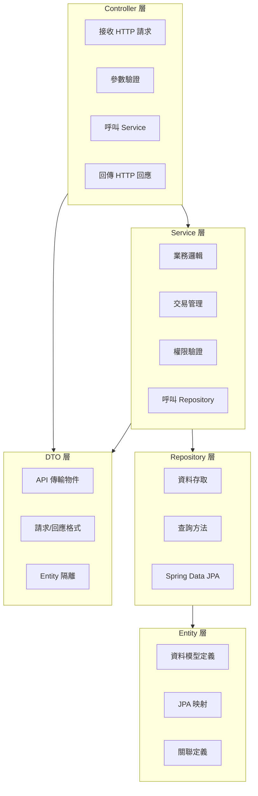

# 02-1-3 Spring Boot 3 骨架生成：Entity、Service、Controller 與 DTO

## 1. 本章學習目標

- 學會使用 Claude Code 從 spec.md 自動生成 Spring Boot 3 的分層骨架程式碼
- 掌握 Entity、Repository、Service、Controller、DTO 各層的生成策略與品質要求
- 理解如何讓 Claude 產出符合團隊慣例的程式碼（而非通用範本）
- 學會逐層生成、逐層驗證的開發節奏
- 建立從規格到可編譯骨架的完整工作流

## 2. 適用對象與前置知識

- **適用對象**：使用 Spring Boot 3 的後端開發者、想要用 AI 加速專案初始化的工程師
- **前置知識**：Spring Boot 3 基礎（依賴注入、JPA、REST Controller）、TDD 概念（02-1-1）、spec.md 結構（01-4-2）
- **關聯章節**：前接 [02-1-2 Auto Mode 測試修正迴圈](./02-1-2-auto-mode-test-and-fix-loop.md)，後接 [02-2-1 React + Vite UI](./02-2-1-react-vite-ui-with-spec-md.md)

## 3. 核心概念

### 3.1 Spring Boot 3 的分層架構



### 3.2 Claude Code 的生成策略

生成 Spring Boot 程式碼時，有三種策略：

| 策略 | 說明 | 適用場景 | 風險 |
|------|------|---------|------|
| 一次生成全部 | 讓 Claude 一次產出所有層的程式碼 | 簡單 CRUD、原型開發 | 各層不一致、品質參差 |
| 逐層生成 | Entity → Repository → Service → Controller，逐層確認 | 正式開發 | 需要較多互動 |
| 由內而外 | 從核心（Entity）向外（Controller）生成 | 複雜業務邏輯 | 需要清楚定義各層介面 |

**本課程建議**：逐層生成，每層生成後立即用測試驗證。

### 3.3 生成品質的關鍵

Claude 產出的程式碼品質取決於三個因素：
1. **spec.md 的精確度**：規格越清晰，生成的程式碼越準確
2. **CLAUDE.md 中的程式碼慣例**：團隊的程式碼風格、命名規則、使用的 Library
3. **Prompt 中的具體指引**：不是「建立 TicketController」，而是「依照 spec.md 第 5.1 節建立 TicketController，使用 @Valid 進行參數驗證，異常由 @ControllerAdvice 統一處理」

## 4. 實務情境

**情境**：我們要為「AI 問題追蹤系統」生成 Ticket 模組的 Spring Boot 骨架。spec.md 已經定義完成（01-4-2），CLAUDE.md 中已設定團隊慣例（01-4-3）。我們將逐層生成並驗證。

## 5. 操作步驟

### 5.1 第一層：Entity 與 Enum

在 Claude Code 中：

```
請依照 @spec.md 第 2 節的資料模型定義，建立以下檔案：

1. Priority Enum（LOW, MEDIUM, HIGH, CRITICAL）
2. TicketStatus Enum（OPEN, IN_PROGRESS, RESOLVED, CLOSED）
3. Ticket Entity，包含：
   - 所有欄位（對照 spec.md 表格）
   - JPA 註解（@Entity, @Id, @GeneratedValue, @Column 等）
   - @ManyToOne 關聯到 User（reporter 和 assignee）
   - @PrePersist 和 @PreUpdate 自動設定時間戳記
   - Lombok @Getter @Setter（不使用 @Data，避免 equals/hashCode 問題）

請使用 Java 17 語法，遵循 Google Java Style Guide。
```

**驗證**：
```bash
# 編譯檢查
mvn compile

# 若編譯失敗，讓 Claude 修正
```

### 5.2 第二層：DTO

```
請依照 @spec.md，建立以下 DTO：

1. TicketDto：用於 API 回應，包含所有 Ticket 欄位
   - 使用 Java Record 而非 Class（Java 17+）
   - 提供 static fromEntity(Ticket) 工廠方法
   
2. TicketCreateRequest：用於建立 Ticket 的請求
   - 使用 Java Record
   - 包含 Jakarta Validation 註解（@NotBlank, @Size 等）
   
3. TicketUpdateRequest：用於更新 Ticket 的請求
   - 所有欄位選填
```

### 5.3 第三層：Repository

```
請依照 @spec.md 的查詢需求，建立 TicketRepository：

1. 繼承 JpaRepository<Ticket, Long>
2. 自訂查詢方法：
   - findByStatus(TicketStatus status, Pageable pageable)
   - findByAssigneeId(Long assigneeId, Pageable pageable)
   - findByStatusAndAssigneeId(TicketStatus status, Long assigneeId, Pageable pageable)
3. 使用 Spring Data JPA 的方法命名規則（不需手寫 @Query，除非必要）
```

### 5.4 第四層：Service

```
請建立 TicketService，依照 @spec.md 實作以下方法：

1. createTicket(TicketCreateRequest, Long reporterId) → TicketDto
   - 驗證輸入
   - 設定初始狀態為 OPEN
   - 儲存並回傳 TicketDto
   
2. getTicketById(Long id) → TicketDto
   - 若不存在，拋出 ResourceNotFoundException

3. getTickets(TicketStatus, Long assigneeId, Pageable) → Page<TicketDto>
   - 支援篩選與分頁

4. updateTicket(Long id, TicketUpdateRequest, Long userId) → TicketDto
   - 驗證權限（僅 reporter 或 admin）

5. deleteTicket(Long id, Long userId)
   - 僅 admin 可刪除

6. changeStatus(Long id, TicketStatus newStatus, Long userId)
   - 驗證狀態轉換合法性（對照 spec.md 2.3）

請使用 @Transactional 管理交易邊界。
```

### 5.5 第五層：Controller

```
請建立 TicketController，依照 @spec.md 第 3 節的 API 端點定義：

1. POST /api/v1/tickets → createTicket
2. GET /api/v1/tickets → getTickets（含查詢參數）
3. GET /api/v1/tickets/{id} → getTicket
4. PUT /api/v1/tickets/{id} → updateTicket
5. DELETE /api/v1/tickets/{id} → deleteTicket
6. PATCH /api/v1/tickets/{id}/status → changeStatus

要求：
- 使用 @Valid 進行請求體驗證
- 使用 ResponseEntity 包裝回應
- 從 SecurityContext 取得目前使用者 ID
- 不要直接回傳 Entity
```

### 5.6 最終驗證

```bash
# 完整編譯
mvn clean compile

# 執行所有測試
mvn test

# 若使用 Auto Mode，可以在此啟動
/auto
請修正所有編譯錯誤和測試失敗，最多嘗試 5 次。
```

## 6. 指令與範例

### 逐層生成 Prompt 範本

```
請建立 [層級名稱]：[類別名稱]

規格來源：@spec.md 第 [節號] 節
技術要求：
- [要求 1]
- [要求 2]

程式碼慣例：參照 CLAUDE.md 中的 [段落名稱]

請注意：
- [特殊注意事項]
- [不要做的事]

完成後請列出產生的檔案清單。
```

### 針對既有程式碼補充

```
請檢查 @TicketService.java 是否完全符合 @spec.md 的定義。
列出任何遺漏或偏差，並提供修正方案。
```

## 7. 常見錯誤與排查方式

### 錯誤 1：Entity 與 DTO 欄位不同步

**原因**：先產生了 Entity，後來修改了 spec.md 的部分欄位，更新 Entity 時忘記同步更新 DTO。

**症狀**：編譯通過但執行時期出現欄位映射錯誤，或 API 回應缺少欄位。

**修正**：讓 Claude 檢查 Entity 與 DTO 的一致性：
```
請檢查 @Ticket.java 和 @TicketDto.java，列出所有欄位不一致的地方。
```

### 錯誤 2：JPA 雙向關聯導致無限迴圈

**原因**：Ticket → User 和 User → Ticket 形成雙向關聯，Jackson 序列化時陷入無限遞迴。

**症狀**：API 回應極長且重複，或直接拋出 StackOverflowError。

**修正**：在一方加上 `@JsonIgnore` 或使用 `@JsonManagedReference` / `@JsonBackReference`。更好的做法是透過 DTO 斷開循環參照。

### 錯誤 3：Service 層缺少交易管理

**原因**：忘記在 Service 方法上加上 `@Transactional`，或在不需要的地方加了。

**症狀**：LazyInitializationException（Session 已關閉）、資料不一致（部分寫入成功部分失敗）。

**修正**：
- 讀取操作：`@Transactional(readOnly = true)`
- 寫入操作：`@Transactional`
- 確保交易邊界在 Service 層，不在 Controller 層

### 錯誤 4：Controller 直接回傳 Entity

**原因**：貪圖方便，Controller 直接將 JPA Entity 序列化為 JSON 回傳。

**症狀**：API 回應暴露了不必要的欄位、敏感資訊、或觸發 LazyInitializationException。

**修正**：Controller 永遠回傳 DTO。在 CLAUDE.md 中設定規則：「Controller 不得直接回傳 Entity」。

## 8. 最佳實務

1. **逐層生成，逐層驗證**：不要一次讓 Claude 產出 5 個檔案。每層完成後，編譯、測試、審查，再進行下一層
2. **Entity 是最重要的根基**：花最多時間在 Entity 層——它的設計影響所有上層。確認關聯、索引、欄位約束都正確定義後再繼續
3. **DTO 使用 Record**：Java 17+ 的 Record 適合用於不可變的 DTO，減少樣板程式碼。但在使用 Lombok 的專案中，需確認團隊偏好
4. **Service 層的權限驗證**：權限檢查（誰能做什麼）應在 Service 層，而非 Controller 層。這樣即使未來加入其他入口（如 Message Queue），權限仍會被執行
5. **Controller 保持輕薄**：Controller 只做三件事：接收請求、呼叫 Service、回傳回應。業務邏輯一概在 Service 層
6. **讓 Claude 產出 Javadoc**：在 Prompt 中要求 Claude 為所有 Public 方法加上 Javadoc。這不僅提升可讀性，也讓 Claude 在產生程式碼時更清楚每個方法的意圖
7. **善用 `@` 參照確保一致性**：每個 Prompt 都參照 `@spec.md` 和 CLUADE.md，讓 Claude 的產出與規格和團隊慣例保持一致

## 9. 安全性、權限與成本注意事項

### 安全性
- **Controller 的輸入驗證**：所有進入系統的資料都必須驗證。使用 `@Valid` + Jakarta Validation
- **Service 的權限檢查**：不要依賴 Controller 層的權限過濾。Service 層必須獨立驗證權限
- **SQL Injection 防範**：使用 Spring Data JPA 的方法命名或 JPQL 參數綁定，避免字串拼接

### 權限
- 不要從 Controller 參數中直接接收 `userId`（任何人都可以偽造）。從 SecurityContext 中取得已認證的使用者
- 權限檢查的粒度：`hasRole('ADMIN')` 用於角色檢查，`@PreAuthorize` 用於方法級權限

### 成本
- 生成完整的 5 層骨架（Entity → Controller）約消耗 10,000-25,000 Token（含規格讀取）
- 若使用逐層生成策略，每次互動的 Token 較少，但總互動次數較多
- 建議：簡單 CRUD 用一次生成，複雜業務邏輯用逐層生成

## 10. 小結

1. Spring Boot 3 的標準分層架構（Entity → Repository → Service → Controller → DTO）是 Claude Code 生成程式碼的基礎框架
2. 建議採用逐層生成、逐層驗證的策略——每層完成後立即編譯與測試
3. 每個 Prompt 都應參照 spec.md 與 CLAUDE.md，確保規格一致性與程式碼慣例
4. Entity 層的正確性決定上層的穩定性；DTO 的正確性決定 API 的可用性
5. 安全驗證（輸入檢查、權限驗證）必須在 Service 層獨立執行，不能只依賴 Controller 層

## 11. 延伸練習

### 練習一：完整骨架生成實作（操作型）
1. 依照本章的逐層生成策略，使用 Claude Code 為「AI 問題追蹤系統」的 Comment 模組生成完整骨架
2. 每一層完成後：
   - 編譯確認
   - 撰寫至少 1 個測試
   - Git Commit
3. 完成所有 5 層後，執行完整測試套件
4. 記錄：哪些層最容易出錯？哪些 Prompt 讓 Claude 產出的品質最好？

### 練習二：程式碼生成品質衡量（思考型）
設計一套衡量 Claude Code 生成品質的指標：
1. 編譯成功率（第一次生成就能編譯通過的比例）
2. 規格符合率（生成的程式碼有多少比例嚴格符合 spec.md）
3. 人工修改率（生成的程式碼有多少行需要人工修改）
4. 如何用這些指標來優化 spec.md 和 CLAUDE.md？
5. 如何建立一個「生成品質回饋循環」，讓每次生成都比上次更好？

## 12. 查核來源與版本備註

本章內容尚未完成即時官方文件查核，正式發布前應重新比對官方最新文件。

- 本章內容依據以下資料核實：
  - 來源 1：Spring Boot 3 官方文件（https://docs.spring.io/spring-boot/documentation.html）
  - 來源 2：Spring Data JPA 官方文件
  - 來源 3：Jakarta Bean Validation 規範
- 查核日期：2026-06-05（教材撰寫日期，尚未完成最終官方查核）
- 版本備註：本章以 Spring Boot 3.2、Java 17、Jakarta EE 9+ 為基準。Spring Boot 版本升級時需確認 API 相容性
- 若使用者環境與本文不同，請優先依官方最新文件與實際環境調整
