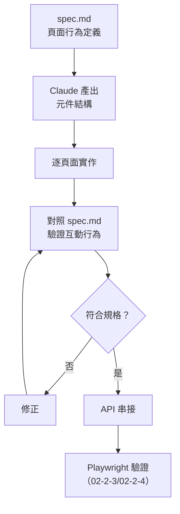

# 02-2-1 React + Vite 快速落 UI：搭配 spec.md 確保規格一致性

> ⚠️ **線上核實狀態**：已核實（2026-06-06）。React 18 + Vite + TypeScript 技術棧為當前主流，npm 指令與程式碼範例正確。
> 前端開發的 AI 協作策略（先定義型別、三狀態處理、元件拆分）皆為實務驗證的最佳做法。

## 1. 本章學習目標

- 學會使用 Claude Code 從 spec.md 快速搭建 React + Vite + TypeScript 前端骨架
- 掌握如何讓 Claude 產出的 UI 與 spec.md 中的頁面行為定義一致
- 理解前後端分離架構下，前端如何與後端 API 規格對接
- 學會建立元件化的前端架構，確保可維護性
- 建立「UI 也是規格的實作，不是自由創作」的開發心態

## 2. 適用對象與前置知識

- **適用對象**：使用 React 的前端/全端開發者、想要用 AI 加速 UI 開發的工程師
- **前置知識**：React 18 基礎（Hooks、元件、Props）、TypeScript 基礎、Vite 基礎、spec.md 結構（01-4-2）
- **關聯章節**：前接 [02-1-3 Spring Boot 骨架](./02-1-3-spring-boot-entity-service-controller-dto.md)，後接 [02-2-2 API 整合](./02-2-2-api-integration-with-controller-reference.md)

## 3. 核心概念

### 3.1 前端開發在 AI Coding 中的挑戰

AI 產生前端程式碼時，常見的問題包括：

1. **UI 與規格不一致**：AI 自由發揮 UI 設計，而非依照 spec.md 的頁面行為定義
2. **元件耦合過高**：一個大元件包含所有邏輯，難以維護
3. **API 串接格式錯誤**：前端預期的回應格式與後端實際格式不同
4. **缺少狀態管理**：載入中、錯誤、空資料等狀態未處理

### 3.2 解決方案：spec.md 驅動的 UI 開發

將 spec.md 中的「頁面行為」章節作為 UI 開發的契約：



## 4. 實務情境

**情境**：我們要依照 spec.md（01-4-2）中的「4. 頁面行為」定義，為「AI 問題追蹤系統」搭建三個頁面：
1. Ticket 列表頁
2. Ticket 詳情頁
3. 建立/編輯 Ticket 表單頁

## 5. 操作步驟

### 5.1 初始化 Vite + React 專案

```bash
# 建立 Vite + React + TypeScript 專案
npm create vite@latest frontend -- --template react-ts

cd frontend
npm install

# 安裝常用依賴
npm install react-router-dom axios @tanstack/react-query tailwindcss
```

### 5.2 讓 Claude 產出專案結構

```
請依照 @spec.md 第 4 節的頁面行為定義，為 React + TypeScript 前端專案設計元件結構。

要求：
- 使用 React 18 + TypeScript
- 使用 react-router-dom v6 進行路由管理
- 使用 @tanstack/react-query 管理伺服器狀態
- 資料夾結構遵循 feature-based 組織方式

請產出建議的資料夾結構與每個元件的職責說明。
```

### 5.3 逐頁面產出

#### Ticket 列表頁

```
請依照 @spec.md 第 4.1 節，建立 TicketListPage 元件。

要求：
- 以表格顯示 Ticket 列表
- 支援依狀態（下拉選單）與指派人（搜尋框）篩選
- 支援分頁（每頁 20 筆）
- 包含三種狀態：載入中（Loading Spinner）、空資料（Empty State）、錯誤（Error Message + Retry 按鈕）
- 使用 TypeScript 定義 Ticket 型別（對照 spec.md 資料模型）
- 使用 Tailwind CSS 進行樣式設計
```

#### Ticket 詳情頁

```
請依照 @spec.md 第 4.2 節，建立 TicketDetailPage 元件。

要求：
- 顯示所有 Ticket 欄位
- Priority 以顏色標籤區分（LOW=灰, MEDIUM=藍, HIGH=橘, CRITICAL=紅）
- 狀態可透過下拉選單變更（依狀態轉換規則限制可選狀態）
- 包含 Comment 列表區塊
- 「編輯」按鈕（僅 reporter 或 admin 時顯示）
- 「刪除」按鈕（僅 admin 時顯示，點擊前需確認對話框）
```

#### 建立/編輯表單

```
請依照 @spec.md 第 4.3 節，建立 TicketForm 元件。

要求：
- 用於建立與編輯（透過 props 區分模式）
- title：單行文字輸入框，含字數統計
- description：多行文字輸入框
- priority：下拉選單
- 前端驗證：title 不可空白、長度 1-200；description 不可空白、長度 1-5000
- 送出按鈕在驗證通過前為 disabled
- 使用 react-hook-form 或內建表單管理
```

### 5.4 讓 Claude 檢查規格一致性

```
請檢查目前已實作的前端元件是否完全符合 @spec.md 第 4 節的頁面行為定義。
列出任何遺漏或偏差，並提供修正方案。
```

## 6. 指令與範例

### TypeScript 型別定義生成

```
請依照 @spec.md 的資料模型定義，建立 TypeScript 型別定義檔案。
包含：Ticket, TicketStatus, Priority, User, Comment 及對應的 Request/Response 型別。
使用 enum 或 union type 定義 TicketStatus 和 Priority。
```

### API Client 生成

```
請依照 @spec.md 第 3 節的 API 端點定義，建立 API Client 模組。
使用 axios 進行 HTTP 請求，每個端點對應一個 async function。
型別使用剛才定義的 TypeScript 型別。
Base URL 從環境變數讀取。
```

## 7. 常見錯誤與排查方式

### 錯誤 1：前端型別與後端回應不匹配

**原因**：Claude 根據 spec.md 定義前端型別，但後端實際回應的欄位名稱或格式不同（例如後端用 snake_case，前端用 camelCase）。

**症狀**：API 呼叫成功但畫面顯示空白或 `undefined`。

**修正**：檢查後端 DTO 的實際欄位名稱。必要時在前端加入資料轉換層（Mapper）。

### 錯誤 2：忘記處理三種 UI 狀態

**原因**：Claude 只實作了「有資料」的狀態，遺漏了 Loading 和 Error 狀態。

**症狀**：頁面首次載入時短暫顯示「無資料」，API 失敗時畫面凍結。

**修正**：在 Prompt 中明確要求三種狀態：
```
每個資料相關元件都必須包含三種狀態的 UI：
1. Loading：顯示載入動畫
2. Error：顯示錯誤訊息與重試按鈕
3. Empty：顯示「尚無資料」的提示（若適用）
```

### 錯誤 3：元件過大，單一檔案包含所有邏輯

**原因**：Claude 為了方便，把所有邏輯塞進一個 500 行的元件。

**症狀**：難以維護、難以測試、難以複用。

**修正**：在 Prompt 中要求元件拆分：
```
每個頁面元件不超過 200 行。將複雜的 UI 片段抽出為獨立元件。
將 API 呼叫邏輯放在 hooks 中，不要直接寫在元件內。
```

### 錯誤 4：Tailwind CSS 樣式氾濫

**原因**：Claude 對每個元件都產生大量 inline Tailwind class，導致 JSX 難以閱讀。

**症狀**：`className` 屬性長達 20 個 class。

**修正**：要求 Claude 使用 `@apply` 或建立可複用的樣式元件。或使用元件庫（如 shadcn/ui）來減少手寫樣式。

## 8. 最佳實務

1. **頁面行為 = 規格的 UI 翻譯**：每個畫面、按鈕、互動都應該對應到 spec.md 中的一條定義。如果 spec.md 中沒有定義，先更新規格再寫程式碼
2. **先定義型別，再寫元件**：讓 Claude 先生成完整的 TypeScript 型別定義，確認與 spec.md 一致後，再基於這些型別產生元件
3. **每個資料元件都要處理三種狀態**：Loading、Error、Empty。這是最常見的 AI 遺漏點，務必在 Prompt 中明確要求
4. **API 呼叫集中管理**：不要在各元件中散落 axios 呼叫。建立統一的 API Client 模組，使用 React Query 管理快取與重新請求
5. **元件拆分原則**：一個元件只做一件事。頁面元件負責排版，功能元件負責互動，UI 元件（Button、Badge）負責視覺
6. **用 spec.md 驗收 UI**：功能開發完成後，打開 spec.md 的頁面行為章節，逐條對照 UI 是否滿足每一條定義
7. **CLAUDE.md 中定義前端慣例**：使用的 UI 框架（Tailwind/MUI）、狀態管理方案（React Query/Redux）、路由方案、命名規則——寫在 CLAUDE.md 中，確保 Claude 產出的程式碼一致

## 9. 安全性、權限與成本注意事項

### 安全性
- **前端權限檢查是 UX 優化，不是安全機制**：按鈕的顯示/隱藏（如「僅 admin 看到刪除按鈕」）是為了好的使用者體驗。真正的權限驗證必須在後端執行
- **不要在 Frontend 程式碼中寫入 API Key**：前端程式碼對使用者是完全透明的

### 權限
- 前端根據使用者角色控制 UI 的顯示（如按鈕、選單項目），但後端必須獨立驗證每個 API 請求的權限

### 成本
- 生成一個完整的頁面元件（含三種狀態、API 串接、樣式）約消耗 3,000-8,000 Token
- 使用 spec.md 作為 Prompt 的一部分會增加 Token 消耗，但換來的是更高的規格一致性

## 10. 小結

1. spec.md 中的「頁面行為」章節是前端開發的契約——UI 必須忠實反映規格定義
2. Claude Code 可以從 spec.md 快速生成 React + Vite + TypeScript 前端程式碼，但需要明確的 Prompt 指引
3. 關鍵品質要求：三種 UI 狀態（Loading/Error/Empty）、元件拆分、TypeScript 型別一致性
4. 前端權限控制（按鈕顯示/隱藏）是 UX 優化，真正的安全驗證在後端
5. 用 spec.md 逐條驗收 UI，確保不遺漏任何頁面行為定義

## 11. 延伸練習

### 練習一：完整前端頁面實作（操作型）
1. 依照 spec.md，使用 Claude Code 為「AI 問題追蹤系統」實作三個頁面
2. 每個頁面完成後，對照 spec.md 逐條檢查頁面行為是否符合
3. 實作一個 Claude 遺漏的功能（如 Empty State 或 Error 重試）
4. 記錄：哪個頁面 Claude 做得最好？哪個最需要人工調整？

### 練習二：前端開發指引設計（思考型）
為團隊設計一份「Claude Code 前端開發 Prompt 指引」：
1. 哪些資訊必須包含在每個前端開發 Prompt 中？
2. 如何確保 Claude 產出的 UI 在不同頁面之間保持一致性（設計系統思維）？
3. 如何讓 Claude 產出的 TypeScript 型別與後端 DTO 自動同步？
4. 在什麼情況下不應該讓 Claude 產出前端程式碼（而應該手寫）？

## 12. 查核來源與版本備註

本章內容尚未完成即時官方文件查核，正式發布前應重新比對官方最新文件。

- 本章內容依據以下資料核實：
  - 來源 1：React 官方文件（https://react.dev/）
  - 來源 2：Vite 官方文件（https://vitejs.dev/）
  - 來源 3：TypeScript 官方文件
  - 來源 4：TanStack Query 官方文件（https://tanstack.com/query/）
- 查核日期：2026-06-05（教材撰寫日期，尚未完成最終官方查核）
- 版本備註：本章以 React 18、Vite 5、TypeScript 5、Tailwind CSS 3 為基準
- 若使用者環境與本文不同，請優先依官方最新文件與實際環境調整
