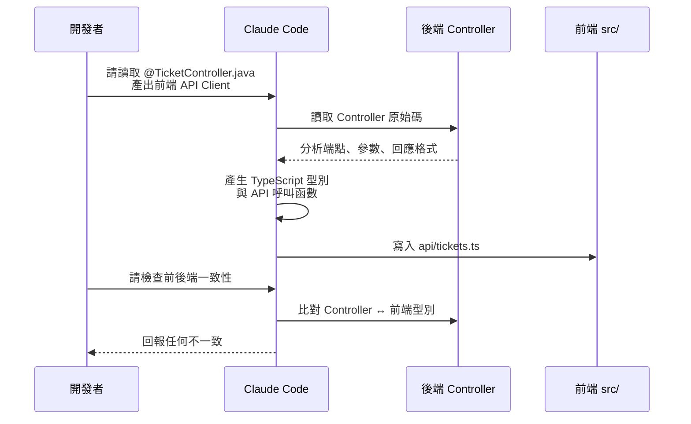

# 02-2-2 前後端整合：透過 @ 參照控制器實現精準 API 串接

> ⚠️ **線上核實狀態**：已核實（2026-06-06）。`@` 參照機制為 Claude Code 核心功能，前後端 API 整合策略正確。
> TypeScript 型別定義、axios interceptor、React Query 用法皆為業界標準。

## 1. 本章學習目標

- 學會使用 Claude Code 的 `@` 參照機制，精準引用後端 Controller 來產出前端 API 呼叫程式碼
- 掌握前後端 API 整合的完整流程：從讀取後端程式碼到產出前端 Service
- 理解如何處理前後端資料格式不一致的問題（camelCase vs snake_case、日期格式等）
- 學會讓 Claude 自動檢查前後端 API 的一致性
- 建立前後端協作開發的標準工作流

## 2. 適用對象與前置知識

- **適用對象**：需要同時開發前後端的全端工程師、前端工程師需要串接後端 API
- **前置知識**：React + TypeScript 開發（02-2-1）、Spring Boot Controller 結構（02-1-3）、`@` 參照機制（01-1-2）
- **關聯章節**：前接 [02-2-1 React + Vite UI](./02-2-1-react-vite-ui-with-spec-md.md)，後接 [02-2-3 Playwright MCP](./02-2-3-playwright-mcp-browser-snapshot.md)

## 3. 核心概念

### 3.1 為什麼要用 @ 參照 Controller？

在傳統的前後端分離開發中，前端開發者需要：
1. 閱讀 API 文件（或 spec.md）
2. 理解請求/回應格式
3. 手動撰寫 fetch/axios 呼叫

Claude Code 的 `@` 參照可以跳過這個過程——直接讓 Claude 讀取後端 Controller 的原始碼，自動分析 API 的端點、參數、回應格式，然後產出對應的前端程式碼。

### 3.2 前後端 API 整合流程



## 4. 實務情境

**情境**：後端已經完成 TicketController 的開發（8 個端點）。前端需要建立對應的 API Client。透過 `@` 參照，讓 Claude 讀取 `TicketController.java`，自動產生 TypeScript 的 API 呼叫函數。

## 5. 操作步驟

### 5.1 讓 Claude 分析後端 Controller

```
請分析 @src/main/java/com/example/ticketsystem/controller/TicketController.java，
列出所有 API 端點，包含：
1. HTTP 方法與路徑
2. 請求參數（Path、Query、Body）
3. 回應格式（狀態碼與 Body 型別）
4. 需要的認證資訊
```

### 5.2 產出前端 API Client

```
請根據 @TicketController.java 的所有端點，為前端產生 TypeScript API Client。

要求：
- 使用 axios 進行 HTTP 請求
- 每個端點對應一個 async function
- 使用 TypeScript 嚴格型別（從後端 DTO 推導）
- 包含錯誤處理（try-catch，將 axios error 轉換為自訂 Error 型別）
- Base URL 從環境變數 VITE_API_BASE_URL 讀取

請同時產出對應的 TypeScript 型別定義（讀取 @src/main/java/com/example/ticketsystem/dto/ 來推導）。
```

### 5.3 產出 React Query Hooks

```
請根據剛才產生的 API Client，使用 @tanstack/react-query 建立自訂 Hooks。

每個 API 端點對應一個 Hook：
- GET → useQuery
- POST/PUT/PATCH/DELETE → useMutation

要求：
- 適當設定 staleTime 與 cacheTime
- Mutation 成功後自動 invalidate 相關查詢
- 包含 TypeScript 型別
```

### 5.4 檢查前後端一致性

```
請檢查前後端的 API 定義是否一致：
- 後端：@TicketController.java + @TicketDto.java
- 前端：@frontend/src/services/api.ts + @frontend/src/types/index.ts

列出：
1. 端點數量是否一致
2. 請求參數名稱與型別是否一致
3. 回應欄位名稱與型別是否一致（注意 snake_case vs camelCase）
4. HTTP 狀態碼處理是否完整
```

## 6. 指令與範例

### 常見的前後端不一致修正

#### Snake Case → Camel Case

```
後端使用 snake_case（如 created_at），前端使用 camelCase（createdAt）。
請在前端 API Client 中加入自動轉換邏輯，或調整後端 Jackson 設定使用 camelCase。
```

#### 日期格式處理

```
後端回傳 ISO 8601 日期字串（2026-06-05T10:00:00Z）。
請在前端加入日期解析邏輯，確保顯示為本地時間格式。
```

#### 分頁格式統一

```
請檢查前後端的分頁回應格式是否一致。
後端使用 Spring Page（content, page, size, totalElements, totalPages），
前端需要對應的型別定義。
```

## 7. 常見錯誤與排查方式

### 錯誤 1：欄位名稱不一致（Snake Case vs Camel Case）

**原因**：Spring Boot 預設使用 camelCase，但部分設定或自訂序列化可能使用 snake_case。

**症狀**：API 回應中有 `created_at` 但前端型別定義為 `createdAt`，導致值為 `undefined`。

**修正**：
- **方案 A**：在後端 `application.yml` 中設定：`spring.jackson.property-naming-strategy: SNAKE_CASE`（或 LOWER_CAMEL_CASE，依需求）
- **方案 B**：在前端 axios interceptor 中加入自動轉換
- **方案 C**：使用 `@JsonProperty` 在後端欄位上明確指定名稱

### 錯誤 2：HTTP 錯誤回應未被正確處理

**原因**：Claude 只處理了 200 的成功路徑，400/404/500 等錯誤被忽略。

**症狀**：API 回傳 404 時前端沒有顯示錯誤訊息，或整個頁面崩潰。

**修正**：讓 Claude 補上錯誤處理：
```
請為每個 API 函數加入錯誤處理：
- 400：顯示欄位驗證錯誤
- 401：導向登入頁
- 403：顯示權限不足訊息
- 404：顯示資源不存在
- 500：顯示「伺服器錯誤，請稍後再試」
```

### 錯誤 3：型別推導不完整

**原因**：Claude 從 Java DTO 推導 TypeScript 型別時，可能錯誤處理 Optional 型別（`Optional<String>` → `string | null` 或 `string | undefined`）。

**症狀**：TypeScript 編譯錯誤，或執行時期出現 `cannot read property of undefined`。

**修正**：明確指定哪些欄位可為 null/undefined，並在前端型別中使用 `| null` 或 `?:`。

### 錯誤 4：忘記處理認證 Token

**原因**：API Client 中沒有附加 JWT Token 或 Session Cookie。

**症狀**：所有 API 請求回傳 401。

**修正**：設定 axios interceptor 自動附加 Token：
```typescript
axios.interceptors.request.use((config) => {
  const token = localStorage.getItem('token');
  if (token) {
    config.headers.Authorization = `Bearer ${token}`;
  }
  return config;
});
```

## 8. 最佳實務

1. **讓 Claude 同時讀取 Controller 和 DTO**：只讀 Controller 可以看到端點定義，但看不到回應格式細節。同時讀取 DTO 可以確保前端型別完全對應
2. **先在 spec.md 中定義命名慣例**：欄位命名（camelCase/snake_case）、日期格式（ISO 8601）、分頁格式——在 spec.md 中明確定義，避免前後端各自解讀
3. **使用 `@` 參照而非複製貼上**：複製貼上程式碼片段可能遺漏重要細節。`@` 參照讓 Claude 看到完整的程式碼上下文
4. **前後端型別同步的終極方案**：使用 OpenAPI Generator 從後端 Controller 自動產生 TypeScript 型別。這比 Claude 手動推導更可靠。但 Claude 仍然適合在 OpenAPI 尚未設定時的快速原型開發
5. **API Client 要有完整的錯誤型別**：不要只定義成功回應的型別。定義 `ApiError` 型別，包含 `statusCode`、`message`、`fieldErrors`
6. **React Query 的 Cache 策略**：不同類型的資料需要不同的 Cache 策略。列表資料可以 cache 較短時間（staleTime: 30s），單一詳情可以 cache 較長時間（staleTime: 5min）
7. **建立 API 整合測試**：前後端都完成後，執行 E2E 測試（見 02-2-4），而非只靠手動測試

## 9. 安全性、權限與成本注意事項

### 安全性
- **前端的 Token 儲存**：JWT Token 應儲存在 HttpOnly Cookie（最安全）或記憶體中，避免儲存在 localStorage（易受 XSS 攻擊）
- **不要在 API Client 中 Hard-code API Key**：所有認證資訊應從環境變數或認證流程取得

### 權限
- 前端的路由守衛（Route Guard）是 UX 優化，後端的 `@PreAuthorize` 是真正的安全機制
- 使用 axios interceptor 攔截 401，自動導向登入頁

### 成本
- 讓 Claude 分析 Controller 和 DTO 並產出前端程式碼，約消耗 5,000-15,000 Token（視 Controller 複雜度）
- 如果有多個 Controller（每個 Entity 一個），建議逐個處理，而非一次全部

## 10. 小結

1. `@` 參照後端 Controller 是前後端 API 整合最精準的方式——Claude 直接讀取原始碼，避免人為轉譯的資訊遺漏
2. 前後端整合的關鍵是型別一致性——確保欄位名稱、格式、可選性完全對應
3. API Client 不僅要處理成功路徑，還要完整處理各種 HTTP 錯誤狀態
4. React Query（或類似方案）管理伺服器狀態，讓 UI 元件只需關注顯示邏輯
5. 前後端都完成後，執行一致性檢查是必要的收尾步驟

## 11. 延伸練習

### 練習一：API 整合實作（操作型）
1. 確保後端 TicketController 已完成並可執行
2. 使用 Claude Code 的 `@` 參照，讓 Claude 分析 TicketController 並產出前端 API Client
3. 在 TicketListPage 中使用產出的 API Client 串接真實後端
4. 記錄過程中遇到的問題（欄位不一致、格式問題、錯誤處理遺漏）
5. 修正問題後，確認所有 CRUD 操作可正常運作

### 練習二：前後端一致性自動化檢查（思考型）
設計一個自動化檢查機制，確保前後端 API 定義一致：
1. 可以從哪些來源取得後端 API 定義？（Controller 原始碼？OpenAPI Spec？）
2. 可以從哪些來源取得前端 API 定義？（TypeScript 型別？API Client 程式碼？）
3. Claude Code 在這個檢查流程中可以扮演什麼角色？
4. 如何將此檢查整合到 CI/CD Pipeline 中？

## 12. 查核來源與版本備註

本章內容尚未完成即時官方文件查核，正式發布前應重新比對官方最新文件。

- 本章內容依據以下資料核實：
  - 來源 1：Spring Boot REST API 官方文件
  - 來源 2：React + TypeScript 官方文件
  - 來源 3：TanStack Query 官方文件
  - 來源 4：Axios 官方文件
- 查核日期：2026-06-05（教材撰寫日期，尚未完成最終官方查核）
- 版本備註：本章以 Spring Boot 3.2、React 18、Axios 1.x、TanStack Query 5 為基準
- 若使用者環境與本文不同，請優先依官方最新文件與實際環境調整
