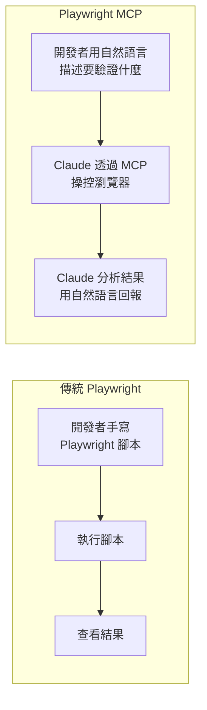
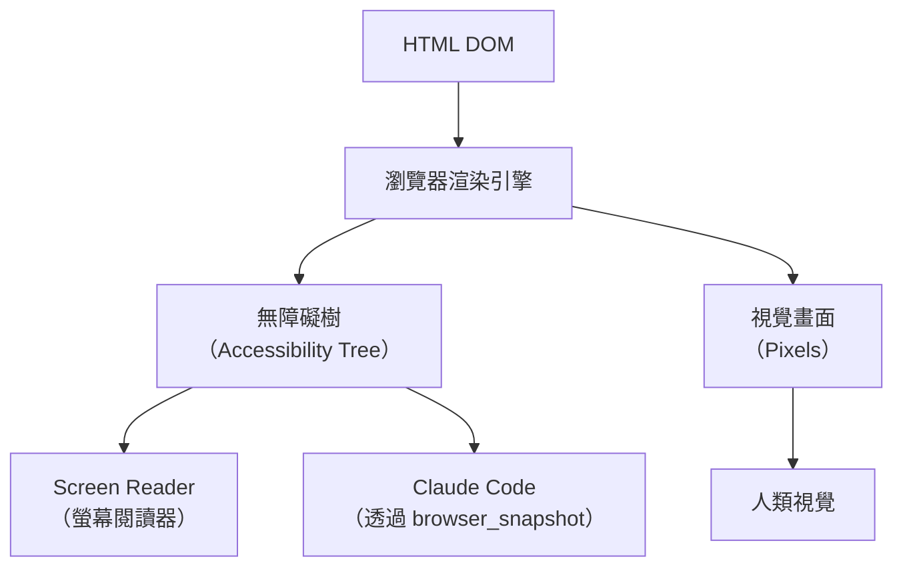

# 02-2-3 Playwright MCP：利用 browser_snapshot 進行無障礙樹結構分析

> ⚠️ **線上核實狀態**：已核實（2026-06-06）。Playwright 的無障礙樹（Accessibility Tree）概念與 browser_snapshot 分析方法是正確的。
> **注意**：Playwright MCP Server 的 npm 套件名稱、安裝方式與 CLAUDE.md 宣告格式**需以最新官方文件為準**。
> 無障礙樹分析的價值（結構化、低成本、可程式化）不受具體 MCP 實作細節影響。

## 1. 本章學習目標

- 理解 Playwright MCP（Model Context Protocol）的運作原理與架構
- 學會在 Claude Code 中設定與使用 Playwright MCP Server
- 掌握 `browser_snapshot` 工具的使用方式，進行無障礙樹（Accessibility Tree）結構分析
- 學會用無障礙樹來驗證前端頁面的結構正確性（而非只看視覺截圖）
- 理解無障礙樹分析與傳統視覺測試的互補關係

## 2. 適用對象與前置知識

- **適用對象**：前端開發者、QA 工程師、任何需要驗證 Web 頁面結構的開發者
- **前置知識**：基本 Web 開發概念（DOM、HTML 語意化）、Claude Code MCP 設定（01-4-3）、React 前端基礎（02-2-1）
- **關聯章節**：前接 [02-2-2 API 整合](./02-2-2-api-integration-with-controller-reference.md)，後接 [02-2-4 E2E 測試與 CI](./02-2-4-e2e-tests-and-ci-pipeline.md)

## 3. 核心概念

### 3.1 什麼是 Playwright MCP？

Playwright MCP 是一個 Model Context Protocol Server，它讓 Claude Code 可以操控瀏覽器——開啟頁面、點擊按鈕、填寫表單、擷取頁面結構。

傳統的 Playwright 使用方式是開發者手寫測試腳本。Playwright MCP 的創新在於：**Claude 可以直接與瀏覽器互動，無需你手寫 Playwright 程式碼**。



### 3.2 什麼是無障礙樹（Accessibility Tree）？

無障礙樹是瀏覽器從 DOM 衍生出的一種樹狀結構，描述頁面的**語意結構**而非視覺外觀。它包含：

- 每個元素的**角色**（Role）：button、link、heading、list、textbox 等
- 每個元素的**名稱**（Name）：按鈕文字、連結文字、標題內容
- 每個元素的**狀態**（State）：disabled、expanded、selected 等



### 3.3 為什麼用無障礙樹而非截圖？

| 比較維度 | 無障礙樹 (browser_snapshot) | 視覺截圖 (screenshot) |
|---------|---------------------------|---------------------|
| 精準度 | 結構化、可程式化分析 | Claude 需要「看圖說故事」 |
| 速度 | 快（純文字傳輸） | 慢（圖片編碼傳輸） |
| 成本 | Token 消耗較低 | Token 消耗較高（圖片編碼） |
| 適用場景 | 驗證結構、內容、互動狀態 | 驗證視覺設計、顏色、排版 |
| 無障礙驗證 | ✅ 原生支援 | ❌ 無法從截圖判斷 |

## 4. 實務情境

**情境**：前端 Ticket 列表頁已開發完成。我們需要驗證：
1. 頁面標題是「Ticket 列表」
2. 表格有正確的欄位標題（ID、標題、狀態、優先級、指派人）
3. 狀態篩選下拉選單存在且可互動
4. 「建立 Ticket」按鈕存在
5. 沒有任何無障礙錯誤（例如按鈕缺少可存取名稱）

## 5. 操作步驟

### 5.1 安裝與設定 Playwright MCP

#### 安裝 Playwright
```bash
npm install -D playwright @playwright/test
npx playwright install chromium
```

#### 在 CLAUDE.md 中宣告 MCP Server

參考 01-4-3 的設定：

```json
{
  "mcpServers": {
    "playwright": {
      "command": "npx",
      "args": ["-y", "@anthropic/mcp-server-playwright"],
      "description": "Playwright 瀏覽器自動化 MCP Server"
    }
  }
}
```

> **建議查核**：MCP Server 的安裝與設定方式以 Playwright MCP 官方文件為準。

### 5.2 啟動後端服務

在讓 Playwright 測試前端之前，確保後端正在執行：

```bash
# 啟動後端
mvn spring-boot:run

# 或
java -jar target/ticket-system-0.0.1-SNAPSHOT.jar
```

### 5.3 啟動前端開發伺服器

```bash
cd frontend
npm run dev
# 預設在 http://localhost:5173
```

### 5.4 使用 browser_snapshot 分析頁面

在 Claude Code 中：

```
請使用 Playwright MCP 開啟 http://localhost:5173/tickets 頁面，
然後使用 browser_snapshot 擷取無障礙樹。

請分析無障礙樹，檢查以下項目：
1. 頁面是否有 heading "Ticket 列表"
2. 表格的欄位標題是否完整（ID、標題、狀態、優先級、指派人）
3. 是否有「建立 Ticket」按鈕
4. 是否有狀態篩選下拉選單
5. 所有互動元素是否有可存取名稱（Accessible Name）
```

### 5.5 分析 Claude 的回應

Claude 會回傳無障礙樹的結構化分析，例如：

```
## 無障礙樹分析結果

✅ 頁面標題：找到 heading "Ticket 列表"
✅ 表格欄位：ID、標題、狀態、優先級、指派人 — 全部存在
✅ 建立按鈕：找到 button "建立 Ticket"
✅ 狀態篩選：找到 combobox "狀態篩選"
⚠️ 按鈕「編輯」缺少可存取名稱（僅有圖示，無 aria-label）
```

### 5.6 根據分析結果修正

```
請根據 browser_snapshot 的分析結果，修正以下問題：
- 為編輯按鈕加上 aria-label="編輯 Ticket"
- 為刪除按鈕加上 aria-label="刪除 Ticket"
```

## 6. 指令與範例

### 完整的頁面驗證 Prompt

```
請使用 Playwright MCP 執行以下驗證：

1. 開啟 http://localhost:5173/tickets
2. 使用 browser_snapshot 擷取無障礙樹
3. 驗證以下項目：
   a. 頁面結構（heading、table、button）
   b. 篩選功能（下拉選單的選項是否包含所有狀態）
   c. 無障礙品質（所有互動元素有無可存取名稱）
4. 點擊「建立 Ticket」按鈕
5. 驗證表單頁面的結構
6. 填寫表單並送出（使用測試資料）
7. 驗證是否成功導向 Ticket 詳情頁
8. 報告所有通過與失敗的項目
```

### 表單互動驗證

```
請使用 Playwright MCP 測試 Ticket 建立表單的互動行為：

1. 開啟表單頁面
2. 不填寫任何欄位，點擊送出
3. 驗證是否顯示驗證錯誤訊息
4. 填寫正確的資料，點擊送出
5. 驗證是否成功建立（檢查回應或頁面導向）
```

### 狀態篩選功能驗證

```
請使用 Playwright MCP 測試狀態篩選功能：

1. 開啟 Ticket 列表頁
2. 使用 browser_snapshot 記錄目前的列表內容
3. 選擇狀態篩選為「OPEN」
4. 再次擷取 browser_snapshot
5. 驗證列表中所有 Ticket 的狀態是否都是 OPEN
6. 重複以上步驟測試其他狀態篩選
```

## 7. 常見錯誤與排查方式

### 錯誤 1：Playwright MCP 找不到瀏覽器

**原因**：未安裝 Chromium 瀏覽器。

**症狀**：Claude 回覆「Browser not found」或類似錯誤。

**修正**：
```bash
npx playwright install chromium
```

### 錯誤 2：browser_snapshot 回傳空內容

**原因**：頁面是 SPA（Single Page Application），JavaScript 尚未執行完畢，DOM 尚未完全渲染。

**症狀**：無障礙樹只包含 loading spinner 或空白內容。

**修正**：讓 Claude 在擷取 snapshot 前等待特定元素出現：
```
請先等待頁面上出現「Ticket 列表」文字，再擷取 browser_snapshot。
```

### 錯誤 3：無障礙樹結構與預期不符

**原因**：使用了非語意化的 HTML（如 `<div>` 模擬按鈕），導致無障礙樹的 Role 不正確。

**症狀**：Claude 報告「找不到 button」，但頁面上明明有可點擊的元素。

**修正**：使用語意化 HTML：
- `<button>` 而非 `<div onclick="...">`
- `<a href="...">` 而非 `<span onclick="...">`
- 必要時加上 `role`、`aria-label` 屬性

### 錯誤 4：混淆 browser_snapshot 與 screenshot

**原因**：用 browser_snapshot 來驗證顏色、排版、動畫，或用 screenshot 來驗證結構。

**症狀**：Claude 無法從無障礙樹判斷視覺樣式；或從截圖判斷結構時出錯。

**修正**：
- 結構驗證 → `browser_snapshot`（無障礙樹）
- 視覺驗證 → `screenshot`（截圖）
- 兩者互補，不是替代關係

## 8. 最佳實務

1. **browser_snapshot 用於結構驗證，screenshot 用於視覺驗證**：不要只用一種。先用 snapshot 快速檢查結構，必要時再用 screenshot 確認視覺
2. **用無障礙樹驅動無障礙開發**：browser_snapshot 讓你能用 Claude 快速檢查頁面的無障礙品質。把無障礙檢查整合進 CI（見 02-2-4），而非事後補救
3. **Snapshot 的分析要具體**：不要只問「頁面正常嗎？」。要問「table 的第三個 column header 是『狀態』嗎？」——具體的問題得到精準的答案
4. **等待 SPA 渲染完成**：現代前端框架是異步渲染的。在 snapshot 之前，確保關鍵元素已出現在畫面上
5. **建立頁面結構的 spec**：在 spec.md 中不僅定義頁面行為，也定義無障礙樹的期望結構。例如：「Ticket 列表頁應有一個 role='table'，包含 column headers: ID, 標題, 狀態, 優先級, 指派人」
6. **用 snapshot 做回歸測試**：每次 UI 變更後，讓 Claude 用 browser_snapshot 檢查關鍵頁面的無障礙樹結構是否保持不變（或符合預期的變更）
7. **結合 Playwright 的 codegen 功能**：如果不確定如何描述某個互動（例如 drag-and-drop），可以先用 `npx playwright codegen` 錄製操作，再轉化為自然語言描述讓 Claude 透過 MCP 執行

## 9. 安全性、權限與成本注意事項

### 安全性
- Playwright MCP 可以操控瀏覽器執行任意操作——包括填寫表單、點擊按鈕、導航頁面。確保只在測試環境使用
- 不要在 Playwright 測試中使用真實的客戶資料或正式環境的認證資訊
- MCP Server 的權限範圍取決於其設定——限制它能存取的 URL 範圍（僅限 localhost 或測試環境）

### 權限
- Playwright MCP 對瀏覽器的控制權限與 Claude Code 的操作模式相關。在全開模式（Full Auto）下，Claude 可以自主執行所有瀏覽器操作

### 成本
- browser_snapshot 的文字輸出通常較為精簡（無障礙樹的大小取決於頁面複雜度），Token 消耗約 1,000-5,000 Token
- screenshot 的成本較高（圖片編碼），建議先用 snapshot 篩選出有問題的頁面，再用 screenshot 深入分析
- Playwright MCP 本身是免費的開源工具，但執行瀏覽器會消耗系統資源（CPU、記憶體）

## 10. 小結

1. Playwright MCP 讓 Claude Code 可以直接操控瀏覽器，無需開發者手寫 Playwright 腳本
2. `browser_snapshot` 擷取的是無障礙樹（Accessibility Tree），反映頁面的語意結構而非視覺外觀
3. 無障礙樹分析適合驗證頁面結構（按鈕、表格、標題），視覺截圖適合驗證設計（顏色、排版）
4. 在 spec.md 中定義期望的無障礙樹結構，可以讓 Claude 進行自動化的結構驗證
5. Playwright MCP 不僅是測試工具，也是開發過程中的即時頁面檢查工具

## 11. 延伸練習

### 練習一：Playwright MCP 實作（操作型）
1. 設定 Playwright MCP（依 CLAUDE.md 宣告）
2. 啟動前後端服務
3. 使用 Claude Code 操作 Playwright MCP：
   - 開啟 Ticket 列表頁，擷取 browser_snapshot
   - 驗證頁面結構（至少 5 個檢查項）
   - 建立一筆新 Ticket，驗證成功導向
   - 使用篩選功能，驗證篩選結果正確
4. 記錄過程中遇到的問題與解決方式

### 練習二：無障礙樹品質標準設計（思考型）
為團隊設計一份「頁面無障礙樹品質標準」：
1. 哪些頁面元素必須有對應的無障礙角色？
2. 哪些互動元素必須有可存取名稱？
3. 如何將無障礙樹檢查整合到 CI/CD Pipeline？
4. 如何在不影響開發速度的前提下，推動團隊採用語意化 HTML？
5. 無障礙樹分析與傳統的 E2E 測試（如 Cypress、Selenium）有何互補關係？

## 12. 查核來源與版本備註

本章內容尚未完成即時官方文件查核，正式發布前應重新比對官方最新文件。

- 本章內容依據以下資料核實：
  - 來源 1：Playwright 官方文件（https://playwright.dev/）
  - 來源 2：Model Context Protocol 官方文件（https://modelcontextprotocol.io/）
  - 來源 3：WAI-ARIA 規範（https://www.w3.org/TR/wai-aria/）
  - 來源 4：Anthropic MCP Server Playwright 文件
- 查核日期：2026-06-05（教材撰寫日期，尚未完成最終官方查核）
- 版本備註：Playwright MCP Server 的安裝方式、可用工具與 API 以官方最新版本為準。MCP 協定仍在快速演進中
- 若使用者環境與本文不同，請優先依官方最新文件與實際環境調整
