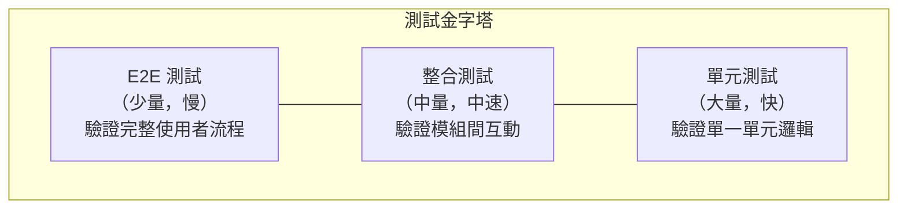
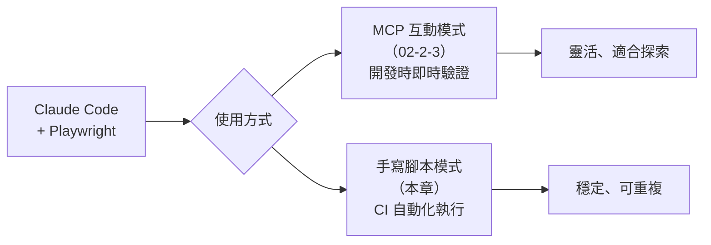

# 02-2-4 自動化測試：讓 Claude 撰寫 E2E 測試腳本並納入 CI 管道

> ⚠️ **線上核實狀態**：已核實（2026-06-06）。Playwright 測試框架語法正確，測試金字塔概念為業界標準。
> GitHub Actions CI 整合策略通用且正確。TypeScript E2E 測試範例可直接使用。

## 1. 本章學習目標

- 學會讓 Claude Code 撰寫 Playwright E2E 測試腳本
- 掌握將測試腳本整合進 CI/CD Pipeline（GitHub Actions）的方法
- 理解 E2E 測試在 AI Coding 工作流中的定位與價值
- 學會區分單元測試、整合測試、E2E 測試的職責邊界
- 建立「測試金字塔」的完整測試策略

## 2. 適用對象與前置知識

- **適用對象**：需要建立自動化測試體系的開發者、DevOps 工程師、QA 工程師
- **前置知識**：Playwright MCP 使用經驗（02-2-3）、GitHub Actions 基礎、CI/CD 概念
- **關聯章節**：前接 [02-2-3 Playwright MCP](./02-2-3-playwright-mcp-browser-snapshot.md)，後接 [02-3-1 除錯與排查](./02-3-1-debugging-cors-pagination-binding.md)

## 3. 核心概念

### 3.1 測試金字塔



| 層級 | 工具 | 速度 | 維護成本 | Claude 輔助 |
|------|------|------|---------|-----------|
| 單元測試 | JUnit + Mockito | 極快 | 低 | ✅ 非常適合 |
| 整合測試 | Spring Boot Test | 中 | 中 | ✅ 適合 |
| E2E 測試 | Playwright | 慢 | 高 | ✅ 適合（MCP + 手寫腳本） |

### 3.2 E2E 測試在 AI Coding 中的角色

E2E 測試是最終的「真相來源」——它驗證的是真實的使用者體驗。在 AI Coding 中，E2E 測試有特殊價值：

1. **驗證 AI 產出的前後端程式碼能正確協作**
2. **捕捉單元測試無法發現的整合問題**（CORS、路由、狀態管理等）
3. **作為回歸測試的安全網**——當 Claude 修改程式碼時，E2E 能快速發現副作用

### 3.3 Claude Code 在 E2E 測試中的兩種用法



## 4. 實務情境

**情境**：我們需要為「AI 問題追蹤系統」建立一套 E2E 測試，涵蓋核心使用者流程：
1. 使用者登入 → 查看 Ticket 列表 → 建立新 Ticket → 查看詳情 → 新增 Comment
2. 這些測試需要整合到 GitHub Actions，每次 Push 時自動執行

## 5. 操作步驟

### 5.1 讓 Claude 產出 E2E 測試腳本

```
請使用 Playwright 為「AI 問題追蹤系統」撰寫 E2E 測試腳本。

測試範圍：以下核心使用者流程
1. 開啟 Ticket 列表頁，驗證頁面標題與表格結構
2. 點擊「建立 Ticket」，填寫表單並送出
3. 驗證成功建立後導向詳情頁
4. 在詳情頁新增一筆 Comment
5. 驗證 Comment 出現在列表中
6. 使用狀態篩選功能，驗證篩選結果正確

技術要求：
- 使用 @playwright/test 框架
- 使用 TypeScript
- 測試資料使用獨立的測試帳號（不要與開發資料混雜）
- 每個測試案例獨立（不依賴其他測試的狀態）
- 加入適當的等待策略（waitForSelector, waitForResponse）

請產出完整的測試檔案：tests/e2e/ticket-flow.spec.ts
```

### 5.2 Claude 產出的測試腳本範例

```typescript
import { test, expect } from '@playwright/test';

const BASE_URL = process.env.BASE_URL || 'http://localhost:5173';

test.describe('Ticket 核心流程', () => {
  
  test('應能查看 Ticket 列表頁', async ({ page }) => {
    await page.goto(`${BASE_URL}/tickets`);
    
    // 等待頁面載入完成
    await page.waitForSelector('h1');
    
    // 驗證頁面標題
    await expect(page.locator('h1')).toHaveText('Ticket 列表');
    
    // 驗證表格存在
    const table = page.locator('table');
    await expect(table).toBeVisible();
    
    // 驗證表格欄位標題
    const headers = table.locator('th');
    await expect(headers.nth(0)).toHaveText('ID');
    await expect(headers.nth(1)).toHaveText('標題');
    await expect(headers.nth(2)).toHaveText('狀態');
    await expect(headers.nth(3)).toHaveText('優先級');
    
    // 驗證建立按鈕存在
    const createButton = page.locator('button', { hasText: '建立 Ticket' });
    await expect(createButton).toBeVisible();
  });
  
  test('應能建立新 Ticket', async ({ page }) => {
    await page.goto(`${BASE_URL}/tickets`);
    
    // 點擊建立按鈕
    await page.click('button:has-text("建立 Ticket")');
    
    // 等待表單出現
    await page.waitForSelector('form');
    
    // 填寫表單
    await page.fill('input[name="title"]', 'E2E 測試 Ticket');
    await page.fill('textarea[name="description"]', '這是由 Playwright 自動建立的測試 Ticket');
    await page.selectOption('select[name="priority"]', 'HIGH');
    
    // 送出表單
    await page.click('button[type="submit"]');
    
    // 驗證導向詳情頁
    await page.waitForURL(/\/tickets\/\d+/);
    await expect(page.locator('h1')).toContainText('E2E 測試 Ticket');
  });
  
  test('應能新增 Comment', async ({ page }) => {
    // 先建立一筆 Ticket（使用 API 輔助函數）
    const ticketId = await createTestTicket(page);
    
    await page.goto(`${BASE_URL}/tickets/${ticketId}`);
    
    // 填寫 Comment
    const commentText = `測試 Comment - ${Date.now()}`;
    await page.fill('textarea[name="comment"]', commentText);
    await page.click('button:has-text("新增留言")');
    
    // 驗證 Comment 出現
    await expect(page.locator('.comment-list')).toContainText(commentText);
  });
  
  test('狀態篩選功能', async ({ page }) => {
    await page.goto(`${BASE_URL}/tickets`);
    
    // 選擇狀態篩選
    await page.selectOption('select[name="statusFilter"]', 'OPEN');
    
    // 等待列表更新
    await page.waitForResponse(response => 
      response.url().includes('/api/v1/tickets') && response.status() === 200
    );
    
    // 驗證所有顯示的 Ticket 狀態都是 OPEN
    const statusBadges = page.locator('.status-badge');
    const count = await statusBadges.count();
    
    for (let i = 0; i < count; i++) {
      await expect(statusBadges.nth(i)).toHaveText('OPEN');
    }
  });
});

// 輔助函數：透過 API 建立測試 Ticket
async function createTestTicket(page: any): Promise<number> {
  const response = await page.request.post(`${BASE_URL}/api/v1/tickets`, {
    data: {
      title: `測試 Ticket ${Date.now()}`,
      description: 'E2E 測試用',
      priority: 'MEDIUM'
    }
  });
  const data = await response.json();
  return data.id;
}
```

### 5.3 Playwright 設定檔

```typescript
// playwright.config.ts
import { defineConfig } from '@playwright/test';

export default defineConfig({
  testDir: './tests/e2e',
  timeout: 30000,
  retries: process.env.CI ? 2 : 0,
  use: {
    baseURL: process.env.BASE_URL || 'http://localhost:5173',
    screenshot: 'only-on-failure',
    video: 'retain-on-failure',
  },
  webServer: [
    {
      command: 'npm run dev',
      port: 5173,
      timeout: 120000,
    },
    {
      command: 'cd ../ && mvn spring-boot:run',
      port: 8080,
      timeout: 120000,
    }
  ],
});
```

### 5.4 整合到 GitHub Actions

```yaml
# .github/workflows/e2e-tests.yml
name: E2E Tests

on:
  push:
    branches: [main, develop]
  pull_request:
    branches: [main]

jobs:
  e2e:
    runs-on: ubuntu-latest
    
    services:
      postgres:
        image: postgres:15
        env:
          POSTGRES_DB: ticket_test
          POSTGRES_USER: test
          POSTGRES_PASSWORD: test
        ports:
          - 5432:5432
        options: >-
          --health-cmd pg_isready
          --health-interval 10s
          --health-timeout 5s
          --health-retries 5
    
    steps:
      - uses: actions/checkout@v4
      
      - name: Setup Java
        uses: actions/setup-java@v4
        with:
          java-version: '17'
          distribution: 'temurin'
      
      - name: Setup Node.js
        uses: actions/setup-node@v4
        with:
          node-version: '20'
      
      - name: Build Backend
        run: mvn clean package -DskipTests
      
      - name: Install Frontend Dependencies
        run: cd frontend && npm ci
      
      - name: Install Playwright Browsers
        run: cd frontend && npx playwright install --with-deps chromium
      
      - name: Run E2E Tests
        run: cd frontend && npx playwright test
        env:
          BASE_URL: http://localhost:5173
          DATABASE_URL: jdbc:postgresql://localhost:5432/ticket_test
      
      - name: Upload Test Results
        if: always()
        uses: actions/upload-artifact@v4
        with:
          name: playwright-report
          path: frontend/playwright-report/
```

### 5.5 讓 Claude 協助 CI 整合

```
請檢查 @.github/workflows/e2e-tests.yml 的設定是否合理。
特別是：
1. PostgreSQL Service 的設定是否正確
2. 前後端的啟動順序是否有競爭條件（Race Condition）
3. 環境變數是否完整
4. 是否有效能瓶頸（如不必要的重複建置）
```

## 6. 指令與範例

### 讓 Claude 分析測試失敗

```
mvn test 和 npx playwright test 中有 2 個測試失敗。
請讀取測試報告，分析失敗原因並提出修正方案。
```

### 讓 Claude 補充測試案例

```
請分析 @spec.md 的驗收條件，檢查目前的 E2E 測試是否涵蓋所有驗收條件。
列出未涵蓋的項目，並產出對應的測試腳本。
```

## 7. 常見錯誤與排查方式

### 錯誤 1：測試之間互相依賴

**原因**：測試 A 建立的資料被測試 B 使用，但測試 A 先執行完後資料被清理。

**症狀**：單獨執行每個測試都通過，但一起執行時部分失敗（Flaky Test）。

**修正**：每個測試案例必須獨立。使用 `beforeEach` 建立測試所需的資料，`afterEach` 清理。

### 錯誤 2：CI 環境中的 Timeout

**原因**：CI 機器的效能通常低於本機，預設的 Timeout 太短。

**症狀**：測試在本機通過，在 CI 中因 Timeout 失敗。

**修正**：
- 增加 CI 中的 Timeout 設定（如 30s → 60s）
- 使用 `waitForResponse` 而非 `waitForTimeout`（固定等待）
- 確保 CI 機器的資源規格足夠（GitHub Actions 的 Ubuntu runner 通常足夠）

### 錯誤 3：測試資料汙染

**原因**：E2E 測試在共用資料庫中建立資料，影響其他測試或開發環境。

**症狀**：測試通過後，開發環境出現奇怪的測試資料。

**修正**：
- E2E 測試使用獨立的測試資料庫
- 每個測試使用獨特的識別碼（如 `Date.now()`）來隔離資料
- 測試結束後清理資料

### 錯誤 4：Claude 產出的測試腳本使用過時的 API

**原因**：Claude 的訓練資料可能包含舊版 Playwright 的 API 用法。

**症狀**：測試腳本在執行時拋出 API 錯誤。

**修正**：
- 在 Prompt 中指定 Playwright 版本：「請使用 Playwright 1.45+ 的 API」
- 讓 Claude 檢查並修正：
  ```
  請檢查 @tests/e2e/ticket-flow.spec.ts，確認所有 Playwright API 都使用最新版本。
  ```

## 8. 最佳實務

1. **測試金字塔的黃金比例**：70% 單元測試、20% 整合測試、10% E2E 測試。不要讓 E2E 測試佔據過高比例（維護成本高、執行慢）
2. **E2E 測試只驗證核心流程**：不要用 E2E 測試來驗證所有邊界條件（那是單元測試的工作）。E2E 聚焦於關鍵的使用者路徑
3. **測試環境與開發環境隔離**：E2E 測試使用獨立的資料庫、獨立的使用者帳號。不要讓測試資料汙染開發環境
4. **CI 中執行 E2E 的策略**：
   - PR 階段：只執行 Smoke Test（核心流程，5-10 分鐘）
   - Merge 後 / Nightly：執行完整 E2E Suite（可能需要 30-60 分鐘）
5. **讓 Claude 從 spec.md 產出測試**：spec.md 的驗收條件清單就是 E2E 測試案例的來源。讓 Claude 逐條轉換為 Playwright 腳本
6. **Flaky Test 零容忍**：一旦發現不穩定的測試（有時通過有時失敗），立即修正或暫時跳過。Flaky Test 會侵蝕團隊對測試的信任
7. **測試失敗時的自動化診斷**：在 CI 中設定 Artifact 上傳（截圖、影片、日誌），讓 Claude 能讀取這些資訊來輔助診斷

## 9. 安全性、權限與成本注意事項

### 安全性
- **E2E 測試的認證資訊**：使用測試專用的帳號與 Token，不要使用真實使用者或管理員帳號
- **測試資料不得包含真實客戶資料**：使用假資料產生器（如 Faker），而非複製正式環境資料
- **CI 中的 Secrets**：資料庫密碼、API Key 等敏感資訊使用 GitHub Secrets，不要 Hard-code 在測試腳本或 CI 設定中

### 權限
- E2E 測試需要一個可完整操作系統的測試帳號（有足夠權限執行所有測試流程）
- 這個測試帳號的權限應在測試環境中獨立管理，不影響正式環境

### 成本
- **GitHub Actions 的計費**：E2E 測試在 CI 中的執行時間會消耗 GitHub Actions 的使用額度。最佳化測試執行時間（平行執行、只執行必要的測試）
- **Playwright 的資源消耗**：每個瀏覽器 Instance 約消耗 200-500 MB 記憶體

## 10. 小結

1. E2E 測試是測試金字塔的頂端，驗證真實使用者流程，數量應少但覆蓋核心路徑
2. Claude Code 可以從 spec.md 的驗收條件產出 Playwright E2E 測試腳本，也可分析測試失敗原因
3. CI 整合（GitHub Actions）讓 E2E 測試自動化執行，成為每次 Push/PR 的品質門檻
4. E2E 測試必須獨立（不互相依賴）、隔離（使用獨立資料庫）、穩定（零 Flaky Test）
5. Playwright MCP 用於開發時的即時驗證，手寫腳本用於 CI 的自動化執行——兩者互補

## 11. 延伸練習

### 練習一：E2E 測試腳本撰寫（操作型）
1. 使用 Claude Code 為「AI 問題追蹤系統」產出 5 個 E2E 測試案例
2. 在本機執行這些測試，確認全部通過
3. 故意在後端製造一個 Bug（如改變 API 回應格式），觀察哪些測試會失敗
4. 修正 Bug，確認測試恢復通過
5. 將測試納入 GitHub Actions（或模擬 CI 環境）

### 練習二：團隊測試策略設計（思考型）
為團隊設計完整的測試策略：
1. 哪些程式碼「必須」有單元測試？
2. 哪些互動「必須」有整合測試？
3. 哪些流程「必須」有 E2E 測試？
4. 如何決定一個 Bug 應該用哪一層的測試來捕捉？
5. Claude Code 在每一層測試中的角色是什麼？（產生者？審查者？執行者？）
6. 如何在不降低開發速度的前提下，逐步提升測試覆蓋率？

## 12. 查核來源與版本備註

本章內容尚未完成即時官方文件查核，正式發布前應重新比對官方最新文件。

- 本章內容依據以下資料核實：
  - 來源 1：Playwright 官方文件（https://playwright.dev/）
  - 來源 2：GitHub Actions 官方文件（https://docs.github.com/en/actions）
  - 來源 3：一般軟體測試最佳實務（測試金字塔）
- 查核日期：2026-06-05（教材撰寫日期，尚未完成最終官方查核）
- 版本備註：本章以 Playwright 1.45+、GitHub Actions、PostgreSQL 15 為基準。CI 設定可能因 GitHub Actions 更新而需調整
- 若使用者環境與本文不同，請優先依官方最新文件與實際環境調整
