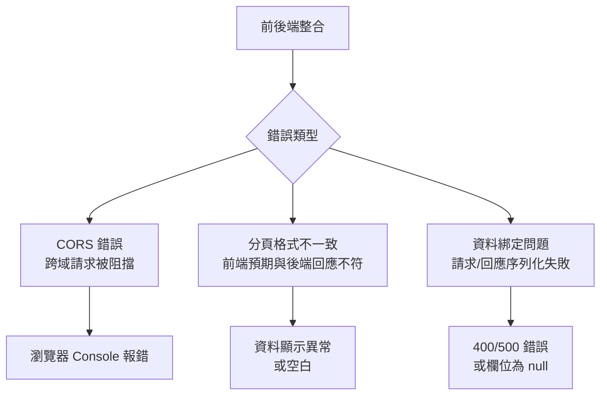
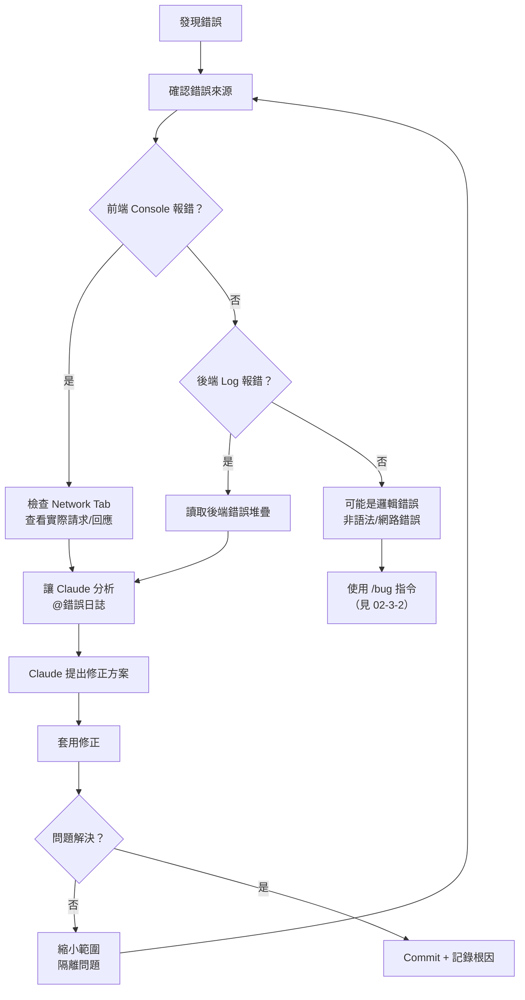

# 02-3-1 常見錯誤排查：CORS、分頁格式與資料綁定誤區

## 1. 本章學習目標

- 學會識別與解決前後端分離開發中最常見的三類錯誤：CORS、分頁格式不一致、資料綁定問題
- 掌握讓 Claude Code 輔助排查這些錯誤的有效 Prompt 策略
- 理解每個錯誤的根因、症狀與標準解決方案
- 建立系統化的除錯思維：從錯誤訊息追溯到根因，而非盲目嘗試

## 2. 適用對象與前置知識

- **適用對象**：正在進行前後端整合開發的全端工程師、遇到跨域或資料格式問題的開發者
- **前置知識**：前後端分離架構（02-1-3、02-2-1）、HTTP 基礎、Spring Boot 基礎
- **關聯章節**：前接 [02-2-4 E2E 測試與 CI](./02-2-4-e2e-tests-and-ci-pipeline.md)，後接 [02-3-2 /bug 指令](./02-3-2-bug-command-debug-context.md)

## 3. 核心概念

### 3.1 前後端整合的常見錯誤地圖



## 4. 錯誤一：CORS（Cross-Origin Resource Sharing）

### 4.1 根因

當前端的 Origin（如 `http://localhost:5173`）與後端的 Origin（如 `http://localhost:8080`）不同時，瀏覽器會基於安全考量阻擋跨域請求。

### 4.2 症狀

瀏覽器 Console 中出現：
```
Access to XMLHttpRequest at 'http://localhost:8080/api/v1/tickets' 
from origin 'http://localhost:5173' has been blocked by CORS policy
```

### 4.3 解決方案

#### Spring Boot 後端設定

```java
@Configuration
public class CorsConfig implements WebMvcConfigurer {
    
    @Override
    public void addCorsMappings(CorsRegistry registry) {
        registry.addMapping("/api/**")
            .allowedOrigins("http://localhost:5173")  // 前端 URL
            .allowedMethods("GET", "POST", "PUT", "PATCH", "DELETE", "OPTIONS")
            .allowedHeaders("*")
            .allowCredentials(true);
    }
}
```

#### 開發環境的快速方案（僅供開發使用）

```java
@CrossOrigin(origins = "http://localhost:5173")
@RestController
@RequestMapping("/api/v1/tickets")
public class TicketController { ... }
```

#### Vite 前端 Proxy 設定（開發環境）

```typescript
// vite.config.ts
export default defineConfig({
  server: {
    proxy: {
      '/api': {
        target: 'http://localhost:8080',
        changeOrigin: true,
      }
    }
  }
});
```

### 4.4 Claude Code 輔助排查

```
前端在呼叫 http://localhost:8080/api/v1/tickets 時出現 CORS 錯誤。
@TicketController.java 是我的後端 Controller，@vite.config.ts 是前端設定。
請分析並提供修正方案。
```

## 5. 錯誤二：分頁格式不一致

### 5.1 根因

後端使用 Spring Data 的 `Page` 物件回傳分頁資料，其 JSON 結構為：
```json
{
  "content": [...],
  "pageable": { ... },
  "totalElements": 42,
  "totalPages": 3,
  "last": false,
  "first": true,
  "size": 20,
  "number": 0,
  "sort": { ... },
  "numberOfElements": 20,
  "empty": false
}
```

但前端可能預期較簡潔的格式（或自訂格式），導致無法正確解析。

### 5.2 症狀

- 前端無法顯示列表資料
- 分頁元件無法正確顯示總頁數
- `response.data.content` 為 `undefined`

### 5.3 解決方案

#### 方案 A：前端對應 Spring Page 格式

```typescript
interface PageResponse<T> {
  content: T[];
  totalElements: number;
  totalPages: number;
  size: number;
  number: number;
  first: boolean;
  last: boolean;
}
```

#### 方案 B：後端自訂分頁回應格式

```java
// 建立統一的分頁回應 DTO
public record PagedResponse<T>(
    List<T> data,
    int page,
    int size,
    long totalElements,
    int totalPages
) {
    public static <T> PagedResponse<T> from(Page<T> page) {
        return new PagedResponse<>(
            page.getContent(),
            page.getNumber(),
            page.getSize(),
            page.getTotalElements(),
            page.getTotalPages()
        );
    }
}
```

### 5.4 Claude Code 輔助排查

```
後端 API 回傳的資料格式如下：
[貼上實際的 API 回應 JSON]

前端的型別定義在 @frontend/src/types/index.ts。
資料無法正確顯示。請分析格式不一致之處並提供修正方案。
```

## 6. 錯誤三：資料綁定問題

### 6.1 常見子類型

| 子類型 | 症狀 | 常見原因 |
|--------|------|---------|
| 請求 Body 無法綁定 | 400 Bad Request | JSON 欄位名稱與 Java 欄位不匹配 |
| 回應序列化失敗 | 500 Internal Server Error | JPA 雙向關聯導致無限遞迴 |
| 日期格式錯誤 | 400 或日期顯示異常 | 前後端日期格式不一致 |
| Enum 轉換失敗 | 400 Bad Request | 前端傳送的 Enum 值與後端定義不符 |

### 6.2 解決方案

#### JSON 欄位名稱匹配

```java
// 後端 DTO
public record TicketCreateRequest(
    @JsonProperty("title")      // 明確指定 JSON 欄位名稱
    @NotBlank
    String title,
    
    @JsonProperty("description")
    @NotBlank
    String description,
    
    @JsonProperty("priority")
    Priority priority
) {}
```

#### JPA 雙向關聯的序列化

```java
// 在不需要序列化的一端加上 @JsonIgnore
@Entity
public class Ticket {
    // ...
    
    @OneToMany(mappedBy = "ticket")
    @JsonIgnore  // 防止序列化 Comment 時又序列化回 Ticket
    private List<Comment> comments;
}
```

更好的做法是使用 DTO 隔離，完全不在 API 回應中包含 Entity 的雙向關聯。

#### 日期格式統一

```yaml
# application.yml
spring:
  jackson:
    date-format: yyyy-MM-dd'T'HH:mm:ss'Z'
    time-zone: UTC
    serialization:
      write-dates-as-timestamps: false
```

### 6.3 Claude Code 輔助排查

```
呼叫 POST /api/v1/tickets 時收到 400 Bad Request。
前端送出的 JSON 如下：
{"title": "測試", "description": "說明", "priority": "HIGH"}

後端 DTO 定義在 @TicketCreateRequest.java。
請分析為何請求無法綁定。
```

## 7. 系統化除錯流程



## 8. 常見錯誤與排查方式（除錯時的誤區）

### 錯誤 1：只看前端 Console 不看 Network Tab

**症狀**：花很多時間檢查前端程式碼，但問題在於後端回應的格式不對。

**修正**：養成習慣——先看 Network Tab 中的實際請求與回應，再判斷是前端問題還是後端問題。

### 錯誤 2：CORS 設定過於寬鬆

**症狀**：為了解決 CORS 問題，設定 `allowedOrigins("*")` 且 `allowCredentials(true)`（這是不合法的組合，瀏覽器會拒絕）。

**修正**：明確指定允許的 Origin。若有多個環境（開發、測試、正式），使用設定檔管理。

### 錯誤 3：在正式環境使用開發環境的 CORS 設定

**症狀**：開發時為了解決 CORS 使用了 `@CrossOrigin(origins = "*")`，部署到正式環境時忘記移除。

**修正**：CORS 設定應透過設定檔（`application.yml`）管理，不同環境使用不同的設定。

### 錯誤 4：沒有讓 Claude 看到完整的錯誤訊息

**症狀**：給 Claude 的描述太模糊（「API 好像有問題」），Claude 無法準確診斷。

**修正**：提供完整資訊——請求 URL、HTTP 方法、請求 Body、回應 Status Code、回應 Body、後端 Log（若有）。越多資訊，Claude 診斷越準確。

## 9. 最佳實務

1. **建立前後端統一的錯誤回應格式**：讓後端所有錯誤回應使用統一結構（`{ "error": "...", "message": "...", "timestamp": "..." }`），前端只需處理一種錯誤格式
2. **CORS 設定使用設定檔管理**：不要 Hard-code Origin 在 Java 程式碼中。使用 `application-{profile}.yml` 管理不同環境的 CORS 設定
3. **分頁格式在 spec.md 中明確定義**：在撰寫 spec.md 時就定義好分頁的回應格式，避免前後端各自實作後才發現不一致
4. **使用 DTO 隔離 Entity 的序列化問題**：永遠不要直接將 JPA Entity 序列化為 API 回應。DTO 是 API 契約的一部分
5. **讓 Claude 比對前後端的資料格式**：開發完成後，讓 Claude 同時讀取後端 DTO 和前端型別定義，檢查一致性
6. **建立「錯誤排查手冊」**：將團隊常遇到的錯誤（如 CORS、分頁格式）的解決方案記錄在 CLAUDE.md 或 Wiki 中，讓 Claude 能快速參考
7. **除錯時先用 curl 隔離問題**：在懷疑是前端問題之前，先用 `curl` 或 Postman 直接呼叫後端 API，確認後端本身是否正確

## 10. 小結

1. CORS、分頁格式不一致、資料綁定問題是前後端分離開發中最常見的三類錯誤
2. CORS 的解決方案需區分開發環境（Proxy 或 `@CrossOrigin`）與正式環境（設定檔管理）
3. 分頁格式應在 spec.md 階段就明確定義，避免前後端各自實作後才發現不一致
4. 資料綁定問題的核心是確保前後端對欄位名稱、型別、格式的理解一致
5. 系統化除錯流程：先確認錯誤來源（前端/後端/網路）→ 收集完整資訊 → 讓 Claude 分析 → 套用修正 → 驗證

## 11. 延伸練習

### 練習一：模擬除錯實作（操作型）
1. 在你的專案中，故意製造以下三個錯誤：
   - 移除 CORS 設定
   - 修改後端分頁回應格式（與前端不一致）
   - 修改 DTO 的 `@JsonProperty` 使欄位名稱不匹配
2. 使用 Claude Code 來診斷並修正這些錯誤
3. 記錄 Claude 診斷每個問題所需的資訊量與準確度
4. 反思：哪些資訊你一開始沒提供，導致 Claude 診斷失敗？

### 練習二：錯誤預防策略設計（思考型）
1. 設計一份團隊的「前後端整合檢查清單」，在 PR 階段使用
2. 哪些自動化檢查可以防止 CORS、分頁格式、資料綁定問題？（如 OpenAPI Schema 驗證、TypeScript 型別檢查）
3. 如何利用 Claude Code 的 Hooks 機制，在程式碼變更時自動檢查前後端一致性？
4. 在什麼情況下，即使所有自動化檢查都通過，前後端整合仍可能失敗？

## 12. 查核來源與版本備註

本章內容尚未完成即時官方文件查核，正式發布前應重新比對官方最新文件。

- 本章內容依據以下資料核實：
  - 來源 1：Spring Boot CORS 官方文件
  - 來源 2：Spring Data JPA 分頁文件
  - 來源 3：Jackson 序列化文件
  - 來源 4：MDN CORS 文件（https://developer.mozilla.org/en-US/docs/Web/HTTP/CORS）
- 查核日期：2026-06-05（教材撰寫日期，尚未完成最終官方查核）
- 版本備註：本章以 Spring Boot 3.2、Jackson 2.16、Vite 5 為基準
- 若使用者環境與本文不同，請優先依官方最新文件與實際環境調整
