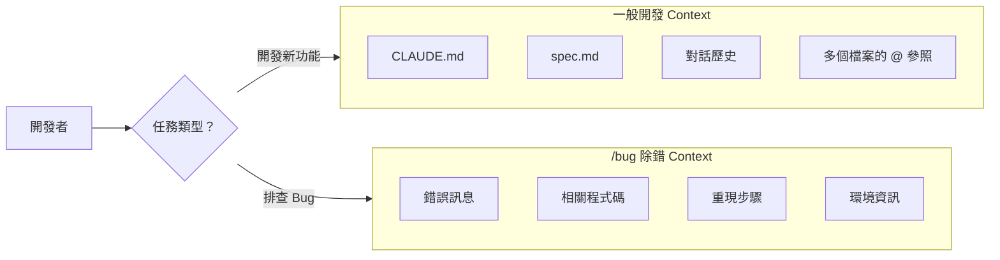

# 02-3-2 /bug 指令：切出專門除錯上下文，聚焦問題核心

## 1. 本章學習目標

- 理解 `/bug` 指令的設計目的與使用時機
- 學會使用 `/bug` 切換到專門的除錯模式，隔離問題上下文
- 掌握如何向 Claude 提供有效的除錯資訊（錯誤訊息、重現步驟、環境資訊）
- 理解除錯上下文與正常開發上下文的隔離價值
- 建立「遇到 Bug 先切 /bug」的除錯習慣

## 2. 適用對象與前置知識

- **適用對象**：遇到難以解決的 Bug 的開發者、需要系統化除錯方法的工程師
- **前置知識**：基本 Claude Code 操作（01-1-2）、常見錯誤類型（02-3-1）、Git 基本操作
- **關聯章節**：前接 [02-3-1 常見錯誤排查](./02-3-1-debugging-cors-pagination-binding.md)，後接 [02-3-3 /rewind 與 /compact](./02-3-3-rewind-compact-context-management.md)

## 3. 核心概念

### 3.1 為什麼需要專門的除錯上下文？

在正常的 Claude Code 對話中，Context 包含：
- CLAUDE.md（專案設定）
- spec.md（規格文件）
- 對話歷史（之前的討論、決策、程式碼變更）
- `@` 參照的檔案

這些資訊對「開發新功能」是寶貴的，但對「排查 Bug」可能是**噪音**。例如：
- 你之前討論了架構設計，但 Bug 只是一個簡單的 NullPointerException
- Claude 可能會被上下文中的架構討論「帶偏」，過度分析而非聚焦在實際錯誤

`/bug` 指令的價值：**創造一個乾淨、專注的空間來處理單一問題**。



### 3.2 /bug 與正常模式的差異

| 維度 | 正常模式 | /bug 模式 |
|------|---------|----------|
| Context 範圍 | 完整（CLAUDE.md + 對話歷史 + 專案知識） | 聚焦（錯誤相關資訊） |
| Claude 的行為 | 傾向產生新程式碼 | 傾向分析與診斷 |
| 建議的檔案引用 | 大量 `@` 參照 | 只引用錯誤相關檔案 |
| 適合場景 | 功能開發、重構、Review | Bug 排查、效能問題、異常行為 |

> **建議查核**：`/bug` 指令的具體行為與 Context 管理方式以 Claude Code 最新版本為準。

## 4. 實務情境

**情境**：大仁在開發 Ticket 系統時，遇到一個神秘的 Bug——`TicketService.createTicket` 在某些情況下會拋出 `NullPointerException`，但錯誤訊息不明確。他已經在正常對話中問過 Claude，但 Claude 的建議太廣泛（建議他重構整個 Service）。

大仁決定使用 `/bug` 指令，提供精確的錯誤資訊，讓 Claude 聚焦在這個特定問題上。

## 5. 操作步驟

### 5.1 收集除錯資訊

在使用 `/bug` 之前，收集以下資訊：

1. **錯誤訊息**：完整的 Stack Trace
2. **重現步驟**：最小化的重現步驟（1-2-3 步驟）
3. **相關程式碼**：出錯的檔案與方法
4. **環境資訊**：Java 版本、Spring Boot 版本、資料庫狀態
5. **已嘗試的修正**：你已經試過什麼（避免 Claude 重複建議）

### 5.2 啟動 /bug 模式

在 Claude Code 中：

```
/bug
```

### 5.3 提供除錯資訊

```
我遇到以下問題：

## 錯誤訊息
java.lang.NullPointerException
    at com.example.ticketsystem.service.TicketService.createTicket(TicketService.java:42)
    at com.example.ticketsystem.controller.TicketController.createTicket(TicketController.java:30)
    ...

## 重現步驟
1. 呼叫 POST /api/v1/tickets
2. Request Body: {"title": "測試", "priority": "HIGH"}
3. 注意：description 欄位未提供（選填？）

## 環境
- Spring Boot 3.2
- Java 17
- PostgreSQL 15

## 已嘗試
- 確認資料庫連線正常
- 確認 User 已存在（reporterId = 1）

請協助分析根因。
```

### 5.4 Claude 的除錯回應

在 `/bug` 模式下，Claude 的回應通常更有結構：

1. **根因分析**：指出錯誤發生的確切原因
2. **程式碼定位**：指出需要修改的具體行號
3. **修正方案**：提供一個聚焦的修正（而非大範圍重構）
4. **預防建議**：如何避免類似問題再次發生

### 5.5 退出 /bug 模式

修正完成後：

```
/clear
```

回到正常開發模式，或繼續使用 `/bug` 排查下一個問題。

## 6. 指令與範例

### 有效的除錯 Prompt 範本

```
/bug

## 問題描述
[一句話描述]

## 錯誤訊息
[完整的錯誤訊息或 Stack Trace]

## 重現步驟
1. [步驟 1]
2. [步驟 2]
3. [步驟 3]

## 相關程式碼
@[出錯的檔案]

## 環境
- [OS、Runtime、Framework 版本]

## 已嘗試的修正
- [試過什麼，結果如何]

請分析根因並提供修正方案。
```

### 多種除錯場景

#### 效能問題
```
/bug
GET /api/v1/tickets?page=0&size=20 回應時間超過 5 秒。
資料庫約有 10,000 筆 Ticket。
請分析 @TicketRepository.java 和 @TicketService.java，找出效能瓶頸。
```

#### 偶發性 Bug
```
/bug
大約每 20 次請求中，有 1 次 POST /api/v1/tickets 回傳 500。
錯誤訊息：[貼上]。這個 Bug 很難重現。
請分析可能的原因（如 Race Condition、資料庫鎖定）。
```

#### 回歸 Bug
```
/bug
昨天還正常的功能今天壞了。最近的變更在 git diff HEAD~5..HEAD 中。
請分析是哪個 Commit 引入了這個 Bug。
```

## 7. 常見錯誤與排查方式

### 錯誤 1：在 /bug 模式中提供過多不相關資訊

**原因**：擔心資訊不足，把所有能想到的資訊都丟給 Claude。

**症狀**：Claude 的回應過於發散，分析了不相關的可能性。

**修正**：聚焦。只提供與錯誤直接相關的資訊。Stack Trace + 出錯的程式碼 + 重現步驟 = 80% 的 Bug 都能被診斷。

### 錯誤 2：在 /bug 模式中要求 Claude 重構

**原因**：排查 Bug 時發現程式碼品質不佳，順便要求重構。

**症狀**：Claude 的回應從「修正 Bug」變成「重構整個模組」，失去了 `/bug` 的聚焦優勢。

**修正**：先修 Bug（用 `/bug`），再重構（回到正常模式）。不要混在一起。

### 錯誤 3：未提供已嘗試的修正

**原因**：想讓 Claude「從零開始分析」。

**症狀**：Claude 建議了你已經試過且無效的方案，浪費時間與 Token。

**修正**：在「已嘗試的修正」區塊列出你已經做過的事情。這不僅節省時間，也幫助 Claude 排除不可能的原因。

### 錯誤 4：在 /bug 模式中讓 Claude 執行終端機指令

**原因**：想讓 Claude 直接跑測試來重現 Bug。

**症狀**：`/bug` 模式可能限制 Claude 的操作權限（依版本而異），Claude 回覆無法執行。

**修正**：你手動執行測試，將結果貼給 Claude。或先確認 `/bug` 模式下的權限範圍。

## 8. 最佳實務

1. **遇到 Bug 先 `/clear` 再 `/bug`**：先清理正常開發的上下文，再切換到除錯模式。避免舊對話干擾診斷
2. **一個 `/bug` Session 只處理一個 Bug**：不要在一次 `/bug` 中列出多個不相關的問題。每個 Bug 開獨立的 `/bug` Session
3. **提供 Stack Trace，不是你的解讀**：不要說「好像是 NullPointerException」，而是貼完整的 Stack Trace。你的解讀可能誤導 Claude
4. **最小化重現步驟**：如果你能將重現步驟從 10 步簡化為 3 步，Claude 的診斷速度會快很多。這過程本身也幫助你理解問題
5. **記錄 `/bug` 的診斷結果**：每次 `/bug` 的結論（根因 + 修正）記錄在 Commit Message 或 Issue Comment 中。這些記錄是團隊的知識資產，也是未來 Claude 的參考資料
6. **如果 `/bug` 三次仍無法解決**：表示問題可能超出 Claude 的能力範圍，或需要更深層的領域知識。此時應該：
   - 與同事討論（Pair Debugging）
   - 縮小問題範圍（用 `git bisect` 定位引入 Bug 的 Commit）
   - 查閱官方文件或社群
7. **`/bug` 不僅用於程式碼錯誤**：也可用於設定問題（「為什麼 CI 一直失敗」）、效能問題（「為什麼這個查詢很慢」）、環境問題（「為什麼在本機正常但在 CI 失敗」）

## 9. 安全性、權限與成本注意事項

### 安全性
- 在 `/bug` 中貼 Stack Trace 時，確認 Stack Trace 中不包含敏感資訊（檔案路徑中的使用者名稱、內部伺服器名稱等）
- 不要在 `/bug` 中貼完整的資料庫連線字串（含密碼）

### 權限
- `/bug` 模式下的權限可能與正常模式不同（依 Claude Code 版本而定）。確認 Claude 能否執行你需要的操作（如讀取特定檔案）

### 成本
- `/bug` Session 通常比正常開發 Session 短（聚焦在單一問題），Token 消耗較低
- 但若 Bug 難以診斷，可能需要多次互動。設定合理的嘗試次數上限
- `/bug` 的初始 Prompt 應包含足夠資訊（Stack Trace + 程式碼），減少後續的來回追問

## 10. 小結

1. `/bug` 指令創造一個專注的除錯上下文，隔離正常開發的「噪音」
2. 有效的除錯需要提供：錯誤訊息、重現步驟、相關程式碼、環境資訊、已嘗試的修正
3. 一個 `/bug` Session 只處理一個 Bug——不要混雜多個問題或趁機重構
4. 如果 `/bug` 的診斷不理想，檢查是否提供了足夠精確的資訊，而非模糊描述
5. 記錄每次除錯的根因與修正，建立團隊的除錯知識庫

## 11. 延伸練習

### 練習一：除錯流程實作（操作型）
1. 在你的專案中故意製造一個 Bug（如修改 Service 邏輯引入 NullPointerException）
2. 使用 `/bug` 指令啟動除錯 Session
3. 依照本章的範本提供完整的除錯資訊
4. 觀察 Claude 的診斷過程——它是否準確定位了問題？
5. 記錄整個除錯過程的時間與互動次數
6. 與你正常模式下的除錯經驗對比

### 練習二：團隊除錯流程設計（思考型）
設計一份團隊的「Claude Code 除錯 SOP」：
1. 遇到 Bug 時的第一步是什麼？（讀 Log？重現？問 Claude？）
2. 什麼情況下應該用 `/bug`？什麼情況下不應該？
3. 如何確保除錯過程中不引入新的 Bug？
4. 除錯完成後，如何確保學到的教訓被記錄與分享？
5. 如何在團隊中建立「安全除錯」的文化（不怕犯錯、不怕承認錯誤）？

## 12. 查核來源與版本備註

本章內容尚未完成即時官方文件查核，正式發布前應重新比對官方最新文件。

- 本章內容依據以下資料核實：
  - 來源 1：Anthropic Claude Code 官方文件（/bug 指令說明）
  - 來源 2：一般軟體除錯方法論
- 查核日期：2026-06-05（教材撰寫日期，尚未完成最終官方查核）
- 版本備註：`/bug` 指令的具體行為、Context 隔離方式與權限範圍以 Claude Code 最新版本為準
- 若使用者環境與本文不同，請優先依官方最新文件與實際環境調整
