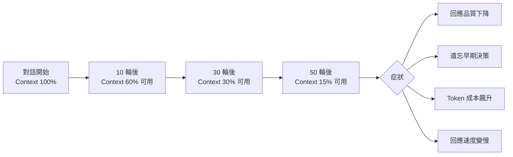
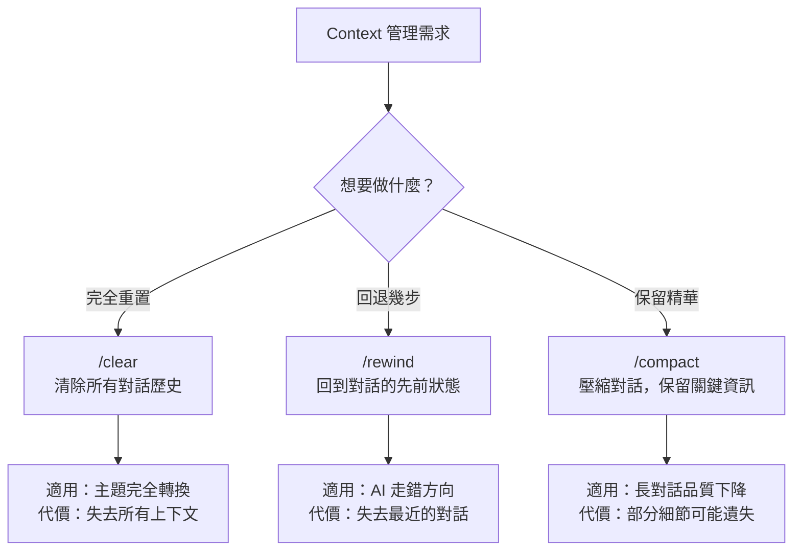

# 02-3-3 /rewind 與 /compact：探索回退與壓縮長對話雜訊

## 1. 本章學習目標

- 理解 Claude Code 對話管理中 Context 膨脹的問題與影響
- 學會使用 `/rewind` 回退到對話的先前狀態
- 學會使用 `/compact` 壓縮長對話，保留關鍵資訊並去除雜訊
- 掌握 `/clear`、`/rewind`、`/compact` 三者的適用場景與差異
- 建立有效的上下文管理習慣，維持 Claude 的回應品質

## 2. 適用對象與前置知識

- **適用對象**：經常與 Claude Code 進行長對話的開發者、遇到 Claude 回應品質下降或成本飆升的工程師
- **前置知識**：基本 Claude Code 操作（01-1-2）、`/clear` 指令（01-1-2）、`/bug` 指令（02-3-2）
- **關聯章節**：前接 [02-3-2 /bug 指令](./02-3-2-bug-command-debug-context.md)，後接 [03-1-1 企業資安情境](./03-1-1-enterprise-security-policy-scenarios.md)

## 3. 核心概念

### 3.1 Context 膨脹的問題

Claude Code 的每次對話都有 Context Window（上下文視窗）限制。當對話越來越長：



### 3.2 三個管理指令的定位



| 指令 | 效果 | 適用時機 | Token 節省 |
|------|------|---------|-----------|
| `/clear` | 完全清除，從零開始 | 主題完全轉換 | 100%（但失去所有上下文） |
| `/rewind` | 回退到先前某個時間點 | AI 走錯方向、想回到決策點 | 取決於回退多少 |
| `/compact` | 壓縮對話，保留摘要 | 長對話品質下降但不想失去上下文 | 50-80%（保留關鍵資訊） |

> **建議查核**：這些指令的具體行為與可用性以 Claude Code 最新版本為準。

## 4. 實務情境

### 情境 1：使用 /rewind

大仁在開發 Ticket 系統時，前 15 輪對話中 Claude 的建議很好。但在第 16 輪，他給了一個不好的 Prompt，導致 Claude 開始往錯誤方向修改程式碼。他使用 `/rewind` 回退到第 15 輪的狀態，重新給出正確的 Prompt。

### 情境 2：使用 /compact

小美與 Claude 進行了 50 輪對話來開發 Comment 功能。她發現 Claude 的回應開始變慢，且偶爾會忘記 20 輪前的決策。她使用 `/compact` 將對話壓縮為精簡摘要，保留了關鍵的設計決策與程式碼結構，去除了來回修正的雜訊。

### 情境 3：使用 /clear

阿傑完成 Ticket CRUD 開發後，要開始開發完全不相關的 Notification 功能。他使用 `/clear` 清除所有上下文，重新開始。

## 5. 操作步驟

### 5.1 使用 /rewind

```
/rewind
```

Claude Code 會顯示可回退的對話節點（依版本而異），你可以選擇回退到哪個時間點。

或直接指定回退步數：
```
/rewind 5
```
（回退 5 輪對話）

### 5.2 使用 /compact

```
/compact
```

Claude 會自動將對話歷史壓縮為精簡摘要，保留：
- 關鍵的設計決策
- 重要的程式碼片段
- 未解決的問題
- 待辦事項

去除：
- 來回的修正嘗試（失敗的）
- 重複的討論
- 不相關的問答

### 5.3 使用 /clear

```
/clear
```

> **警告**：`/clear` 是不可逆的！執行前確認重要內容已保存（Commit、存檔）。

## 6. 指令與範例

### 判斷該用哪個指令

```
# 情況 1：想要完全換主題
/clear
現在我們來討論 Notification 功能的設計。

# 情況 2：AI 最近 3 輪走錯方向
/rewind 3
（回到 3 輪前的狀態，重新給 Prompt）

# 情況 3：對話很長但還在同一個主題
/compact
（壓縮後繼續在同主題上工作）

# 情況 4：對話很長且主題已結束
先 Commit 所有變更
/clear
開始新主題
```

### /compact 前後的對比

**壓縮前（50 輪對話，約 80,000 Token）**：
- 討論了 3 種 API 設計方案，最終選了方案 B
- 嘗試了 5 種錯誤修正，最後一種成功了
- 討論了命名慣例（前後討論了 3 次）

**壓縮後（約 15,000 Token）**：
- API 設計：採用方案 B（RESTful + 分頁）
- 錯誤修正：NullPointerException 在 TicketService:42 行，透過加入 null check 修正
- 命名慣例：DTO 使用 Record，方法使用動詞開頭

## 7. 常見錯誤與排查方式

### 錯誤 1：過早使用 /clear，失去有價值的上下文

**原因**：覺得對話「有點亂」就急著清除。

**症狀**：新對話中 Claude 不理解專案的既有決策，你需要重複解釋。

**修正**：先用 `/compact` 壓縮。如果壓縮後仍不理想，再考慮 `/clear`。在 `/clear` 前，用手動方式記錄關鍵決策（寫在 CLAUDE.md 或 spec.md 中）。

### 錯誤 2：對話已經嚴重偏離，仍不使用 /rewind

**原因**：捨不得失去 Claude 已經產生的程式碼（即使那些程式碼方向錯誤）。

**症狀**：繼續在錯誤的基礎上修正，成本越來越高，品質越來越差。

**修正**：使用 Git 來記錄正確的程式碼（Commit），然後放心使用 `/rewind`。Git 才是你的安全網，不是 Claude 的對話歷史。

### 錯誤 3：誤解 /compact 的能力

**原因**：以為 `/compact` 是魔術，能完美保留所有細節。

**症狀**：壓縮後發現 Claude 遺漏了某個重要的決策細節。

**修正**：`/compact` 是摘要工具，不是備份工具。壓縮後，手動檢查摘要是否遺漏了重要資訊。可以在 `/compact` 之前先對 Claude 說：「以下是我希望壓縮後保留的關鍵決策：1. ... 2. ...」。

### 錯誤 4：使用 /rewind 但忘記 Git 狀態

**原因**：回退了對話，但 Claude 之前已經修改了檔案。

**症狀**：對話回退了，但檔案系統的狀態停留在錯誤的方向。

**修正**：使用 `/rewind` 後，用 `git diff` 檢查檔案狀態。手動還原不需要的變更，或使用 `git checkout -- .` 還原所有檔案。

## 8. 最佳實務

1. **Git Commit 是 Context 管理的最佳夥伴**：每完成一個小型里程碑就 Commit。這樣你可以放心使用 `/clear` 或 `/rewind`，因為程式碼狀態已保存在 Git 中
2. **建立「手動 /compact」習慣**：在長對話中，定期（每 20-30 輪）手動總結關鍵決策：
   ```
   請用 5 點總結目前為止的關鍵設計決策與未解決問題。
   ```
   把這個摘要記錄在 CLAUDE.md 或對話外，作為未來的參考
3. **三指令決策樹**：
   - 需要換主題？→ `/clear`（但先 Commit）
   - 最近幾輪走錯方向？→ `/rewind N`
   - 對話很長但還在同主題？→ `/compact`
4. **在 `/compact` 後立即驗證**：壓縮後，問 Claude 一個你已知答案的問題（關於早期的決策），確認它仍記得。如果不記得，表示壓縮過度，需要手動補充
5. **CLAUDE.md 是跨 Session 的記憶**：重要的、長期有效的決策不應該只存在對話歷史中。將它們寫入 CLAUDE.md，這樣即使 `/clear` 也不會丟失
6. **監控對話長度**：在 Claude Code 中觀察 Token 使用量。當使用量接近 Context Window 的 70-80% 時，主動考慮壓縮或清理
7. **不要害怕 `/clear`**：有時重新開始比在混亂的上下文中掙扎更有效率。只要你的程式碼在 Git 中、關鍵決策在 CLAUDE.md 中，`/clear` 的成本比你預期的低

## 9. 安全性、權限與成本注意事項

### 安全性
- `/compact` 的摘要會保留在對話中。確保摘要不包含剛被移除的敏感資訊
- 使用 `/clear` 清除對話後，確認沒有任何含有敏感資訊的暫存檔遺留

### 權限
- `/rewind` 和 `/compact` 是對話管理指令，不涉及檔案系統權限變更

### 成本
- **Context 膨脹是隱形成本的主要來源**：一個 50 輪的對話，後 25 輪的 Token 消耗可能是前 25 輪的 3 倍（因為每次互動都要載入完整的對話歷史）
- `/compact` 可以顯著降低後續互動的 Token 成本（壓縮比約 3:1 到 5:1）
- `/clear` 後的第一輪互動成本最低，但需要重新載入 CLAUDE.md 和必要的 `@` 參照檔案
- **投資報酬率**：花 2,000 Token 執行 `/compact`，可能節省後續 20,000 Token 的成本

## 10. 小結

1. Context 膨脹是長對話中的隱形殺手——降低品質、增加成本、拖慢速度
2. `/rewind` 讓你回到對話的先前狀態，適合 AI 走錯方向時使用
3. `/compact` 壓縮長對話為精簡摘要，保留關鍵資訊並去除雜訊
4. `/clear` 完全重置對話，適合主題轉換，但使用前務必 Commit 並記錄關鍵決策
5. Git + CLAUDE.md + Context 管理指令 = 完整的對話治理體系

## 11. 延伸練習

### 練習一：Context 管理實作（操作型）
1. 與 Claude Code 進行一段約 30 輪的開發對話（開發一個小功能）
2. 在第 30 輪時，記錄 Claude 的回應品質與速度
3. 執行 `/compact`，觀察壓縮後的摘要是否保留了關鍵資訊
4. 繼續 5 輪對話，觀察 Claude 的回應品質是否有改善
5. 使用 `/rewind 10` 回退到第 20 輪的狀態
6. 用 `git diff` 檢查檔案狀態，手動調整
7. 記錄整個過程中的體驗與學到的教訓

### 練習二：團隊 Context 管理策略設計（思考型）
設計一份團隊的 Claude Code Context 管理策略：
1. 團隊成員何時該使用 `/clear`、`/rewind`、`/compact`？（決策樹）
2. 如何讓 CLAUDE.md 成為跨 Session 的可靠記憶？
3. 如何在不增加過多管理負擔的前提下，讓團隊養成 Context 管理習慣？
4. Context 管理與 Git 工作流如何配合？（例如：Commit 與 `/clear` 的時序關係）
5. 如何監控團隊的 Context 使用效率？（如平均每功能開發的 Token 消耗趨勢）

## 12. 查核來源與版本備註

本章內容尚未完成即時官方文件查核，正式發布前應重新比對官方最新文件。

- 本章內容依據以下資料核實：
  - 來源 1：Anthropic Claude Code 官方文件（/rewind、/compact、/clear 指令說明）
  - 來源 2：一般 AI Context Window 管理概念
- 查核日期：2026-06-05（教材撰寫日期，尚未完成最終官方查核）
- 版本備註：`/rewind` 與 `/compact` 指令的具體行為、可回退的步數、壓縮策略以 Claude Code 最新版本為準
- 若使用者環境與本文不同，請優先依官方最新文件與實際環境調整
