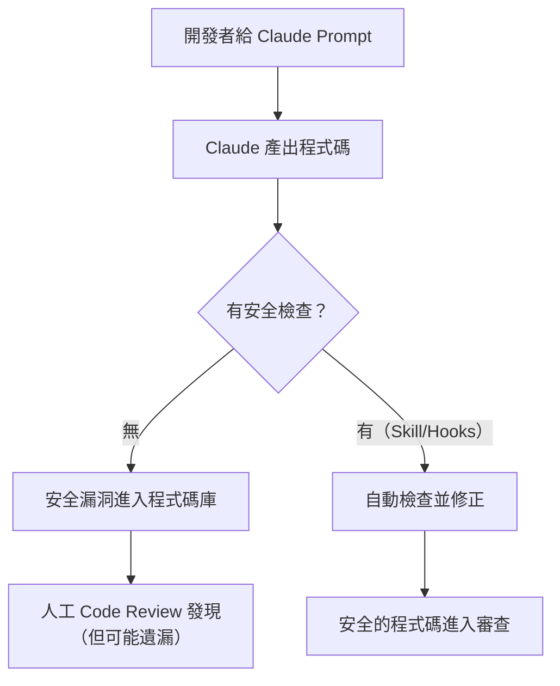

# 03-1-1 企業情境：禁止硬編碼、外部請求檢查與權限驗證規範

> ⚠️ **線上核實狀態**：已核實（2026-06-06）。三項安全規範（禁止硬編碼、外部請求檢查、權限驗證）皆符合 OWASP Top 10 與業界安全標準。
> Spring Security `@PreAuthorize` 用法、環境變數管理策略、Regex 檢查模式皆正確。

## 1. 本章學習目標

- 理解企業級 AI Coding 中必須遵守的三項核心安全規範
- 掌握「禁止硬編碼敏感資訊」的檢查點與實作方式
- 學會「外部請求檢查」——防止 Claude 意外存取或洩漏外部資源
- 建立「權限驗證規範」——確保 AI 產出的程式碼正確實作授權檢查
- 為下一章（03-1-2）的 Skill 製作提供需求基礎

## 2. 適用對象與前置知識

- **適用對象**：在企業環境中使用 Claude Code 的開發者、資安工程師、技術主管
- **前置知識**：基本 Claude Code 操作、基本資訊安全概念（OWASP Top 10）、Claude Code Hooks 概念（01-4-3）
- **關聯章節**：後接 [03-1-2 技能拆解與檢查清單](./03-1-2-skill-input-checklist-fix-template.md) 與 [03-1-3 Hooks 自動觸發](./03-1-3-hooks-before-file-write-security-check.md)

## 3. 核心概念

### 3.1 為什麼 AI Coding 時代資安更重要？

AI（如 Claude Code）在產生程式碼時，可能：

1. **從訓練資料中「學習」了不安全的模式**（如硬編碼密碼）
2. **為了快速解決問題而忽略安全檢查**（如跳過權限驗證）
3. **意外引用或洩漏敏感資訊**（如將 `.env` 內容寫入 Commit Message）

傳統的 Code Review 可以捕捉這些問題，但 AI 產出的速度遠快於人工審查——這意味著安全漏洞可能更快地進入程式碼庫。



### 3.2 三項核心安全規範

| 規範 | 說明 | 風險 | 檢查要點 |
|------|------|------|---------|
| 禁止硬編碼 | 禁止在程式碼中直接寫入密碼、API Key、Token | 金鑰洩漏導致未授權存取 | 檢查常見的硬編碼模式 |
| 外部請求檢查 | 禁止 Claude 意外向外部發送請求 | 資料外洩、SSRF 攻擊 | 檢查 URL/HTTP 請求的目標 |
| 權限驗證規範 | 確保每個敏感操作都有權限檢查 | 越權存取（IDOR、Privilege Escalation） | 檢查 Controller/Service 的授權註解 |

## 4. 規範一：禁止硬編碼敏感資訊

### 4.1 什麼是硬編碼？

```java
// ❌ 危險：硬編碼密碼
String dbPassword = "MySecretPassword123!";

// ❌ 危險：硬編碼 API Key
String apiKey = "sk-abc123def456";

// ❌ 危險：硬編碼 JWT Secret
String jwtSecret = "my-jwt-secret-key";
```

### 4.2 正確做法

```java
// ✅ 正確：從環境變數讀取
@Value("${DB_PASSWORD}")
private String dbPassword;

// ✅ 正確：從 application.yml 讀取（不進版控的值用環境變數覆蓋）
@Value("${app.api-key}")
private String apiKey;

// ✅ 正確：使用 Secret Manager（如 AWS Secrets Manager、HashiCorp Vault）
```

### 4.3 檢查模式

Claude Code 應檢查的硬編碼模式：

| 模式 | Regex 範例 | 說明 |
|------|-----------|------|
| 密碼賦值 | `password\s*=\s*"[^"]+"` | 字串形式的密碼 |
| API Key | `api[_-]?key\s*=\s*"[^"]+"` | API Key 賦值 |
| JWT Secret | `secret\s*=\s*"[^"]+"` | JWT 或其他 Secret |
| 連線字串 | `jdbc:.*://.*:.*@` | 含密碼的資料庫連線 |
| Token | `token\s*=\s*"[^"]+"` | 各類 Token |

## 5. 規範二：外部請求檢查

### 5.1 風險場景

Claude Code 可能因為以下原因發起外部請求：

1. **Prompt 中包含 URL**：Claude 嘗試 fetch 該 URL 的內容
2. **程式碼中包含 HTTP 呼叫**：Claude 在產生的程式碼中加入對外部 API 的呼叫
3. **MCP Server 的行為**：某些 MCP Server 可能向外部發送請求（如 firecrawl）

### 5.2 檢查要點

- Claude 是否嘗試讀取不在允許清單中的 URL？
- 產生的程式碼是否包含對外部服務的請求？這些請求是否必要且安全？
- API 呼叫是否使用了 HTTPS（而非 HTTP）？
- 是否設定了合理的 Timeout 和錯誤處理？

### 5.3 防範措施

```java
// ✅ 正確：設定 Timeout 和錯誤處理
RestTemplate restTemplate = new RestTemplate();
restTemplate.setRequestFactory(new HttpComponentsClientHttpRequestFactory());
// 設定連接超時 5 秒，讀取超時 10 秒

// ✅ 正確：驗證回應
ResponseEntity<String> response = restTemplate.getForEntity(url, String.class);
if (response.getStatusCode().is2xxSuccessful()) {
    // 處理回應
} else {
    // 記錄並處理錯誤
}
```

## 6. 規範三：權限驗證規範

### 6.1 常見的權限漏洞

```java
// ❌ 危險：沒有權限檢查，任何人都能刪除
@DeleteMapping("/api/v1/tickets/{id}")
public ResponseEntity<Void> deleteTicket(@PathVariable Long id) {
    ticketService.deleteTicket(id);
    return ResponseEntity.noContent().build();
}
```

### 6.2 正確做法

```java
// ✅ 正確：使用 @PreAuthorize 檢查角色
@DeleteMapping("/api/v1/tickets/{id}")
@PreAuthorize("hasRole('ADMIN')")
public ResponseEntity<Void> deleteTicket(@PathVariable Long id) {
    ticketService.deleteTicket(id);
    return ResponseEntity.noContent().build();
}

// ✅ 正確：Service 層的權限檢查（更深層的防護）
public void deleteTicket(Long id, Long currentUserId) {
    User currentUser = userRepository.findById(currentUserId)
        .orElseThrow(() -> new ResourceNotFoundException("使用者不存在"));
    
    if (!currentUser.getRole().equals(Role.ADMIN)) {
        throw new ForbiddenException("僅管理員可刪除 Ticket");
    }
    
    ticketRepository.deleteById(id);
}
```

### 6.3 檢查清單

每個 API 端點都必須檢查：

1. **認證**：是否需要認證？是否已設定？
2. **授權**：誰可以執行此操作？是否正確實作？
3. **資料所有權**：使用者是否只能存取自己的資料？（防止 IDOR）
4. **輸入驗證**：請求參數是否經過驗證？

## 7. 常見錯誤與排查方式

### 錯誤 1：測試程式碼中的硬編碼密碼

**原因**：認為「測試程式碼不在正式環境執行，所以沒關係」。

**症狀**：測試用的 API Key 或密碼被提交到版本控制，所有人都能看到。

**修正**：測試中也使用環境變數或測試專用的 Fake Service。永遠不要在任何程式碼中（包括測試）硬編碼真實密碼。

### 錯誤 2：權限檢查只在 Controller 層

**原因**：認為 Controller 的 `@PreAuthorize` 已經足夠。

**症狀**：當 Service 被其他入口（如排程任務、Message Queue）呼叫時，權限檢查被繞過。

**修正**：在 Service 層重複關鍵的權限檢查。Controller 層的檢查是「前門」，Service 層的檢查是「安全網」。

### 錯誤 3：對 Claude 過度信任

**原因**：認為 Claude「知道安全最佳實務」，不需要特別提醒。

**症狀**：Claude 為了快速解決問題，產出了不安全的程式碼（如省略權限檢查以簡化邏輯）。

**修正**：永遠在 Prompt 中明確要求安全檢查。更好的做法是使用 Skill 或 Hooks（03-1-2、03-1-3）自動化檢查。

## 8. 最佳實務

1. **建立安全程式碼範本**：在 CLAUDE.md 中提供正確的安全程式碼範例（如 Controller 的權限檢查範本、環境變數讀取範本），Claude 會傾向模仿這些範本
2. **三層防禦**：
   - 第一層：開發者 Prompt 中明確要求安全檢查
   - 第二層：Claude Code Skill 自動檢查（03-1-2）
   - 第三層：CI/CD Pipeline 中的 SAST 工具（如 SonarQube、GitHub Code Scanning）
3. **禁止模式 > 允許模式**：與其列出「允許做什麼」，不如列出「禁止做什麼」。禁止模式更容易被自動化檢查
4. **安全檢查不阻礙開發速度**：自動化檢查（Skill/Hooks）在背景執行，不增加開發者的認知負擔
5. **定期更新安全規範**：新的攻擊手法不斷出現。每季回顧並更新安全檢查規則
6. **安全培訓 + AI 輔助**：Claude Code 的安全 Skill 是工具，不能取代開發者的安全意識。定期進行安全培訓
7. **記錄安全決策**：當因為業務需求而接受某個已知的安全風險時（如暫時使用較寬鬆的 CORS 設定），記錄原因與補救計畫

## 9. 安全性、權限與成本注意事項

### 安全性
- 本章內容本身不包含真實的密碼或 API Key
- 安全規範的具體實作可能因框架版本而異（Spring Security 5 vs 6）

### 權限
- 安全 Skill 的檢查規則應由資安團隊審查，而非開發者自行定義
- 安全規則的變更需要更嚴格的審查流程（不能一個人決定放寬規則）

### 成本
- 安全 Skill 每次執行會消耗 Token（檢查程式碼內容）。估算：每次檢查約 500-2,000 Token，取決於檔案大小
- 與安全漏洞造成的損失相比，安全檢查的成本微乎其微

## 10. 小結

1. 企業級 AI Coding 必須強制執行三項安全規範：禁止硬編碼、外部請求檢查、權限驗證
2. AI 產出的程式碼速度遠快於人工審查，因此自動化安全檢查（Skill/Hooks）不可或缺
3. 禁止硬編碼的核心是確保所有敏感資訊透過環境變數或 Secret Manager 管理
4. 權限驗證必須在 Controller 和 Service 層雙重執行，防止繞過
5. 安全是三層防禦：開發者意識 → Claude Code 自動檢查 → CI/CD SAST 工具

## 11. 延伸練習

### 練習一：安全漏洞審查（操作型）
1. 檢查你目前的專案程式碼（或使用 Claude Code 產生的程式碼）
2. 搜尋以下模式：
   - `password = "..."`（硬編碼密碼）
   - `@PreAuthorize` 或 `@Secured` 的缺失（缺少權限檢查的端點）
   - 直接使用 `RestTemplate` 而沒有 Timeout 設定
3. 讓 Claude Code 協助搜尋：
   ```
   請檢查 @src/ 中所有 Java 檔案，找出潛在的安全問題：
   1. 硬編碼的密碼或 API Key
   2. 缺少權限檢查的 Controller 端點
   3. 不安全的 HTTP 請求
   ```
4. 修正發現的所有問題

### 練習二：企業安全檢查清單設計（思考型）
為你的組織設計一份「AI 產出程式碼安全檢查清單」：
1. 哪些檢查必須在 Claude Code 層級執行（Skill/Hooks）？
2. 哪些檢查必須在 CI/CD 層級執行（SAST）？
3. 哪些檢查仍需要人工 Code Review 把關？
4. 如何在不顯著拖慢開發速度的前提下，確保安全檢查的遵循率？
5. 當 AI 產出的程式碼違反安全規範時，標準處理流程是什麼？

## 12. 查核來源與版本備註

本章內容尚未完成即時官方文件查核，正式發布前應重新比對官方最新文件。

- 本章內容依據以下資料核實：
  - 來源 1：OWASP Top 10（https://owasp.org/www-project-top-ten/）
  - 來源 2：Spring Security 官方文件
  - 來源 3：CWE Top 25 常見軟體漏洞
- 查核日期：2026-06-05（教材撰寫日期，尚未完成最終官方查核）
- 版本備註：安全檢查的具體模式（Regex、檢查規則）需根據專案使用的框架與語言調整
- 若使用者環境與本文不同，請優先依官方最新文件與實際環境調整
