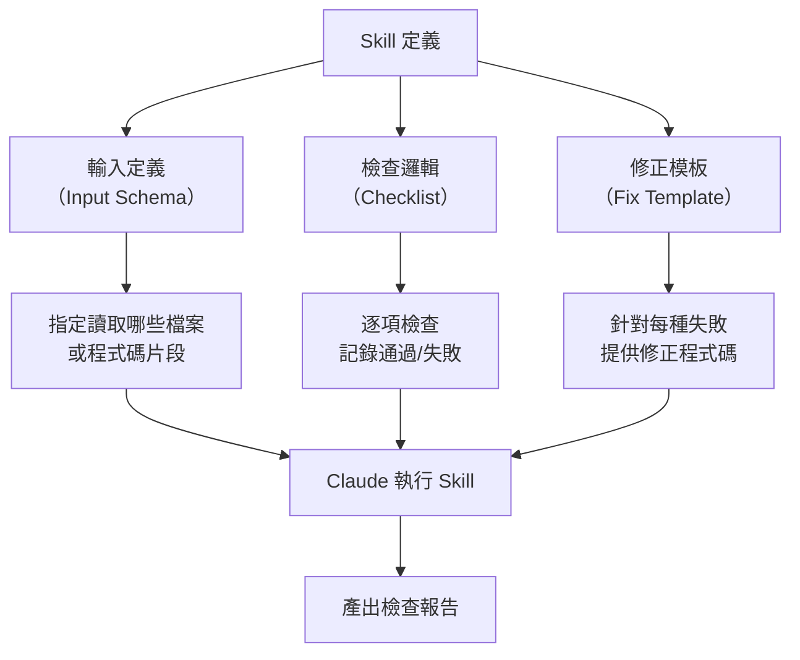

# 03-1-2 技能拆解：定義輸入、檢查清單與建議修正模板

## 1. 本章學習目標

- 學會將企業安全規範（03-1-1）拆解為可被 Claude Code Skill 執行的檢查單元
- 掌握 Skill 的結構化設計：輸入定義 → 檢查清單 → 修正模板
- 理解如何讓 Skill 產出機器可讀的檢查報告與人類可讀的修正建議
- 學會使用 Claude Code 的 skill-creator 工具來建立自訂 Skill
- 建立可複用、可維護的 Skill 設計思維

## 2. 適用對象與前置知識

- **適用對象**：需要建立自訂 Claude Code Skill 的開發者、資安工程師、DevOps 工程師
- **前置知識**：企業安全規範（03-1-1）、Claude Code CLAUDE.md 設定（01-4-3）、基本 YAML/Markdown 語法
- **關聯章節**：前接 [03-1-1 企業資安情境](./03-1-1-enterprise-security-policy-scenarios.md)，後接 [03-1-3 Hooks 自動觸發](./03-1-3-hooks-before-file-write-security-check.md)

## 3. 核心概念

### 3.1 什麼是 Claude Code Skill？

Skill 是 Claude Code 中的可複用能力模組。它可以被視為「給 Claude 的專業訓練手冊」——當 Claude 執行特定任務時，Skill 提供：

1. **Context**：這個任務的背景知識
2. **檢查清單**：需要檢查哪些項目
3. **範例**：正確與錯誤的範例
4. **輸出格式**：檢查結果應該如何呈現



### 3.2 Skill 設計的三層結構

| 層級 | 說明 | 範例 |
|------|------|------|
| 輸入定義 | Skill 需要什麼資訊才能運作 | 要檢查的檔案路徑、程式碼語言 |
| 檢查清單 | 逐項檢查的規則與判斷標準 | 「檢查是否有 password = \" 的模式」 |
| 修正模板 | 當檢查失敗時，如何修正 | 「將密碼改為從環境變數讀取」 |

> **建議查核**：Claude Code 的 Skill 建立方式（skill-creator 工具或手動撰寫）以官方最新文件為準。

## 4. 實務情境

**情境**：我們要建立一個「企業資安規範檢查 Skill」，命名為 `security-check`。當 Claude 準備寫入 Java 檔案時，這個 Skill 會自動檢查三項安全規範（03-1-1）。

## 5. 操作步驟

### 5.1 定義 Skill 的輸入

```yaml
# Skill 輸入定義
input:
  - name: target_files
    type: file_list
    description: 要檢查的 Java 檔案清單
    required: true
  
  - name: check_level
    type: enum
    values: [quick, full]
    description: 檢查深度（quick=僅檢查明顯問題，full=深度分析）
    default: full
  
  - name: report_format
    type: enum
    values: [markdown, json]
    description: 報告輸出格式
    default: markdown
```

### 5.2 定義檢查清單

```markdown
# 企業資安規範檢查清單

## 檢查 1：禁止硬編碼敏感資訊

### 1.1 密碼與 Secret
- [ ] 檢查是否有 `password = "..."` 模式（雙引號內有內容）
- [ ] 檢查是否有 `secret = "..."` 模式
- [ ] 檢查是否有 `apiKey = "..."` 或 `api_key = "..."` 模式
- [ ] 檢查是否有 `token = "..."` 模式
- [ ] 檢查是否有資料庫連線字串包含明文密碼

### 1.2 環境變數使用
- [ ] 敏感設定是否使用 `@Value("${...}")` 或環境變數
- [ ] 是否有 `.env` 或 `application-prod.yml` 被意外引用

## 檢查 2：外部請求檢查

### 2.1 HTTP 請求
- [ ] 檢查是否有對非信任 URL 的 HTTP 請求
- [ ] 檢查是否使用 HTTPS（而非 HTTP）
- [ ] 檢查是否設定了連接 Timeout
- [ ] 檢查是否有 SSRF（Server-Side Request Forgery）風險

### 2.2 檔案操作
- [ ] 檢查是否有不受控的檔案路徑（Path Traversal 風險）
- [ ] 檔案上傳是否驗證了檔案類型與大小

## 檢查 3：權限驗證規範

### 3.1 Controller 層
- [ ] 每個 CUD（Create/Update/Delete）端點是否有 `@PreAuthorize`
- [ ] 每個端點的授權規則是否與 spec.md 中的定義一致
- [ ] 是否從 SecurityContext 取得使用者（而非從請求參數）

### 3.2 Service 層
- [ ] 敏感操作是否有重複的權限檢查（深度防禦）
- [ ] 是否防止 IDOR（使用者只能存取自己的資料）

## 檢查 4：其他安全考量

### 4.1 輸入驗證
- [ ] 所有 Controller 的 Request Body 是否使用 `@Valid`
- [ ] DTO 中的欄位是否有適當的 Validation 註解

### 4.2 輸出編碼
- [ ] API 回應中的使用者輸入是否經過適當的編碼（防止 XSS）
```

### 5.3 定義修正模板

~~~~markdown
# 修正模板

## 模板 1：硬編碼密碼 → 環境變數

### 原始（不安全）
```java
private String dbPassword = "MySecret123!";
```

### 修正後
```java
@Value("${DB_PASSWORD}")
private String dbPassword;
```

並在 application.yml 中：
```yaml
spring:
  datasource:
    password: ${DB_PASSWORD}
```

## 模板 2：缺少權限檢查 → 加入授權

### 原始（不安全）
```java
@DeleteMapping("/api/v1/tickets/{id}")
public ResponseEntity<Void> deleteTicket(@PathVariable Long id) {
```

### 修正後
```java
@DeleteMapping("/api/v1/tickets/{id}")
@PreAuthorize("hasRole('ADMIN')")
public ResponseEntity<Void> deleteTicket(@PathVariable Long id) {
```

## 模板 3：不安全的 HTTP 請求 → 加入安全設定

### 原始（不安全）
```java
RestTemplate restTemplate = new RestTemplate();
String result = restTemplate.getForObject(url, String.class);
```

### 修正後
```java
RestTemplate restTemplate = new RestTemplate();
// 設定 Timeout
restTemplate.setRequestFactory(clientHttpRequestFactory());
// 驗證 URL 是否在允許清單中
if (!isAllowedUrl(url)) {
    throw new SecurityException("不允許的外部請求: " + url);
}
String result = restTemplate.getForObject(url, String.class);
```

## 模板 4：缺少輸入驗證 → 加入 @Valid

### 原始（不安全）
```java
@PostMapping("/api/v1/tickets")
public ResponseEntity<TicketDto> createTicket(@RequestBody TicketCreateRequest request) {
```

### 修正後
```java
@PostMapping("/api/v1/tickets")
public ResponseEntity<TicketDto> createTicket(@Valid @RequestBody TicketCreateRequest request) {
```
~~~~

### 5.4 使用 skill-creator 建立 Skill

> **建議查核**：以下步驟以 Claude Code 官方 skill-creator 文件為準。

```
請使用 skill-creator 建立一個名為「security-check」的 Skill。

Skill 描述：檢查 Java Spring Boot 程式碼是否符合企業安全規範。
檢查項目包含：硬編碼敏感資訊、外部請求安全、權限驗證、輸入驗證。

輸入：要檢查的 Java 檔案路徑
輸出：Markdown 格式的檢查報告，包含通過/失敗項目與修正建議

請讀取 @03-1-1-enterprise-security-policy-scenarios.md 作為安全規範的參考。
```

## 6. 指令與範例

### Skill 的使用方式

```
請使用 security-check Skill 檢查以下檔案：
@TicketController.java
@TicketService.java
@SecurityConfig.java
```

Claude 會產出類似以下的報告：

~~~~markdown
# 安全檢查報告

檢查時間：2026-06-05 14:30 UTC
檢查檔案：3 個 Java 檔案

## 摘要
- 總檢查項目：15
- 通過：12
- 失敗：3
- 通過率：80%

## 失敗項目

### ❌ TicketService.java:42 — 硬編碼 API Key
```java
private String apiKey = "sk-abc123";
```
**風險**：API Key 洩漏可能導致未授權存取
**修正**：改用 `@Value("${API_KEY}")` 讀取環境變數

### ❌ TicketController.java:30 — 缺少權限檢查
```java
@DeleteMapping("/api/v1/tickets/{id}")
```
**風險**：任何認證使用者都能刪除 Ticket
**修正**：加上 `@PreAuthorize("hasRole('ADMIN')")`

### ❌ SecurityConfig.java:15 — 過於寬鬆的 CORS
```java
.allowedOrigins("*")
```
**風險**：允許任何網站跨域請求
**修正**：明確指定允許的 Origin
~~~~

## 7. 常見錯誤與排查方式

### 錯誤 1：檢查清單過於寬鬆，漏掉重要安全問題

**原因**：檢查規則只涵蓋了最明顯的模式（如 `password = "..."`），但遺漏了變體（如 `pwd = "..."`、`passwd = "..."`）。

**症狀**：Skill 報告「全部通過」，但實際上程式碼中仍有安全漏洞。

**修正**：持續更新檢查規則。每次發現 Skill 漏掉的安全問題，就將該模式加入檢查清單。

### 錯誤 2：修正模板過於死板，不適用所有情境

**原因**：修正模板假設所有情況都一樣，但實際上有例外。

**症狀**：Claude 提出的修正建議不適用（例如建議刪除某個必要的測試用假資料）。

**修正**：在修正模板中加入「適用條件」與「例外情況」。例如：「若此檔案為測試程式碼，且使用測試專用的 Fake Key，則標註為可接受的例外。」

### 錯誤 3：Skill 報告太長，開發者不願意閱讀

**原因**：Skill 對每個通過的項目都輸出詳細說明。

**症狀**：報告長達數頁，開發者直接忽略。

**修正**：報告預設只顯示失敗項目。通過項目以統計摘要呈現。提供 `--verbose` 選項來顯示完整報告。

### 錯誤 4：誤把 Skill 當作唯一的安全防線

**原因**：認為有 Skill 檢查就萬無一失。

**症狀**：不再進行人工安全審查，或移除了 CI/CD 中的 SAST 工具。

**修正**：Skill 是輔助工具，不是替代品。安全檢查應該多層次——Skill（Claude 層級）+ SAST（CI 層級）+ 人工審查（PR 層級）。

## 8. 最佳實務

1. **Skill 的檢查規則應該由資安專家定義**：開發者不應該自行定義什麼是「安全」。檢查規則應由資安團隊審查並簽署
2. **檢查清單要具體、可驗證**：不好的規則：「確保程式碼安全」；好的規則：「檢查是否有 `password = \"[^\"]+\"` 的字串賦值」
3. **修正模板要附上「為什麼」**：不僅告訴開發者「怎麼修正」，還要解釋「為什麼這是安全問題」與「不修正的後果」
4. **Skill 的輸出要機器可讀**：提供 JSON 格式的輸出選項，方便 CI/CD Pipeline 解析與統計
5. **定期更新 Skill**：安全威脅不斷演進。每季回顧並更新 Skill 的檢查規則與修正模板
6. **建立 Skill 的測試案例**：為 Skill 建立「已知有漏洞的程式碼」和「已知安全的程式碼」作為測試案例，確保 Skill 能正確辨識
7. **Skill 失敗不阻擋開發，但要有可見性**：Skill 的檢查結果應該被記錄，但不應該阻擋開發者 Commit（那是 CI/CD 的工作）。讓開發者在 Push 前就能看到安全問題，自主修正

## 9. 安全性、權限與成本注意事項

### 安全性
- Skill 本身是設定檔/描述檔，不應包含真實的密碼或 API Key
- Skill 的檢查規則可能被惡意修改（放寬規則以隱藏安全問題）。Skill 檔案應納入 Code Review

### 權限
- 誰有權限修改 Skill？建議只有資安團隊或 Tech Lead
- Skill 的變更需要經過資安審查（不能一個人決定放寬安全檢查）

### 成本
- Skill 執行一次約消耗 1,000-3,000 Token（視檔案大小與檢查項目數量）
- 若每個 PR 都觸發 Skill 檢查，成本需要納入考量。可設定只在特定檔案類型（如 Java、YAML）變更時觸發

## 10. 小結

1. Claude Code Skill 是可複用的能力模組，結構包含：輸入定義、檢查清單、修正模板
2. 企業安全 Skill 的核心價值是將安全規範轉化為自動化、可重複的檢查流程
3. 檢查清單必須具體、可驗證；修正模板必須附上「為什麼」
4. Skill 是安全防線的一環，不能取代 CI/CD 的 SAST 或人工安全審查
5. Skill 需要定期更新，以應對新的安全威脅與框架變更

## 11. 延伸練習

### 練習一：建立自訂 Skill（操作型）
1. 使用 skill-creator 或手動方式，建立一個 `security-check` Skill
2. 實作至少 5 條檢查規則（涵蓋硬編碼、權限、輸入驗證）
3. 為每條規則定義對應的修正模板
4. 使用該 Skill 檢查你的專案程式碼
5. 根據檢查結果，修正發現的安全問題
6. 反思：哪些問題是 Skill 發現的？哪些問題是 Skill 遺漏的？

### 練習二：Skill 治理策略設計（思考型）
如果你在一個 50 人的開發團隊中推廣 Claude Code Skill：
1. 誰應該負責建立與維護 Skill？（中央團隊？各 Squad 自行管理？）
2. Skill 的品質如何把關？（誰來審查 Skill 的正確性？）
3. 如何避免 Skill 過多導致的「檢查疲勞」？
4. Skill 的執行結果如何與現有的開發流程（PR Review、CI/CD）整合？
5. 如何衡量 Skill 的投資報酬率（ROI）？

## 12. 查核來源與版本備註

本章內容尚未完成即時官方文件查核，正式發布前應重新比對官方最新文件。

- 本章內容依據以下資料核實：
  - 來源 1：Anthropic Claude Code 官方文件（Skill 建立與 skill-creator 工具）
  - 來源 2：OWASP Top 10 與 CWE Top 25
  - 來源 3：Spring Security 官方文件
- 查核日期：2026-06-05（教材撰寫日期，尚未完成最終官方查核）
- 版本備註：Skill 的建立方式（skill-creator 工具或手動 YAML/Markdown）以 Claude Code 最新版本為準
- 若使用者環境與本文不同，請優先依官方最新文件與實際環境調整
