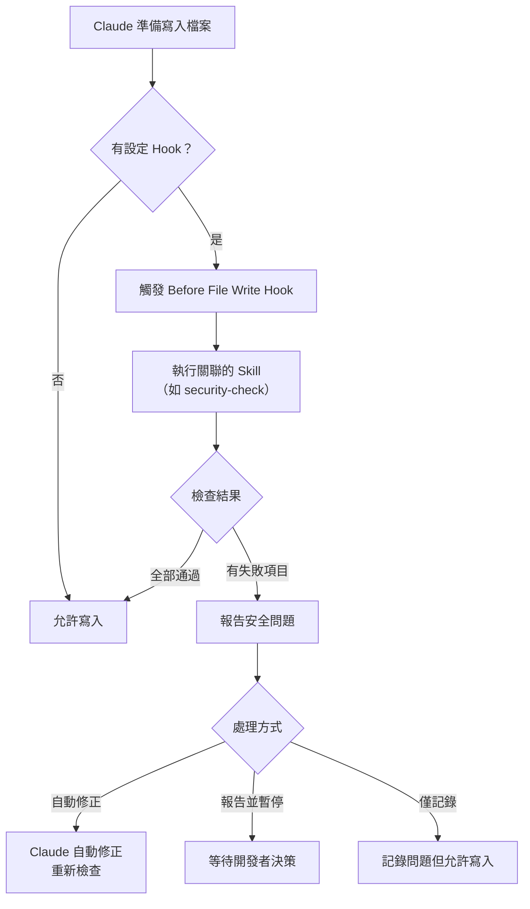

# 03-1-3 Hooks 應用：在寫入檔案前自動觸發資安檢查

## 1. 本章學習目標

- 理解 Claude Code Hooks 機制的事件驅動模型
- 學會設定「寫入檔案前」的 Hook，自動觸發安全檢查
- 掌握 Hooks 與 Skill 的整合方式：Hook 負責觸發，Skill 負責檢查
- 理解 Hooks 的限制與適用場景
- 建立自動化安全檢查的完整工作流：Hook → Skill → 報告 → 修正

## 2. 適用對象與前置知識

- **適用對象**：需要在 Claude Code 中建立自動化安全檢查的開發者、DevOps 工程師、資安工程師
- **前置知識**：Claude Code Hooks 概念（01-4-3）、Skill 設計（03-1-2）、企業安全規範（03-1-1）
- **關聯章節**：前接 [03-1-2 技能拆解](./03-1-2-skill-input-checklist-fix-template.md)，後接 [03-2-1 firecrawl](./03-2-1-firecrawl-docs-api-research.md)

## 3. 核心概念

### 3.1 Hooks 的事件驅動模型

Hooks 讓 Claude Code 在特定事件發生時自動執行特定動作。最常用的事件是「寫入檔案前」（Before File Write）。



### 3.2 Hook 的定位

| 維度 | Hook | Skill | CI/CD SAST |
|------|------|-------|-----------|
| 執行時機 | Claude 寫入檔案前 | 被 Hook 或開發者觸發 | Push/PR 時 |
| 執行位置 | Claude Code 內部 | Claude Code 內部 | CI Server |
| 延遲 | 即時（寫入前） | 即時（被呼叫時） | 數分鐘 |
| 阻擋能力 | 可阻止寫入 | 僅報告 | 可阻止 Merge |

## 4. 實務情境

**情境**：我們在 CLAUDE.md 中設定一個 Hook——當 Claude 準備寫入任何 `.java` 檔案時，自動觸發 `security-check` Skill 進行安全檢查。如果檢查發現硬編碼密碼，Hook 阻止寫入並提醒開發者修正。

## 5. 操作步驟

### 5.1 在 CLAUDE.md 中設定 Hook

```markdown
# CLAUDE.md

## Hooks

### Before File Write — Java 檔案安全檢查

觸發條件：當 Claude 準備寫入 `*.java` 檔案時

執行動作：
1. 呼叫 security-check Skill，檢查該檔案
2. 若檢查通過（無安全問題），允許寫入
3. 若檢查發現「硬編碼密碼或 API Key」，阻止寫入並報告
4. 若檢查發現「缺少權限檢查」，報告但允許寫入（記錄為待辦）
5. 若檢查發現其他問題，報告並詢問開發者

例外：
- `*Test.java`（測試檔案）：僅檢查硬編碼密碼，其餘規則放寬
- `*Config.java`（設定檔）：檢查硬編碼密碼與不安全的預設值

### Before File Write — 設定檔安全檢查

觸發條件：當 Claude 準備寫入 `application*.yml` 或 `*.properties` 時

執行動作：
1. 檢查是否包含明文密碼
2. 檢查是否使用環境變數佔位符（`${...}`）
3. 若有明文密碼，阻止寫入並建議使用環境變數
```

### 5.2 Hook 的實際運作範例

#### 情境 A：Hook 阻止寫入

~~~~
開發者：請為 TicketService 加上資料庫備份功能
Claude：（準備寫入 TicketService.java）

--- Hook 觸發 ---
security-check 檢查中...
❌ 發現硬編碼密碼：String dbPassword = "admin123";
--- Hook 報告 ---

Claude：⚠️ 在寫入檔案前，安全檢查發現以下問題：

TicketService.java:42 — 硬編碼資料庫密碼
```java
String dbPassword = "admin123";
```

此寫入已被阻止。建議修正為：
```java
@Value("${DB_PASSWORD}")
private String dbPassword;
```

是否要我改用環境變數後重新寫入？
~~~~

#### 情境 B：Hook 報告但允許寫入

```
Claude：⚠️ 安全檢查發現以下待辦項目（已寫入檔案）：

TicketController.java:55 — 缺少 @PreAuthorize
建議在後續 Commit 中補上權限檢查。
```

### 5.3 驗證 Hook 是否正確運作

```
請測試 security-check Hook：嘗試寫入一個包含硬編碼密碼的 Java 檔案。
確認 Hook 是否正確阻止寫入。
```

## 6. 指令與範例

### Hook 設定範本

```markdown
## Hooks

### [Hook 名稱]

**觸發條件**：
- 事件：[Before File Write / After File Write / On Conversation Start]
- 檔案模式：[glob pattern，如 *.java]

**執行動作**：
1. [步驟 1]
2. [步驟 2]

**處理方式**：
- [通過時的行為]
- [失敗時的行為]

**例外**：
- [何時不觸發此 Hook]
```

### 多個 Hook 的優先級

```markdown
## Hooks

### 1. 安全檢查（優先級：高）
觸發條件：*.java
行為：阻止寫入（若發現硬編碼）

### 2. 程式碼風格檢查（優先級：中）
觸發條件：*.java
行為：報告但不阻止

### 3. 文件更新提醒（優先級：低）
觸發條件：*.java
行為：提醒更新 spec.md（若 API 有變更）
```

### Hook 與 Skill 的整合

```
# Prompt 範例：讓 Claude 建立 Hook + Skill 整合

請在 CLAUDE.md 中設定一個 Before File Write Hook：
- 當寫入 Java 檔案時，自動呼叫 security-check Skill
- 若 Skill 回報「硬編碼密碼」，阻止寫入
- 若 Skill 回報「缺少權限檢查」，報告但允許寫入
- 測試檔案（*Test.java）放寬檢查規則
```

## 7. 常見錯誤與排查方式

### 錯誤 1：Hook 過於嚴格，影響開發效率

**原因**：為了安全，設定了過多的阻止規則。

**症狀**：開發者頻繁被 Hook 阻止，開始尋找繞過 Hook 的方法（如暫時移除 Hook 設定）。

**修正**：區分「必須阻止」（硬編碼密碼）與「報告即可」（缺少 Javadoc）。只有最高風險的問題才阻止寫入。

### 錯誤 2：Hook 的例外規則不夠完善

**原因**：未考慮測試程式碼、設定檔、Script 等特殊場景。

**症狀**：Hook 阻止了合理的程式碼（如測試中的假密碼）。

**修正**：為不同檔案類型設定不同的檢查規則。測試程式碼放寬硬編碼檢查（測試假資料不視為安全漏洞）。

### 錯誤 3：Hook 執行時間過長

**原因**：Hook 中設定了過多的檢查項目，或檢查了過大的檔案。

**症狀**：每次寫入檔案都要等待數秒，開發者感到煩躁。

**修正**：
- 限制檢查的檔案大小（如跳過超過 1000 行的檔案）
- 優先執行高風險檢查（硬編碼密碼），低風險檢查（如命名慣例）可設為非同步
- 使用增量檢查——只檢查新增或修改的行，而非整個檔案

### 錯誤 4：開發者關閉 Hook 後忘記重新啟用

**原因**：為了快速完成某個任務，暫時關閉 Hook，但忘記重新啟用。

**症狀**：失去安全保護，直到下次安全事件才發現。

**修正**：
- Hook 的開關狀態應該被記錄（在 CLAUDE.md 的 Git History 中可見）
- CI/CD 中的安全檢查是最後的安全網——即使 Hook 被關閉，CI 仍會檢查
- 建立團隊規範：關閉 Hook 需要在 Commit Message 中說明原因

## 8. 最佳實務

1. **Hook 的阻擋分級**：
   - 🔴 必須阻止：硬編碼密碼、API Key、Token
   - 🟡 報告並詢問：缺少權限檢查、SQL Injection 風險
   - 🟢 僅記錄：命名慣例、缺少 Javadoc
2. **Hook 失敗要有清晰的回饋**：不要只說「檢查失敗」。必須說明：哪一行、什麼問題、為什麼是問題、如何修正
3. **例外規則要明確**：與其事後手動處理大量例外，不如在 Hook 設定中就定義好例外規則
4. **Hook 與 Skill 分離**：Hook 只負責「何時觸發」，Skill 負責「檢查什麼」。這樣的職責分離讓兩者可以獨立維護
5. **測試 Hook 的正確性**：為 Hook 建立測試案例（故意寫入不安全程式碼，確認 Hook 阻止）
6. **Hook 不是唯一的防線**：開發者可能繞過 Hook（使用不同編輯器、直接修改檔案）。CI/CD 中的安全檢查是必要的最終防線
7. **定期審查 Hook 的有效性**：每月回顧 Hook 的觸發記錄，分析：哪些規則是有效的？哪些造成太多誤報？哪些安全問題 Hook 沒抓到？

## 9. 安全性、權限與成本注意事項

### 安全性
- Hook 設定檔案本身（CLAUDE.md）可能包含安全規則。確保 Hook 設定不會暴露安全檢查的盲點
- Hook 的安全規則應由資安團隊審查，不能由開發者自行放寬

### 權限
- CLAUDE.md 的變更需要 PR Review。特別是 Hook 區塊的變更，需要資安團隊的批准
- 誰有權限關閉 Hook？建議只有 Tech Lead，且需要記錄原因

### 成本
- 每次 Hook 觸發都會消耗 Token（執行 Skill 檢查）。估算：每次約 500-2,000 Token
- 如果每次寫入小檔案都觸發完整的 Skill 檢查，成本可能高於預期。考慮「快速掃描」模式（只執行高風險檢查）與「完整檢查」模式
- 與安全事件造成的損失相比，Hook 的 Token 成本通常可以忽略

## 10. 小結

1. Hooks 是 Claude Code 的事件驅動機制，最常用的「Before File Write」可在寫入檔案前自動觸發檢查
2. Hook 與 Skill 的最佳分工：Hook 負責「何時觸發」，Skill 負責「檢查什麼」
3. 安全 Hook 的阻擋應分級——最高風險（硬編碼密碼）阻止寫入，較低風險報告即可
4. Hook 是安全防線的第一層（即時），CI/CD 是最終防線（不可繞過）
5. Hook 的設定需要例外規則、清晰的回饋、定期的審查與更新

## 11. 延伸練習

### 練習一：Hook 設定實作（操作型）
1. 在 CLAUDE.md 中設定一個 Before File Write Hook
2. 讓該 Hook 在寫入 Java 檔案時觸發安全檢查（引用 03-1-2 定義的檢查清單）
3. 測試以下情境：
   - 寫入一個包含硬編碼密碼的程式碼 → 確認 Hook 阻止
   - 寫入一個安全的程式碼 → 確認 Hook 允許
   - 寫入一個測試檔案（*Test.java）→ 確認例外規則生效
4. 記錄 Hook 的執行時間與 Token 消耗

### 練習二：企業級 Hook 治理策略（思考型）
為企業設計一套 Claude Code Hook 治理策略：
1. 哪些 Hook 應該是全域的（所有專案強制執行）？哪些是專案特定的？
2. Hook 的例外申請流程是什麼？
3. 如何監控 Hook 的執行情況（觸發次數、阻止次數、誤報率）？
4. Hook 與 CI/CD Pipeline 的安全檢查如何分工與互補？
5. 如何處理 Hook 的「緊急繞過」情境（如 Production Hotfix 需要暫時關閉檢查）？

## 12. 查核來源與版本備註

本章內容尚未完成即時官方文件查核，正式發布前應重新比對官方最新文件。

- 本章內容依據以下資料核實：
  - 來源 1：Anthropic Claude Code 官方文件（Hooks 機制說明）
  - 來源 2：一般軟體安全開發最佳實務
- 查核日期：2026-06-05（教材撰寫日期，尚未完成最終官方查核）
- 版本備註：Hooks 的觸發事件、設定格式與執行行為以 Claude Code 最新版本為準。Hooks 機制可能隨版本更新而變化
- 若使用者環境與本文不同，請優先依官方最新文件與實際環境調整
