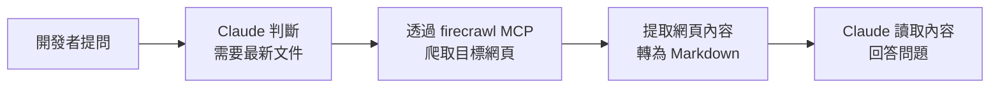

# 03-2-1 外部資料補充：firecrawl 爬取最新文件與 API

## 1. 本章學習目標

- 理解 firecrawl MCP Server 的用途與運作原理
- 學會在 Claude Code 中設定與使用 firecrawl 來爬取網頁文件
- 掌握如何讓 Claude 自動查詢最新官方文件，而非依賴訓練資料中的過時資訊
- 理解何時該用 firecrawl、何時不該用（成本、合法性、必要性）
- 建立「先查最新文件，再寫程式碼」的 AI 開發習慣

## 2. 適用對象與前置知識

- **適用對象**：需要參考最新 API 文件或第三方文件的開發者
- **前置知識**：Claude Code MCP 設定（01-4-3）、基本 HTTP 與網頁概念
- **關聯章節**：後接 [03-2-2 docx/pdf 處理](./03-2-2-docx-pdf-summary-and-report-generation.md)

## 3. 核心概念

### 3.1 AI 的知識時效性問題

Claude 的訓練資料有截止日期。當你問 Claude 關於某個 Library 的最新 API 用法時，它可能基於舊版本文檔回答。firecrawl 解決了這個問題——讓 Claude 能即時爬取最新官方文件。

### 3.2 firecrawl 的運作模式



## 4. 操作步驟

### 4.1 在 CLAUDE.md 中宣告 firecrawl MCP

```json
{
  "mcpServers": {
    "firecrawl": {
      "command": "npx",
      "args": ["-y", "@anthropic/mcp-server-firecrawl"],
      "description": "網頁爬取 MCP Server，用於查詢最新 API 文件"
    }
  }
}
```

### 4.2 使用 firecrawl 查詢文件

```
Spring Boot 3.3 的 @PreAuthorize 有新增什麼用法嗎？
請先用 firecrawl 查詢 Spring Security 最新官方文件，再回答。
```

### 4.3 使用時的注意事項

- 僅爬取公開的官方文件網站
- 遵守目標網站的 robots.txt
- 不要用 firecrawl 爬取需要認證的頁面
- 注意 API 使用量與成本

## 5. 常見錯誤與最佳實務

### 常見錯誤
1. **過度依賴 firecrawl**：每次問問題都先爬取，浪費時間與資源
2. **爬取非官方來源**：爬取了過時或錯誤的第三方部落格
3. **未指定爬取範圍**：爬取了整個網站而非特定頁面

### 最佳實務
1. 先用 Claude 的既有知識，不確定時才用 firecrawl
2. 指定爬取範圍（特定 URL 或頁面）
3. 將爬取結果記錄在對話中，供後續參考
4. 遵守 robots.txt 與網站使用條款

## 6. 小結

firecrawl 是 Claude Code 的「即時查詢工具」，解決 AI 訓練資料時效性問題。應在需要最新文件時使用，而非每次提問都爬取。

## 7. 延伸練習

1. 查詢一個你常用的 Library 最新版本的新功能
2. 使用 firecrawl 爬取官方文件，與 Claude 的既有知識對比

## 8. 查核來源與版本備註

- 來源：firecrawl 官方文件、Anthropic MCP Server 文件
- 查核日期：2026-06-05（尚未最終查核）
- 版本備註：firecrawl MCP 的可用性與設定以官方最新文件為準
