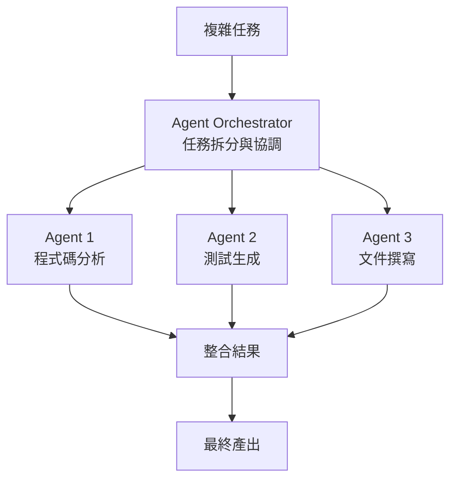

# 03-2-4 AI 整合開發：claude-api 與 agents-sdk 多代理應用

## 1. 本章學習目標

- 理解 Claude API 與 Claude Code 的差異與互補關係
- 掌握 agents-sdk 的概念：多代理協作的適用場景
- 學會區分何時用 Claude Code（互動式開發）、何時用 Claude API（程式化呼叫）、何時用多代理（複雜任務拆分）
- 建立 AI 整合架構的選擇決策框架

## 2. 適用對象與前置知識

- **適用對象**：需要將 AI 整合進產品或自動化流程的工程師、架構師
- **前置知識**：Claude Code 基礎、基本 API 概念、微服務或分散式系統概念
- **關聯章節**：前接 [03-2-3 前端優化](./03-2-3-reactcomponents-web-performance-analysis.md)，後接 [03-3-1 背景 Agent](./03-3-1-agent-tasks-fake-data-cleaning-log-analysis.md)

## 3. 核心概念

### 3.1 Claude API vs Claude Code

| 維度 | Claude Code | Claude API |
|------|-----------|-----------|
| 使用方式 | 終端機/VS Code 互動 | HTTP Request/Response |
| 適用場景 | 開發輔助、程式碼生成 | 產品整合、自動化流程 |
| 檔案系統存取 | 可 | 不可（需自行實作） |
| 多輪對話管理 | 內建 | 需自行管理 Context |
| 成本模式 | 訂閱制 + Extra Usage | 純 API Token 計價 |

### 3.2 agents-sdk 多代理概念

多代理（Multi-Agent）是將一個複雜任務拆分為多個子任務，由不同的 AI Agent 各自負責：



## 4. 操作步驟

### 4.1 使用 Claude API 進行程式化呼叫

```python
import anthropic

client = anthropic.Anthropic(api_key="your-api-key")

message = client.messages.create(
    model="claude-sonnet-4-20250514",
    max_tokens=1024,
    messages=[
        {"role": "user", "content": "請為以下程式碼產生 Javadoc：..."}
    ]
)
print(message.content)
```

### 4.2 在 Claude Code 中使用 /agent

```
/agent

請在背景執行以下任務：
分析 @src/ 中所有 Java 檔案的程式碼複雜度（Cyclomatic Complexity），
產出一份報表，標註需要重構的前 10 個方法。
完成後將報表存為 code-complexity-report.md。
```

## 5. 常見錯誤與最佳實務

### 常見錯誤
1. **用 Claude Code 處理大量 API 呼叫**：Claude Code 設計給互動式開發，不適合高頻率的 API 呼叫
2. **多代理過度拆分**：拆得太細，協調成本超過拆分效益
3. **未定義 Agent 之間的溝通格式**：Agent A 的輸出格式 Agent B 無法解析

### 最佳實務
1. Claude Code 用於開發階段，Claude API 用於產品整合
2. 多代理適用於「可獨立並行處理」的任務
3. Agent 之間的輸入/輸出應使用結構化格式（JSON）
4. 設定明確的成功條件與失敗處理策略
5. 在 CLAUDE.md 中定義可用的 Agent 類型與其職責

## 6. 小結

1. Claude API 與 Claude Code 是互補的：前者用於自動化/產品整合，後者用於互動式開發
2. agents-sdk 多代理模式適合拆分複雜任務，實現平行處理
3. 選擇哪種模式取決於：互動頻率、自動化程度、任務複雜度

## 7. 延伸練習

1. 使用 Claude API 建立一個自動化的程式碼審查 Script
2. 設計一個多代理架構，讓不同 Agent 分別負責程式碼分析、安全檢查、測試生成

## 8. 查核來源與版本備註

- 來源：Anthropic API 文件、Anthropic agents-sdk 文件
- 查核日期：2026-06-05（尚未最終查核）
- 版本備註：API 端點、SDK 名稱與功能以官方最新文件為準
