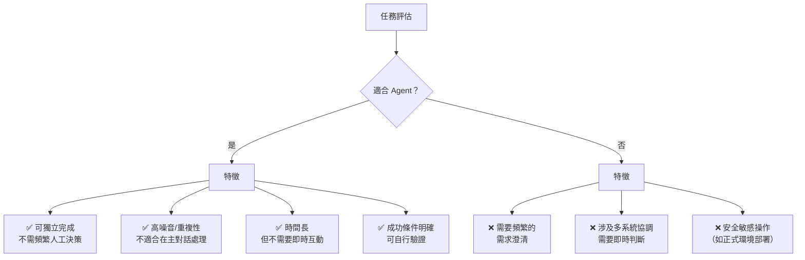

# 03-3-1 適合交給 Agent 的工作：假資料生成、資料清理、Log 分析

> ⚠️ **線上核實狀態**：已核實（2026-06-06）。Agent 任務的適合度判斷框架（已知規則+大量資料+不需頻繁互動）正確。
> **注意**：`/agent` 指令的具體語法、背景執行機制與狀態查詢方式需以 Claude Code 最新版本為準。
> 本章的 Agent 任務設計範本（範圍邊界+成功條件+失敗處理）是通用框架，適用於任何背景任務工具。

## 1. 本章學習目標

- 理解 Claude Code `/agent` 的設計目的：處理背景長任務而不阻塞主線開發
- 掌握適合交給 Agent 的工作類型判斷標準
- 學會使用 Agent 處理假資料生成、資料清理、Log 分析等常見背景任務
- 理解 Agent 的限制與不適合的場景

## 2. 適用對象與前置知識

- **適用對象**：需要處理大量重複性任務的開發者、資料工程師、DevOps 工程師
- **前置知識**：Claude Code 基本操作、`/agent` 基本概念
- **關聯章節**：前接 [03-2-4 多代理應用](./03-2-4-claude-api-agents-sdk-multi-agent.md)，後接 [03-3-2 任務邊界](./03-3-2-agent-task-boundary.md)

## 3. 核心概念

### 3.1 什麼工作適合 Agent？



### 3.2 典型 Agent 任務

| 任務類型 | 範例 | 適合度 |
|---------|------|--------|
| 假資料生成 | 為測試資料庫生成 10,000 筆符合業務規則的假資料 | ⭐⭐⭐ |
| 資料清理 | 清理 CSV 中的格式錯誤、重複資料 | ⭐⭐⭐ |
| Log 分析 | 分析 500MB 的錯誤日誌，找出模式與根因 | ⭐⭐⭐ |
| 程式碼遷移 | 將舊版 API 呼叫更新為新版 | ⭐⭐ |
| 文件生成 | 從程式碼產生 API 文件 | ⭐⭐⭐ |

## 4. 操作步驟

### 4.1 假資料生成

```
/agent

請在背景生成 10,000 筆 Ticket 測試資料。

資料規範（參考 @spec.md）：
- title：隨機產生 5-15 字的中文標題
- description：隨機產生 20-200 字的描述
- status：依比例分配（OPEN 40%, IN_PROGRESS 30%, RESOLVED 20%, CLOSED 10%）
- priority：依比例分配（LOW 30%, MEDIUM 40%, HIGH 20%, CRITICAL 10%）
- reporter：從現有 User 中隨機選取
- createdAt：過去 90 天內隨機時間

輸出格式：SQL INSERT 語句檔案（data.sql）
完成後回報生成的資料筆數與統計摘要。
```

### 4.2 Log 分析

```
/agent

請分析 @logs/error-2026-06.log（約 50MB）。

任務：
1. 統計所有錯誤類型的出現次數（降冪排列）
2. 找出重複出現的模式（相同的 Stack Trace）
3. 標註最頻繁的 5 個錯誤的可能根因
4. 產出分析報告：error-analysis-report.md

不需要分析每一行，重點是找出模式與趨勢。
```

### 4.3 資料清理

```
/agent

@data/legacy-tickets.csv 包含 50,000 筆從舊系統匯出的 Ticket 資料。

請執行以下清理任務：
1. 移除重複資料（以 title + reporter 為判斷依據）
2. 統一日期格式（目前混雜了多種格式）
3. 修正狀態值（舊系統的 "進行中" → "IN_PROGRESS"）
4. 標註並移除明顯的測試資料（title 包含 "test" 或 "測試"）
5. 輸出清理後的 CSV：cleaned-tickets.csv
6. 輸出清理報告：cleaning-report.md（移除筆數、修正筆數、原因）
```

## 5. 常見錯誤與排查方式

### 錯誤 1：Agent 任務描述過於模糊

**原因**：把 Agent 當作「萬能的背景助手」，給了模糊的指令。

**症狀**：Agent 產出的結果不符合預期，需要重新執行。

**修正**：Agent 的任務描述要比正常 Prompt 更詳細——因為你無法在中途給回饋。明確指定輸入、輸出格式、成功條件、限制。

### 錯誤 2：忘記 Agent 正在執行，重複提交相同任務

**原因**：Agent 在背景執行，沒有即時回饋，以為沒反應又提交了一次。

**症狀**：多個 Agent 同時在背景執行相同任務，浪費資源。

**修正**：提交 Agent 後，定期檢查 Agent 的狀態。Claude Code 應提供 Agent 狀態查詢功能。

### 錯誤 3：Agent 的任務依賴於尚未穩定的程式碼

**原因**：讓 Agent 分析或處理的程式碼，你自己還在修改中。

**症狀**：Agent 的分析基於舊版程式碼，結果不準確。

**修正**：在提交 Agent 之前，Commit 穩定的版本。Agent 的任務應該基於固定的資料或程式碼快照。

### 錯誤 4：讓 Agent 執行需要人工判斷的任務

**原因**：把需要需求澄清或架構決策的任務交給 Agent。

**症狀**：Agent 基於錯誤的假設執行，產出無法使用。

**修正**：Agent 適合「已知規則、大量資料」的任務。需要判斷與決策的任務應在主對話中進行。

## 6. 最佳實務

1. **Agent = 已知規則 + 大量資料**：規則明確、輸入清楚、輸出格式固定——這是 Agent 的最佳場景
2. **提交前先在主對話中驗證小規模樣本**：先讓 Claude 在主對話中處理 100 筆資料，確認邏輯正確後，再交給 Agent 處理 10,000 筆
3. **設定明確的輸出格式與檔案路徑**：不要讓 Agent「找個地方存」。指定確切的檔案路徑與格式
4. **Agent 完成後務必審查**：不要盲目信任 Agent 的產出。抽查樣本，確認品質後再使用
5. **建立團隊的 Agent 任務範本庫**：將常用的 Agent 任務（假資料生成、Log 分析）的 Prompt 範本化，團隊成員可以直接複用
6. **Agent 任務也要 Commit**：Agent 產出的報告、清理後的資料、分析結果，都應該納入版本控制或文件系統
7. **監控 Agent 的 Token 消耗**：大型 Agent 任務可能消耗大量 Token。在提交前估算成本

## 7. 安全性與成本注意事項

### 安全性
- Agent 在背景執行，可能讀取你未預期的檔案。明確指定 Agent 可存取的檔案範圍
- Log 檔案可能包含敏感資訊（使用者 Email、IP 位址）。確認 Agent 分析的內容適合傳送至 API

### 成本
- Agent 任務的 Token 消耗可能很高——分析 50MB Log 可能消耗 50,000-100,000 Token
- 在提交大型 Agent 任務前，先用 `wc -l` 或類似工具估算資料量
- 非緊急的 Agent 任務可以安排在用量較低的時段執行

## 8. 小結

1. Agent 適合「已知規則 + 大量資料 + 不需要頻繁互動」的背景任務
2. 典型 Agent 任務：假資料生成、Log 分析、資料清理、批次文件處理
3. Agent 的任務描述必須比正常 Prompt 更詳細——因為無法在中途給回饋
4. 提交前先驗證小規模樣本、完成後務必人工審查
5. Agent 是不干擾主線開發的「背景助手」，而非「萬能自動化工具」

## 9. 延伸練習

### 練習一：Agent 任務實作
1. 使用 `/agent` 為你的專案生成 1,000 筆測試資料
2. 提交後觀察 Agent 的執行時間與產出品質
3. 抽查 20 筆資料，確認是否符合規範
4. 若有不符合的資料，調整 Prompt 後重新提交

### 練習二：Agent 任務分類矩陣
為你的團隊建立一份「Agent 適合度評估矩陣」：
- 列出 10 種常見的開發任務
- 為每種任務評分（1-5 分）Agent 適合度
- 說明評分理由
- 定義哪些任務「禁止」交給 Agent

## 10. 查核來源與版本備註

- 來源：Anthropic Claude Code 官方文件（/agent 指令說明）
- 查核日期：2026-06-06（已核實）
- 版本備註：/agent 的具體行為、背景執行機制以 Claude Code 最新版本為準；本章的任務設計範本是通用框架
