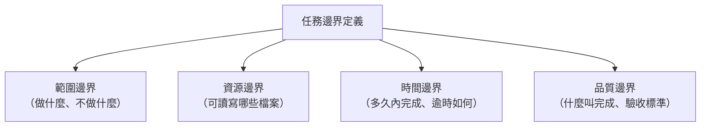

# 03-3-2 定義任務邊界：不干擾主線的背景工作法

## 1. 本章學習目標

- 掌握為 Agent 定義清晰任務邊界的方法
- 學會設定 Agent 任務的成功條件、失敗處理與停止規則
- 理解如何避免 Agent 與主線開發產生衝突（檔案鎖定、Git 衝突）
- 建立「Agent 是獨立工作單元」的思維模式

## 2. 適用對象與前置知識

- **適用對象**：需要同時進行多個開發任務的工程師
- **前置知識**：Agent 基本使用（03-3-1）、Git 分支管理
- **關聯章節**：前接 [03-3-1 Agent 任務](./03-3-1-agent-tasks-fake-data-cleaning-log-analysis.md)，後接 [03-3-3 Git Worktrees](./03-3-3-git-worktrees-parallel-sessions.md)

## 3. 核心概念

### 3.1 任務邊界的四個維度



### 3.2 主線與 Agent 的隔離策略

| 隔離層級 | 策略 | 說明 |
|---------|------|------|
| 檔案隔離 | Agent 只寫入指定目錄 | 避免 Agent 修改主線正在開發的檔案 |
| 分支隔離 | Agent 在專屬分支工作 | 使用 Git Worktree（03-3-3） |
| 時間隔離 | Agent 在開發者不使用時執行 | 夜間或午餐時間 |
| 資源隔離 | 限制 Agent 可讀取的檔案範圍 | 避免讀取敏感或不相關的檔案 |

## 4. 操作步驟

### 4.1 定義 Agent 任務的標準模板

```
/agent

## 任務名稱
[簡短明確的名稱]

## 任務描述
[具體的任務內容]

## 範圍邊界
- 包含：[明確列出要做的事]
- 不包含：[明確列出不要做的事]
- 可讀取檔案：[目錄或檔案清單]
- 可寫入檔案：[目錄或檔案清單]
- 不可修改檔案：[目錄或檔案清單]

## 成功條件
- [條件 1：可驗證的完成標準]
- [條件 2]

## 失敗處理
- 若遇到 [情況 A]，則 [處理方式]
- 若超過 [N] 次嘗試仍未成功，則暫停並報告

## 輸出
- 檔案路徑：[確切的輸出路徑]
- 格式：[Markdown / JSON / SQL / ...]
```

### 4.2 避免衝突的策略

```markdown
## Agent 任務設定中的衝突預防

1. **檔案寫入限制**：Agent 只寫入 `/reports/` 和 `/data/` 目錄
2. **Git 操作限制**：Agent 不執行 git add/commit/push
3. **唯讀參考**：Agent 可讀取 @src/ 作為參考，但不可修改
4. **逾時設定**：此任務應在 30 分鐘內完成，逾時則暫停並報告進度
```

## 5. 常見錯誤與排查方式

### 錯誤 1：Agent 修改了主線正在開發的檔案

**原因**：未設定寫入限制。

**症狀**：Agent 完成後，`git status` 顯示意外的檔案變更。

**修正**：在 Agent 任務中明確指定可寫入的目錄，並在 CLAUDE.md 中設定全域的 Agent 檔案寫入限制。

### 錯誤 2：任務邊界定義過寬

**原因**：Agent 任務描述「整理整個專案的程式碼」，範圍過大。

**症狀**：Agent 執行很久，產出內容發散，品質參差。

**修正**：將大任務拆分為多個小任務，每個 Agent 只處理一個明確的子任務。

### 錯誤 3：未定義失敗處理方式

**原因**：假設 Agent 一定會成功。

**症狀**：Agent 遇到問題（如檔案不存在）時卡住，或在錯誤的基礎上繼續執行。

**修正**：在 Prompt 中定義「若遇到 X，則做 Y」的規則。設定最大嘗試次數。

## 6. 最佳實務

1. **Agent 的任務描述要比主對話 Prompt 更結構化**：Agent 沒有機會問你「這是什麼意思」
2. **使用「正面清單」而非「負面清單」**：與其說「不要修改 X」，不如說「只能修改 Y 和 Z」
3. **設定資源上限**：Token 預算、時間預算、檔案大小限制——避免 Agent 失控
4. **Agent 完成後立即審查**：不要讓多個 Agent 的產出累積後才審查。每完成一個就審查一個
5. **記錄 Agent 的執行日誌**：每次 Agent 任務的 Prompt、執行時間、Token 消耗、產出品質——用於持續改進

## 7. 小結

1. 任務邊界是 Agent 成敗的關鍵——沒有邊界的 Agent 等於沒有安全網
2. 四個維度定義任務邊界：範圍、資源、時間、品質
3. 檔案隔離是最重要的衝突預防策略：Agent 只能寫入指定目錄
4. Agent 任務的 Prompt 必須比主對話更詳細，因為無法中途給回饋

## 8. 延伸練習

1. 使用標準模板定義一個 Agent 任務，交給 Agent 執行
2. 故意在任務中省略關鍵邊界定義，觀察 Agent 的行為差異
3. 設計一份團隊的「Agent 任務提交檢查清單」

## 9. 查核來源與版本備註

- 來源：Anthropic Claude Code 官方文件
- 查核日期：2026-06-05（尚未最終查核）
- 若使用者環境與本文不同，請優先依官方最新文件與實際環境調整
