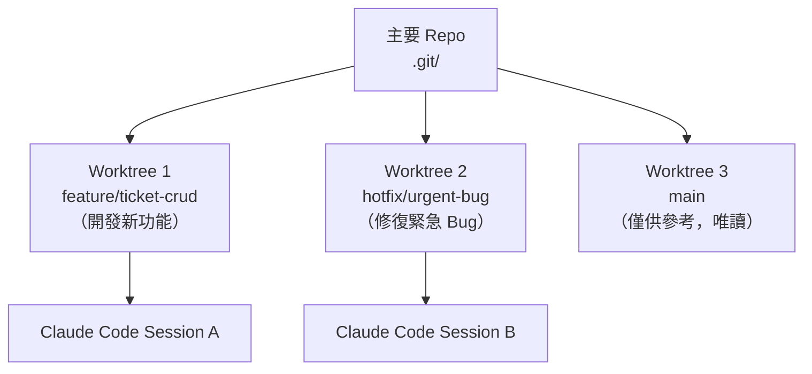
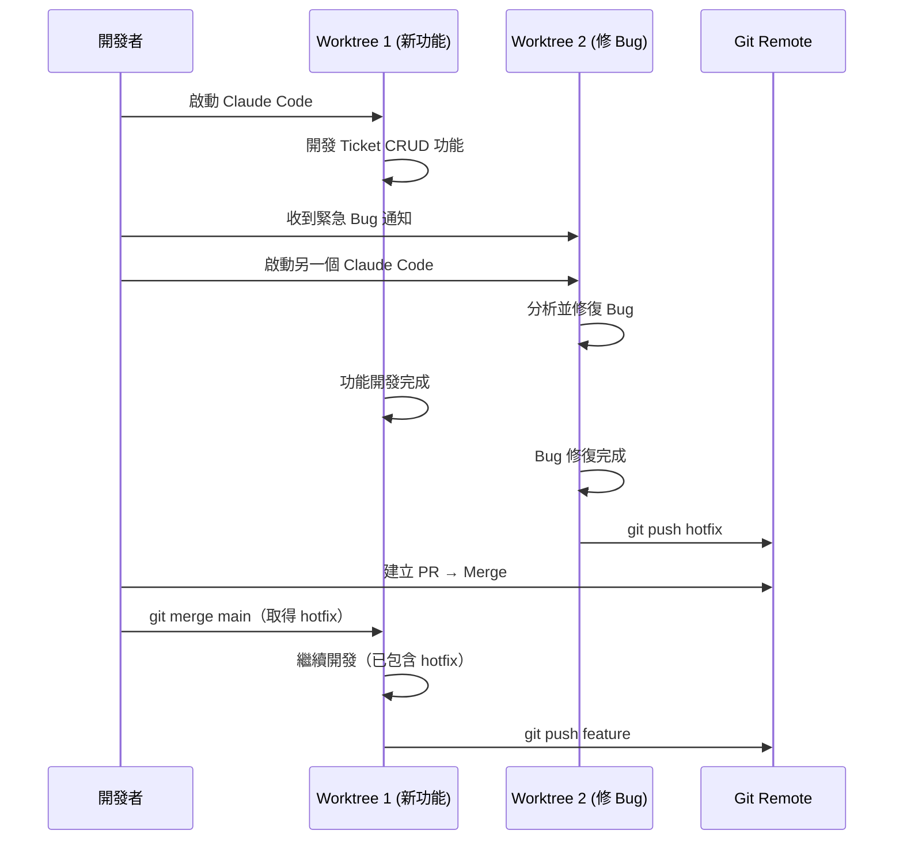

# 03-3-3 Git Worktrees 與平行 Session：一個修 Bug，一個開發新功能

> ⚠️ **線上核實狀態**：已核實（2026-06-06）。Git Worktrees 指令（`git worktree add/list/remove/prune`）已對照 Git 官方文件確認正確。
> 平行 Claude Code Session 的策略實用且可行。

## 1. 本章學習目標

- 理解 Git Worktrees 的概念與使用場景
- 學會使用 Worktrees 同時進行多個開發任務（修 Bug + 新功能）
- 掌握如何在不同 Worktree 中執行獨立的 Claude Code Session
- 理解平行開發的衝突預防與合併策略
- 建立多任務並行的 AI 輔助開發工作流

## 2. 適用對象與前置知識

- **適用對象**：需要同時處理多個開發任務的工程師
- **前置知識**：Git 分支管理、Claude Code 基本操作
- **關聯章節**：前接 [03-3-2 任務邊界](./03-3-2-agent-task-boundary.md)，後接 [04-1-1 程式碼審查](./04-1-1-code-review-correctness-security-readability.md)

## 3. 核心概念

### 3.1 為什麼需要 Git Worktrees？

傳統的 Git 工作流程中，如果你正在 `feature/ticket-crud` 分支上開發，突然需要修一個 `main` 分支上的緊急 Bug，你要麼：
- `git stash` → 切換分支 → 修 Bug → 切回來 → `git stash pop`（繁瑣）
- 重新 Clone 整個 Repo（浪費空間和時間）

Git Worktrees 解決了這個問題：**一個 Repo，多個工作目錄，各自在不同的分支上獨立工作**。



### 3.2 Worktree vs Branch vs Stash

| 方法 | 適合場景 | 優點 | 缺點 |
|------|---------|------|------|
| Worktree | 長時間平行開發 | 完全隔離、可同時執行 | 佔用額外磁碟空間 |
| Branch 切換 | 短時間任務切換 | 簡單 | 需要 stash/commit |
| Stash | 暫時儲存未完成工作 | 快速 | 無法同時工作 |

## 4. 操作步驟

### 4.1 建立 Worktree

```bash
# 在主要 Repo 中
cd ~/projects/ticket-system

# 建立一個新的 Worktree 來處理緊急 Bug
git worktree add ../ticket-system-hotfix hotfix/urgent-bug

# 建立一個新的 Worktree 來開發新功能
git worktree add ../ticket-system-feature feature/ticket-crud

# 查看所有 Worktree
git worktree list
```

輸出：
```
~/projects/ticket-system          abc123 [main]
~/projects/ticket-system-hotfix   def456 [hotfix/urgent-bug]
~/projects/ticket-system-feature  ghi789 [feature/ticket-crud]
```

### 4.2 在不同 Worktree 中啟動 Claude Code

```bash
# 終端機 1：開發新功能
cd ~/projects/ticket-system-feature
claude
> 請依照 @spec.md 繼續開發 Ticket CRUD 的更新功能...

# 終端機 2：修復緊急 Bug
cd ~/projects/ticket-system-hotfix
claude
> /bug
> 請分析 production 上的 NullPointerException...
```

### 4.3 完成後的合併

```bash
# 在 hotfix Worktree 中
cd ~/projects/ticket-system-hotfix
git add .
git commit -m "fix: resolve NullPointerException in TicketService"
git push origin hotfix/urgent-bug

# 回到主要 Repo，合併 hotfix
cd ~/projects/ticket-system
git merge hotfix/urgent-bug

# 清理已完成的 Worktree
git worktree remove ../ticket-system-hotfix
```

### 4.4 Claude Code + Worktree 的平行開發流程



## 5. 常見錯誤與排查方式

### 錯誤 1：多個 Worktree 同時修改同一檔案

**原因**：兩個 Worktree 的工作範圍重疊。

**症狀**：合併時出現 Conflict。

**修正**：在開始前就分配好修改範圍。如果無法避免重疊，先合併一個 Worktree 的變更，另一個 Worktree 再 rebase。

### 錯誤 2：忘記清理已完成的 Worktree

**原因**：Bug 修完後直接回到主 Worktree，忘記清理。

**症狀**：`git worktree list` 中有多個已廢棄的 Worktree，佔用磁碟空間。

**修正**：
```bash
# 定期清理
git worktree list
git worktree remove ../old-worktree

# 或使用 prune 清理已刪除目錄的 Worktree 記錄
git worktree prune
```

### 錯誤 3：在 Worktree 中使用了不同版本的依賴

**原因**：各 Worktree 的 `node_modules/` 或 `target/` 是獨立的，可能安裝了不同版本。

**症狀**：在 Worktree A 中測試通過，在 Worktree B 中失敗。

**修正**：在每個 Worktree 中重新安裝依賴（`npm ci`、`mvn clean install`）。使用統一的依賴版本鎖定檔案（`package-lock.json`、`pom.xml`）。

### 錯誤 4：Claude Code 的 Context 混淆

**原因**：在不同 Worktree 中使用 Claude Code，但 CLAUDE.md 可能有差異。

**症狀**：Claude 的行為在不同 Worktree 中不一致。

**修正**：確保 CLAUDE.md 的變更在主分支中合併後，各 Worktree 都 rebase/merge 了最新的 CLAUDE.md。

## 6. 最佳實務

1. **Worktree 命名應反映用途**：`ticket-system-hotfix`、`ticket-system-feature`，一目了然
2. **每個 Worktree 有獨立的 Claude Code Session**：不要在不同 Worktree 中共用同一個 Claude Code 終端機
3. **完成後立即清理**：Worktree 是暫時的工作區，不是永久目錄。Bug 修完、功能合併後就清理
4. **主 Worktree 保持乾淨**：主 Worktree（`main` 分支）只用於參考或緊急操作，日常開發在專屬 Worktree 中進行
5. **共享的設定要同步**：CLAUDE.md、`.gitignore`、`spec.md` 等共用檔案應在主分支中維護，各 Worktree 定期 rebase
6. **磁碟空間管理**：每個 Worktree 約佔用與主目錄相同的空間（不含 `.git`）。大型專案需注意磁碟使用量
7. **CI/CD 也支援 Worktree**：在 CI Pipeline 中，可以使用 Worktree 來平行執行不同類型的測試（單元測試在 Worktree A，E2E 測試在 Worktree B）

## 7. 安全性與成本注意事項

### 安全性
- 每個 Worktree 是獨立目錄，權限與主目錄相同。敏感檔案（`.env`）不會自動複製到 Worktree，需手動建立
- 不要在不同 Worktree 中使用不同的 API Key 或認證——保持一致性

### 成本
- Worktree 使用 Hard Link 共享 `.git` 目錄，磁碟空間增加有限（主要是工作目錄的檔案）
- 多個 Claude Code Session 同時執行意味著多倍的 Token 消耗。確保預算能支撐平行開發

## 8. 小結

1. Git Worktrees 讓你在同一個 Repo 中擁有多個獨立的工作目錄，各自在不同的分支上工作
2. 每個 Worktree 可以啟動獨立的 Claude Code Session，實現真正的平行 AI 輔助開發
3. Worktree 適合長時間的平行任務（修 Bug + 開發新功能），不適合短時間的快速切換
4. 關鍵紀律：完成後清理 Worktree、保持共用設定同步、避免修改範圍重疊

## 9. 延伸練習

### 練習一：Worktree 實作
1. 在你的專案中建立兩個 Worktree
2. 在 Worktree A 中使用 Claude Code 開發一個小功能
3. 在 Worktree B 中使用 Claude Code 修復一個 Bug（可人為製造）
4. 分別 Commit 後，合併到主分支
5. 清理 Worktree

### 練習二：團隊平行開發策略
設計團隊的平行開發策略：
1. 哪些場景建議使用 Worktree？
2. 如何避免多人同時使用 Worktree 導致的合併衝突？
3. 如何將 Worktree + Claude Code 整合進團隊的日常開發流程？

## 10. 查核來源與版本備註

- 來源：Git 官方文件（git-worktree）、Anthropic Claude Code 官方文件
- 查核日期：2026-06-06（已核實）
- 版本備註：Git Worktree 功能自 Git 2.5+ 開始支援，本章以 Git 2.40+ 為基準
