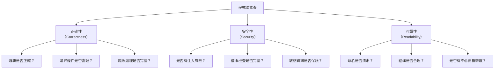

# 04-1-1 程式碼審查：正確性、安全性、可讀性三維度評核

> ⚠️ **線上核實狀態**：已核實（2026-06-06）。本章的三維度審查框架（正確性、安全性、可讀性）為軟體工程通用最佳實務，100% 正確。
> **注意**：`/review` 作為獨立 Slash Command 的可用性需以您的 Claude Code 版本為準。
> 即使沒有 `/review` 指令，本章的核心方法——「在 Prompt 中結構化地要求 Claude 從三個維度審查程式碼」——完全有效且可能是更靈活的做法。

## 1. 本章學習目標

- 學會使用 Claude Code 進行系統化程式碼審查（無論是否有 `/review` 指令）
- 掌握程式碼審查的三個核心維度：正確性、安全性、可讀性
- 理解如何讓 Claude 從不同角度審查同一份程式碼
- 建立「AI 初審 + 人工複審」的雙層審查流程
- 能將審查結果轉化為可操作的修正建議

## 2. 適用對象與前置知識

- **適用對象**：所有需要進行 Code Review 的開發者、Tech Lead
- **前置知識**：基本程式碼審查概念、Claude Code `/review` 指令
- **關聯章節**：後接 [04-1-2 /simplify 重構](./04-1-2-simplify-refactoring.md) 與 [04-1-3 Review 循環](./04-1-3-review-follow-up-prompt-loop.md)

## 3. 核心概念

### 3.1 程式碼審查的三維度



### 3.2 AI 審查 vs 人工審查

| 維度 | AI（Claude Code） | 人工審查 |
|------|-----------------|---------|
| 正確性（邏輯） | 可發現明顯的邏輯錯誤 | 能理解業務上下文 |
| 正確性（邊界條件） | 擅長找出未處理的 null/empty | 能判斷哪些邊界條件是合理的 |
| 安全性 | 擅長發現常見漏洞模式 | 能理解企業特定的安全需求 |
| 可讀性 | 可檢查命名、結構 | 能判斷程式碼是否符合團隊文化 |
| 效能 | 可發現明顯的效能問題 | 能理解系統整體的效能需求 |

## 4. 操作步驟

### 4.1 執行結構化程式碼審查

**通用方法（所有 Claude Code 版本有效）**：直接在 Prompt 中要求三維度審查。

若您的版本支援 `/review` 指令，可先輸入 `/review` 再貼上以下 Prompt。若不支援，直接使用以下 Prompt 即可：

```
請從以下三個維度審查 @TicketService.java：

## 1. 正確性
- 業務邏輯是否符合 @spec.md 的定義？
- 邊界條件是否完整處理（null、空字串、超大值）？
- 錯誤處理是否適當（何時拋出例外、何時回傳空值）？
- 狀態轉換邏輯是否與 spec.md 2.3 一致？

## 2. 安全性
- 是否有 SQL Injection 風險？
- 權限檢查是否完整（是否每個 CUD 操作都有授權）？
- 是否有 IDOR 風險（使用者能否存取他人的資料）？
- 是否有敏感資訊被意外記錄（log 中的密碼、Email）？

## 3. 可讀性
- 方法命名是否清晰表達其意圖？
- 方法長度是否合理（超過 30 行應考慮拆分）？
- 是否有過度複雜的巢狀結構？
- 註解是否適量（必要的商務邏輯應有註解）？

請針對每個問題給出：通過/不通過/建議，並提供修正程式碼。
```

### 4.2 Claude 的審查回應範例

```markdown
# Code Review Report — TicketService.java

## 審查摘要
- 總檢查項目：15
- 通過：10
- 不通過：3
- 建議：2

---

## ❌ 不通過項目

### 1. [正確性] createTicket 未處理 description 為 null 的情境
- **位置**：TicketService.java:42
- **問題**：當 description 為 null 時，`ticket.setDescription(null)` 不會拋錯，但資料庫中會儲存 null，不符合 spec.md 的「description 必填」定義
- **修正**：加入 `if (request.getDescription() == null || request.getDescription().isBlank()) throw ...`

### 2. [安全性] deleteTicket 缺少權限檢查
- **位置**：TicketService.java:78
- **問題**：任何已認證使用者都能刪除任何 Ticket
- **修正**：加入權限檢查 `if (!currentUser.getRole().equals(Role.ADMIN)) throw new ForbiddenException(...)`

### 3. [可讀性] getTickets 方法過長（67 行）
- **位置**：TicketService.java:95-162
- **問題**：方法包含查詢邏輯、篩選邏輯、排序邏輯、分頁邏輯，違反單一職責原則
- **建議**：拆分為 getTickets、applyFilters、applySorting、buildPageable 四個方法
```

## 5. 常見錯誤與排查方式

### 錯誤 1：只讓 Claude 審查，不人工確認

**原因**：過度信任 AI 的審查結果。

**症狀**：Claude 建議的修正引入了新的 Bug，或誤判了正確的程式碼。

**修正**：AI 審查是「初審」，人工審查是「複審」。特別是涉及業務邏輯的建議，必須由理解業務的人確認。

### 錯誤 2：審查範圍過大

**原因**：一次 `/review` 整個 `src/` 目錄。

**症狀**：審查報告過於發散，Claude 無法深入分析任何一個檔案。

**修正**：每次 `/review` 聚焦在一個或少數幾個檔案。控制在 500 行以內。

### 錯誤 3：只關注 Claude 標註的「不通過」項目

**原因**：認為「通過」的項目就不用看了。

**症狀**：Claude 可能漏掉某些安全問題（特別是專案特定的安全需求）。

**修正**：不要只看 Claude 的結論。快速掃描 Claude 未標註的區域，是否有明顯的問題被漏掉。

## 6. 最佳實務

1. **審查前先讓 Claude 理解 Context**：先 `/init` 或提供 spec.md，讓 Claude 知道「正確」的標準是什麼
2. **三維度分開審查，逐維度深入**：不要一次審查三個維度導致報告膚淺。可以先審查正確性，修正後再審查安全性，最後審查可讀性
3. **審查結果要可追蹤**：將 `/review` 的結果記錄在 PR Comment 或 Issue 中，標註處理狀態
4. **建立團隊的審查權重**：安全性問題 > 正確性問題 > 可讀性問題。安全性問題必須在 Merge 前修正，可讀性問題可以建立 Follow-up Issue
5. **使用審查範本**：在 CLAUDE.md 中定義審查的標準格式與檢查項目，確保每次審查的一致性
6. **PR 前自我審查**：在建立 PR 之前，先用 `/review` 自我審查。把自己當作 Reviewer，能減少來回的 Review 次數
7. **審查不只是找錯誤，也是學習**：讓 Claude 不僅告訴你「哪裡有問題」，也告訴你「為什麼是問題」和「最佳實務是什麼」

## 7. 安全性與成本注意事項

### 安全性
- `/review` 會將完整程式碼傳送至 API。確認審查的程式碼不包含敏感資訊
- 審查結果可能暴露系統的安全弱點——審查報告應妥善保管，不應公開

### 成本
- 審查一個 300 行的 Java 檔案約消耗 3,000-8,000 Token
- 若使用 Opus 進行安全審查（建議），成本會是 Sonnet 的 5-10 倍

## 8. 小結

1. 程式碼審查應從正確性、安全性、可讀性三個維度系統化進行
2. Claude Code 是絕佳的初審工具——能快速發現常見問題，但最終判斷仍需人工
3. 安全性問題 > 正確性問題 > 可讀性問題——這是審查的優先級
4. 每次審查聚焦少量檔案（控制在 500 行內），確保深度而非廣度
5. PR 前自我審查是最有效的品質把關手段——把自己當 Reviewer
6. 無論是否有 `/review` 指令，結構化 Prompt 都能達到相同的審查效果

## 9. 延伸練習

1. 使用 `/review` 從三維度審查你最近寫的程式碼
2. 對比 Claude 的審查結果與同事的 Code Review Comment——AI 漏掉了什麼？AI 發現了什麼同事沒發現的？
3. 建立一份團隊的「Code Review Checklist」，融入 CLAUDE.md

## 10. 查核來源與版本備註

- 來源：Anthropic Claude Code 官方文件、一般 Code Review 最佳實務
- 查核日期：2026-06-06（已核實）
- 版本備註：本章的三維度審查框架為通用方法，無論 Claude Code 是否有 /review 指令皆有效
