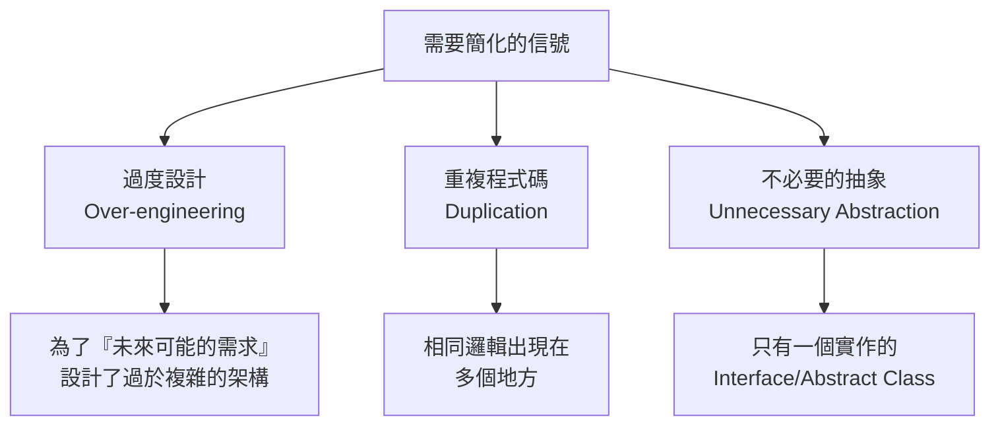

# 04-1-2 /simplify 重構精簡：消除過度設計與重複代碼

## 1. 本章學習目標

- 學會使用 Claude Code 的 `/simplify` 指令進行程式碼精簡與重構
- 掌握識別「過度設計」與「重複程式碼」的方法
- 理解簡潔性與可讀性的平衡——簡化不是越短越好
- 建立「先審查（/review），再簡化（/simplify）」的工作流程
- 能在測試保護下安全地進行重構

## 2. 適用對象與前置知識

- **適用對象**：想要提升程式碼品質的開發者、需要清理技術債的工程師
- **前置知識**：基本重構概念、Claude Code `/review` 指令（04-1-1）、TDD 概念（02-1-1）
- **關聯章節**：前接 [04-1-1 程式碼審查](./04-1-1-code-review-correctness-security-readability.md)，後接 [04-1-3 Review 循環](./04-1-3-review-follow-up-prompt-loop.md)

## 3. 核心概念

### 3.1 什麼是需要簡化的程式碼？



### 3.2 /simplify 的設計理念

`/simplify` 不是「把程式碼變短」，而是「移除不必要的複雜度」。好的簡化：
- ✅ 讓程式碼更容易理解
- ✅ 讓未來的修改更安全
- ✅ 減少維護負擔
- ❌ 不犧牲可讀性
- ❌ 不隱藏重要的業務邏輯
- ❌ 不過度合併不相關的邏輯

## 4. 操作步驟

### 4.1 使用 /simplify

```
/simplify

請分析 @TicketService.java，找出可以簡化的地方：

1. 是否有重複的程式碼模式？（如重複的 null check、重複的 DTO 轉換）
2. 是否有過度設計？（如只有一個實作的 Interface）
3. 是否有可以合併的相似方法？
4. 是否有不必要的暫時變數？
5. 是否有過深的巢狀結構（超過 3 層）？

請在保持所有測試通過的前提下，提出簡化方案。
```

### 4.2 簡化前後的對比範例

```java
// ❌ 簡化前：過度設計
public interface TicketValidator {
    boolean validate(Ticket ticket);
}

public class TicketValidatorImpl implements TicketValidator {
    public boolean validate(Ticket ticket) {
        return ticket.getTitle() != null && !ticket.getTitle().isBlank();
    }
}

// 只有一個實作，Interface 是多餘的
@Service
public class TicketService {
    private final TicketValidator ticketValidator;
    // ...
}

// ✅ 簡化後：移除不必要的 Interface
@Service
public class TicketService {
    // 直接在 Service 中驗證，或抽出為 private method
    private boolean isValidTicket(Ticket ticket) {
        return ticket.getTitle() != null && !ticket.getTitle().isBlank();
    }
    // ...
}
```

```java
// ❌ 簡化前：重複的 null check 模式
public TicketDto getTicket(Long id) {
    Ticket ticket = ticketRepository.findById(id).orElse(null);
    if (ticket == null) {
        throw new ResourceNotFoundException("Ticket not found: " + id);
    }
    return TicketDto.fromEntity(ticket);
}

public UserDto getUser(Long id) {
    User user = userRepository.findById(id).orElse(null);
    if (user == null) {
        throw new ResourceNotFoundException("User not found: " + id);
    }
    return UserDto.fromEntity(user);
}

// ✅ 簡化後：抽出共用的查詢方法
private <T> T findOrThrow(Optional<T> optional, String entityName, Long id) {
    return optional.orElseThrow(
        () -> new ResourceNotFoundException(entityName + " not found: " + id)
    );
}

public TicketDto getTicket(Long id) {
    Ticket ticket = findOrThrow(ticketRepository.findById(id), "Ticket", id);
    return TicketDto.fromEntity(ticket);
}
```

### 4.3 簡化後務必執行測試

```
/simplify 完成後，請執行 mvn test 確保所有測試仍通過。
若有測試失敗，請修正直到全部通過。
```

## 5. 常見錯誤與排查方式

### 錯誤 1：過度簡化導致可讀性下降

**原因**：追求「最少行數」，把多個邏輯壓縮成一行難以理解的 Stream 或 Lambda。

**症狀**：程式碼變短了，但同事看不懂。

**修正**：簡化的標準是「可讀性」，不是「行數」。一行清楚的程式碼勝過三行難以理解的壓縮碼。

### 錯誤 2：在沒有測試保護的情況下簡化

**原因**：覺得改動很小，不需要跑測試。

**症狀**：簡化後引入了 Bug，但沒有測試捕捉。

**修正**：永遠在測試保護下進行重構。如果該程式碼沒有測試，先補測試再簡化。

### 錯誤 3：簡化時改變了外部行為

**原因**：在簡化的過程中不小心修改了 API 的回應格式或行為。

**症狀**：前端或外部系統出現錯誤。

**修正**：簡化應是「重構」——改變內部結構但不改變外部行為。如果外部行為需要改變，那是「功能變更」，不是「簡化」。

### 錯誤 4：Claude 的簡化建議破壞了領域模型的表達力

**原因**：Claude 從程式碼結構角度簡化，不理解業務領域的語意。

**症狀**：合併了兩個名稱相似但業務含義不同的方法。

**修正**：人工判斷 Claude 的簡化建議是否合理。如果一個「重複」實際上有不同的業務含義，保留它。

## 6. 最佳實務

1. **先 /review 再 /simplify**：先了解程式碼有哪些問題，再針對性地簡化。不要盲目簡化所有東西
2. **簡化後的程式碼應通過相同的測試**：如果測試需要修改才能通過，表示你改變了行為，不是在做簡化
3. **簡化不是「把什麼都變成一行」**：保留必要的空白、註解、中間變數——這些是給人類閱讀的
4. **小步簡化，頻繁 Commit**：每次只簡化一個模式（如先消除重複的 null check，再合併相似的 DTO 轉換），每步都 Commit
5. **使用 DRY 原則但不過度**：重複兩次不一定需要抽出——三次重複才是明確的信號。過早的抽象比適度的重複更糟糕
6. **簡化後更新 CLAUDE.md**：如果簡化過程中建立了共用的工具方法或慣例，記錄在 CLAUDE.md 中，讓未來的 Claude 使用
7. **定期排定「簡化 Sprint」**：每個月或每個 Sprint 結束時，專門花半天時間清理技術債與過度設計

## 7. 安全性與成本注意事項

### 安全性
- 簡化不應移除安全檢查。如果簡化過程中移除了權限驗證或輸入檢查，那是危險的
- 簡化後的程式碼應通過相同的安全審查（如 security-check Skill）

### 成本
- `/simplify` 的 Token 消耗與 `/review` 相似（3,000-8,000 Token/檔案）
- 簡化是投資——前期花時間簡化，後期節省維護與理解的成本

## 8. 小結

1. `/simplify` 是消除過度設計與重複程式碼的品質指令，不是「把程式碼變短」
2. 簡化的信號：重複模式、只有一個實作的 Interface、過深的巢狀結構
3. 簡化必須在測試保護下進行——先確保有測試，再進行簡化
4. 簡化的標準是「可讀性」與「可維護性」，不是「最少行數」
5. 小步簡化、頻繁 Commit、定期排定簡化時間

## 9. 延伸練習

1. 使用 `/simplify` 簡化你專案中一個過於複雜的 Service 類別
2. 簡化前後執行測試，確認行為不變
3. 請同事 Review 簡化後的程式碼——是更容易理解還是更難？

## 10. 查核來源與版本備註

- 來源：Anthropic Claude Code 官方文件、Martin Fowler "Refactoring"、DRY 原則
- 查核日期：2026-06-05（尚未最終查核）
- 版本備註：/simplify 指令的行為以 Claude Code 最新版本為準
