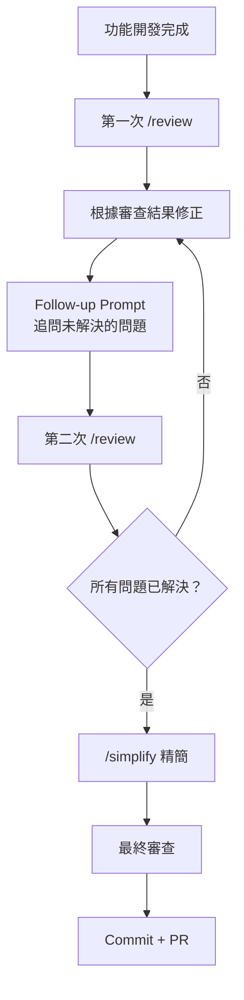

# 04-1-3 收尾循環：審查搭配 Follow-up Prompt 追問修正細節

> ⚠️ **線上核實狀態**：已核實（2026-06-06）。迭代審查方法論（審查→修正→追問→再審查）為通用的品質保證實務。
> Follow-up Prompt 的撰寫技巧適用於所有 AI 工具。

## 1. 本章學習目標

- 學會建立 `/review` → Follow-up Prompt → 修正 → 再審查的完整收尾循環
- 掌握 Follow-up Prompt 的撰寫技巧：如何追問 Claude 以獲得更深入的修正建議
- 理解「收尾」不是一次性的動作，而是迭代的品質提升過程
- 建立「不滿足於第一次審查結果」的品質意識

## 2. 適用對象與前置知識

- **適用對象**：所有希望提升程式碼品質的開發者
- **前置知識**：`/review` 指令（04-1-1）、`/simplify` 指令（04-1-2）
- **關聯章節**：前接 [04-1-2 /simplify](./04-1-2-simplify-refactoring.md)，後接 [04-2-1 開發時序表](./04-2-1-slash-command-development-timeline.md)

## 3. 核心概念

### 3.1 收尾循環的意義

「寫完程式碼」不是終點，「寫完且審查通過的程式碼」才是。收尾循環確保：



### 3.2 Follow-up Prompt 的價值

第一次 `/review` 的結果可能不夠深入或遺漏了某些面向。Follow-up Prompt 可以：

1. **深入特定問題**：「你提到了效能問題，能具體分析瓶頸在哪裡嗎？」
2. **探索替代方案**：「除了你建議的修正，有沒有其他方案？各自的 trade-off？」
3. **驗證修正的正確性**：「我依照你的建議修正了，請重新審查確認是否還有問題」
4. **詢問最佳實務**：「這個模式在社群中的最佳實務是什麼？」

## 4. 操作步驟

### 4.1 收尾循環的完整流程

```
# 步驟 1：第一次審查
/review
請從正確性、安全性、可讀性三維度審查 @TicketService.java

# 步驟 2：根據審查結果修正
（手動修正程式碼，或讓 Claude 協助修正）

# 步驟 3：Follow-up 追問
針對你提到的「getTickets 方法效能問題」，請具體分析：
1. 瓶頸是在資料庫查詢還是 Java 處理？
2. 如果加入快取，建議使用什麼策略？
3. 有沒有不需要快取的輕量級最佳化方案？

# 步驟 4：第二次審查（確認修正）
/review
請重新審查 @TicketService.java，確認上次的問題是否已修正。
特別檢查：我之前修正的安全性問題是否有引入新的問題？

# 步驟 5：簡化
/simplify
請簡化已審查通過的程式碼

# 步驟 6：最終確認
請做最後一次檢查，確認所有測試通過且程式碼已準備好提交。
```

### 4.2 有效的 Follow-up Prompt 範例

```
# 追問安全性
你提到 deleteTicket 有權限問題。除了加上 @PreAuthorize，
還有哪些層面需要考慮？（如 Audit Log、資料復原機制？）

# 追問可讀性
你建議拆分 getTickets 方法。能給我一個具體的拆分方案嗎？
包含每個新方法的名稱、參數與職責。

# 追問正確性
你提到狀態轉換邏輯可能需要改善。能幫我畫一個狀態機的 Mermaid 圖，
確認我對 spec.md 的理解是否正確嗎？

# 追問替代方案
對於這個重複的 null check 模式，除了你建議的泛型方法，
還有沒有使用 Java 8+ Optional 的更優雅寫法？
```

## 5. 常見錯誤與排查方式

### 錯誤 1：第一次審查後就急著 Commit

**原因**：看到「通過」項目很多，認為品質已經足夠。

**症狀**：後續的 Code Review（同事或 CI）發現了 Claude 遺漏的問題。

**修正**：將 `/review` 視為品質提升的起點，而非終點。Follow-up 追問至少 2-3 個問題後再 Commit。

### 錯誤 2：Follow-up 問題太發散

**原因**：一次問了太多不相關的問題。

**症狀**：Claude 的回答膚淺，每個問題都只觸及表面。

**修正**：每次 Follow-up 聚焦在 1-2 個問題。深度優於廣度。

### 錯誤 3：未將審查結果記錄下來

**原因**：審查完就過了，未留下記錄。

**症狀**：一個月後又遇到相同的問題，但忘了上次的審查建議。

**修正**：將重要的審查結果與 Follow-up 結論記錄在 CLAUDE.md 或專案 Wiki 中，形成團隊的知識庫。

## 6. 最佳實務

1. **收尾循環的標準節奏**：/review → 修正 → Follow-up → /review → /simplify → 最終確認
2. **Follow-up 要具體**：不好的 Follow-up：「能再詳細說明嗎？」；好的 Follow-up：「你提到的效能問題，具體是 N+1 Query 還是記憶體不足？」
3. **每次修正後都要重新審查**：修正程式碼可能引入新的問題，不要假設「修了就沒事了」
4. **建立「審查完成」的定義**：團隊應該有明確的標準——什麼狀態的程式碼才算「審查完成」
5. **收尾循環也適用於 AI 產出的程式碼**：Claude 產出的程式碼更需要收尾循環——AI 可能為了快速解決問題而走捷徑

## 7. 安全性與成本注意事項

### 安全性
- 每次重新審查都是一次安全檢查的機會。不要因為「只是小改動」就跳過
- Follow-up 中討論的安全方案可能暴露系統的防禦策略——確認討論內容的適當性

### 成本
- 完整的收尾循環（2 次審查 + 2-3 次 Follow-up）可能消耗 15,000-30,000 Token
- 這是值得的投資——相對於後續的 Bug 修復與技術債清理成本

## 8. 小結

1. 收尾循環是 `/review` → Follow-up → 修正 → 再審查的迭代品質提升過程
2. Follow-up Prompt 讓你能深入探索特定問題、獲取替代方案、驗證修正正確性
3. 收尾不是一次性的——持續追問直到你對程式碼品質有信心
4. 將審查結果與 Follow-up 結論記錄下來，形成團隊知識庫

## 9. 延伸練習

1. 執行一次完整的收尾循環（使用你自己的程式碼）
2. 記錄每次審查發現的問題數量與 Follow-up 的深度
3. 比較收尾前後的程式碼品質差異

## 10. 查核來源與版本備註

- 來源：Anthropic Claude Code 官方文件、一般軟體品質保證實務
- 查核日期：2026-06-06（已核實）
