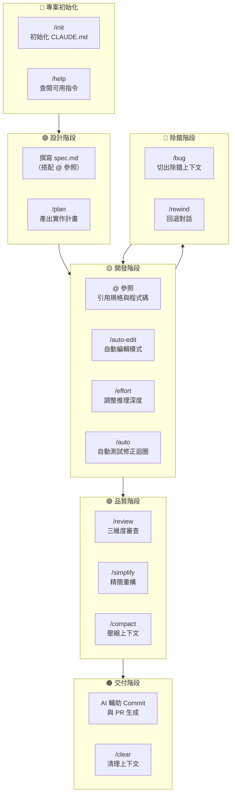

# 04-2-1 常用指令開發時序表：從 /init 到 /clear 的應用時機

## 1. 本章學習目標

- 掌握 Claude Code 所有 Slash Commands 在開發生命週期中的應用時機
- 建立從專案初始化到交付的完整指令使用地圖
- 理解各指令之間的上下游關係與最佳組合方式
- 能根據開發階段選擇最合適的指令組合

## 2. 適用對象與前置知識

- **適用對象**：所有 Claude Code 使用者，尤其是想要建立系統化工作流的開發者
- **前置知識**：已完成課程所有章節，熟悉各 Slash Command 的用法
- **關聯章節**：前接 [04-1-3 Review 循環](./04-1-3-review-follow-up-prompt-loop.md)，後接 [04-2-2 自動化 PR 交付](./04-2-2-automated-pr-delivery.md)

## 3. 核心概念

### 3.1 Slash Commands 開發時序表



### 3.2 指令使用頻率建議

| 指令 | 頻率 | 說明 |
|------|------|------|
| `@` 參照 | 每次互動 | 最基本且最常用的指令 |
| `/auto-edit` | 每日 | 預設開發模式 |
| `/review` | 每個功能完成後 | 品質把關 |
| `/clear` | 每日 2-3 次 | 上下文管理 |
| `/bug` | 遇到 Bug 時 | 專注除錯 |
| `/compact` | 每日 1 次 | 長對話壓縮 |
| `/simplify` | 每個功能完成後 | 程式碼精簡 |
| `/rewind` | 需要時 | 對話回退 |
| `/effort` | 需要時 | 調整深度 |
| `/plan` | 複雜任務前 | 先規劃再執行 |
| `/init` | 新專案時 | 一次性設定 |

## 4. 操作步驟

### 4.1 典型的開發日指令時序

```
09:00 — 啟動 Claude Code
09:05 — /clear（清理昨天的上下文）
09:10 — @spec.md（載入今日要開發的功能規格）
09:15 — /plan（產出今日開發計畫）
09:30 — /auto-edit（開始開發）

11:00 — 遇到 Bug
11:05 — /bug（切出除錯上下文）
11:30 — Bug 解決，/clear，回到 /auto-edit

14:00 — 功能開發完成
14:05 — /review（三維度審查）
14:30 — /simplify（精簡程式碼）
14:45 — /compact（壓縮長對話）

15:00 — AI 輔助產生 Commit Message 與 PR
15:30 — /clear（準備下班）
```

## 5. 常見錯誤與最佳實務

### 常見錯誤
1. **開發完直接 Push，跳過 /review**：最常見的品質問題來源
2. **在 /bug 模式中順便開發新功能**：混淆了除錯與開發的 Context
3. **忘記 /compact 導致 Context 過大**：回應品質逐漸下降

### 最佳實務
1. 每個開發日以 `/clear` 開始，以 `/clear` 結束
2. 新功能 = `/plan` → `/auto-edit` → `/review` → `/simplify`
3. Bug 修復 = `/bug` → 修正 → `/review` → Commit
4. 定期 `/compact` 保持在長對話中的效率

## 6. 小結

1. Slash Commands 各有其最佳應用時機，掌握時序是高效開發的關鍵
2. 核心循環：設計（/plan）→ 開發（/auto-edit）→ 審查（/review）→ 精簡（/simplify）
3. 品質與效率不是對立的——正確使用指令可以在不犧牲品質的前提下提升效率

## 7. 延伸練習

1. 追蹤你一天的 Claude Code 使用記錄，對比本章的建議時序表
2. 建立你自己團隊的「Slash Commands 使用指南」

## 8. 查核來源與版本備註

- 來源：Anthropic Claude Code 官方文件
- 查核日期：2026-06-05（尚未最終查核）
- 版本備註：Slash Commands 清單與行為以 Claude Code 最新版本為準
