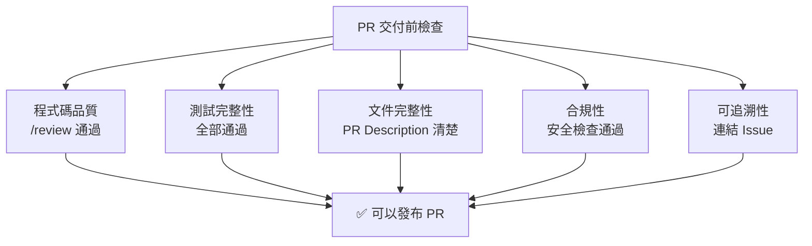

# 04-2-2 自動化 PR 交付：整理 Diff、生成說明並發布 PR

## 1. 本章學習目標

- 掌握從開發完成到 PR 交付的完整自動化流程
- 學會讓 Claude Code 整合 Git Diff、Commit 歷史與 PR 生成
- 理解 PR 交付的最佳實務：描述、測試結果、風險標註、Reviewer 指定
- 建立「開發完成 ≠ 交付完成，PR 品質 = 你的專業形象」的意識

## 2. 適用對象與前置知識

- **適用對象**：所有需要在 GitHub 上發布 PR 的開發者
- **前置知識**：Git/GitHub 操作（01-3 系列）、PR 生成（01-3-3）、gh CLI（01-3-2）
- **關聯章節**：前接 [04-2-1 開發時序表](./04-2-1-slash-command-development-timeline.md)，後接 [04-2-3 課程總結](./04-2-3-stable-development-workflow-summary.md)

## 3. 核心概念

### 3.1 PR 交付的品質標準

一個高品質的 PR 不是「程式碼能動就好」，而是：



### 3.2 自動化 PR 交付流程

```
開發完成 → /review → /simplify → 執行完整測試 → 
整理 Diff → 生成 PR Title & Body → 連結 Issue → 
標註 Reviewer 與 Label → gh pr create → 通知團隊
```

## 4. 操作步驟

### 4.1 一站式 PR 交付 Prompt

```
請協助我完成 PR 交付，步驟如下：

1. 執行 git diff main..HEAD --stat，確認變更範圍
2. 執行 mvn test（或 npm test），確認所有測試通過
3. 分析 Commit 歷史（git log main..HEAD --oneline）
4. 生成符合 Conventional Commits 的 PR Title
5. 生成結構化的 PR Body（Summary / Changes / Testing / Risk）
6. 檢查是否應連結的 Issue（搜尋相關 Issue）
7. 產出 gh pr create 指令（附帶完整參數）

請在產出 gh 指令後暫停，等我確認後再執行。
```

### 4.2 PR 交付前的檢查清單

讓 Claude 幫你逐項檢查：

```
請執行 PR 交付前檢查：

- [ ] /review 是否已執行且所有❌項目已修正？
- [ ] 所有測試是否通過？（單元 + 整合 + E2E）
- [ ] spec.md 是否需要更新？
- [ ] CLAUDE.md 是否需要更新？
- [ ] Commit Message 是否符合團隊規範？
- [ ] 是否有遺漏的檔案（如 Migration、設定檔）？
- [ ] PR 中是否包含敏感資訊（密碼、API Key）？
- [ ] 是否已 Rebase 到最新的 main 分支？

若有任何 ❌，請列出並提供修正建議。
```

### 4.3 最終的 gh pr create

```bash
gh pr create \
  --title "feat(ticket): 實作 Ticket CRUD API 與狀態管理" \
  --body "$(cat pr-body.md)" \
  --base main \
  --head feature/ticket-crud \
  --reviewer "tech-leads" \
  --label "feature,needs-review" \
  --assignee "@me"
```

## 5. 常見錯誤與最佳實務

### 常見錯誤
1. **PR 中包含多個不相關的功能**：Reviewer 難以理解，審查時間拉長
2. **PR Description 只有 Title，沒有 Body**：Reviewer 需要自行理解變更內容
3. **未在 PR 中標註測試結果**：Reviewer 不知道你有沒有測過
4. **未 Rebase 就建立 PR**：PR 中包含大量 Merge Commit，難以審查

### 最佳實務
1. 一個 PR 做一件事——如果 Claude 建議拆分，聽它的
2. PR Body 要讓 Reviewer 不需看程式碼就能理解變更
3. 在 PR Body 中明確標註「如何測試」：不只是說「測試通過」，而是列出測試步驟
4. PR 建立後，自己先用 `gh pr view` 預覽，確認品質後再通知 Reviewer
5. 設定 CLAUDE.md 中的 PR 範本，讓每次 PR 格式一致

## 6. 小結

1. PR 交付是開發工作的「最後一哩路」——PR 品質直接影響團隊效率與你的專業形象
2. 自動化 PR 流程：分析 Diff → 生成 Title/Body → 連結 Issue → gh pr create
3. PR 交付前必須完成：/review、測試、Rebase、敏感資訊檢查
4. 好的 PR 讓 Reviewer 的焦點放在「設計與邏輯」而非「格式與拼字」

## 7. 延伸練習

1. 使用本章的一站式 Prompt，為你最近的功能建立一個 PR
2. 請同事回饋：PR Description 是否清楚？是否有遺漏的資訊？
3. 根據回饋調整你的 PR 範本

## 8. 查核來源與版本備註

- 來源：GitHub Docs、Anthropic Claude Code 官方文件
- 查核日期：2026-06-05（尚未最終查核）
- 若使用者環境與本文不同，請優先依官方最新文件與實際環境調整
