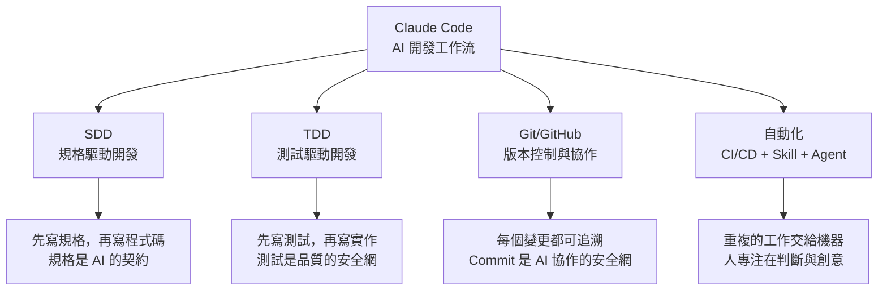
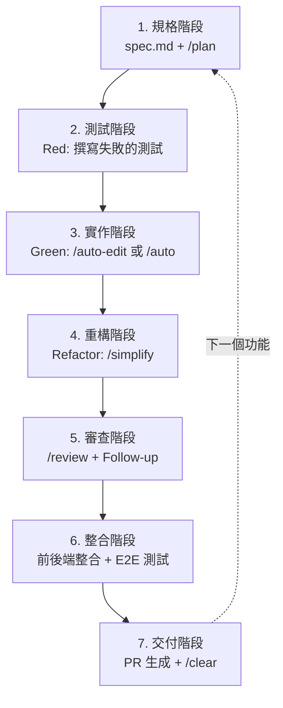

# 04-2-3 課程總結：建立穩定開發工作流的核心心法回顧

## 1. 本章學習目標

- 回顧整套課程的核心心法與關鍵收穫
- 理解 SDD、TDD、CI/CD、AI Coding 之間的整體關聯
- 建立可持續運作的 AI 輔助開發工作流
- 知道如何繼續深化與擴展所學

## 2. 核心心法回顧

### 2.1 四大支柱

### 2.2 完整的開發生命週期

### 2.3 十條核心心法

1. **規格優先，AI 才有方向**：沒有 spec.md，AI 就是在猜測。花 30 分鐘寫規格，省下 3 小時的修正
2. **Git 是 AI 協作的安全網**：每次讓 AI 自主操作前，務必 Commit。`git reset --hard` 是你的好朋友
3. **測試是 AI 產出的驗收標準**：不要相信 AI 說「這樣應該可以」。讓測試來驗證
4. **AI 是顧問，不是代理人**：AI 產出的程式碼需要你的審查。最終責任在你，不在 AI
5. **Context 是需要管理**的資源：適時使用 /clear、/compact、/rewind，不要讓對話變成垃圾場
6. **成本意識是專業素養**：了解每個 Prompt 的成本。Opus 用於架構決策，Haiku 用於格式化
7. **安全是不可協商的底線**：Skill、Hooks、CI/CD——三層防禦確保 AI 產出的程式碼不會帶來災難
8. **模式選擇是風險管理**：逐步確認 → 自動編輯 → 自動模式 → 全開模式。越往右，效率越高，風險越大
9. **工具是為了減少瑣事，不是為了取代思考**：AI 幫你寫程式碼，你來做設計決策
10. **持續改進勝於一次完美**：今天的規格比昨天好、今天的測試比昨天完整、今天的 PR 比昨天清楚——這就是進步

## 3. 學習路徑建議

### 3.1 初學者（0-3 個月）
- 熟練基本指令（/init、@ 參照、/help）
- 在個人專案中練習 SDD + TDD
- 養成 Commit 後再讓 AI 自主操作的習慣

### 3.2 中階者（3-6 個月）
- 建立團隊的 CLAUDE.md 規範
- 使用 Auto Mode 與 Skill 提升效率
- 整合 Playwright MCP 進行自動化驗證

### 3.3 進階者（6 個月以上）
- 設計企業級的安全檢查 Skill 與 Hooks
- 整合 Agent 進行背景任務處理
- 建立 CI/CD 中的 AI 輔助品質門檻
- 推廣團隊的 AI Coding 文化

## 4. 下一步

完成本課程後，建議的行動方案：

1. **立即行動**：選擇一個你正在開發的功能，完整走一次 SDD → TDD → /review → PR 的流程
2. **建立習慣**：每天使用 Claude Code 時，遵循本章的指令時序表
3. **分享知識**：將本課程中的心法與團隊分享，建立共同的 AI Coding 語言
4. **持續學習**：關注 Anthropic 官方發布、社群最佳實務、新的 MCP Server
5. **回饋改進**：記錄你的使用經驗，持續優化 CLAUDE.md 和團隊規範

## 5. 謝辭

感謝你完成這套課程。AI 輔助開發的旅程才正要開始。記住：**最好的 AI 工具，是與最好的開發習慣結合的 AI 工具。**

祝開發愉快，Bug 退散。

## 6. 查核來源與版本備註

- 本課程總結基於全套教材內容
- 查核日期：2026-06-05（尚未最終查核）
- 版本備註：AI 輔助開發工具與最佳實務持續演進，請保持學習心態，定期更新知識
- 若使用者環境與本文不同，請優先依官方最新文件與實際環境調整
