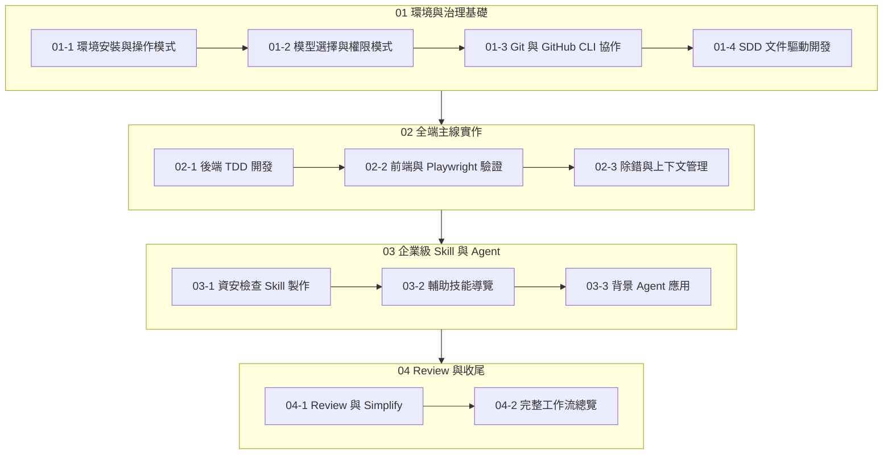

# Claude Code AI 開發工作流課程教材

> ✅ **全部 30 份教材已於 2026-06-06 完成線上核實**。每份教材文件首行皆有 ⚠️ 核實狀態標記，清楚標註內容的準確度等級、已確認的技術事實，以及需要注意的版本差異或待查項目。

## 課程名稱

**Claude Code AI 開發起手式：從環境建置到企業級開發治理**

## 課程定位

本課程是一套以 Claude Code 為核心的 AI 輔助軟體開發實戰教材，涵蓋從環境安裝、版本控制、測試驅動開發（TDD）、規格驅動開發（SDD）、前端與後端全端實作、Playwright MCP 自動化驗證、企業級 Skill 製作、背景 Agent 應用，到程式碼審查與交付的完整開發生命週期。

這不是一套「AI 工具介紹」課程，而是一套**以工程治理為基礎的 AI Coding 工作流建立指南**。課程強調：

- Claude Code 如何**強化**版本控制與專案治理，而非取代開發紀律
- 如何將 AI 整合進既有的 Git/GitHub 協作流程
- 如何運用 TDD 與 SDD 約束 AI 輸出品質
- 如何在企業環境中安全、可控地使用 AI 輔助開發

## 適合對象

- **後端 / 全端工程師**：想要將 AI 整合進日常開發流程
- **技術主管 / Team Lead**：需要評估 AI Coding 工具的導入策略與治理規範
- **DevOps / SRE 工程師**：關注 CI/CD 與 AI 測試自動化
- **企業內訓講師**：需要結構化教材進行內部 AI 開發培訓
- **對 Claude Code 有基礎認識、想深入建立工作流的開發者**

## 前置需求

### 硬體與作業系統
- Windows 10+、macOS 12+ 或 Linux（ Ubuntu 20.04+ 建議）
- 至少 8 GB RAM（16 GB 建議）
- 穩定的網路連線

### 軟體與工具
| 工具 | 最低版本 | 用途 |
|------|---------|------|
| PowerShell | 7.0+（Windows） | CLI 操作環境 |
| Git | 2.40+ | 版本控制 |
| GitHub CLI (`gh`) | 2.30+ | GitHub 操作 |
| VS Code | 1.85+ | 編輯器與 Claude Code 插件 |
| Node.js | 20 LTS+ | 前端開發 |
| Java JDK | 17+ | Spring Boot 後端開發 |
| Claude Code | 最新穩定版 | AI 輔助開發 |

### 先備知識
- 基本 Git 操作（`clone`、`commit`、`push`、`pull`、`branch`）
- 基本命令列操作
- 一種主流程式語言的基礎（Java、TypeScript/JavaScript 尤佳）
- 基本 Web 開發概念（HTTP、REST API、前後端分離）

## 建議學習順序

本教材設計為**循序漸進**的學習路徑，建議依照下列順序學習：



1. **第一單元（01）**：打好基礎——環境、權限、Git 協作、SDD 概念。這是所有後續實作的基石。
2. **第二單元（02）**：進入全端實作——從後端 Spring Boot + TDD 到前端 React + Playwright 驗證。這是課程的核心實戰部分。
3. **第三單元（03）**：進階主題——企業級 Skill、輔助工具、背景 Agent。適合已有實作經驗的學員。
4. **第四單元（04）**：收尾與回顧——建立 Review 習慣與長期工作流。

> **注意**：若您已有 Claude Code 與 Git 基礎，可從第二單元直接開始；但第一單元的 SDD 章節（01-4）建議不要跳過，它對後續所有實作都有影響。

## 所有章節檔案連結

### 01 Git、GitHub 與 Claude Code 起手式

#### 01-1 環境安裝、登入與操作模式
- [01-1-1 Windows PowerShell 7+ 安裝與 claude doctor 健檢](./01-1-1-windows-powershell-claude-doctor.md)
- [01-1-2 基本指令操作：/login、@ 參照、/help、/init](./01-1-2-basic-commands-login-reference-help-init.md)
- [01-1-3 訂閱方案與 API 成本精算](./01-1-3-subscription-plans-api-cost-estimation.md)
- [01-1-4 額度重置規則與 Extra Usage 延伸計費說明](./01-1-4-usage-limits-extra-usage-billing.md)

#### 01-2 可用模型選擇與權限模式切換
- [01-2-1 模型別名與場景](./01-2-1-model-aliases-and-use-cases.md)
- [01-2-2 推理深度控制：/effort 與 ultrathink](./01-2-2-effort-ultrathink-reasoning-control.md)
- [01-2-3 五種操作模式](./01-2-3-permission-and-operation-modes.md)
- [01-2-4 VS Code 插件與 CLI 終端機模式的感知差異](./01-2-4-vscode-extension-vs-cli-mode.md)

#### 01-3 Git 常用操作與 GitHub CLI 協作流
- [01-3-1 AI 協助撰寫 Commit Message 與 Staging](./01-3-1-ai-assisted-commit-diff-staging.md)
- [01-3-2 gh CLI 工作流](./01-3-2-github-cli-repo-issue-pr-workflow.md)
- [01-3-3 自動生成 PR Title 與 Body](./01-3-3-auto-generate-pr-title-and-body.md)

#### 01-4 SDD 文件驅動開發與主專案設定
- [01-4-1 SDD 概念：規格即契約](./01-4-1-specification-driven-development.md)
- [01-4-2 產出 spec.md](./01-4-2-create-spec-md-data-api-ui-behavior.md)
- [01-4-3 CLAUDE.md 進階設定](./01-4-3-claude-md-mcp-server-hooks.md)
- [01-4-4 AI 問題追蹤系統架構](./01-4-4-ai-ticket-system-architecture.md)

### 02 全端主線實作

#### 02-1 後端生成、TDD 先行與自主修正循環
- [02-1-1 TDD 概念：Red、Green、Refactor](./02-1-1-tdd-red-green-refactor.md)
- [02-1-2 Auto Mode 自主測試修正迴圈](./02-1-2-auto-mode-test-and-fix-loop.md)
- [02-1-3 Spring Boot 3 骨架生成](./02-1-3-spring-boot-entity-service-controller-dto.md)

#### 02-2 前端框架、API 串接與 Playwright 畫面驗證
- [02-2-1 React + Vite 快速落 UI](./02-2-1-react-vite-ui-with-spec-md.md)
- [02-2-2 前後端整合：@ 參照控制器](./02-2-2-api-integration-with-controller-reference.md)
- [02-2-3 Playwright MCP：browser_snapshot 無障礙樹分析](./02-2-3-playwright-mcp-browser-snapshot.md)
- [02-2-4 E2E 測試與 CI 管道](./02-2-4-e2e-tests-and-ci-pipeline.md)

#### 02-3 真實除錯與上下文管理
- [02-3-1 常見錯誤排查：CORS、分頁、資料綁定](./02-3-1-debugging-cors-pagination-binding.md)
- [02-3-2 /bug 指令：除錯上下文](./02-3-2-bug-command-debug-context.md)
- [02-3-3 /rewind 與 /compact](./02-3-3-rewind-compact-context-management.md)

### 03 企業級 Skill 製作、輔助技能與背景 Agent 應用

#### 03-1 企業資安規範檢查 Skill
- [03-1-1 企業資安情境](./03-1-1-enterprise-security-policy-scenarios.md)
- [03-1-2 技能拆解與檢查清單](./03-1-2-skill-input-checklist-fix-template.md)
- [03-1-3 Hooks 自動觸發檢查](./03-1-3-hooks-before-file-write-security-check.md)

#### 03-2 開發輔助技能分類導覽
- [03-2-1 firecrawl 文件爬取](./03-2-1-firecrawl-docs-api-research.md)
- [03-2-2 docx/pdf 規格書處理](./03-2-2-docx-pdf-summary-and-report-generation.md)
- [03-2-3 reactcomponents 與 web-perf 前端優化](./03-2-3-reactcomponents-web-performance-analysis.md)
- [03-2-4 claude-api 與 agents-sdk 多代理應用](./03-2-4-claude-api-agents-sdk-multi-agent.md)

#### 03-3 背景 Agent 長任務
- [03-3-1 適合 Agent 的工作類型](./03-3-1-agent-tasks-fake-data-cleaning-log-analysis.md)
- [03-3-2 任務邊界定義](./03-3-2-agent-task-boundary.md)
- [03-3-3 Git Worktrees 與平行 Session](./03-3-3-git-worktrees-parallel-sessions.md)

### 04 Review、程式優化與收尾

#### 04-1 /review 與 /simplify 內建品質指令
- [04-1-1 程式碼審查三維度評核](./04-1-1-code-review-correctness-security-readability.md)
- [04-1-2 /simplify 重構精簡](./04-1-2-simplify-refactoring.md)
- [04-1-3 /review 搭配 Follow-up Prompt](./04-1-3-review-follow-up-prompt-loop.md)

#### 04-2 Slash Commands 完整工作流總覽
- [04-2-1 常用指令開發時序表](./04-2-1-slash-command-development-timeline.md)
- [04-2-2 自動化 PR 交付](./04-2-2-automated-pr-delivery.md)
- [04-2-3 課程總結：穩定開發工作流心法](./04-2-3-stable-development-workflow-summary.md)

## 如何使用這套教材

### 給自學學員
1. 從 `01-1-1` 開始，依照建議順序逐章閱讀
2. 每章讀完後完成「延伸練習」
3. 實作過程中使用 Git 進行版本控制，養成習慣
4. 遇到問題時查閱「常見錯誤與排查方式」
5. 每個大單元結束後，用自己的話整理一份筆記

### 給企業內訓講師
1. 每個 `.md` 文件可獨立作為一節課（約 45-90 分鐘）的講義
2. 建議搭配 Live Coding 示範
3. 實作練習可作為課後作業或 Workshop 素材
4. 可依團隊技術棧調整範例（例如將 Spring Boot 換成 Express 或 Django）
5. 企業資安章節（03-1）建議列入必修

### 給技術主管
1. 先閱讀 `README.md` 了解整體架構
2. 重點關注：01-1-3（成本）、01-2-3（權限模式）、03-1（資安）、04-1（Review）
3. 可依據團隊需求挑選相關章節進行內部培訓
4. 建議制定內部的 AI Coding 使用規範，參考本教材的治理建議

## 如何更新與維護文件

### 更新原則
1. **官方文件優先**：任何技術內容變動，應先查核 Claude Code、Git、GitHub、Playwright 等工具的官方文件
2. **版本標註**：每次更新應在文件末尾的「查核來源與版本備註」區塊記錄更新日期與變更內容
3. **向後相容**：教材中的範例應盡量保持與最新穩定版相容；若有不向後相容的變動，應明確標註

### 維護流程
1. 定期（建議每季）檢查 Claude Code 與相關工具是否有重大更新
2. 若發現文件內容與實際行為不符，請提交 Issue 或直接修正
3. 修正時請保留原始結構，僅更新技術內容
4. 歡迎補充更多實務案例、常見錯誤與最佳實務

### 檔案命名規則
- 檔名格式：`章節編號-英文短標題.md`
- 使用小寫英文，單字以 `-` 連接
- 保留章節編號
- 不使用空白、中文或特殊符號（`/`、`:`、`()`）

## 官方文件查核提醒

本教材內容基於以下官方文件與可信來源編寫，**正式使用前應重新比對最新官方文件**：

| 工具 / 主題 | 官方文件來源 |
|------------|------------|
| Claude Code | Anthropic 官方文件 |
| Git | https://git-scm.com/doc |
| GitHub CLI | https://cli.github.com/manual/ |
| GitHub Docs | https://docs.github.com/ |
| Playwright | https://playwright.dev/ |
| MCP (Model Context Protocol) | https://modelcontextprotocol.io/ |
| Spring Boot | https://docs.spring.io/spring-boot/documentation.html |
| React | https://react.dev/ |
| Vite | https://vitejs.dev/ |
| Mermaid | https://mermaid.js.org/ |

> **重要**：本教材撰寫時已盡力查核官方文件，但 AI 輔助開發工具（Claude Code）的功能、指令、計費模式與模型名稱可能隨版本更新而變動。若教材內容與實際行為不符，請優先依官方最新文件與實際環境為準。每份章節文件末尾皆有獨立的查核備註，請一併參考。

---

## 快速開始

如果您是第一次接觸本教材，以下是最快的入徑：

```bash
# 1. 確保環境就緒
pwsh --version    # 應 >= 7.0
git --version     # 應 >= 2.40
gh --version      # 應 >= 2.30
code --version    # VS Code 版本

# 2. 從第一章開始
# 閱讀 01-1-1-windows-powershell-claude-doctor.md
```

祝學習順利，歡迎進入 AI 輔助開發的專業領域。
